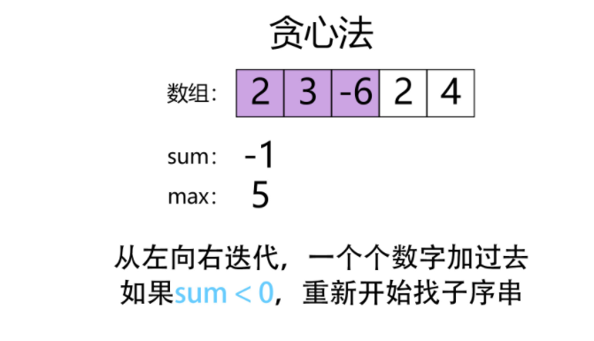

## 动态规划


### 70. 爬楼梯问题
- 递归公式：f(n)=f(n-1)+f(n-2) 递归解法会超时
- 使用简单的动态规划解决
- 或者利用上面的递归公式的通项公式来直接求解

```
class Solution {
public:
    int climbStairs(int n) {
        if(n<=1){
            return 1;
        }
       
        return climbStairs(n-1)+climbStairs(n-2);

    }
};
```


```
class Solution {
public:
    int climbStairs(int n) {
        vector<int> dp(n+1);
        dp[0]=1;
        dp[1]=1;
        for(int i=2;i<n+1;i++){
            dp[i]=dp[i-1]+dp[i-2];
        }
        return dp[n];

    }
};
```
**这种写法时间复杂度为O(n) 空间复杂度为O(n)，可以做进一步优化**： 空间复杂度优化到O(1)
```
class Solution {
public:
    int climbStairs(int n) {
        int p=0;
        int q=0;
        int r=1;
        for(int i=0;i<n;i++){
            p=q;
            q=r;
            r=q+p;

        }
        return r;

    }
};
```


### 121. 买卖股票的最佳时机

- 计算最大差值，如下所示一次遍历，记录当前最小值并计算差值。
- 时间复杂度O(n) 空间复杂度O(1)

```class Solution {
public:
    int maxProfit(vector<int>& prices) {
        int minprice=INT_MAX;
        int maxprofit=0;
        for(int i=0;i<prices.size();i++){
            if(prices[i]<minprice){
                minprice=prices[i];
            }else if(prices[i]-minprice>maxprofit){
                maxprofit=prices[i]-minprice;
            }
        }
        return maxprofit;

    }
};
```


### 53. 最大子序和
- 动态规划求解 **学习掌握这种节省空间的变量管理写法**
    - f(i)=max{f(i-1)+ai,ai} 状态转移公式 f(i)即表示以第i个数字结尾的子序列的最大值
    - 时间复杂度为： O(n) 空间复杂度O(1)

```class Solution {
public:
    int maxSubArray(vector<int>& nums) {
        //vector<int> res(nums.size());
        int pre=nums[0];
        int maxans=nums[0];
        for(int i =1; i<nums.size();i++){
            pre=max(pre+nums[i],nums[i]);
            maxans=max(pre,maxans);
        }
        return maxans;

    }
};
```

- 贪心算法: 从左到右遍历，计算和值，保留最大值；当和值小于0时，当前和值归0； 本质上仍然是DP算法
- **后续编程中，首先考虑边界情况(输入为空的情况)**

```class Solution {
public:
    int maxSubArray(vector<int>& nums) {
        //vector<int> res(nums.size());
        if(nums.size()==0) return INT_MIN;  
        int sum=0;
        int maxans=INT_MIN;
        for(int i =0; i<nums.size();i++){
            sum+=nums[i]; 
            maxans=max(sum,maxans);
            if(sum<0){
                sum=0;
            }
        }
        return maxans;
    }
};
```

-  分治解法


### 198. 打家劫舍
- 计算非间隔取数的最大值
- DP算法求解： dp[x]表示以第x个值结尾打劫取得的最大值：
    状态转移公式如下 dp[x]=max(dp[x-1],dp[x-2]+a[x]),dp[0]=a[0];dp[1]=max(a[0],a[1])
- 时间复杂度O(N) 空间复杂度O(n)

```class Solution {
public:
    int rob(vector<int>& nums) {
        if(nums.size()==0){return 0;}
        
        vector<int> dp;
        dp.push_back(nums[0]);
        for(int i=1;i<nums.size();i++){
            if(i<=1){
                dp.push_back(max(nums[i],dp[i-1]));
            }
            else{
                dp.push_back(max(dp[i-1],dp[i-2]+nums[i]));
            }
        }
        return dp[nums.size()-1];

    }
};
```

- **通过滚动数组压缩空间：仅用两个变量来记录即可**，在状态更新过程中进行变量移动更新，将空间复杂度压缩至O(1)

```class Solution {
public:
    int rob(vector<int>& nums) {
        if(nums.size()==0){return 0;}
        
        int odd=nums[0];
        int even=odd;

        for(int i=1;i<nums.size();i++){
            if(i<=1){
                even=max(odd,nums[i]);
            }
            else{
                int tmp=(max(even,odd+nums[i]));
                odd=even;
                even=tmp;
            }
        }
        return even;

    }
};
```