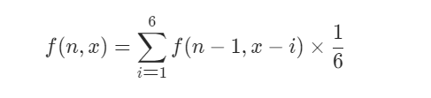
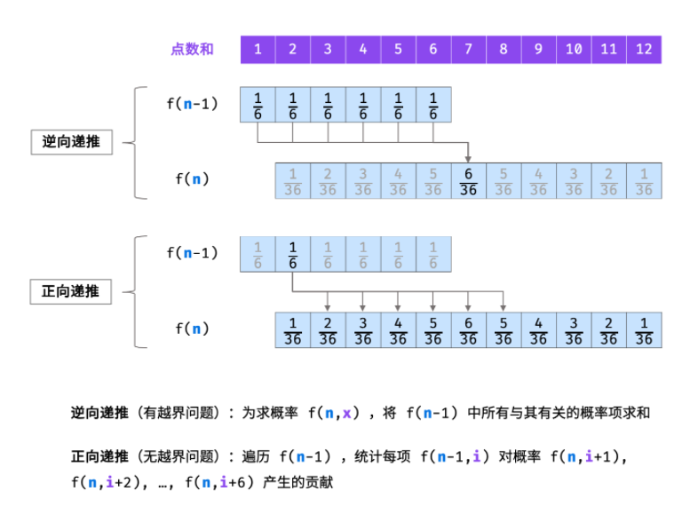

- [基础问题](#基础问题)
  - [0-1背包问题](#0-1背包问题)
  - [剑指10-1.斐波那契数列](#剑指10-1斐波那契数列)
  - [70. 爬楼梯问题](#70-爬楼梯问题)
  - [746. 使用最小花费爬楼梯](#746-使用最小花费爬楼梯)
  - [补充问题： 圆环回原点问题](#补充问题-圆环回原点问题)
- [子序和问题](#子序和问题)
  - [53. 最大子序和 *](#53-最大子序和-)
  - [面试题 17.24. 最大子矩阵*](#面试题-1724-最大子矩阵)
  - [152. 乘积最大子数组](#152-乘积最大子数组)
- [买卖股票](#买卖股票)
  - [121. 买卖股票的最佳时机 *](#121-买卖股票的最佳时机-)
  - [122. 买卖股票的最佳时间 2 *](#122-买卖股票的最佳时间-2-)
  - [123. 买卖股票的最佳时间 3 [Hard] *](#123-买卖股票的最佳时间-3-hard-)
  - [188. 买卖股票的最佳时机 IV [Hard]*](#188-买卖股票的最佳时机-iv-hard)
  - [309. 最佳买卖股票时间含冷冻期 [*medium*]](#309-最佳买卖股票时间含冷冻期-medium)
  - [714. 最佳买卖股票时间含手续费 [*medium*]](#714-最佳买卖股票时间含手续费-medium)
- [打家劫舍系列](#打家劫舍系列)
  - [198. 打家劫舍](#198-打家劫舍)
  - [213. 打家劫舍 II](#213-打家劫舍-ii)
  - [337. 打家劫舍 III](#337-打家劫舍-iii)
- [游戏对战系列](#游戏对战系列)
  - [486. 预测赢家](#486-预测赢家)
  - [877. 石子游戏](#877-石子游戏)
  - [1563. 石子游戏](#1563-石子游戏)
  - [补充. 回文串变换 [360笔试]](#补充-回文串变换-360笔试)
- [背包问题系列](#背包问题系列)
  - [416. 分割等和子集](#416-分割等和子集)
  - [1049. 最后一块石头的重量II](#1049-最后一块石头的重量ii)
  - [494. 目标和 target sum [Medium]](#494-目标和-target-sum-medium)
- [匹配问题](#匹配问题)
  - [10. 正则表达式 [Hard *]](#10-正则表达式-hard-)
  - [44. 通配符匹配 [Hard]](#44-通配符匹配-hard)
- [跳跃游戏](#跳跃游戏)
  - [55. 跳跃游戏 [Medium]](#55-跳跃游戏-medium)
  - [45. 跳跃游戏 II  [贪心]](#45-跳跃游戏-ii--贪心)
  - [1306. 跳跃游戏 III](#1306-跳跃游戏-iii)
- [Others](#others)
  - [62. 不同路径 [Medium]](#62-不同路径-medium)
  - [63. 不同路径 2](#63-不同路径-2)
  - [980. 不同路径 3 [Hard]](#980-不同路径-3-hard)
  - [322. 零钱兑换 [Medium]](#322-零钱兑换-medium)
  - [518. 零钱兑换 II](#518-零钱兑换-ii)
  - [300. 最长上升子序列 (LIS)](#300-最长上升子序列-lis)
  - [673. 最长递增子序列的个数](#673-最长递增子序列的个数)
  - [354. 俄罗斯套娃信封](#354-俄罗斯套娃信封)
  - [221. 最大正方形](#221-最大正方形)
  - [72. 编辑距离 *[Hard]*](#72-编辑距离-hard)
  - [补充： 最小编辑代价 [ByteDance]](#补充-最小编辑代价-bytedance)
  - [91. 解码方法 [Medium]](#91-解码方法-medium)
  - [剑指46. 把数字翻译成字符串](#剑指46-把数字翻译成字符串)
  - [64. 最小路径和](#64-最小路径和)
  - [120. 三角形最小路径和 [Red 小红书]](#120-三角形最小路径和-red-小红书)
  - [312. 戳气球](#312-戳气球)
  - [343. 整数拆分](#343-整数拆分)
  - [1143. 最长公共子序列 *](#1143-最长公共子序列-)
  - [887. 鸡蛋掉落 [面试**]](#887-鸡蛋掉落-面试)
  - [1235. 规划兼职工作 [Huawei]](#1235-规划兼职工作-huawei)
  - [5815. 扣分后的最大得分](#5815-扣分后的最大得分)
  - [剑指 Offer 60. n个骰子的点数](#剑指-offer-60-n个骰子的点数)

## 基础问题
### 0-1背包问题
> 有N件物品和⼀个最多能被重量为W 的背包。第i件物品的重量是weight[i]，得到的价值是value[i] 。每 件物品只能⽤⼀次，求解将哪些物品装⼊背包⾥物品价值总和最⼤

- 背包问题是动态规划算法思想的索引，很多dp问题都可以转化成背包问题
- 定义：
  - `dp[i][w]`： 表示给定最大承重w， 从0-i个物品挑选的最大价值和
  -  状态转移公式： `dp[i][w] = max(dp[i-1][w], dp[i-1][w - w[i]] + value[i]`
  -  dp[i - 1][w] : 背包容量为j, 里面不放物品i的最大价值，`dp[i][j] = dp[i - 1][j]`
  -  `dp[i-1][j - w[i]]` 容量为`j-w[i]`时的最大价值，那么当背包放入物品i后得到的最大价值即为目标值


- **dp状态初始化**
  - dp[i][0] = 0
  - 对于物品0， 应该将所有w设为`dp[0][w]=v[0]`
  - 倒叙遍历/或者直接赋值

```c++  
// 倒叙遍历
for (int j = bagWeight; j >= weight[0]; j--) {  
    dp[0][j] = dp[0][j - weight[0]] + value[0]; // 初始化i为0时候的情况
} 
```

- **确定遍历顺序**： 两个遍历维度： 物品与背包重量
两种遍历顺序都可以

```c++
for (int i = 1; i < weight.size(); i++) {
    for (int j = 0; j <= bagweight; j++) {
        if (j < weight[i]) {
            dp[i][j] = dp[i - 1][j];
        }
        else {
            dp[i][j] = max(dp[i-1][j],
                dp[i-1][j - weight[i]] + value[i]);
        }
    }
}
```


完整代码： 
```c++
void test_2_wei_bag_problem1() { 
    vector<int> weight = {1, 3, 4}; vector<int> value = {15, 20, 30}; int bagWeight = 4;
// ⼆维数组 
vector<vector<int>> dp(weight.size() + 1, vector<int>(bagWeight + 1, 0));
// 初始化 
for (int j = bagWeight; j >= weight[0]; j--) 
dp[0][j] = dp[0][j - weight[0]] + value[0];
// weight数组的⼤⼩ 就是物品个数 
for(int i = 1; i < weight.size(); i++) { // 遍历物品 
    for(int j = 0; j <= bagWeight; j++) { // 遍历背包容量 
    if (j < weight[i]) 
        dp[i][j] = dp[i - 1][j]; 
    else 
        dp[i][j] = max(dp[i - 1][j], dp[i - 1][j - weight[i]] + value[i]);
    }
}
} 
cout << dp[weight.size() - 1][bagWeight] << endl;
}
```

- 采用滚动数组来实现结果, 将二维数组转换为一维数组，取行向量来记录结果，
  - 公式变为：  `dp[w] = max([w], [w - w[i]] + value[i]`， 移除公式中不同物品集的影响
  - **由于是动态调整的过程，为了避免中间结果被覆写，要在内循环中使用逆序遍历**
```c++
vector<int> dp(bagweight + 1, 0);

for (int i = 0; i < weight.size(); i++) {
    for (int j = bagweight; j >= weight[i]; j--) {
        dp[j] = max(dp[j], dp[j - weight[i]]+values[i]);
    }
}
cout << dp[bageweight];
```


### 剑指10-1.斐波那契数列

- 最经典的动态规划问题： f[n] = f[n-1] + f[n-2]  n>1
- 通过两个状态记录即可
- **需要注意的是要避免越界，根据提示在计算加和的时候进行模操作**
```
class Solution {
public:
    int fib(int n) {
        int pred = 0;
        int cur = 1;
        if (n == 0)
            return 0;
        while (n > 1) {
            int tmp = cur;
            cur = (cur + pred) % (1000000007);
            pred = tmp;
            n--;
        }
        return cur % (1000000007);
    }
};
```
### 70. 爬楼梯问题
> 假设你正在爬楼梯。需要 n 阶你才能到达楼顶。每次你可以爬 1 或 2 个台阶。你有多少种不同的方法可以爬到楼顶呢


- 递归公式：f(n)=f(n-1)+f(n-2) 递归解法会超时
  - 初始状态： `f(0) = 1` `f(1) = 1` 
- 使用简单的动态规划解决
- 或者利用上面的递归公式的通项公式来直接求解


```c++
class Solution {
public:
    int climbStairs(int n) {
        vector<int> dp(n+1);
        dp[0]=1;
        dp[1]=1;
        for(int i=2;i<n+1;i++){
            dp[i]=dp[i-1]+dp[i-2];
        }
        return dp[n];

    }
};
```
**这种写法时间复杂度为O(n) 空间复杂度为O(n)，可以做进一步优化**： 空间复杂度优化到O(1)
```c++
class Solution {
public:
    int numWays(int n) {
        int a = 1;
        int b = 1;
        for (int i = 1; i < n; i++) {
            int tmp = b;
            b = (a + b)%(1000000007);
            a = tmp;
        }
        return b%(1000000007);
    }
};
```
### 746. 使用最小花费爬楼梯
> 每当你爬上一个阶梯你都要花费对应的体力值，一旦支付了相应的体力值，你就可以选择向上爬一个阶梯或者爬两个阶梯
**找出达到楼层顶部的最低花费**

- [LC70.爬楼梯]的升级版本
- 把当前楼梯的cost考虑进入公式即可
  - `dp[i]`表示达到当前楼梯所需的最小花费
  - `dp[i] = min(dp[i-1]+cost[i-1], dp[i-2] + cost[i-2])`

```c++
class Solution {
public:
    int minCostClimbingStairs(vector<int>& cost) {
        int n = cost.size();
        vector<int> dp(n + 1);
        dp[0] = 0;
        dp[1] = 0;
        for (int i = 2; i <= n; i++) {
            dp[i] = min(dp[i-1] + cost[i-1], dp[i-2] + cost[i-2]);
        }
        return dp[n];
    }
};
```
- 空间压缩，使用临时变量代替数组
```c++
class Solution {
public:
    int minCostClimbingStairs(vector<int>& cost) {
        int n = cost.size();
        int pre = 0;
        int cur = 0;
        for (int i = 2; i <= n; i++) {
            int tmp = cur;
            cur = min(cur + cost[i-1], pre+ cost[i-2]);
            pre = tmp;
        }
        return cur;
    }
};
```
### 补充问题： 圆环回原点问题

> 圆环上有10个点，编号为0~9。从0点出发，每次可以逆时针和顺时针走一步，问走n步回到0点共有多少种走法。

- **与LC70.爬楼梯有相似之处**
- 这里是走n步， LC70是n阶；
- 动态规划公式的目标是要描述左/右走法的作用
  - dp[i][j] : **定义为i步走到j点的走法数量**
  - `dp[i][j] = dp[i-1][(j-1+length)%length]  + dp[i-1][(j+1)%length]`
  - **走n步到0的方案数=走n-1步到1的方案数+走n-1步到9的方案数**
  - 由于是环形，所以要使用模操作

```c++
int backToOrigin(int n, int length) {
    vector<vector<int>> dp(n, vector<int>(length));
    dp[0][0] = 1;
    for (int i = 1; i < n; i++) {
        for (int j = 0; j < length; j++) {
            dp[i][j] = dp[i-1][(j-1+length)%length] + dp[i-1][(j+1)%length];
        }
    }
    return dp[n-1][0];
}
```


## 子序和问题
### 53. 最大子序和 *
> 给定一个整数数组 nums ，找到一个具有最大和的**连续子数组**（子数组最少包含一个元素），返回其最大和。
> 
- 动态规划求解 **学习掌握这种节省空间的变量管理写法**
    - f(i)=max{f(i-1)+ai,ai} 状态转移公式 f(i)即表示以第i个数字结尾的子序列的最大值
    - 时间复杂度为： O(n) 空间复杂度O(1)

```c++
class Solution {
public:
    int maxSubArray(vector<int>& nums) {
        //vector<int> res(nums.size());
        int pre=nums[0];
        int maxans=nums[0];
        for(int i =1; i<nums.size();i++){
            pre=max(pre+nums[i],nums[i]);
            maxans=max(pre,maxans);
        }
        return maxans;

    }
};
```

- 贪心算法: 从左到右遍历，计算和值，保留最大值；当和值小于0时，当前和值归0； 本质上仍然是DP算法
- **后续编程中，首先考虑边界情况(输入为空的情况)**

```class Solution {
public:
    int maxSubArray(vector<int>& nums) {
        //vector<int> res(nums.size());
        if(nums.size()==0) return INT_MIN;  
        int sum=0;
        int maxans=INT_MIN;
        for(int i =0; i<nums.size();i++){
            sum+=nums[i]; 
            maxans=max(sum,maxans);
            if(sum<0){
                sum=0;
            }
        }
        return maxans;
    }
};
```

-  **分治解法**， 定义线段树，对于一个区间[l,r],定义中点$m=(l+r)/2$，分治计算[l,m]和[m+1,r]两段
    - 利用线段树来计算，对于线段[l,r]
    - lSum 表示 [l, r][l,r] 内以 l **为左端点的最大子段和**
    rSum 表示 [l, r][l,r] 内以 r **为右端点的最大子段和**
    mSum 表示 [l, r][l,r] 内的最大子段和
    iSum 表示 [l, r][l,r] 的**区间和**
    - 通过递归对段内的量进行计算：
        可以考虑 [l, r]的 mSum 对应的区间是否跨越 m——它可能不跨越 m，也就是说 [l, r] 的 mSum 可能是「左子区间」的 mSum 和 「右子区间」的 mSum 中的一个；它也可能跨越 m，可能是「左子区间」的 rSum 和 「右子区间」的 lSum 求和。三者取大。
    
    - 时空复杂度分析： 相当于遍历了整棵二叉树，时间复杂度O(n)； 由于递归过程空间复杂度为O(logn)，树的深度为logn

```class Solution {
public:
    struct Status {
        int lSum, rSum, mSum, iSum;
    };

    Status pushup(Status l, Status r){
        int iSum=l.iSum+r.iSum;
        int lSum=max(l.lSum,l.iSum+r.lSum);
        int rSum=max(r.rSum,r.iSum+l.rSum);
        int mSum=max(max(l.mSum,r.mSum),l.rSum+r.lSum);
        return (Status){lSum,rSum,mSum,iSum};
    }

    Status get(int l,int r,vector<int>& nums){
        if(l==r){
            return (Status){nums[l],nums[l],nums[l],nums[l]};
        }
        int m=(l+r)/2;
        Status lSub = get(l,m,nums);
        Status rSub = get(m+1,r,nums);
        return pushup(lSub,rSub);
    }
    int maxSubArray(vector<int>& nums) {
        //vector<int> res(nums.size());
        return get(0,nums.size()-1,nums).mSum;
        
    }
};
```
### 面试题 17.24. 最大子矩阵*
> 给定一个正整数、负整数和 0 组成的 N × M 矩阵，**编写代码找出元素总和最大的子矩阵**。 返回一个数组 [r1, c1, r2, c2]，其中 r1, c1 分别代表子矩阵左上角的行号和列号，r2, c2 分别代表右下角的行号和列号。若有多个满足条件的子矩阵，返回任意一个均可。
```
输入：
[
   [-1,0],
   [0,-1]
]
输出：[0,1,0,1]
```

- 最大子序和 + 前缀和, 与[LC53.最大子序和]的差异在于从一维变成了二维，并且需要返回起始和结束位置的坐标
- 整体的递归公式仍然不变，当变更当前dp时 （dp = nums[i]）时需要更新起点位置
  - 此外，还涉及到前缀和的问题
  - 在二维情况下： `dp[i][j] = max(dp[i][j - 1] + preSum_j, dp[i-1][j] + preSum_i, matrix[i][j])`
  - 由于是计算最大矩阵，前缀和需要与起点坐标对齐，这个地方还是比较难处理
- 借鉴别人的写法，使用一个辅助数组记录列方向的前缀和，同时采用双层循环，分别设置起点的位置，和终点的行位置
  - 在循环内部利用一维的最大子序和进行结果更新即可
- 关键点： **`前缀和思想`**  **`最大子序和`** **`循环方式`**
```c++
class Solution {
public:
    vector<int> getMaxMatrix(vector<vector<int>>& matrix) {
        int n = matrix.size();
        int m = matrix[0].size();
        vector<int> ans(4);
        int max_sum = matrix[0][0];
        //vector<int> tmp(m, 0);
        int bx = 0, by = 0;
        for (int i = 0; i < n; i++) {
            vector<int> tmp(m, 0);
            for (int j = i; j < n; j++) {
                int sum = 0;
                for (int k = 0; k < m; k++) {
                    tmp[k] += matrix[j][k];
                    if (sum > 0) {
                        sum += tmp[k];
                    }
                    else {
                        sum = tmp[k];
                        bx = i;
                        by = k;
                    }
                    if (sum > max_sum) {
                        max_sum = sum;
                        ans[0] = bx;
                        ans[1] = by;
                        ans[2] = j;
                        ans[3] = k;
                    }
                }
            }
        }
        return ans;
    }
};
```
### 152. 乘积最大子数组
> 找出数组中乘积最大的连续子数组（该子数组中至少包含一个数字），并返回该子数组所对应的乘积

```
输入: [2,3,-2,4]
输出: 6
解释: 子数组 [2,3] 有最大乘积 6。
```
- 题目看起来与*[LC53.最大子序和]*很相近，但是由于乘法**涉及到符号问题**，
  - `dp[i] = max(dp[i-1]*n[i], n[i])` 最大值不一定在前面的子段中取得
  - `{5,6,−3,4,−3}` 对应的值为 `5 30 -3 4 -3` 而实际最大值为:`5 * 6 * -3 * 4 * -3`
  - 因此要考虑正负号的影响
- 记录正负两种情况的值，构建两个dp数组`dpMax[i]` `dpMin[i]`分别记录最大/最小的情况
  - `dpMax[i] = max(dpMax[i - 1] * nums[i], max(nums[i], dpMin[i - 1]* nums[i]));`
  - `dpMin[i] = min(dpMin[i - 1] * nums[i], min(nums[i], dpMax[i - 1]* nums[i]));`
- 总体上要比LC53复杂一点，但基本思路仍然一致
```c++
class Solution {
public:
    int maxProduct(vector<int>& nums) {
        if (nums.empty()) return 0;
        int n = nums.size();
        vector<int> dpMax(n);
        vector<int> dpMin(n);
        dpMax[0] = nums[0];
        dpMin[0] = nums[0];
        int ans = dpMax[0];
        for (int i = 1; i < nums.size(); i++) {
            dpMax[i] = max(dpMax[i - 1] * nums[i], max(nums[i], dpMin[i - 1]* nums[i]));
            dpMin[i] = min(dpMin[i - 1] * nums[i], min(nums[i], dpMax[i - 1]* nums[i]));
            ans = max(ans, dpMax[i]);
        }
        return ans;
    }
};
```


## 买卖股票

### 121. 买卖股票的最佳时机 *
- **买卖一次 求最大收益**
- 计算最大差值，如下所示一次遍历，记录当前最小值并计算差值。
- 时间复杂度O(n) 空间复杂度O(1)

```c++
class Solution {
public:
    int maxProfit(vector<int>& prices) {
        int minprice=INT_MAX;
        int maxprofit=0;
        for(int i=0;i<prices.size();i++){
            if(prices[i]<minprice){
                minprice=prices[i];
            }else if(prices[i]-minprice>maxprofit){
                maxprofit=prices[i]-minprice;
            }
        }
        return maxprofit;

    }
};
```
- 模板解法
  - 只有一次交易机会
  - 考虑 第一次买和第一次卖的情况
  - 等价于寻找最小值及对应的最大差值
  
```c++
class Solution {
public:
    int maxProfit(vector<int>& prices) {
        int buy= INT_MIN;
        int sell=0;
        for(auto p : prices){
            buy = max(buy, -p); // 第一次买 -p
            sell = max(sell, buy + p);
        }
        return sell;

    }
};
```
- **总结**
  - 股票买卖的buy和sell，每次遍历时考虑当前状态下buy和sell的最优情况，
  - buy表示购入股票的情况下的最大收益
  - sell表示股票卖出的情况下的最大收益
  - buy = max(buy, -p) 买入时讨论：不买入/买入
  - sell = max(sell, buy + p)  卖出时观察： 当前节点卖出的最佳
### 122. 买卖股票的最佳时间 2 *
- 买卖股票的次数不受限制，上一题是只能操作一次
- **贪心算法**
  - 取所有的上升段即可，涨了就卖

```
class Solution {
public:
    int maxProfit(vector<int>& prices) {
        int ans = 0;
        for (int i = 1; i < prices.size(); i++) {
            ans += max(0, prices[i] - prices[i - 1]);
        }
        return ans;
    }
};
```
- dp算法
  - 定义`dp[i][0]` 表示当前没有股票在手的最大收益
    - `dp[i][0] = max(dp[i - 1][0], dp[i-1][1] + prices[i])`
  - 定义`dp[i][1]` 表示当前股票在手的最大收益
    - `dp[i][1] = max(dp[i - 1][1], dp[i-1][0] - prices[i])`
    - dp[0][0] = 0 dp[0][1] = - prices[0]


- 通用模板解法

```c++
class Solution {
public:
    int maxProfit(vector<int>& prices) {
        int buy= INT_MIN;
        int sell=0;
        for(auto p : prices){
            int buynow = max(buy, sell - p); // 第一次买 -p
            int sellnow = max(sell, buy + p);
            buy = buynow;
            sell = sellnow;
        }
        return sell;
    }
};
```

### 123. 买卖股票的最佳时间 3 [Hard] *
- **限制只能买卖2次**
- 使用模板
    - 分为四次判断：
    - 第一次买
    - 第一次卖
    - 第二次买
    - 第二次卖
    - 每次取最大值
```c++
class Solution {
public:
    int maxProfit(vector<int>& prices) {
        int fstbuy = INT_MIN, fstsell = 0;
        int secbuy = INT_MIN, secsell = 0;
        for( auto p : prices) {
            fstbuy = max(fstbuy, - p); // 第一次买 -p
            fstsell = max(fstsell, fstbuy + p); // 第一次卖 buy + p
            secbuy = max(secbuy, fstsell - p); // 第二次买 在fstsell的基础上-p
            secsell = max(secsell, secbuy + p);
        }
        return secsell;
    }
};
```

### 188. 买卖股票的最佳时机 IV [Hard]*
- 给定最大购买次数 `k`, 计算最大收益
- 在上题的基础上，加入循环改进即可
  - 使用数组存储每轮交易的状态buy/sell状态
  - 每轮交易状态的更新与上面一致


```c++
class Solution {
public:
    int maxProfit(int k, vector<int>& prices) {
        vector<int> buy (k + 1, INT_MIN);
        vector<int> sell (k+1);
        for (auto p : prices) {
            // 遍历范围设置
            for (int i = 1; i <= k; i++) {
                buy[i] = max(buy[i], sell[i - 1] -p);
                sell[i] = max(sell[i], buy[i] + p);
            }
        }
        return sell.back();
    }
};
```
### 309. 最佳买卖股票时间含冷冻期 [*medium*]
- 卖完一次股票后有一天的冷冻期，无法进行交易
- 交易次数不做限制
  - 跟第2个题目相比，唯一差异在于多一个冷冻限制，
  - 整体代码一致
  - 为了对冷冻期进行处理，即避免sell后里面进行交易，所以就需要**对其中的sell数据更新做延迟，延迟一天更新即可**
  - 因此取临时变量lock，取sell更新前的值

```c++
class Solution {
public:
    int maxProfit(vector<int>& prices) {
        int buy = INT_MIN;
        int sell = 0;
        int lock = 0;
        for (auto p : prices) {
            int buynow = max(buy, lock - p);
            int sellnow = max(sell, buy + p);
            lock = sell; // 变量延迟赋值
            sell = sellnow;
            buy = buynow;
        }
        return sell;
    }
};
```

### 714. 最佳买卖股票时间含手续费 [*medium*]
- 与309一致，添加了一些小限制，只需要在基本的操作上添加逻辑即可
  - 把手续费加入buy/sell的更新计算中，由于sell中`buy+p` 会有溢出bug，还是加在buy的操作中

```c++
class Solution {
public:
    int maxProfit(vector<int>& prices, int fee) {
        int buy = INT_MIN;
        int sell = 0;
        for (auto p : prices) {
            int buynow = max(buy, sell - p - fee);
            int sellnow = max(sell,  buy + p);
            sell = sellnow;
            buy = buynow;
        }
        return sell;
    }
};
```


## 打家劫舍系列

### 198. 打家劫舍
- 计算非间隔取数的最大值
- DP算法求解： dp[x]表示以第x个值结尾打劫取得的最大值：
  - 状态转移公式如下 `dp[x]=max(dp[x-1],dp[x-2]+a[x])`,
  - `dp[0]=a[0];dp[1]=max(a[0],a[1])`
- 时间复杂度O(N) 空间复杂度O(n)

```c++
class Solution {
public:
    int rob(vector<int>& nums) {
        if(nums.size()==0){return 0;}
        
        vector<int> dp;
        dp.push_back(nums[0]);
        for(int i=1;i<nums.size();i++){
            if(i<=1){
                dp.push_back(max(nums[i],dp[i-1]));
            }
            else{
                dp.push_back(max(dp[i-1],dp[i-2]+nums[i]));
            }
        }
        return dp[nums.size()-1];

    }
};
```

- **通过滚动数组压缩空间：仅用两个变量来记录即可**，在状态更新过程中进行变量移动更新，将空间复杂度压缩至O(1)

```c++
class Solution {
public:
    int rob(vector<int>& nums) {
        if(nums.size()==0){return 0;}
        
        int odd=nums[0]; // 
        int even=odd;    // 临时代码

        for(int i=1;i<nums.size();i++){
            if(i<=1){
                even=max(odd,nums[i]);
            }
            else{
                int tmp=(max(even,odd+nums[i]));
                odd=even;
                even=tmp;
            }
        }
        return even;

    }
};
```

### 213. 打家劫舍 II 
> 各个房屋形成环，首尾相接

- 在上面的做法基础上，将问题转换成两个单向数组，[0, n-1] [1, n]即尾不偷和头不偷的两个情况，取两种情况的最大值
```c++
class Solution {
public:
    int rob(vector<int>& nums) {
        if (nums.empty())
            return 0;
        if (nums.size() < 2) {
            return nums.back();
        }
        return max(robS(nums, 0, nums.size() - 1), robS(nums, 1, nums.size()));
    }
    int robS(vector<int>& nums, int start, int end) {
        int pre = 0;
        int cur = 0;
        for (int i = start; i < end; i++) {
            int tmp = cur;
            cur = max(cur, pre + nums[i]);
            pre = tmp;
        }
        return cur;
    }
};
```
### 337. 打家劫舍 III 
> 各个房屋形成二叉树，地区只有一个入口， 即根节点

- **结合二叉树遍历的动态规划**
- dp状态定义： 
  - dp[i][0]: 表示当前点不偷的最大收益， 
  - dp[i][1]: 表示当前点偷的最大收益
- 在树结构下的，**状态转移考虑根节点与左右子树的关系**：
  - 当前root节点： `dp[r][0] = max(dp[left][0], dp[left][1]) + max(dp[right][0], dp[right][1])`
  - `dp[r][1] = root -> val +  dp[right][0] + dp[left][0])`
  - 使用结构体来整体记录**偷与不偷**的结果
- 根据问题定义，整个遍历应该采用自底而上的方式，即后序遍历
- 时间复杂度 O(N) (后序遍历的时间) 空间复杂度 O(N)


```c++
class Solution {
public:
    struct Choice{
        int notSelect;
        int selected;
    };

    Choice _rob(TreeNode* root) {
         if (!root) return {0, 0};
        Choice l = _rob(root -> left);
        Choice r = _rob(root -> right);
        int notSelect = max(l.notSelect, l.selected) + max(r.notSelect, r.selected);
        int selected = root -> val + l.notSelect + r.notSelect;
        return {notSelect, selected};
    }
    int rob(TreeNode* root) {
        Choice res = _rob(root);
        return max(res.notSelect, res.selected);
    }
};
```
## 游戏对战系列

### 486. 预测赢家
> 给定一个表示分数的非负整数数组。 玩家 1 从数组任意一端拿取一个分数，随后玩家 2 继续从剩余数组任意一端拿取分数，然后玩家 1 拿，…… 。
> 每次一个玩家只能拿取一个分数，分数被拿取之后不再可取。直到没有剩余分数可取时游戏结束。最终获得分数总和最多的玩家获胜。 如果最终两个玩家的分数相等，那么玩家 1 仍为赢家
给定一个表示分数的数组，预测玩家1是否会成为赢家。你可以假设每个玩家的玩法都会使他的分数最大化。

- 两个人交换地从两端取数，进行结果对比，可以进行递归模拟
  - 由于存在重复子问题，因此可以使用动态规划降低时间复杂度。

- dp定义：`dp[i][j]` 表示i到j之间的取数差值： 当数组剩下的部分为下标 i 到下标 j 时，即在下标范围 [i, j]中，**当前玩家与另一个玩家的分数之差的最大值**，注意当前玩家不一定是先手
- 状态转移： `dp[i][j] = max(nums[i] - dp[i + 1][j] , nums[j] - dp[i][j-1] )` 分别对应从左侧取i个数， 最后差值为 当前值 - 下一个玩家的取值分差； 以及从右侧取第j个数
- 时间复杂度 O(N^2) 空间复杂度 O(N)

```c++
class Solution {
public:
    bool PredictTheWinner(vector<int>& nums) {
        int n = nums.size();
        vector<vector<int>> dp(n, vector<int>(n));
        // 初始化： [i,i]区间内只能选择拿当前值
        for (int i = 0; i < n; i++) {
            dp[i][i] = nums[i];
        }
        for (int i = n - 2; i>=0; i--) {
            for (int j = i + 1; j < n; j++) {
                dp[i][j] = max(nums[i] - dp[i + 1][j], nums[j] - dp[i][j-1]);
            }
        }
        return dp[0][n-1] >= 0;
    }
};
```
- 滚动数组操作压缩空间：
  - 根据数据依赖关系，直接取一列数据即可，**因为内外循环的设计方法，不存在覆盖问题**，相对来说改动较小

```c++
class Solution {
public:
    bool PredictTheWinner(vector<int>& nums) {
        int n = nums.size();
        //vector<vector<int>> dp(n, vector<int>(n));
        vector<int> dp(n);
        for (int i = 0; i < n; i++) {
            // dp[i][i] = nums[i];
            dp[i] = nums[i];
        }
        
        for (int i = n - 2; i>=0; i--) { // n-2 为了避免溢出
            for (int j = i + 1; j < n; j++) {
                //dp[i][j] = max(nums[i] - dp[i + 1][j], nums[j] - dp[i][j-1]);
                dp[j] = max(nums[i] - dp[j], nums[j] - dp[j-1]);
            }
        }
        //return dp[0][n-1] >= 0;
        return dp[n-1] >= 0;
    }
};
```

###  877. 石子游戏
> 偶数堆石子排成一行，每堆都有正整数颗石子 piles[i] 。游戏以谁手中的石子最多来决出胜负。石子的总数是奇数，所以没有平局.
> 亚历克斯和李轮流进行，亚历克斯先开始。 每回合，玩家从行的开始或结束处取走整堆石头。 这种情况一直持续到没有更多的石子堆为止，此时手中石子最多的玩家获胜。
假设亚历克斯和李都发挥出最佳水平，当亚历克斯赢得比赛时返回 true ，当李赢得比赛时返回 false 

- 与[LC486.预测赢家]相比，多了两个关键的条件：
  - **数组的长度是偶数**；
  - **数组的元素之和是奇数，所以没有平局**
- 在以上的限制下，**存在先手优势，即先选的玩家一定能获胜**：
  - 将石子分成两组之后，可以计算出每一组的石子数量，同时知道哪一组的石子数量更多。\text{Alex}Alex 只要选择取走数量更多的一组石子即可。因此，先选的玩家总是可以赢得比赛

```c++
class Solution {
public:
    bool stoneGame(vector<int>& piles) {
        int n = piles.size();
        vector<int> dp(n);
        for (int i = 0; i < n; i++) {
            // dp[i][i] = nums[i]; 
            dp[i] = piles[i];
        }
        
        for (int i = n - 2; i>=0; i--) { // n-2 为了避免溢出
            for (int j = i + 1; j < n; j++) {
                //dp[i][j] = max(nums[i] - dp[i + 1][j], nums[j] - dp[i][j-1]);
                dp[j] = max(piles[i] - dp[j], piles[j] - dp[j-1]);
            }
        }
        return dp[n-1] > 0;
    }
};
```

```c++
class Solution {
public:
    bool stoneGame(vector<int>& piles) {
        return true;
    }
};
```

### 1563. 石子游戏
> 石子分两行，Bob 负责计算每一行的值，即此行中所有石子的值的总和。Bob 会丢弃值最大的行，Alice 的得分为剩下那行的值（每轮累加）。**如果两行的值相等，Bob 让 Alice 决定丢弃哪一行**。下一轮从剩下的那一行开始。**只剩下一块石子时，游戏结束**。Alice的分数最初为 0 。返回 Alice 能够获得的最大分数 。

- 博弈问题，dp状态比较清晰：
  - `dp[i][j]`表示第i和j石子内的最大收益
  - `sum[i,k] < sum [k+1, j]: dp[i][j] = dp[i][k] + sum[i,k]`
  - `sum[i,k] > sum [k+1, j]: dp[i][j] = dp[k+1][j] + sum[k+1, j]`
  - 初始化： 计算前缀和数组用于sum快速计算，注意设置前缀的初始0
- 使用递归的形式进行实现，对于重复计算的值进行跳过
  - 记忆化搜索
- 关键点： **`递归方式实现`**

```c++
class Solution {
public:
    vector<vector<int>> dp;
    int dfs(vector<int>& stoneValue, vector<int>& preSum, int left, int right) {
        if (left == right) return 0;
        // 剪枝操作
        if (dp[left][right]) {
            return dp[left][right];
        }
        for (int i = left; i < right; i++) {
            // 分段取前缀和 避免区间重叠
            int suml = preSum[i + 1] - preSum[left];
            int sumr = preSum[right + 1] - preSum[i + 1];
            if (suml < sumr) {
                dp[left][right] = max(dp[left][right], dfs(stoneValue, preSum, left, i) + suml);
            } 
            else if (suml > sumr) {
                dp[left][right] = max(dp[left][right], dfs(stoneValue, preSum, i + 1, right ) + sumr);
            }
            else {
                dp[left][right] = max(dp[left][right], max(dfs(stoneValue, preSum, left, i) + suml, dfs(stoneValue, preSum, i + 1, right) + sumr));
            }
        }
        return dp[left][right];
    }

    int stoneGameV(vector<int>& stoneValue) {
        vector<int> preSum (stoneValue.size());
        int n = stoneValue.size(); 
        for (int i = 0; i < n; i++) {
            if (i == 0) {
                preSum[i] = stoneValue[0];
            }
            else {
                preSum[i] = stoneValue[i] + preSum[i - 1];
            }
        }
        preSum.insert(preSum.begin(), 0);
        dp = vector<vector<int>> (n, vector<int>(n));
        return dfs(stoneValue, preSum, 0, n - 1);
    }
};
```


### 补充. 回文串变换 [360笔试]
> 所谓回文数就是一个数字，从左边读和从右边读的结果都是一样的，例如12321。
现在有一个只包含1、2、3、4的数字，你可以通过在任意位置增加一位数字或者删除一位数字来将其变换成一个回文数。但是增加或删除不同数字所需要的代价是不一样的。
```
已知增加和删除每个数字的代价如下：
增加一个1，代价：100；删除一个1，代价：120。
增加一个2，代价：200；删除一个2，代价：350。
增加一个3，代价：360；删除一个3，代价：200。
增加一个4，代价：220；删除一个4，代价：320。
```
> 请问如何**通过最少的代价将一个数字变换为一个回文数**。当然，如果一个数字本身已经是一个回文数（包括一位数，例如：2），那么变换的代价为0。

- 动态规划问题：
  - `dp[i][j]`定义从i~j子串构成回文数的最少代价
  - 若`s[i] == s[j]`, 则`dp[i][j] = dp[i+1][j-1]`
  - 若不相等，则需要进行删减操作，考虑左右两边的删增操作，即得到如下的公式：
    - 在右侧添加一个`s[i]` 需要考察i+1~j子串的回文数代价, 即i与新增的j+1进行匹配
    - 在左侧添加`s[j]` 对应i~j-1
    - 在左侧删除`s[i]`： 对应 i+1 ~j, 即i+1需要和j匹配
    - 在右侧删除`s[j]`： 对应i ~ j - 1, 即i需要和j-1匹配
    - `dp[i][j] = min(min(dp[i+1][j] + add[s[i]], dp[i][j-1] + add[s[j]]), min( dp[i+1][j] + del[s[i]], dp[i][j-1] + del[s[j]]))`
- 采用了自顶而下的递归方式进行求解
  - 为了避免重复计算，在递归中对dp有值的循环直接返回即可
  - 实现逻辑上与[LC1563.石子游戏]相似

```c++
#include<iostream>
#include<vector>
#include<string>
#include<algorithm>
using namespace std;

int add[4] = {100, 200, 360, 220};
int del[4] = {120, 350, 200, 320};
vector<vector<int>> dp;
int dfs(string nums, int i, int j) {
    if (i >= j) return 0;
    if (dp[i][j] != 0) {
        return dp[i][j]; // 直接返回
    }
    if (nums[i] == nums[j]) {
        dp[i][j] = dfs(nums, i + 1, j - 1); 
    }
    else {
        dp[i][j] = min(min(dfs(nums, i + 1, j) + add[nums[i] - '1'], //添加左侧
                       dfs(nums, i, j - 1) + add[nums[j] - '1'] // 添加右侧
                      ),
                   min(dfs(nums, i + 1, j) + del[nums[i] - '1'], //删除左侧
                       dfs(nums, i, j - 1) + del[nums[j] - '1'] // 删除右侧
                      )
                      );
    }
    return dp[i][j];
}
int main() {
    string n;
    cin >> n;
    
    int N = n.size();
    dp = vector<vector<int>> (N, vector<int>(N));
     
    cout << dfs(n, 0, N - 1);
    return 0;
}
```


## 背包问题系列
- https://leetcode-cn.com/problems/partition-equal-subset-sum/solution/bang-ni-ba-0-1bei-bao-xue-ge-tong-tou-by-px33/
- 01背包问题：
  - 关键要素： 背包总重量， 物品价值、物品重量； 每个物品只能放一次 
  - 二维dp： `dp[i][j]` 前i个物品放入总重为j的包中的最大价值
    - `dp[i][j] = max(dp[i-1][j] , dp[i-1][j-w[i]] + v[i])`
  - 一维滚动数组形式：
    - `dp[j] = max(dp[j], dp[j-w[i]] + v[i])`
### 416. 分割等和子集
> 一个 只包含正整数 的 非空 数组 nums 。请你判断是否可以将这个数组分割成两个子集，使得两个子集的元素和相等

```
输入：nums = [1,5,11,5]
输出：true
解释：数组可以分割成 [1, 5, 5] 和 [11] 
```
- 分析： 寻找子集得到和为sum/2的子集
- 单纯通过排序后进行截取的求解方法存在很多反例，本题还是要通过动态规划问题进行求解：
  - 可以将问题转换成01背包问题：**从n个元素中选取若干个构成sum/2的问题，每个元素只能使用一次**
  - `dp[i][j]` 从下标为0~i的元素中选取若干个，**是否存在一种方案使其和等于j** （与标准01背包略有差异，但形式基本一致）
  - 状态转移公式： `dp[i][j] = dp[i-1][j] | dp[i-1][j-nums[i]` 通过或来判断是否成立
  - 初始化： `dp[i][0] = true` `dp[0][nums[0]] = true`;
- 特殊情况：
  - 当sum为奇数时，显然无法成立
  - 当数组最大值大于sum/2时，也无法成立
- 时间复杂度 O(N^2) 空间复杂度 O(N^2)

```c++
class Solution {
public:
    bool canPartition(vector<int>& nums) {
        int sum = 0;
        int _m = 0;
        for (auto p : nums) {
            sum += p;
            _m = max(_m, p);
        }
        if (sum % 2 == 1) return false;
        int target = sum / 2;
        if (target < _m) return false;
        int n = nums.size();
        vector<vector<int>> dp(n, vector<int> (target + 1));
        for (int i = 0; i < n; i++) {
            dp[i][0] = true;
        }
        dp[0][nums[0]] = true;
        for (int i = 1; i < n; i++) {
            for (int j = 0; j <= target; j++) {
                if (j < nums[i]) {
                    dp[i][j] = dp[i-1][j];
                }
                else {
                    dp[i][j] = dp[i-1][j] | dp[i-1][j-nums[i]];
                }
            }
            cout << i;
        }
        return dp[n-1][target];
    }
};
```
- 按照滚动数组进行空间优化， 可以看到下面的形式：
  - `dp[j] = dp[j] | dp[j - nums[i]]`
  - 代码基本与01背包一致， 需要注意内外循环的写法，内循环要逆序遍历，避免结果覆盖
```c++
class Solution {
public:
    bool canPartition(vector<int>& nums) {
        int sum = 0;
        int _m = 0;
        for (auto p : nums) {
            sum += p;
            _m = max(_m, p);
        }
        if (sum % 2 == 1) return false;
        int target = sum / 2;
        if (target < _m) return false;
        int n = nums.size();
        vector<int> dp(target + 1);
        dp[0] = true;
        for (int i = 0; i < n; i++) {
            for (int j = target; j >= nums[i]; j--) {
               dp[j] = dp[j] | dp[j-nums[i]]; 
            }
        }
        return dp[target];
    }
};
```

### 1049. 最后一块石头的重量II
> 有一堆石头，每块石头的重量都是正整数。

> 每一回合，从中选出任意两块石头，然后将它们一起粉碎。假设石头的重量分别为 x 和 y，且 x <= y。那么粉碎的可能结果如下：

> 如果 x == y，那么两块石头都会被完全粉碎；
如果 x != y，那么重量为 x 的石头将会完全粉碎，而重量为 y 的石头新重量为 y-x。
最后，最多只会剩下一块石头。返回此石头最小的可能重量。如果没有石头剩下，就返回 0

- 问题分析： 关键是让石头分成重量相同的两堆， 相撞之后剩下的石头最小
  - 设置： 通过背包问题计算`sum/2`的背包最多能装多重的石头：
    - `target  = sum / 2` `dp[target]`
    - `ans = (sum - dp[target]) - dp[target]` 最后结果就是两堆石头的差值
  - 与[LC416.分割等和子集]做法基本相似
- 状态转移公式： `dp[j] = max(dp[j], dp[j-stones[i]] + stones[i])`
```c++
class Solution {
public:
    int lastStoneWeightII(vector<int>& stones) {
        vector<int> dp(15001, 0); // 
        int sum = 0;
        for (auto p : stones) {
            sum += p;
        }
        int n = stones.size();
        int target = sum / 2; // 背包总重量
        for (int i = 0; i < n; i++) {
            for (int j = target; j >= stones[i]; j--) {
                dp[j] = max(dp[j], dp[j - stones[i]] + stones[i]);
            }
        }
        return sum - dp[target] - dp[target];
    }
};
```


### 494. 目标和 target sum [Medium]
- 给定序列，计算仅利用+ -运算组合可以得到的目标值的组合数量
- DFS搜索所有可能组合，是最为暴力的解题方法
  - 时间复杂度： O(2^N),N为数组的长度，即组合的数量； 空间复杂度O(N)

```c++
class Solution {
public:
    int count = 0;
    void dfs(vector<int>& nums, int S, int cur, int i) {
        if (i == nums.size()) {
            if (cur == S)
            count++;
        }
        else 
        {
            dfs(nums, S, cur + nums[i], i+1);
            dfs(nums, S, cur - nums[i], i+1);
        }
    }
    int findTargetSumWays(vector<int>& nums, int S) {
        dfs(nums, S, 0, 0);
        return count;
    }
};
```
- 其他方法： 利用动态规划方法，大幅减少搜索空间
  - `dp[i][j]`**定义i个数构成目标值j的组合数量** (与01背包问题相似)
  - 状态转移方程：`dp[i][j] = dp[i-1][j-nums[i]] + dp[i-1][j+nums[i]]`
    - 初始化比较复杂： 由于j- nums[i]可能出现负值，因此需要将遍历空间调大： 增大到`[0,2*sum+1)`的范围；
    - 同时**初始化最开始的元素取值**：
      - `dp[0][nums[0]+sum]=1 dp[0][sum -nums[0]]=1`
      - 还要考虑当`nums[0]=0`的特殊情况，`dp[0][sum]=2`
    - 时间复杂度： O(N^2), 空间复杂度O(N*max(sum)) N为数组长度

```c++
class Solution {
public:
    int findTargetSumWays(vector<int>& nums, int S) {
        vector<vector<int> > dp;
        int sum = 0;
        for (auto i: nums) {
            sum += i;
        }
        if (sum < S)
            return 0;
        for (int i = 0; i < nums.size(); i++) {
            vector<int> tmp;
            tmp.assign(2*sum + 1, 0);
            dp.push_back(tmp);
        }
        int t = 2*sum + 1;
        if (nums[0] == 0) {
            dp[0][sum] = 2;
        }
        else {
            dp[0][nums[0] + sum] = 1; // init 
            dp[0][sum - nums[0]] = 1; // init
        }
        //cout << t << endl;
        for (int i = 1; i < nums.size(); i++) {
            for (int j = 0; j < t; j++ ) {
                int l = j - nums[i] < 0 ? 0 : j - nums[i];
                int r = j + nums[i] >= t ? 0 : j + nums[i];
                //cout << l << r << endl;
                dp[i][j] = dp[i - 1][l] + dp[i - 1][r];
            }
        }
        return dp[nums.size() - 1][S + sum];
    }
};
```
- 在上面的基础上，可以对dp数组进行优化，仅利用两个一维数组进行存储。大幅降低空间复杂度
  - 由于上面的转移方程中仅涉及相邻状态的转换，因此可以利用两个数组进行相对更新存储，在动态规划中十分常见
```c++
class Solution {
public:
    int findTargetSumWays(vector<int>& nums, int S) {
        vector<vector<int> > dp;
        int sum = 0;
        for (auto i: nums) {
            sum += i;
        }
        if (sum < S)
            return 0;
        
        vector<int> prev;
        prev.assign(2*sum + 1, 0);
        vector<int> next;
        next.assign(2*sum + 1, 0);
        int t = 2*sum + 1;
        if (nums[0] == 0) {
            prev[sum] = 2;
        }
        else {
            prev[nums[0] + sum] = 1; // init 
            prev[sum - nums[0]] = 1; // init
        }
        for (int i = 1; i < nums.size(); i++) {
            for (int j = 0; j < t; j++ ) {
                int l = j - nums[i] < 0 ? 0 : j - nums[i];
                int r = j + nums[i] >= t ? 0 : j + nums[i];
                next[j] = prev[l] + prev[r];
            }
            prev = next;
        }
        return prev[S + sum];
    }
};
```

- **更优雅的解法**
  - 将数组进行转换， 将计算目标转换为 `(target + sum) / 2`, 只用考虑加法运算即可
    - 定义数组元素之和为`Sum`， 构成S的方程中，加法部分的结果为X, 那么被减的数之和为`sum-x`: X- (sum - x) = S; 即`X = (target + sum) / 2`
    - $a_1 + a_2 - (a_3 + a_4) =sum$
    - 那么X**即为01背包问题中背包的总重量**
  - 本质仍然是 0/1背包问题
  - 定义当前值的组合数 `dp[j]`  转换方程为：`dp[j] += (dp[j-nums[i]])`
    - 二维形式为： 描述前i个元素构成目标和为j的个数`dp[i][j] = dp[i-1][j] + dp[i-1][j-nums[i]]`
    - 形式比标准01背包问题更简单
  - 注意遍历顺序
- 关键点: **问题转换**  **1d01背包问题**
```c++
class Solution {
public:
    int findTargetSumWays(vector<int>& nums, int target) {
        int sum = 0;
        for (int num : nums){
            sum +=  num;
        }
        if((sum + target) % 2 != 0 || sum < target) return 0;
        int n = nums.size();
        target = (sum + target) / 2;
        vector<int>dp(target + 1, 0);
        dp[0] = 1;
        
        for (int i = 0; i < n; i++){
            for(int j = target; j >= nums[i]; j--){ //从target 倒推
                 dp[j] += dp[j - nums[i]];
            }
        }
        return dp[target];
    }
};
```
## 匹配问题

### 10. 正则表达式 [Hard *]
> 给你一个**字符串 s 和一个字符规律 p**，请你来实现一个支持 '.' 和 '*' 的正则表达式匹配。
'.' 匹配任意单个字符
'*' 匹配零个或多个前面的那一个元素
所谓匹配，是要涵盖 整个 字符串 s的，而不是部分字符串。


```
输入：s = "aa" p = "a*"
输出：true
解释：因为 '*' 代表可以匹配零个或多个前面的那一个元素, 在这里前面的元素就是 'a'。因此，字符串 "aa" 可被视为 'a' 重复了一次
```

- 注意`*`的作用： 匹配前一个元素n次 （`n>=0`）
- 那么根据这个特点，可以分为三种匹配情况：对于当前位置为`*`:
  - 通配符匹配s串**一个字符** `dp[i][j-1]`
  - 匹配s串**0个字符** `dp[i][j-2]` 当p串的前一个字符和当前s串的字符不匹配时，需要把前一个字符给忽略掉，即匹配0次
  - 匹配s串**多个字符**  `dp[i-1][j]`
```c++
class Solution {
public:
    bool isMatch(string s, string p) {
        s = " " + s;  // 有效避免空字符串的对比问题
        p = " " + p; // 防止 c* 或者 /n 的情况
        int m = s.size();
        int n = p.size();
        vector<vector<int>> dp(m + 1, vector<int>(n + 1));
        dp[0][0] = 1;
        for (int i = 1; i <= m; i++) {
            for (int j = 1; j <= n; j++) {
                // 注意索引-1的情况 dp和实际string的索引有差
                // 单个字符匹配
                if (s[i - 1] == p[j - 1] || p[j - 1] == '.') {
                    dp[i][j] = dp[i - 1][j - 1];
                }
                else if (p[j - 1] == '*') {
                    // 考察p串前一个字符  无法匹配的情况下，*匹配0次
                    if (p[j - 2] != s[i - 1] && p[j - 2] != '.') {
                        dp[i][j] = dp[i][j - 2];
                    }
                    // 多次匹配
                    else { // p[j-2] == s[i-1] or p[j-2] == '.' 
                        // dp[i][j-2] : 无法匹配
                        // dp[i][j-1] : 匹配1个
                        // dp[i-1][j] : 匹配多个a （s串）
                        dp[i][j] = dp[i][j - 2] || dp[i - 1][j] || dp[i][j - 1]; 
                    }
                }
            }
        }
        return dp[m][n];
    }
};
```


### 44. 通配符匹配 [Hard] 
> 给定一个字符串 (s) 和一个字符模式 (p) ，实现一个支持 '?' 和 '*' 的通配符匹配。
'?' 可以匹配任何单个字符。
'*' 可以**匹配任意字符串（包括空字符串）**。
两个字符串完全匹配才算匹配成功。

```
输入:
s = "aa"
p = "*"
输出: true
解释: '*' 可以匹配任意字符串。
```
- 与[LC10.正则表达式]一题相似，但在具体的匹配规则上有差异：
    - 本题，使用`*`可以匹配任意字符串，匹配范围更广：
- `dp[i][j]` 表示s串的前i个字符和p串前j个字符匹配：
  - `s[i-1] == p[j-1] | p[j-1] == '?` 当前位置上字符匹配：
    - `dp[i][j] = dp[i-1][j-1]`
  - 如果当前位置上字符串不直接匹配的话，需要考虑`*`的功效：
    - `dp[i][j] = dp[i-1][j] | dp[i][j-1]` 若 `p[j-1] == '*'`
      - 即使用当前*进行匹配(`dp[i-1][j]`)与不使用`*`匹配(匹配空字符串 `dp[i][j-1]`)

```c++
class Solution {
public:
    bool isMatch(string s, string p) {
        int  n = s.size();
        int  m = p.size();
        vector<vector<int>> dp(n + 1, vector<int> (m + 1));
        // init 初始化设置
        dp[0][0] = 1;
        for (int i = 1; i <= m; i++) {
            if (p[i-1] == '*') {
                dp[0][i] = dp[0][i-1];
            }
        }
        for (int i = 1; i <= n; i++) {
            for (int j = 1; j <= m; j++) {
                if (s[i-1] == p[j-1] || p[j-1] == '?') {
                    dp[i][j] = dp[i-1][j-1];
                }
                else if (p[j-1] == '*') {
                     
                    dp[i][j] = dp[i-1][j] || dp[i][j-1] || dp[i-1][j-1];
                }
            }
        }
         
        return dp[n][m];
    }
};
```

## 跳跃游戏
### 55. 跳跃游戏 [Medium]
- **判断是否可达**
  - 可以通过**贪心的思路**进行处理
  - 计算最大路径，**需要判断当前位置是否可达**即 `i<=maxStep`

```c++
class Solution {
public:
    bool canJump(vector<int>& nums) {
        if (nums.size() <= 1)
            return true;
        int maxStep = nums[0];
        for (int i = 1; i < nums.size() - 1; i++) {
            if (i <= maxStep) {
                maxStep = max(nums[i] + i, maxStep);
            }
        }
        return maxStep >= nums.size() - 1;   
    }
};
```

### 45. 跳跃游戏 II  [贪心]
> 数组中的每个元素代表你在该位置可以跳跃的最大长度。
> 你的目标是**使用最少的跳跃次数到达数组的最后一个位置**

- 基于dp的思路:
  - 时间复杂度 $O(N^2)$
  - 空间复杂度 $O(N)$

```c++
class Solution {
public:
    int jump(vector<int>& nums) {
        vector<int> dp(nums.size(), INT_MAX);
        dp[0] = 0;
        for (int i = 0; i < nums.size(); i++) {
            //cout << dp[i] << endl;
            for (int k = i + 1; k <= nums[i] + i && k < nums.size(); k++ ) {
                dp[k] = min(dp[k], dp[i] + 1);
            }
        }
        return dp[nums.size() - 1];
    }
};
```

- 本题本质上还是典型的**贪心算法**，可以**通过贪心的思路来提高效率**
    - 记录当前位置的最大可达边界，当**当前位置越过之前最大边界时即需要跳跃**
    - **step++**
    - end记录前一个最大边界，初始化为0；
    - `maxposition` **维护当前的最大边界**
  - 时间复杂度 O(N) 空间复杂度O(1)

```c++
class Solution {
public:
    int jump(vector<int>& nums) {
        int length = nums.size();
        int end = 0;
        int steps = 0;
        int maxPosition = 0; // 最大可大边界
        for (int i = 0; i < length - 1; i++) {
            // 更新当前最大可达边界
            maxPosition = max(maxPosition, nums[i] + i); 
            if (i == end) {
            // 当到达前一个边界时， 需要进行跳跃更新
                end = maxPosition;
                steps++;
            }
        }
        return steps;
    }
};
```

### 1306. 跳跃游戏 III
> 有一个非负整数数组 arr，你最开始位于该数组的起始下标 start 处。当你位于下标 i 处时，你可以跳到 i + arr[i] 或者 i - arr[i]。
请你判断自己是否能够跳到**对应元素值为 0 的 任一 下标处**。
不管是什么情况下，你都无法跳到数组之外

```
输入：arr = [4,2,3,0,3,1,2], start = 5
输出：true
解释：
到达值为 0 的下标 3 有以下可能方案： 
下标 5 -> 下标 4 -> 下标 1 -> 下标 3 
下标 5 -> 下标 6 -> 下标 4 -> 下标 1 -> 下标 3 
```
- 基于深搜或者广搜即可完成:
  - dfs 基于栈/递归实现
  - bfs 基于队列实现
  - 注意判断位置是否可达, 并避免重复访问即可
- 时间复杂度 O(N) 
- 空间复杂度 O(N)
```c++
class Solution {
public:
    bool bfs(vector<int>& arr, int index) {
        queue<int> q;
        q.push(index);
        unordered_set<int> visited;
        visited.insert(index);
        while (!q.empty()) {
            int sz = q.size();
            for (int i = 0; i < sz; i++) {
                int cur = q.front();
                q.pop();
                if (arr[cur] == 0) return true;
                if (cur - arr[cur] >= 0 && visited.find(cur - arr[cur]) == visited.end()) {
                    q.push(cur - arr[cur]);
                    visited.insert(cur - arr[cur]);
                }
                if (cur + arr[cur] < arr.size() && visited.find(cur + arr[cur]) == visited.end()) {
                    q.push(cur + arr[cur]);
                    visited.insert(cur + arr[cur]);
                }
            }
        }
        return false;
    }
    bool helper(vector<int>& arr, vector<int>& visited, int index) {
        
        if (arr[index] == 0) return true;
        if (arr[index] + index < arr.size() && !visited[arr[index] + index]) {
            visited[arr[index] + index] = 1;
            if (helper(arr, visited, arr[index] + index)) return true;
            visited[arr[index] + index] = 0;
        }
        if (index - arr[index] >= 0 && !visited[index - arr[index]]) {
            visited[index - arr[index]] = 1;
            if (helper(arr, visited, index - arr[index])) return true;
            visited[index - arr[index]] = 0;
        }
        return false;
    }
    bool canReach(vector<int>& arr, int start) {
        if (arr.size() < start) return false;
        // vector<int> visited(arr.size());
        // visited[start] = 1;
        //return helper(arr, visited, start);
        return bfs(arr, start);
    }
};
```
## Others
### 62. 不同路径 [Medium]
- 经典的dp任务： **给出矩形，计算到达右下角的路径数量**
  - $O(MN)$
  - `dp[i][j] = dp[i-1][j] + dp[i][j-1]`
```c++
class Solution {
public:
    int uniquePaths(int m, int n) {
        int dp [100][100];
        
        for(int i = 0; i < m; i++) {
            dp[i][0] = 1;
        }
        for(int i = 0; i < n; i++) {
            dp[0][i] = 1;
        }
        for (int i = 1;i < m; i++) {
            for (int j=1; j< n; j++) {
                dp[i][j] = dp[i-1][j] + dp[i][j-1];
            }
        }
        return dp[m-1][n-1];
    }
};
```

- 更直接的思路：组合数学公式：
  - `C = C(m+n-2,m-1)` 组合公式


### 63. 不同路径 2
- 在上面的基础上，**增加障碍物品, dp时跳过障碍点**
- 使用**滚动数组**的方式来减少dp表的内存占用
- 时间复杂度 `O(mn)` 空间复杂度`O(n)`
```c++
class Solution {
public:
    int uniquePathsWithObstacles(vector<vector<int>>& obstacleGrid) {
        int m = obstacleGrid.size();
        int n = obstacleGrid[0].size();
        vector<int> dp(n);
        dp[0] = (obstacleGrid[0][0] == 0);
        for (int i = 0; i < m; i++) {
            for (int j = 0; j < n; j++) {
                if (obstacleGrid[i][j]) {
                    dp[j] = 0;
                    continue;
                }
                if (j - 1 >=0 && obstacleGrid[i][j-1] ==0) {
                    dp[j] += dp[j-1];
                }
            }
        }
        return dp.back();
    }
};
```
### 980. 不同路径 3 [Hard]


### 322. 零钱兑换 [Medium]
> 给定不同面额的硬币 coins 和一个总金额 amount。编写一个函数来计算可以凑成总金额所需的最少的硬币个数。如果没有任何一种硬币组合能组成总金额，返回 -1。 可以认为每种硬币的数量是无限的


- dp方法的基础，**状态转移公式**： `dp[i] = min (dp[i - r_k]) + 1`
- **初始化**： 
  - **dp[0] = 0**
  - **其他元素初始为`amount + 1`**, 直接初始化为最大值，会在**计算最小值出bug**
- 时间复杂度 O(nS) 空间复杂度 O(n)
- 关键点： **`状态初始化小技巧`**
```c++
class Solution {
public:
    int coinChange(vector<int>& coins, int amount) {
        int n = coins.size();
        vector<int> dp(amount + 1, amount + 1);// 技巧
        dp[0] = 0;
        // for (int i = 0; i < n; i++)
        //     dp[coins[i]] = 1;
        for (int i = 1; i <= amount; i++) {
            for (auto coin : coins) {
                if(i - coin >= 0) {
                    dp[i] = min(dp[i], dp[i - coin] + 1);
                }
            }
        }
        if (dp[amount] == amount + 1)
            return -1;
        return dp[amount];
    }
};
```

### 518. 零钱兑换 II
> **给定不同面额的硬币和一个总金额**。写出函数来计算可以凑成总金额的硬币组合数。假设每一种面额的硬币有无限个。 

- 比前面一题要复杂一些：
- 定义`dp[k][i]`表示k种硬币兑换i的组合数
- 那么状态转移公式为 `dp[k][i] = dp[k - 1][i] + d[k][i - k]`
  - 前k个硬币凑齐金额i的组合数等于**前k-1个硬币凑齐金额i的组合数加上在原来i-k的基础上使用硬币的组合数**。
  - 即要分为两种情况：
    - 一种是**只用前k-1个硬币就凑齐了**，
    - 一种是**前面已经凑到了i-coins[k]**，现在就差第k个硬币了。
- 注意初始化dp[k][0]为1
- 下面的**内外循环顺序可以交换**，结果不变
```c++
class Solution {
public:
    
    int change(int amount, vector<int>& coins) {
        // dp[k][i] : k种硬币构成金额i的组合数量
        vector<vector<int>> dp(coins.size() + 1, vector<int>(amount + 1));
        for (int k = 0; k < coins.size() + 1; k++) {
            dp[k][0] = 1;
        }
        for (int k = 1; k <= coins.size(); k++) {
            for (int i = 1; i <= amount; i++) {
                if (i >= coins[k - 1]) {
                    dp[k][i] = dp[k][i - coins[k - 1]] + dp[k - 1][i];
                }
                else { // 当前目标钱数要小于新加入的硬币， 所以没法加入当前的硬币k
                    dp[k][i] = dp[k - 1][i];
                }
            }
        }
        return dp[coins.size()][amount];
    }
};
```
- 将二维数组压缩到一维数组，取amout维度的一维数组, 代码简化如下；通过滚动数组实现了空间压缩
- 问题在于： **此时的内外循环次序可以交换么？** **不可以！** 交换的本质就是在改变dp的更新顺序，对于vector<int> dp(amount + 1);， 两维情况下，更新依赖于左侧和上方的数据
  - 而现在的一维也是行方向的数据即从左到右遍历而来，交换次序后同一位置上的数据是自上而下的遍历更新
  - 那么就会出现结果错误

```c++
class Solution {
public:
    
    int change(int amount, vector<int>& coins) {
        // dp[k][i] : k种硬币构成金额i的组合数量
        vector<int> dp(amount + 1);
        dp[0] = 1;
        for (int k = 1; k <= coins.size(); k++) {
            for (int i = 1; i <= amount; i++) {
                if (i < coins[k - 1]) {
                    continue;
                }
                else { // 当前目标钱数要小于新加入的硬币， 所以没法加入当前的硬币k
                    dp[i] += dp[i - coins[k - 1]];
                }
            }
        }
        return dp[amount];
    }
};
```


### 300. 最长上升子序列 (LIS)
- 基础DP思路
  - 状态转移公式 `dp[i]=max(dp[j])+1,其中0≤j<i且num[j]<num[i]`
  - 初始化：`dp[0]=0` 
  - 最后结果需要从dp中选取最大的值
  - 时间复杂度O(n^2), 空间复杂度 O(N)

```c++
class Solution {
public:
    int lengthOfLIS(vector<int>& nums) {
        vector<int> dp(nums.size(), 0);
        dp[0] = 1;
        int ans = 1;
        for (int i = 1; i < nums.size(); i++) {
            dp[i] = 1;
            for (int j = 0; j< i; j++) {
                if (nums[j] < nums[i]) {
                    dp[i] = max(dp[i], dp[j] + 1);
                }
            }
            ans = max(dp[i], ans);
        } 
        return ans;
    }
};
```

- **贪心+二分搜索**
  - 要使上升子序列尽可能的长，则我们需要让序列上升得尽可能慢，因此我们希望每次在上升子序列最后加上的那个数尽可能的小。
  - 基于上面的贪心思路，维护一个数组 d[i]，表示长度为 ii 的最长上升子序列的末尾元素的最小值，用 \textit{len}len 记录目前最长上升子序列的长度，起始时 lenlen 为 11，d[1] = \textit{nums}[0]d[1]=nums[0]


```c++
class Solution {
public:
    int lengthOfLIS(vector<int>& nums) {
        vector<int> tail; // 定义不同长度的子序列的最大尾值
        int ans;
        tail.push_back(nums[0]);
        for (int i = 1; i < nums.size(); i++) {
            if (nums[i] > tail.back()) {
                tail.push_back(nums[i]);
            }
            else {
                int left = 0;
                int right = tail.size() - 1;
                //cout << 'l' << left << 'r' << right << " "<< nums[i] <<endl;
                while(left < right) {
                    // int mid = left + (right - left)/2;
                    int mid = (left + right) / 2;
                    if (tail[mid] < nums[i]) {
                        left = mid + 1;
                    } else {
                        right = mid;
                    }
                }
               tail[left] = nums[i];
            }
        }
        return tail.size();
    }
};
```
### 673. 最长递增子序列的个数
> 给定一个未排序的整数数组，找到最长递增子序列的个数。
- 与[LC300.最长递增子序列]做法一致，需要增加额外的统计数组
  - 用于记录当前位置最长子序列的个数
  - 更新规则如下：
  - `dp[i] < dp[j] + 1` 则 `cnt[i] = cnt[j]`
```c++
class Solution {
public:
    int findNumberOfLIS(vector<int>& nums) {
        int n = nums.size();
        vector<int> dp(n, 1);
        vector<int> cnt(n, 1);
        int ans = 1;
        for (int i = 0; i < n; i ++) {
            for (int j = 0; j < i; j++) {
                if (nums[j] < nums[i]) {
                    if (dp[i] < dp[j] + 1) {
                        dp[i] = dp[j] + 1;
                        cnt[i] = cnt[j];  // 注意保存结果
                    }
                    else if (dp[i] == dp[j] + 1){
                        cnt[i] += cnt[j];
                    }
                }
            }
            ans = max(ans, dp[i]);
        }
        int res = 0;
        for (int i = 0; i < n; i++) {
            if (dp[i] == ans) {
                res += cnt[i];
            }
        }
        return res;
    }
};
```

### 354. 俄罗斯套娃信封
> 给你一个二维整数数组 envelopes ，其中 envelopes[i] = [wi, hi] ，表示第 i 个信封的宽度和高度。
当另一个信封的宽度和高度都比这个信封大的时候，这个信封就可以放进另一个信封里，如同俄罗斯套娃一样。
请计算 最多能有多少个 信封能组成一组“俄罗斯套娃”信封
```
输入：envelopes = [[5,4],[6,4],[6,7],[2,3]]
输出：3
解释：最多信封的个数为 3, 组合为: [2,3] => [5,4] => [6,7]。
```

- 首先需要将嵌套数组进行排序，得到升序的结果
- 根据升序数组来寻找套娃结构，套娃结构即严格的升序要求，
- **因此问题等价于寻找最长上升子序列**，区别在于此处的序列是二维数组
- 采用动态规划即可解决问题：
  - `dp[i] = max(dp[j] + 1)` (`nums[j] < nums[i]`)


```c++
class Solution {
public:
    struct cmp {
        bool operator () (vector<int>& a, vector<int>& b) {
            return a[0] < b[0] || (a[0] == b[0] && a[1] < b[1]) ;
        }
    };
    int maxEnvelopes(vector<vector<int>>& envelopes) {
        vector<int> dp(envelopes.size(), 0);
        sort(envelopes.begin(), envelopes.end(), cmp());
        int ans = 1;
        int idx = 0;
        dp[0] = 1;
        for (int i = 1; i < envelopes.size(); i++) {
            dp[i] = 1;
            for (int j = 0; j < i; j++) {
                if (envelopes[i][0] > envelopes[j][0] && envelopes[i][1] > envelopes[j][1]) {
                    dp[i] = max(dp[j] + 1, dp[i]);   
                }   
            }
            ans = max(ans, dp[i]); 
        }
        return ans;
    }
};
```


### 221. 最大正方形
> 在一个由 '0' 和 '1' 组成的二维矩阵内，找到只包含 '1' 的最大正方形，并返回其面积


- 计算全为1的最大正方形面积
- 定义`dp[i][j]`表示以i j为正方形右下角的最大边长，dp状态转移公式
  - `dp[i][j] = min(dp[i -1 ][j], dp[i][j-1], dp[i-1][j-1]) + 1`
  - dp初始化： 横向和纵向的判断
  - 临界情况考虑： 在初始化的时候要更新ans，确定ans初始为0/1
- 时间复杂度O(N^2) 空间复杂度O(N^2)

```c++
class Solution {
public:
    
    int maximalSquare(vector<vector<char>>& matrix) {
        int rows = matrix.size();
        int cols = matrix[0].size();
        int ans = 0; // 考虑临界情况
        vector<vector<int>> dp(rows, vector<int>(cols));
        for (int i = 0; i < rows; i++) {
            if (matrix[i][0] == '1') {
                dp[i][0] = 1;
                ans = 1;
            }
        }
        for (int i = 0; i < cols; i++) {
            if (matrix[0][i] == '1') {
                dp[0][i] = 1;
                ans = 1;
            }
        }
        for (int i = 1; i < rows; i++) {
            for (int j = 1; j < cols; j++) {
                if (matrix[i][j]=='1') {
                    dp[i][j] = min(dp[i - 1][j], min(dp[i][j - 1], dp[i - 1][j - 1])) + 1; 
                    ans = max(ans, dp[i][j]);
                }
            }
        }
        return ans*ans;
    }
};
```


### 72. 编辑距离 *[Hard]*
> 给你两个单词 word1 和 word2，请你计算出将 word1 转换成 word2 所使用的最少操作数 
> 
- 动态规划解题
- 定义`dp[i][j]`表示把**word1的前i个字母替换为word2的前j个字母**的最少操作数量
  - 那么动态规划的转移方程为;
  -  `dp[i][j] = min(dp[i-1][j] + 1, dp[i][j-1] + 1, dp[i-1][j-1] + (w1[i]!=w2[j])`
  -  初始化： `dp[i][0] = i`
  -  根据dp定义，那么我们应该初始化[m+1][n+1]的二维数组，返回dp[m][n]作为最终结果
- 对于特殊情况，即其中一个word为空时，编辑距离为非空word的长度
- 尤其要注意索引的设置
  - 取字符串内元素的索引和dp的索引
- 时间复杂度O(N^2) 空间复杂度O(N^2)
```c++
class Solution {
public:
    int minDistance(string word1, string word2) {
        int l1 = word1.size();
        int l2 = word2.size();
        if (word1.empty())
            return l2;
        if (word2.empty())
            return l1;
        vector<vector<int>> dp(l1 + 1, vector<int>(l2 + 1));
        for (int i = 1; i< l1 + 1; i++) {
            dp[i][0] = i;
        }
        for (int i = 1; i< l2 + 1; i++) {
            dp[0][i] = i;
        }
        for (int i = 1; i < l1 + 1; i++) {
            for (int j = 1; j< l2 + 1; j++) {
                int tmp = 1;
                // 对于字符串取值，需要注意索引的差异
                if (word1[i-1] == word2[j-1])
                    tmp = 0;
                dp[i][j] = min(dp[i-1][j] + 1, min(dp[i][j-1] + 1, dp[i-1][j-1] + tmp));
            }
        }
        return dp[l1][l2];
    }
};
```
- 进一步优化空间使用，dp问题的常见优化，将二维数组变为一维数组
  - 使用一维数组记录当前行的情况，在遍历的同时进行更新
  - 代码易读性大幅下降

```
class Solution {
public:
    int minDistance(string word1, string word2) {
        int l1 = word1.size();
        int l2 = word2.size();
        int prev = 0;
        if (word1.empty())
            return l2;
        if (word2.empty())
            return l1;
        vector<int> dp((l2 + 1));
        for (int i = 0; i < l2 + 1; i++) {
            dp[i] = i;// dp[i][j]
        }

        for (int i = 1; i < l1 + 1; i++) {
            prev = dp[0]; // dp[i-1][j-1]
            dp[0] = i; // dp[i-1][0] 更新dp赋值
            for (int j = 1; j < l2 + 1; j++) {
                // dp[i][j] = dp[i-1][j] dp[i][j-1]
                // 提前存储上一行的状态，避免被覆盖
                int tmp = dp[j];
                dp[j] = min(dp[j] + 1, min(dp[j-1] + 1, prev + int(word1[i-1] != word2[j-1])));
                prev = tmp;
            }
        }
        return dp.back();
    }
};
```

### 补充： 最小编辑代价 [ByteDance]
在编辑距离上的改动：
> 给定两个字符串str1和str2，再给定三个整数ic，dc，rc，**分别代表插入、删除、替换一个字符的代价**，返回将str1编辑成str2的最小代价。

- 编辑距离问题中没有涉及到不同方式的代价，都是1；
- 修改状态转移公式： `dp[i][j] = min(dp[i][j-1] + ic,  dp[i-1][j] + dc, dp[i-1][j-1] /  dp[i-1][j-1] + rc)`
  - 当`str1[i]!=str[j]` 时， 从str1[i] 转移到 str2[j]需要把[i]/[j]进行替换，所以加上的时rc 
  - 其他ic / dc都是**ß本质上考察对状态转移公式的理解**
  - 状态初始化： `dp[0][j] = ic*j`   `dp[i][0] = dc*i`   
https://www.it610.com/article/1176869420593655808.htm

```
1.dp[0][0]表示空串编辑成空串，故dp[0][0]=0;

2.求第一行dp[0][j]，空串编辑成str2[0….j-1]，则dp[0][j]=ic*j;

3.求第一列dp[i][0]，str1[0……i-1]编辑成空串，则dp[i][0]=dc*i;

4.求dp[i][j]，即str1[0….i-1]编辑成str2[0…..j-1]，四种可能的途径：

<1>str1[0….i-1]先编辑成str2[0…..j-2]，再由str2[0…..j-2]到str2[0…..j-1]，即dp[i][j-1]+ic;

<2>str1[0….i-1]先编辑成str1[0…..i-2]，再由str1[0…..i-2]到str2[0…..j-1]，即dc+dp[i-1][j];

<3>如果str1[i-1]==str2[j-1],则dp[i][j]=dp[i-1][j-1];
```


### 91. 解码方法 [Medium]
>一条包含字母 A-Z 的消息通过以下映射进行了编码, 请计算并返回解码方法的总数


- 将数字串解码为字符串
  - **并没有单独 '0' 所对应的解码，只有 '10'、'20' 可以解码为字符串**。
  - 提示中还有包含前导零的说明, 并非所给的字符串都可以解码


- 基于动态规划解题，利用上面提到的限制
- **dp[i] 表示前i个字符可以构成的字符串数量**
    - `dp[i] = dp[i - 1] + dp[i-2]` : 11~19 21~26
    - dp[i] = dp[i - 2] : , `10 / 20`
    - `dp[i]= dp[i-1]` :   `xy`超过26
    - 初始化： dp[0] = 1 dp[1] = 1
- 临界情况处理： 
  - **字符串首字符为0， 非法字符**


```c++
class Solution {
public:
    int numDecodings(string s) {
     // 0 没有对应字符  只有10 20 可以转换， 当出现0的时候要考虑是否是10/20
     vector<int> dp(s.size() + 1);
     if (s[0] == '0')
        return 0;
    dp[0] = 1;
    dp[1] = 1;
    for (int i = 2; i <= s.size(); i++) {
         if (s[i - 1] == '0' && (s[i - 2] != '1' && s[i - 2] != '2')) {
            return 0;
        }
        if  (s[i - 2] == '2' && (s[i - 1] >= '0' && s[i - 1] <= '6' )) {
            if (s[i - 1] == '0')
                dp[i] = dp[i - 2];
            else 
                dp[i] = dp[i - 1] + dp[i - 2];
            // cout << "1";
        }
        else if  (s[i - 2] == '1' && s[i - 1] >= '0' && s[i - 1] <= '9'  ) {
            if (s[i - 1] == '0')
                dp[i] = dp[i - 2];
            else 
                dp[i] = dp[i - 1] + dp[i - 2];
           // cout << "11";
        }
        else {
            dp[i] = dp[i - 1];
        }
        //cout << dp[i] << endl;
    }   
    return dp[s.size()];

    }
};
```
- 将dp数组优化掉: 状态转移中仅依赖前两个值，直接动态更新这两个值即可

```c++
class Solution {
public:
    int numDecodings(string s) {
     // 0 没有对应字符  只有10 20 可以转换， 当出现0的时候要考虑是否是10/20
     if (s[0] == '0')
        return 0;
    int pre = 1;
    int cur = 1;
    for (int i = 2; i <= s.size(); i++) {
        int tmp = cur;
         if (s[i - 1] == '0' && (s[i - 2] != '1' && s[i - 2] != '2')) {
            return 0;
        }
        if  (s[i - 2] == '2' && (s[i - 1] >= '0' && s[i - 1] <= '6' )) {
            if (s[i - 1] == '0')
                cur  = pre;
            else 
                cur = cur + pre;
            // cout << "1";
        }
        else if  (s[i - 2] == '1' && s[i - 1] >= '0' && s[i - 1] <= '9'  ) {
            if (s[i - 1] == '0')
                cur = pre;
            else 
               cur = cur + pre;
           // cout << "11";
        }
        pre = tmp;// 更新 dp[i-2]
        //cout << dp[i] << endl;
    }   
    return cur;
    }
};
```

### 剑指46. 把数字翻译成字符串
- 与[LC91.解码方法]是相似的，限制条件变少
- **dp[i] 表示前i个字符可以构成的字符串数量**
- 限制当前值要在10~25之间
```c++
class Solution {
public:
    int translateNum(int num) {
        string s = to_string(num);
        vector<int> dp (s.size() + 1);
        dp[0] = 1;
        dp[1] = 1;
        for (int i = 2; i <= s.size(); i++) {
            if (s[i - 2]=='1'&& s[i - 1]>='0' && s[i - 1]<='9') {
                dp[i] = dp[i - 1] + dp[i - 2];
            }
            else if (s[i - 2]=='2'&& s[i - 1]>='0' && s[i - 1]<='5') {
                dp[i] = dp[i - 1] + dp[i - 2];
            }
            else {
                dp[i] = dp[i - 1];
            }
        }
        return dp[s.size()];
    }
};
```


### 64. 最小路径和
> 给定一个包含非负整数的 m x n 网格 grid ，请找出一条从左上角到右下角的路径，使得路径上的数字总和为最小。
> 说明：每次只能向下或者向右移动一步。

- 基础dp
- 状态转移公式： `dp[i][j] = min(dp[i-1][j], dp[i][j-1]) + grid[i][j]`
  - 初始化： 将dp[i][0]/ dp[0][j]初始化
  - 时间复杂度 O（N^2） 空间复杂度 O(N^2)
- 关键技巧： **`原位dp  空间压缩`**
```c++
class Solution {
public:
    int minPathSum(vector<vector<int>>& grid) {
        int m = grid.size();
        int n = grid[0].size();
        vector<vector<int>> dp(m, vector<int> (n));
        dp[0][0] = grid[0][0];
        for (int i = 1; i < m; i++) {
            dp[i][0] = dp[i-1][0] + grid[i][0];
        }
        for (int i = 1; i < n; i++) {
            dp[0][i] = dp[0][i-1] + grid[0][i];
        }
        for (int i = 1; i < m; i++) {
            for (int j = 1; j < n; j++) {
                dp[i][j] = min(dp[i-1][j], dp[i][j-1]) + grid[i][j];
            }
        }
        return dp[m-1][n-1];
    }

};
```
- 空间压缩
    - **使用原位dp，直接在grid二维数组中进行修改**
```c++
class Solution {
public:
    int minPathSum(vector<vector<int>>& grid) {
        int m = grid.size();
        int n = grid[0].size();
        for (int i = 1; i <n; i++) {
            grid[0][i] += grid[0][i-1];
        }
        for (int i = 1; i <m; i++) {
            grid[i][0] += grid[i-1][0];
        }
        for (int i = 1; i < m; i++) {
            for (int j = 1; j < n; j++) {
                grid[i][j] += min(grid[i-1][j], grid[i][j-1]);
            }
        }
        return grid[m-1][n-1];
    }

};
```

### 120. 三角形最小路径和 [Red 小红书]
> 给定一个三角形 triangle ，找出自顶向下的最小路径和。
> 每一步只能移动到下一行中相邻的结点上。相邻的结点 在这里指的是 下标 与 上一层结点下标 相同或者等于 上一层结点下标 + 1 的两个结点

- `dp[i][j] = min(dp[i-1][j-1],dp[i-1][j]) + num[i][j]` 对边界的情况要特殊处理： `dp[i][0] = dp[i-1][0] + num[i][j] , dp[i][r]=dp[i-1][r] + num[i][j] `
- 对只有一层的临界情况进行直接返回
关键技巧： **`原位dp  空间压缩`**
```c++
class Solution {
public:
    int minimumTotal(vector<vector<int>>& triangle) {
        int n = triangle.size();
        int m = triangle.back().size();
        vector<vector<int>> dp(n, vector<int>(m));
        dp[0][0] = triangle[0][0];
        int ans = INT_MAX;
        if (n == 1) {
            return triangle[0][0];
        }
        for (int i = 1; i < n; i++) {
            for (int j = 0; j < triangle[i].size(); j++) {
                if (j == 0)
                    dp[i][j] = dp[i-1][j] + triangle[i][j];
                else if (j == triangle[i].size() - 1) {
                    dp[i][j] = dp[i-1][j-1] + triangle[i][j];
                }
                else {
                    dp[i][j] = min(dp[i-1][j], dp[i-1][j-1]) + triangle[i][j];
                }
                if (i == n - 1) ans = min(dp[i][j], ans);
            }
        }
        return ans;
    }
};
```
- 空间压缩： 原位DP

```c++
class Solution {
public:
    int minimumTotal(vector<vector<int>>& triangle) {
        int n = triangle.size();
        int m = triangle.back().size();
        //vector<vector<int>> dp(n, vector<int>(m));
         
        int ans = INT_MAX;
        if (n == 1) {
            return triangle[0][0];
        }
        for (int i = 1; i < n; i++) {
            for (int j = 0; j < triangle[i].size(); j++) {
                if (j == 0)
                    triangle[i][j] += triangle[i-1][j] ;
                else if (j == triangle[i].size() - 1) {
                    triangle[i][j] += triangle[i-1][j-1] ;
                }
                else {
                    triangle[i][j] += min(triangle[i-1][j], triangle[i-1][j-1]);
                }
                if (i == n - 1) ans = min(triangle[i][j], ans);
            }
        }
        return ans;
    }
};
```

### 312. 戳气球
> 有 n 个气球，编号为0 到 n - 1，每个气球上都标有一个数字，这些数字存在数组 nums 中。现在要求你戳破所有的气球。戳破第 i 个气球，你可以获得 nums[i - 1] * nums[i] * nums[i + 1] 枚硬币。 这里的 i - 1 和 i + 1 代表和 i 相邻的两个气球的序号。如果 i - 1或 i + 1 超出了数组的边界，那么就当它是一个数字为 1 的气球。
**求所能获得硬币的最大数量**

```
输入：nums = [3,1,5,8]
输出：167
解释：
nums = [3,1,5,8] --> [3,5,8] --> [3,8] --> [8] --> []
coins =  3*1*5    +   3*5*8   +  1*3*8  + 1*8*1 = 167
```

- 动态规划问题： 
- 将一个区间分为三段， 选出中心节点来戳破，两端的气球来计算，假设中间所夹的两段气球已被戳破
- 根据这个简单的设定，定义`dp[i][j]` 表示**开区间(i, j)内的最大值**，由于超出边界的问题可以看作数字为1的气球，最后n个气球的问题转换为计算`dp[0][n+1]` **0和n+1位置都为1的气球**
  - 转移公式： `dp[i][j] = max(c[i] * c[j] * c[k] + dp[i][k] + dp[k][j])` 两端的计算结果+中间的dp情况 
  - **初始化**：构造[n+2][n+2]的存储矩阵，并设置临时数组[n+2]来存储气球的值
  - **遍历方向**： 由于dp转移公式中，(i,j)设置到(i,k) (k,j)的dp值，因此需要从下而上递减的遍历，**外层递减，内层递增**
- 时间复杂度O(N^3) 空间复杂度O(N^2)
- 关键点： **`dp定义的范围`** **`遍历方向`** **`初始化 n+2 的设计`**
```c++
class Solution {
public:
    int maxCoins(vector<int>& nums) {
        int n = nums.size();
        // 开区间
        vector<vector<int>> dp(n + 2, vector<int> (n+2));
        vector<int> tmp(n + 2);
        // 构造辅助数组 首尾添加1
        for (int i = 0; i < n; i++) {
            tmp[i + 1] = nums[i]; 
        }
        tmp[0] = 1;
        tmp[n + 1] = 1;
        // 外层递减 设置为n-1 与内层间隔2
        for (int i = n - 1; i >= 0; i--) {
            for (int j = i + 2; j <= n + 1; j++) {
                // 搜索中间戳的位置
                for (int k = i + 1; k < j; k++) {
                    // 关键点
                    int total = tmp[i] * tmp[j] * tmp[k];
                    total += dp[i][k];
                    total += dp[k][j];
                    dp[i][j] = max(dp[i][j], total);
                }
            }
        }
        return dp[0][n + 1];
    }
};
```


### 343. 整数拆分
> 给定一个正整数 n，将其拆分为至少两个正整数的和，并使这些整数的乘积最大化。 返回你可以获得的最大乘积。

- 基本做法： 动态规划：
  - dp[i] 定义正整数i的拆分最大乘积
  - `dp[i] = max(dp[i], j*dp[i - j], j *(i - j))`
- 时间复杂度  O(N^2) 空间复杂度 O(N)
- 关键点： **`dp公式`**  **`数学方法`**


```c++
class Solution {
public:
    int integerBreak(int n) {
        vector<int> dp(n + 1, 0);
        for (int i = 2; i <= n; i++) {
            int curMax = 0;
            for (int j = 1; j < i; j++) {
                curMax = max(curMax, max(j * (i - j), j * dp[i - j]));
            }
            dp[i] = curMax;
        }
        return dp[n];
    }
};
```
- 数学方法: **最优拆分方案中 数字为1/2/3,数学可证全为3是最优的结果**
- 时间复杂度 O(1) 空间复杂度 O(1)
- 数学证明：
  - $n = \sum^a_1 n_i$ 
  - $max(n_1 * n_2 * ... * n_a)$
  - 当拆分数量确定时，当各拆分数字相等时，乘积最大：
    - $x^a = x^{n/x} = (x\frac{1}{x})^n$ 
    - 对$y = x\frac{1}{x}$ 进行求导： $x_0 = e$为极大值点
    - 因子 必须为整数，最接近 e 的整数为 2 或 3 
    - 实际上取3时，乘积最大
```c++
class Solution {
public:
    int integerBreak(int n) {
        int ans = 0;
        int s = n / 3;
        int r = n % 3;
        // 最优拆分的元素只能是2/3
        if (n <= 3) return n - 1;
        if (r == 0) return pow(3, s);  // 当整除3时，结果就是3个幂
        if (r == 1) return pow(3, s - 1)*4; // 当整除余2时，需要对余数做处理
        return pow(3, s) * 2;
    }
};
```
###  1143. 最长公共子序列 *
- 教科书式经典dp问题
> 给定两个字符串 text1 和 text2，返回这两个字符串的最长 公共子序列 的长度。如果不存在 公共子序列 ，返回 0 。
一个字符串的 子序列 是指这样一个新的字符串：它是由**原字符串在不改变字符的相对顺序的情况下删除某些字符（也可以不删除任何字符）后组成的新字符串**

- 定义`dp[i][j]`表示**子串text1[0:i）和text2[0:j）的公共子序列的最长长度**
    - 状态转移公式： dp[i][j] = dp[i-1][j-1]+ 1  当text1[i] == text2[j]
      - `dp[i][j] = max(dp[i-1][j], dp[i][j-1])`
```c++
class Solution {
public:
    int longestCommonSubsequence(string text1, string text2) {
        int n1 = text1.size();
        int n2 = text2.size();
        vector<vector<int> > dp(n1 + 1, vector<int>(n2 + 1));
        for (int i = 1; i <= n1; i++) {
            for (int j = 1; j <= n2; j++) {
                if (text1[i - 1] == text2[j - 1]) {
                    dp[i][j] = dp[i - 1][j - 1] + 1;
                }
                else {
                    dp[i][j] = max(dp[i - 1][j], dp[i][j - 1]);
                }
            }
        }
        return dp[n1][n2];
    }
};
```


### 887. 鸡蛋掉落 [面试**]
>  k 枚相同的鸡蛋，并可以使用一栋从第 1 层到第 n 层共有 n 层楼的建筑。已知存在楼层 f ，满足 0 <= f <= n ，任何从 高于 f 的楼层落下的鸡蛋都会碎，从 f 楼层或比它低的楼层落下的鸡蛋都不会破. 请你计算并返回要确定 **f 确切的值** 的 **最小操作次数** 是多少.

- 基础动态规划做法：
  - 定义dp[k][N]: k个鸡蛋对N个楼层进行测试的最小操作次数
    - `dp[k][N] = min(res, max(dp[k-1][i-1]， dp[k][N-i]))`
    - i从1开始遍历到N
      - 当鸡蛋碎了： 向下搜索： dp[k-1][i-1]; 对`i-1`层楼进行搜索
      - 当鸡蛋没有碎： 向上搜索： `dp[k][N-i]` 对 `N-i`层楼进行搜索

- **逆向思维** 将问题进行转换：
N 和 F 的关系
  - N 的定义：使用一栋从 1 到 N 共有 N 层楼的建筑
  - F 的定义：满足 0 <= F <= N 任何从高于 F 的楼层落下的鸡蛋都会碎，从 F 楼层或比它低的楼层落下的鸡蛋都不会破， 即状态
  - 因此得知，F 比 N 多一个 0 层
- 问题转换
    将问题从： **N 个楼层，有 K 个蛋，求最少要扔 T 次，才能保证当 F 无论是 0 <= F <= N 中哪个值，都能测试出来**
    **转变为：有 K 个蛋，扔 T 次，求可以确定 F 的个数，然后得出 N 个楼层**
- 递归逻辑
1. 如果只有 1 个蛋，或只有 1 次机会时，只可以确定出 T + 1 个 F
2. 其他情况时： 【蛋碎了减 1 个，机会减 1 次】 + 【蛋没碎，机会减 1 次】 （遍历所有的状态）

```c++
class Solution {
public:
    int calcF(int K, int T)
    {
        if (T == 1 || K == 1) return T + 1;
        // 两种不同的状态 对应不同的搜索F
        return calcF(K - 1, T - 1) + calcF(K, T - 1);
    }

    int superEggDrop(int K, int N)
    {
        int T = 1;
        while (calcF(K, T) < N + 1) T++;
        return T;
    }
};
```

- 面试子问题：
> 有 2 个蛋，用一座 100 层的楼，要使用**最少次数测试出蛋几层会碎**（F）。
问**第一次应该从几层扔**。

- 本质还是在求**最小测试次数**，  `superEggDrop(2, 100) = 14`
- 最少需要14次，
  - 所以第一次扔在14层， 若蛋碎， 从下面的1～13开始仍
  - 若蛋没碎，从上面的27层开始扔，（剩下的区间只有12， 只能够15～26， 所以扔27） 

所以在蛋的数量固定为 2 的情况下，T 和 F（N） 的关系应该是：
扔 1 次，确定 2 个 F，也就是 (2 - 1 = 1) 个 N。
扔 2 次，确定 2 + 2 个 F，也就是 (4 - 1 = 3) 个 N。
扔 3 次，确定 2 + 2 + 3 个 F，也就是 (7 - 1 = 6) 个 N。
即：1 + 2 + 3 + ... + 14 > 100
所以答案是 14 次


### 1235. 规划兼职工作 [Huawei]
> n份兼职工作，每份工作预计从 startTime[i] 开始到 endTime[i] 结束，报酬为 profit[i]。
给你一份兼职工作表，包含开始时间 startTime，结束时间 endTime 和预计报酬 profit 三个数组，**请你计算并返回可以获得的最大报酬**。
时间上出现重叠的 2 份工作不能同时进行。

- 比较复杂的规划问题：
  - `dp[i][0]` 第i份工作不做的最大收益
  - `dp[i][1]` 第i份工作做的最大收益
  - `dp[i][0] = max(dp[i-1][0],dp[i-1][1])`
  - `dp[i][1] = max(dp[pre[i]][0]+profit[i],dp[pre[i]][1]+profit[i])`
    - `pre[i]`即第i份工作的上一个近邻任务
  - 表示定义整合：
    - `dp[i]` 表示**从第0到第i份工作的最大收益**， 其取决于前i-1份工作中的收益情况以及`dp[pre]`当前第i份工作的上一个近邻任务的收益情况
    - `dp[i] = max(dp[i-1], dp[pre] + p[i])`
- 其他:
  - 利用结构体，**根据任务的结束时间进行升序排列**: 便于计算上一个任务
  - 初始化`dp[0]=p[0]`

- 时间复杂度 O(NlogN) 空间复杂度O(N)
```c++
class Solution {
public:
    struct Job {
        int beg;
        int end;
        int profit;
        bool operator < (const Job& x) const {
            return end < x.end; // 根据结束时间升序排序
        }
    };
    // 二分法找到上界， 第一个结束时间大于目标任务开始时间的任务index
    // 利用 index-1 来确定实际的最近邻任务
    int my_upper_bound(vector<Job>& jobs, int target) {
        int left = 0;
        int right = jobs.size() - 1;
        
        while (left <= right) {
            //cout << left << " " << right << endl;
            int mid = (left + right) >> 1;
            
            if (jobs[mid].end <= target) {
                left = mid + 1;
            }
            else {
                right = mid - 1;
            }
        }
        return left;
    }
    int jobScheduling(vector<int>& startTime, vector<int>& endTime, vector<int>& profit) {
        int n = startTime.size();
        vector<Job> jobs(n);
        for (int i = 0; i < n; i++) {
            jobs[i].beg = startTime[i];
            jobs[i].end = endTime[i];
            jobs[i].profit = profit[i];
        }
        sort(jobs.begin(), jobs.end());
        vector<int> dp(n);
        dp[0] = jobs[0].profit;
        for (int i = 1; i < n; i++) {
            int index = my_upper_bound(jobs, jobs[i].beg) - 1; 
            // 对于没有近邻任务的进行特殊判断
            dp[i] = index < 0 ? max(dp[i-1], jobs[i].profit) : max(dp[i-1], dp[index] + jobs[i].profit);
        }
        return dp[n-1];
    }
};
```

### 5815. 扣分后的最大得分
> m x n 的整数矩阵 points （下标从 0 开始）。一开始你的得分为 0 ，你想最大化从矩阵中得到的分数。
每一行 中选取一个格子，选中坐标为 (r, c) 的格子会给你的总得分 增加 points[r][c]
相邻行之间被选中的格子如果隔得太远，你会失去一些得分。对于相邻行 r 和 r + 1 （其中 0 <= r < m - 1），选中坐标为 (r, c1) 和 (r + 1, c2) 的格子，你的总得分 减少 abs(c1 - c2)

- 动态规划解题：
  - `dp[i][j] = max(dp[i - 1][k] + k) - j  + points[i][j] when k <= j `
  - `dp[i][j] = max(dp[i - 1][k] - k + j)  + points[i][j] when k>j `
- 算法思想不复杂，关键在于实现的时候如果高效实现，把复杂度降低到O(MN)
  - 通过上面的公式，我们尝试在内层循环的时候，通过线性扫描，每次拿到左边的最大值，从而将O(k) -> O(1)
```c++
class Solution {
public:
    long long maxPoints(vector<vector<int>>& points) {
        int n = points.size();
        int m = points[0].size();
        vector<vector<long long>> dp(n, vector<long long>(m));
        for (int i = 0; i < n; i++) {
            if (i == 0) {
                for (int j = 0; j < m; j++) {
                    dp[i][j] = points[i][j];
                }
            }
            else {
                // dp[i][j] = max(dp[i - 1][k] - j + k) + points[i][j] when k <= j 
                //  max(dp[i - 1][k] - k + j) + points[i][j] when k > j
                long long Max = 0;
                // 技巧！！！
                for (int j = 0; j < m; j++) {
                    Max = Max - 1 < dp[i-1][j] ? dp[i-1][j] : Max - 1;
                    dp[i][j] = Max + points[i][j];
                }
                Max = 0;
                for (int j = m - 1; j >= 0; j--) {
                    Max = Max - 1 < dp[i-1][j] ? dp[i-1][j] : Max - 1;
                    dp[i][j] = dp[i][j] < Max + points[i][j] ? Max + points[i][j] : dp[i][j];
                }
            }
        }
        long long ans = 0;
        for (int i = 0; i < m; i++) {
            if (ans < dp[n-1][i]) {
                ans = dp[n-1][i];
            }
        }
        return ans;
    }
};
```

### 剑指 Offer 60. n个骰子的点数
> 把n个骰子扔在地上，所有骰子朝上一面的点数之和为s。输入n，打印出s的所有可能的值出现的概率。

 
- 即考虑n个骰子的点数和分布情况。
  - 暴力解法：统计所有可能的分布，并记录出现的次数
- n个骰子的投掷结果有`6^n`个，**但取值范围为`n ~ 6*n`, 共有`5n + 1`个取值**
  - 定义`dp[i][x]`: 表示 i个骰子构成和为x的概率


- 采用**滚动数组**的方式实现，每次调整dp数组的长度。
  - `tmp[k+j] = dp[k] / 6.;`
```c++
class Solution {
public:
    // `sum_{1}^n
    // dp[i] = [1/n] i个骰子的分布结果
    vector<double> dicesProbability(int n) {
        vector<double> dp (6, 1/6.);
        for (int i = 2; i <= n; i++) {
            vector<double> tmp(5 * i + 1); // 2个： 5 * 2 + 1 
            for (int k = 0; k < dp.size(); k++) {
                for (int j = 0; j < 6; j++) {
                    tmp[k + j] += dp[k] / 6.;
                }
            }
            dp = tmp;
        }
        return dp;
    }
};
```