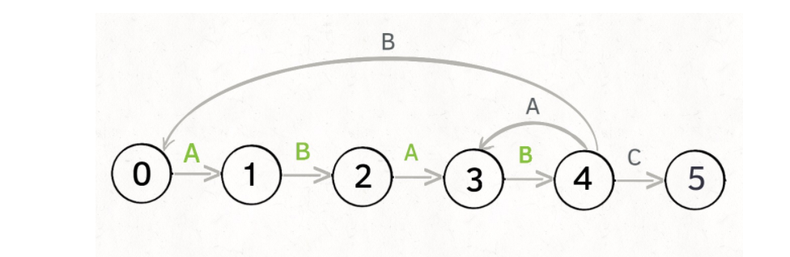
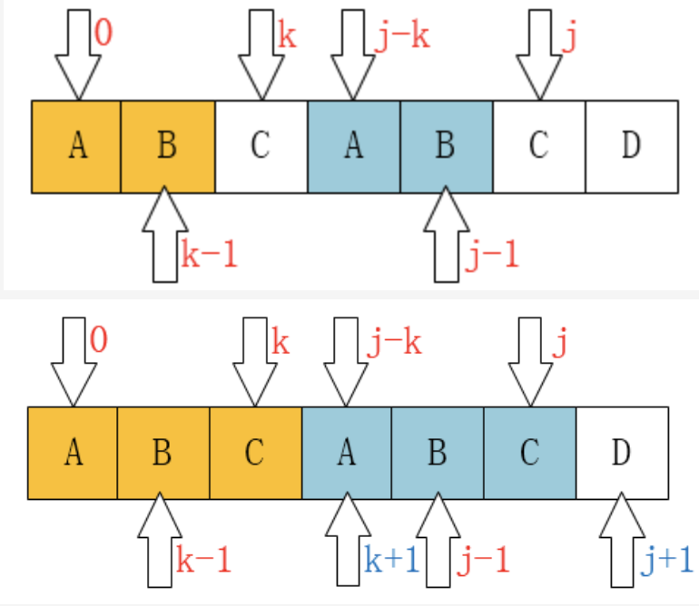

<!-- @import "[TOC]" {cmd="toc" depthFrom=1 depthTo=6 orderedList=false} -->

<!-- code_chunk_output -->

- [字符串的遍历](#字符串的遍历)
  - [6. Z字形变换](#6-z字形变换)
  - [7. 整数反转](#7-整数反转)
  - [14. 最长公共前缀](#14-最长公共前缀)
  - [38.外观数列](#38外观数列)
  - [43. 字符串相乘](#43-字符串相乘)
  - [415. 字符串相加](#415-字符串相加)
  - [67. 二进制求和](#67-二进制求和)
  - [补充. 字符串相减（大数减法）](#补充-字符串相减大数减法)
  - [补充. 36进制加法 [字节]](#补充-36进制加法-字节)
  - [166. 分数到小数](#166-分数到小数)
  - [306. 累加数](#306-累加数)
  - [344.反转字符串](#344反转字符串)
  - [剑指 Offer 58 - II. 左旋转字符串](#剑指-offer-58---ii-左旋转字符串)
  - [151. 翻转字符串的单词](#151-翻转字符串的单词)
  - [557. 反转字符串中的单词III](#557-反转字符串中的单词iii)
  - [387. 字符串中的唯一字符](#387-字符串中的唯一字符)
  - [49. 字母异位词组合](#49-字母异位词组合)
  - [242. 有效的字母异位词](#242-有效的字母异位词)
  - [443. 压缩字符串](#443-压缩字符串)
- [字符串匹配问题](#字符串匹配问题)
  - [KMP算法理解与实现 *](#kmp算法理解与实现-)
  - [28. 实现strStr() 子串匹配查找 *](#28-实现strstr-子串匹配查找-)
  - [459. 重复的子字符串](#459-重复的子字符串)
  - [796. 旋转字符串](#796-旋转字符串)
  - [97. 交错字符串](#97-交错字符串)
- [回文串](#回文串)
  - [5. 最长回文子串 [Medium] [ByteDance]](#5-最长回文子串-medium-bytedance)
  - [125. 回文串验证](#125-回文串验证)
  - [680. 验证回文串II](#680-验证回文串ii)
  - [132. 分割回文串 II *](#132-分割回文串-ii-)
  - [647.  回文子串](#647--回文子串)
  - [139. 单词拆分](#139-单词拆分)
  - [516. 最长回文子序列](#516-最长回文子序列)
- [字符串转换问题](#字符串转换问题)
  - [8.字符串转换整数 (atoi) Mid *](#8字符串转换整数-atoi-mid-)
- [综合问题](#综合问题)
  - [3. 无重复字符的最长子串 * [Medium] [Tencent/字节]](#3-无重复字符的最长子串--medium-tencent字节)
  - [334. 递增的三元子序列 [Medium]](#334-递增的三元子序列-medium)
  - [32. 最长有效括号](#32-最长有效括号)
  - [678. 有效的括号字符串](#678-有效的括号字符串)
  - [71. 简化路径 *](#71-简化路径-)
  - [224. 基础计算器 [Hard] ***](#224-基础计算器-hard-)
  - [227. 基本计算器II [Medium]](#227-基本计算器ii-medium)
  - [402. 移除K个字符 [Medium]](#402-移除k个字符-medium)
  - [补充. 01串问题](#补充-01串问题)
  - [165.比较版本号 [Medium]](#165比较版本号-medium)
  - [468. 验证IP地址](#468-验证ip地址)
  - [767. 重构字符串](#767-重构字符串)
  - [1044. 最长重复子串*](#1044-最长重复子串)

<!-- /code_chunk_output -->
字符串问题花样繁多，面试题目难易差距显著，唯有多做多看掌握各种细节处理才能驾驭该类题目

## 字符串的遍历
本质与数组的遍历问题相似， 题目比较灵活， 难度正常  
常可以**运用双指针、滑窗等通用技巧**

### 6. Z字形变换
> 将一个给定字符串 s 根据给定的行数 numRows ，以从上往下、从左到右进行 Z 字形排列
```
输入字符串为 "PAYPALISHIRING" 行数为 3 时，排列如下：
P   A   H   N
A P L S I I G
Y   I   R
```
- 字符串遍历问题，需要考虑如何实现**z形游走**， 先增再减
  - 设置方向变量，当到达0/numRows-1时调整方向， 即改变-1/+1，
  - **由于从0开始向下，需要将方向预设为-1**
- 此外还需要考虑边界问题，如：只有一行的情况
  - 直接返回即可
- 时间复杂度： O(N) 
- 关键点： **`Z形遍历`**  这类思想可以应用在数组的特殊方向遍历中

```
class Solution {
public:
    string convert(string s, int numRows) {
        if (numRows == 1) return s;
        vector<string> res(numRows);
        int dir = -1;
        int index = 0;
        for (int i = 0; i< s.size(); i++) {
            //cout << index << " ";
            res[index].push_back(s[i]);
            if (index == 0 || index == numRows - 1) {
                dir = -dir;
            }
            index = index + dir;
        }
        string ans = "";
        for (auto p : res) {
            ans +=p;
        }
        return ans;
    }
};
```

### 7. 整数反转
> 给你一个 32 位的有符号整数 x ，返回将 x 中的数字部分反转后的结果。
如果反转后整数超过 32 位的有符号整数的范围 [−231,231 − 1] ，就返回 0。

- 考虑反转后是否会溢出的问题：
  - **使用ans 和INT_MIN / INT_MAX的判断，提前判断*10前是否会溢出， 正数最大值个位为7 ， 负数为8**
- 主要考虑反转过程的溢出情况：当数是正数，逐步计算反转值使用 res*10+pop; 当上一步得到的res以及接近最大临界时需要提取return: **res>INT_MAX/10** （res==INT_MAX/10&&res>7） **7为最大正整数的个位数， 8是INT_MIN的个位**
  - *非常常见的点*
- 时间复杂度O(log10(x)) 要处理log10(x)个数字
- 关键点： **`字符串常规遍历`**  **`数值边界情况处理`**

```class Solution {
public:
    int reverse(int x) {
       int res=0;
        while(x){
            int pop=x%10;
            if(res>INT_MAX/10||(res==INT_MAX/10 && pop>7 )) return 0;
            if(res<INT_MIN/10||(res==INT_MIN/10 && pop<-8 )) return 0;
            x=int(x/10);
            res=res*10+pop;
        }
        return res;
    }
};
```

### 14. 最长公共前缀
> 编写一个函数来查找字符串数组中的最长公共前缀。如果不存在公共前缀，返回空字符串 ""

- 遍历数组中的所有最短字符串，取最短字符串的长度；
- 从0开始循环遍历各串同一位置上是否相等
- 时间复杂度 O(NM)
- 关键点： **`循环遍历`**
```
class Solution {
public:
    string longestCommonPrefix(vector<string>& strs) {
        if (strs.empty())
            return "";
        int min_l = INT_MAX;
        for (auto s : strs) {
            int a =  s.size();
            min_l = min(min_l, a);
        }
        int end = 0;
        bool flag = true;
        for (int i = 0; i < min_l; i++) {
            for (int j = 1; j < strs.size(); j++) {
                if (strs[j][i] != strs[j-1][i]) {
                    flag = false;
                    break;
                }
            }
            if (flag)
                end++;
            else {
                break;
            }
        }
        return strs[0].substr(0, end);
    }
};
```
- 进阶优化： **二分查找**：长公共前缀的长度不会超过字符串数组中的最短字符串的长度。
  - 用 $\textit{minLength}minLength$ 表示字符串数组中的最短字符串的长度，则可以在 $[0,\textit{minLength}][0,minLength]$ 的范围内通过二分查找得到最长公共前缀的长度
  - 每次取查找范围的中间值 $\textit{mid}mid$，判断每个字符串的长度为$ \textit{mid}$ 的前缀是否相同，
    - 如果相同则最长公共前缀的长度一定大于或等于 $\textit{mid}$，
    - 如果不相同则最长公共前缀的长度一定小于 $\textit{mid}$，
  - 通过上述方式将查找范围缩小一半，直到得到最长公共前缀的长度。  
- 时间复杂度为O(mnlogm) m为最小字符串长度。


```
class Solution {
public:
    string longestCommonPrefix(vector<string>& strs) {
        //int s_id=0;
        int c_id=0;
        char tmp;
        string res="";
        int s_len=strs.size();
        bool flag=false;
        if(s_len==0) return res;
        while(true){
            for(int i=0;i<s_len;i++){
                if(c_id==strs[i].length()){
                    flag=true;
                    break;
                }else{
                    if(i==0){
                        tmp=strs[i][c_id];
                    }else{
                        if(strs[i][c_id]!=tmp){
                            flag=true;
                            break;
                        }
                    }
                }

            }
            if(flag) return res;
            res.append(1,tmp);
            c_id++;
        }
        return res;


    }
};
```
### 38.外观数列
- 数组遍历，分段计算
- 可以使用双指针完成，头尾指针共同确定一段数字相同的片段

```class Solution {
public:
    string countAndSay(int n) {
        if(n==1) return "1";
        
        string s=countAndSay(n-1);
        int counts=1;
        string res;
        char tmp;
        
        for(int i=0;i<s.length();i++){
            if(i==0){
                counts=1;
                tmp=s[i];
                if(i==s.length()-1){
                res.append(to_string(counts));
                counts=1;
                res.append(1,tmp);
                tmp=s[i]; 
                }
                continue;
            }
            if(s[i]==s[i-1]){
                counts++;
            }else{
                res.append(to_string(counts));
                counts=1;
                res.append(1,tmp);
                tmp=s[i];
            }
            if(i==s.length()-1){
                res.append(to_string(counts));
                counts=1;
                res.append(1,tmp);
                tmp=s[i]; 
            }
            //cout<<res<<endl;
        }

        return res;

    }
};
```
### 43. 字符串相乘
> 给定两个以字符串形式表示的非负整数 num1 和 num2，返回 num1 和 num2 的乘积，它们的乘积也表示为字符串形式

- 乘法拆分成加法和乘法组合的形式
- 考虑在加法/乘法中存在的进位问题，
- 以及不同位置上乘法结果的对齐问题
```c++
class Solution {
public:
    string multiply(string num1, string num2) {
        if (num1.size() < num2.size()) {
            return multiply(num2, num1);
        }
        int n1 = num1.size();
        int n2 = num2.size();
        if ((n1 == 1 || n2 == 1) && (num1[0] == '0' || num2[0] == '0'))
            return "0";
        vector<string> tmp;
        for (int i = n2 - 1; i >= 0; i--) {
            string t;
            for (int k = 0; k < n2 - i - 1; k++) {
                t.push_back('0');
            }
            int add = 0;
            for (int j = n1 - 1; j >= 0; j--) {
                int mul = (num2[i] - '0') * (num1[j] - '0') + add;
                t.push_back((char) (mul%10 + '0'));
                add = mul / 10;
            }
            if (add) t.push_back((char) (add + '0'));
            tmp.push_back(t);
        }
        int index = 0;
        string res;
        int add = 0;
        while (true) {
            int num = 0;
            bool flag = false;
            for (auto s : tmp) {
                if (index >= s.size()) {
                    continue;
                } 
                flag = true;
                num += (s[index] - '0') ;
            }
            index++;
            if (!flag) break;
            num += add;
            add = num / 10;
            res.push_back((char) (num % 10 + '0'));
        }
        if (add) res.push_back((char) (add + '0'));
        reverse(res.begin(), res.end());
        return res; 
    }
};
```
### 415. 字符串相加
> 给定两个字符串形式的非负整数 num1 和num2 ，计算它们的和

- 基础题目，对两个字符串从低位进行逐位计算即可
- 注意往上增加值的处理

```c++
class Solution {
public:
    string addStrings(string num1, string num2) {
        if (num1.size() > num2.size()) {
            return addStrings(num2, num1);
        }
        string res;
        int pre = 0;
        int l1 = num1.size() - 1;
        int l2 = num2.size() - 1;
        while ((l1 >=0) && (l2 >= 0)) {
            int a = num2[l2] - '0';
            int b = num1[l1] - '0';
            int tmp = a + b + pre;
            res.push_back(tmp % 10 + '0');
            pre = tmp/10;
            l1--;
            l2--;

        }
        while(l2 >= 0) {
            int a = num2[l2] - '0';
            int tmp = a + pre;
            res.push_back(tmp % 10 + '0');
            pre = tmp/10;
            l2--;
        }
        if (pre) {
            res.push_back('1');
        }
        reverse(res.begin(), res.end());
        return res;
    }
};
```

###  67. 二进制求和
> 给你两个二进制字符串，返回它们的和（用二进制表示）。
输入为 非空 字符串且只包含数字 1 和 0。

```
输入: a = "11", b = "1"
输出: "100"
```
- 字符串加和的变种，直接实现即可
```c++
class Solution {
public:
    string addBinary(string a, string b) {
        int plus = 0;
        int p1 = a.size() - 1;
        int p2 = b.size() - 1;
        string res;
        while (p1 >= 0 || p2 >= 0) {
            int x = p1 >= 0 ? a[p1--] - '0': 0;
            int y = p2 >= 0 ? b[p2--] - '0' : 0;
            int tmp = x + y + plus;
            plus = tmp / 2;
            int cur = tmp % 2;
            res.push_back(cur + '0');
        }
        if (plus) {
            res.push_back(plus + '0');
        }
        reverse(res.begin(), res.end());
        return res;
    }
};
```
### 补充. 字符串相减（大数减法）
> 给定两个字符串形式的非负整数 num1 和num2 ，计算它们的差。

- 减法比加法要复杂许多，但思路基本一致，要考虑一下情况：
  - 结果为负的情况： **交换字符串，让大数-小数**
  - 在减法的过程中要从低位进行操作，**向高位借位处理**
  - 在保存结果时需要删除多余的前导0，但对于结果为0的情况，要避免全部删除
- **掌握字符串的 加/减/乘操作**
```c++
string subStrings(string a, string b){
    if (isLess(a,b))  {
        string res = sub(b, a);
        // 对于负号情况的判断
        if (a != "0") res.insert('-');
        return res;
    }
    return subStrings(a, b);
}

bool isLess(string a, string b) {
    if (a.size() == b.size()) return a < b;
    return a.size() < b.size();
}

string sub(string a, string b) {
    int n = a.size();
    int m = b.size();
    int i = n - 1;
    int j = m - 1;
    int borrow = 0;
    string res;
    while (i >= 0 || j >= 0) {
        int x = (j >= 0) ? (b[j] - '0') : 0;
        int y = (i >= 0) ? (a[i] - '0') : 0;
        int z = (y - x - borrow + 10) % 10;
        // 确认是否存在借位的需求，当为负数的时候即需要向上借1
        borrow = (y - x - borrow) < 0 ? 1 : 0; 
        res.push_back(z + '0');
        i--;
        j--;
    }
    reverse(res.begin(), res.end());
    // 删除前导0
    
    int pos = 0;
    for (int i = 0; i < res.size() - 1; i++) {
        if (res[i] != '0') {
            pos = i;
            break;
        }
        
    }
    return res.substr(pos);
}

```

### 补充. 36进制加法 [字节]
> 36进制由0-9，a-z，共36个字符表示。要求按照加法规则计算出任意两个36进制正整数的和，如1b + 2x = 48  （解释：47+105=152）要求：不允许使用先将36进制数字整体转为10进制，相加后再转回为36进制的做法


- [LC415]**字符串加法的扩展**
- 套用之前的写法框架即可，主要注意各位上36进制的处理方式
  - `l1 >=0 || l2 >= 0 || pre > 0` 这样的**循环判断是这道题的灵魂**

```c++
class Solution {
public:
    char getChar(int n) {
        if (n <= 9) return '0' + n;
        return n - 10 + 'a';
    }
    int getInt(char ch) {
        if ('0' <= ch && ch <= '9') return ch - '0';
        return ch - 'a' + 10;
    }
    string addStrings(string num1, string num2) {
        string res;
        int pre = 0;
        int l1 = num1.size() - 1;
        int l2 = num2.size() - 1;
        while (l1 >=0 || l2 >= 0 || pre > 0) {
            int a = l1 >= 0 ? getInt(num2[l2]) : 0;
            int b = l2 >= 0: getInt(num1[l1]) : 0;
            int tmp = a + b + pre;
            //注意
            res.push_back(getChar(tmp % 36 + '0'));
            pre = tmp/36; // 注意
            l1--;
            l2--;
        }
        reverse(res.begin(), res.end());
        return res;
    }
};
```
### 166. 分数到小数
> 给定两个整数，分别表示分数的分子 numerator 和分母 denominator，以 字符串形式返回小数 。
如果**小数部分为循环小数**，则将循环的部分括在括号内。
如果存在多个答案，只需返回 任意一个 。

```
输入：numerator = 1, denominator = 2
输出："0.5"
输入：numerator = 4, denominator = 333
输出："0.(012)"
```
- 直接使用长除法进行解决即可，问题关键在于对多种情况的把握
  - 小数点前的整数位： 先进行一次整除运算得到整数位情况
  - 小数点后的小数位： 循环长除法：
    - `tmp = rs / den`
    - `rs = rs % den * 10` 
  - 循环节的判断： 使用哈希表进行记录，**判断有无相同的余数出现**： 注意记录的是余数，而非直接对小数结果做处理
  - 正负号的处理： 先进行abs处理, 最后进行负号添加即可
  - 整数溢出问题: 使用`long long`
- 关键点： **`临界情况的考虑`**
```c++
class Solution {
public:
    string fractionToDecimal(int numerator, int denominator) {
        string res = "0";
        if (numerator == 0) return res;
        // long division 
        string rem;
        bool f1 = numerator > 0;
        bool f2 = denominator > 0;
        long long num = abs(numerator); // 避免整数溢出
        long long den = abs(denominator);
        res = to_string(num / den); // 小数点前面位置
        long long rs = num % den * 10;
        int index = 0;
        unordered_map<int, int> us;
        vector<int> reminders;
        long long tmp = 0;
        while (rs != 0 && us.count(rs) < 1) {
            reminders.push_back(rs); // 记录循环节
            us[rs] = index;
            index++;
            tmp = rs / den;
            rem += to_string(tmp);
            rs = rs % den * 10; // 
           
        }
        if (rs == 0) {
            if (!rem.empty()) res += "." + rem;
        }
        else {
            int cur = us[rs];
            res += ".";
            res += rem.substr(0, cur);
            res += "(";
            res += rem.substr(cur, index - cur + 1);
            res += ")";
        }
        if ( f1 != f2) {
            return "-" + res;
        }
        return res;

    }
};
```


### 306. 累加数
> 一个有效的累加序列必须至少包含 3 个数。除了最开始的两个数以外，字符串中的其他数都等于它之前两个数相加的和。 给定一个只包含数字 '0'-'9' 的字符串，编写一个算法来判断给定输入是否是累加数。

```
输入: "112358"
输出: true 
解释: 累加序列为: 1, 1, 2, 3, 5, 8 。1 + 1 = 2, 1 + 2 = 3, 2 + 3 = 5, 3 + 5 = 8
```

- 基本思路：
  - 先确定开头两个字符，然后进行后续判断
    - **需要考虑到非法字符影响**，不能出现0开头的字符
  - 在后续迭代遍历中，需要查找和是否存在，使用`find()`来完成，但要保证find的位置从目标位置开始，`find`默认从头开始搜索
  - 为了避免大数溢出，**直接使用字符串大数加法**
- 关键点： **`0开头的异常处理`**

```c++
class Solution {
public:
    bool isAdditiveNumber(string num) {
        int n = num.size();
        for (int i = 0; i < n - 2; i++) {
            if (num[0] == '0' && num[i] != '0') {
                return false; // 外层遇到非法数进行返回
            }
            for (int j = i + 1; j < n - 1; j++) {
                //cout << num.substr(0,i + 1) << "---" << num.substr(i + 1, j - i) << endl;
                if (num[i + 1] == '0' && num[j] != '0') {
                    break;// 内层遇到非法进行跳过
                }
                
                if (check(num, num.substr(0,i + 1), num.substr(i + 1, j - i), j + 1))
                    return true;
            }
        }
        return false;
    }
    string addStr(string a, string b) {
        
        int i = a.size() - 1;
        int j = b.size() - 1;
        int cur = 0;
        string res;
        while (i >= 0 || j >= 0 || cur > 0) {
            int l = i >= 0 ? a[i--] - '0' : 0;
            int r = j >= 0 ? b[j--] -'0' : 0;
            //cout << l << r;
            res.push_back('0' + (l + r + cur) % 10);
            cur = (l + r + cur) / 10;
        }
        
        reverse(res.begin(), res.end());
        return res;
    }
    bool check(string num, string pre, string cur, int start) {
        while (start < num.size()) {
            string next = addStr(pre, cur);
            
            if (num.find(next, start) != start) {
                return false;
            }
            start += next.size();
            pre = cur;
            cur = next;
        }
        return true;
    }
};
```


### 344.反转字符串

- **`双指针法`**：头尾指针进行掉换，时间复杂度为O(N)

```
class Solution {
public:
    void reverseString(vector<char>& s) {
        int start=0;
        int end=s.size()-1;
        while(start<end){
            int tmp=s[start];
            s[start]=s[end];
            s[end]=tmp;
            start++;
            end--;
        }

    }
};
```

### 剑指 Offer 58 - II. 左旋转字符串
> 定义一个函数实现字符串左旋转操作的功能。比如，输入字符串"abcdefg"和数字2，该函数将返回左旋转两位得到的结果"cdefgab"。

- 旋转/翻转操作，可以通过三次翻转来得到最后的结果
- 时间复杂度 O(N) 空间复杂度O(1)
- 可以通过调用api 或者自己实现reverse来完成
    - 注意reverse中循环终止的条件, **采用左闭右开的形式**， 也可以通过双指针来实现

```c++
class Solution {
public:
    void _reverse(string& s, int start, int end) {
        for (int i = start; i <= (end + start) / 2; i++) {
            swap(s[i], s[start + end - i]);
        }
    }
    string reverseLeftWords(string s, int n) {
        _reverse(s, 0, s.size());
        _reverse(s, 0, s.size() - n);
        _reverse(s, s.size() - n, s.size());

        // reverse(s.begin(), s.end());
        // reverse(s.begin(), s.begin() + s.size() - n);
        // reverse(s.begin() + s.size() - n, s.end());
        return s;
    }
};
```

### 151. 翻转字符串的单词
> 给定一个字符串，逐个翻转字符串中的每个单词
> 无空格字符构成一个单词。输入字符串可以在前面或者后面包含多余的空格，但是反转后的字符不能包括。


- 关键点：去除空格以及字符串翻转
- 1. 首先进行翻转，得到整体翻转后的字符串
- 2. **对于翻转后的字符串，要去除多余的空格，保持每个单词间仅有一个空格**，且在单词内部进行翻转
  - 将空格都移动到字符串尾部，首先进行单词内部移动，调整空格； idx 
  - 然后进行内部翻转 reverse
- 时间复杂度 O(N) 空间复杂度 O(1)

```c++
class Solution {
public:
    string reverseWords(string s) {
        reverse(s.begin(), s.end());
        // 删除空格
        // 单词级别反转
        int n = s.size();
        int idx = 0; // 按照格式去除空格的指针
        int start = 0; // 字符串指针
        while (start < n) {
            if (s[start] != ' ') {
                if (idx != 0) // 首个单词头不需要空格 
                    s[idx++] = ' '; 
                int end = start;
                while (end < n && s[end] != ' ') s[idx++] = s[end++];
                reverse(s.begin() + idx - (end - start) , s.begin() + idx);
                start = end;
            }
            else {
                start++;
            }
        }
        // 去除空格
        s.erase(s.begin() + idx, s.end());
        return s;

    }
};
```
### 557. 反转字符串中的单词III
> 给定一个字符串，你需要反转字符串中每个单词的字符顺序，同时仍保留空格和单词的初始顺序。每个单词由单个空格分隔，并且字符串中不会有任何额外的空格。

```
输入："Let's take LeetCode contest"
输出："s'teL ekat edoCteeL tsetnoc"
```
- **采用原地反转即可，关键在于确定反转的左右边界**， 与LC151翻转字符串单词有相似之处
  - begin 左边界寻找上一个空格位置 `beg = - 1`因此初始化为-1
  - end **右边界确定下一个空格位置**  `end = i + 1`需要比beg多一个位置
  - 两个空格之间的即为反转需要的： `reverse( beg + 1,  end)`
- 时间复杂度： O(N) 空间复杂度O(1)

- 关键点： **`左右边界确定`**
```c++
class Solution {
public:
    string reverseWords(string s) {
        int n = s.size();
        int beg = -1;
        int end = 0;
        int i = 0;
        while (i < n) {
            if (s[i] == ' ') {
                //cout << beg << " " << end << s[end]<< endl; 
                if (end > beg) {
                    reverse(s.begin() + beg + 1, s.begin() + end);
                }
                beg = i;
                end = i + 1;
            }
            else {
                end++;
            }
            i++;
        }
        //cout << beg << " " << end;
        if (end - beg > 1) {
            reverse(s.begin() + beg + 1, s.begin() + end);
        }
        return s;
    }
};
```

###  387. 字符串中的唯一字符

- 返回字符串中第一个出现的非重复字符
- 使用哈希表记录各字符的情况，最后再遍历一遍字符串得到第一个非重复字符

```
class Solution {
public:
    int firstUniqChar(string s) {
        unordered_map<char,int> keys;
        for(int i=0;i<s.length();i++)
        {
            keys[s[i]]++;
        }
        int pos=0;
          for(int i=0;i<s.length();i++)
        {
            if(keys[s[i]]==1)
             return i;
        }
        return -1;

    }
};
```

### 49. 字母异位词组合
> 给定一个字符串数组，将字母异位词组合在一起。字母异位词指字母相同，但排列不同的字符串

```
输入: ["eat", "tea", "tan", "ate", "nat", "bat"]
输出:
[
  ["ate","eat","tea"],
  ["nat","tan"],
  ["bat"]
]
```

- 考察hash表的使用
- **两个字符串互为字母异位词，当且仅当两个字符串包含的字母相同**。
- 同一组字母异位词中的字符串具备相同点，可以使用相同点作为一组字母异位词的标志，使用哈希表存储每一组字母异位词，哈希表的键为一组字母异位词的标志，哈希表的值为一组字母异位词列表
- 关键点： **`哈希表`**

```c++
class Solution {
public:
    unordered_map<string, vector<int>> maps;
    vector<vector<string>> groupAnagrams(vector<string>& strs) {
        for (int i = 0; i < strs.size(); i++) {
            string cur = strs[i];
            sort(cur.begin(), cur.end());
            if (!maps.count(cur)) {
                vector<int> tmp;
                tmp.push_back(i);
                maps[cur] = tmp;
            }
            else {
                maps[cur].push_back(i);
            }
        }
        vector<vector<string>> ans;
        for (unordered_map<string, vector<int>>::iterator iter = maps.begin(); iter != maps.end(); iter++) {
            vector<string> tmp;
            for (auto s : iter -> second) {
                tmp.push_back(strs[s]);
            }
            ans.push_back(tmp);
        }
        return ans;
    }
};
```

###  242. 有效的字母异位词 
> 给定两个字符串 s 和 t ，编写一个函数来判断 t 是否是 s 的字母异位词。

- **排序或者哈希表**即可
- 判断两个字符串是否为字符异位符  即字符分布相同，位置不同；
- 对字符串进行排序，然后比较: 时间复杂度排序:O(nlogn)
- 哈希表记录字符串内的数字分布情况，判断两个字符串是否相同： 时间复杂度O(n)

```c++
class Solution {
public:
    bool isAnagram(string s, string t) {
        if (s.size() != t.size()) {
            return false;
        }
        unordered_map<char, int> records;
        sort(s.begin(), s.end());
        sort(t.begin(), t.end());
        for (int i = 0; i < s.size(); i++) {
            if (s[i] != t[i])
                return false;
        }
        return true;
    }
};
```


```c++
class Solution {
public:
    bool isAnagram(string s, string t) {
        if(s.length()!=t.length())
        return false;
        unordered_map<char,int> keys;
        for(int i=0;i<s.length();i++){
            keys[s[i]]++;
        }
        for(int i=0;i<t.length();i++){
            if(keys.count(t[i])==0)
              return false;
            keys[t[i]]--;
            if(keys[t[i]]==0)
             keys.erase(t[i]);
        }
        return true;
    }
};
```


### 443. 压缩字符串
> 给定一组字符，使用原地算法将其压缩。压缩后的长度必须始终小于或等于原数组长度

```
["a","a","b","b","c","c","c"]

输出：
返回 6 ，输入数组的前 6 个字符应该是：["a","2","b","2","c","3"]
```
- **双指针**方法，`rear + start`搜索重复字符段，并将重复长度进行原地存储； 
  - rear指针用于原地存储， start用于向后搜索
  - 更新过程中主要时要注意rear指针的调整
- 关键点： **`指针移动细节`**
```c++
class Solution {
public:
    int compress(vector<char>& chars) {
        if (chars.empty()) return 0;
        int mark = 1;
        int n = chars.size();
        int beg = 0;
        while (start < n) {
            int b = start;
            int cnt = 0;
            while (end < n && chars[start] == chars[b]) {
                cnt++;
                start++;
            }
            // cout << cnt << "-cnt ";
            if (cnt > 1) {
                chars[beg] = chars[b];
                beg++;
                string s = to_string(cnt);
                for (int i = 0; i < s.size(); i++) {
                    chars[beg + i] = s[i]; 
                }
                beg += s.size();
            }
            else {
                chars[beg] =  chars[b];
                beg++;
            }
        }
        return beg;
    }
};
```

- 代码简化
    - 三个指针： rear  start  end
    - 注意rear指针的移动：
      -  `chars[++rear] = chars[start];`  辅助压缩字符
      -  `chars[++rear] = s[i];`   设置压缩长度
```c++
class Solution {
public:

    int compress(vector<char>& chars) {
        if (chars.empty()) return 0;
        int rear = -1;
        int start = 0;
        int end = 0;
        int n = chars.size();
        while (end < n) {
            start = end;
            while (start < n && chars[end] == chars[start]) {
                end++;
            }
            int cnt = end - start;
            // cout << cnt << "-cnt ";
            chars[++rear] = chars[start];
            if (cnt > 1) {
                string s = to_string(cnt);
                for (int i = 0; i < s.size(); i++) {
                    chars[++rear] = s[i]; 
                }
            }
        }
        return rear + 1;
    }
};
```

## 字符串匹配问题
主要利用C++中的查找api **find()**  
或者**手写复现KMP算法**来进行更高效的匹配

### KMP算法理解与实现 *
https://leetcode-cn.com/problems/implement-strstr/solution/kmp-suan-fa-xiang-jie-by-labuladong/

- 两个字符串进行匹配，定义主串(query)和模式串(pattern)
- 如何减少暴力搜索的匹配次数是KMP要解决的问题：
  - 通过**调整模式串的移动方式来避免重复的移动**
  - KMP算法的关键就在于如何设计模式串的移动/匹配规则
- 基于有限状态机进行理解：pat： `ABABC` 当匹配到不同的主串字符时的移动情况，可以用下面的状态转移图表示



- 那么如果构建这样的状态图呢？**关键在于当前状态如何回退**，正常情况下往下遍历很简单，但是当出现不匹配时如何进行有效的回退，也就是状态转移图中的返回。
- 基于标准代码进行分析：
  - 暴力法中的回退法则就是遇到不相等的字符就从模式串头部开始遍历，也就是所有字符都是`next[i] = 0`
  - 这里用next[i] 表示**如果出现模式串`p[i]!=T[j]`时，下一个回退的位置**
  - 基本情况： 
    - 当在模式串第一个字符就不等时， **这时模式串无法回退，应该是主串指针后移**， 设置特殊状态：`next[0] = -1`表示主串后移
  - 
  - 那么更通用的情况下：当前位置的前一位置[i-1]的回退位置为k，如果模式串p[k+1]==p[j], 那么当前回退位置就是k + 1，即`next[i] = k + 1`
  - 若模式串`p[k+1]!=p[j]`,那么这里就要往前回退，`k = next[k]`，寻找最优的前缀
  - **整个过程是在寻找最长前后缀长度，但利用上面的分析过程会更容易理解整个实现过程**
```c++
vector<int> getNext(string ps) {
    vector<int> next(ps.size(), -1);
    for (int i = 1; i < ps.size(); i++) {
        int k = next[i - 1];
        while (k != -1 && ps[k + 1] != ps[i]) {
            k = next[k];
        }
        if (ps[k + 1] == ps[i]) {
            next[i] = k + 1;
        }
    }
    return next;
}
```

- 完整KMP代码如下： **建议全文背诵**
    - 匹配过程与取next过程基本一致，按照相同逻辑进行模式串回退即可
    - 时间复杂度O(N) 空间复杂度O(N)
```c++
class Solution {
public:
    vector<int> getNext(string pat) {
        vector<int> next(pat.size(), -1);
        for (int i = 1; i < pat.size(); i++) {
            int k = next[i - 1];
            while (k != -1 && pat[k + 1] != pat[i])
                k = next[k];
            if (pat[k + 1] == pat[i]) {
                next[i] = k + 1;
            } 
        }
        return next;
    }
    int strStr(string haystack, string needle) {
        if (needle.size() == 0) return 0;
        int n = haystack.size();
        int m = needle.size();
        vector<int> next = getNext(needle);
        int j = -1;
        for (int i = 0; i < n; i++) {
            while (j != -1 && needle[j + 1] != haystack[i]) {
                j = next[j];
            } 
            if (needle[j + 1] == haystack[i]) {
                j++;  
                if (j == m - 1)
                    return (i - m + 1);
            }
        }
        return -1;
    }
};
```

### 28. 实现strStr() 子串匹配查找 *

- **KMP查找算法**，定义最大相同前后缀长度，计算子串各位置的最大前缀长度，当出现不匹配时根据最大前缀长度进行回退 时间复杂度(O(N))
- 常见面试题，需要深入了解并记住该原理，可以动态规划求解：前缀是指不包含最后一个字符的所有以第一个字符开头的连续子串；后缀是指不包含第一个字符的所有以最后一个字符结尾的连续子串
- 字符串匹配算法：还有Sunday 匹配机制相对比较简单： 

```c++
class Solution {
public:
    void get_next(vector<int> &next,string &s){
        int j=-1;
        next[0]=j;
        for(int i=1;i<s.length();i++){
            //回溯
            while(j>=0&&s[j+1]!=s[i])
            {
                j=next[j];
            }
            if(s[j+1]==s[i]){
                j++;
            }
            next[i]=j;
        }
    }
    int strStr(string haystack, string needle) {
        if(needle.length()==0) return 0;
        vector<int> next(needle.length());
        get_next(next,needle);
        int j=-1;
        for(int i=0; i<haystack.length();i++){
            int ns=0;
            while(j>=0&&haystack[i]!=needle[j+1]){
                j=next[j];
            }
            if(haystack[i]==needle[j+1]){
                j++;
            }
            
            if(j==needle.size()-1)
            return (i-needle.size()+1);
            
        }
    return -1;
    }
};
```

- 更简单的匹配方法：记录待匹配子串的位移表，即每一个在子串 中出现的字符，在子串中出现的最右位置到尾部的距离+1，即记录在匹配失败后的最小移动长度
- 在匹配失败后根据位移表，调整目标串的遍历指针位置，如果下个字符出现在子串中，根据位移表进行指针移动；否则直接将位置移动len+1个位置。
- 时间复杂度O(n)，最差情况：O(mn)
```
class Solution {
public:
    
    int strStr(string haystack, string needle) {
        if(needle.length()==0) return 0;
        unordered_map<int,int> shift;
        int len=needle.length();
        for(int i=len-1;i>=0;i--){
            if(shift.count(needle[i]))
            continue;
            shift[needle[i]]=len-i;
        }
        int ns=0;
        int start=0;
        int i=start;
        while( i<haystack.length()){
            if(haystack[i]!=needle[ns]){
                if(start+len<haystack.length()){
                    if(shift.count(haystack[start+len])){
                        start=start+shift[haystack[start+len]];
                    }else{
                        start=start+len+1;
                    }
                    i=start;
                }
                else{
                    return -1;
                }
                ns=0;
            }
            else{
                ns++;
                i++;
                if(ns==needle.length()){
                    return start;
                }
            }
        }

    return -1;
    }
};
```

### 459. 重复的子字符串
> 给定一个非空的字符串，判断它是否可以由它的一个子串重复多次构成
> 输入: "abab" 输出: True


- 可以将问题转换为**字符串匹配问题**：
  - 对于目标串s，拼接得到 s+s,**从第2个字符开始搜索**，如果还能搜索出s，说明s内部是有循环节的
- 关键点 ： **`掌握KMP算法`** **`每天看一遍`**
- 调用API实现
```c++
class Solution {
public:
    
    bool repeatedSubstringPattern(string s) {
        return (s + s).find(s, 1) != s.size() ;
    }
};
```

- 手动KMP算法实现：
  - **KMP查找算法**，定义最大相同前后缀长度，计算子串各位置的最大前缀长度，当出现不匹配时根据最大前缀长度进行回退 
  - 时间复杂度(O(N))
  - 代码结构： 
    - 构造next数组函数
    - KMP搜索
  - https://www.jianshu.com/p/dcfa55a773f0
  - https://www.cnblogs.com/yjiyjige/p/3263858.html

```c++
class Solution {
public:
    // 构造next数组
    vector<int> getNext(string ps) {
        vector<int> next(ps.size(), -1);
        for (int i = 1; i < ps.size(); i++) {
            int k = next[i - 1];
            while (k != -1 && ps[k + 1] != ps[i]) {
                k = next[k];
            }
            if (ps[k + 1] == ps[i]) {
                next[i] = k + 1;
            }
        }
        return next;
    }
    bool kmp(string query, string pattern, int beg) {
        int n = query.size();
        int m = pattern.size();
        vector<int> next = getNext(pattern);
        int k = -1;
        for (int i = beg; i < n - 1; i++) {
            while (k != -1 && pattern[k + 1] != query[i]) {
                k = next[k];
            }
            if (pattern[k + 1] == query[i]) {
                k++;
                if (k == m - 1)
                    return true;
            }
        }
        return false;
    }
    bool repeatedSubstringPattern(string s) {
        return kmp((s + s), s, 1);
    }
};
```

### 796. 旋转字符串
> 给定两个字符串, A 和 B。A 的旋转操作就是将 A 最左边的字符移动到最右边。 例如, 若 A = 'abcde'，在移动一次之后结果就是'bcdea' 。如果在若干次旋转操作之后，A 能变成B，那么返回True。

- 与[LC459题目]相似,在暴力法之外，需要考虑字符串匹配问题
- 将问题转换为 **A + A串中是否包含 B 串**
- 跟上题目一样可以使用KMP匹配算法来完成：时间复杂度 O(N) 空间复杂度 O(N)
- [优质KMP思路介绍](https://leetcode-cn.com/problems/implement-strstr/solution/kmp-suan-fa-xiang-jie-by-labuladong/)


```c++
class Solution {
public:
    vector<int> getNext(string B) {
        vector<int> next(B.size(), -1);
        for (int i = 1; i < B.size(); i++) {
            int k = next[i - 1];
            while (k != -1 && B[k + 1] != B[i]) {
                k = next[k];
            }
            if (B[k + 1] == B[i]) {
                next[i] = k + 1;
            }
        }
        return next;
    }
    bool kmp(string A, string B, int beg) {
        int n = A.size();
        int m = B.size();
        vector<int> next = getNext(B);
        int k = -1;
        for (int i = beg; i < n; i++) {
           while (k != -1 && B[k + 1] != A[i]) {
               k = next[k];
           }
           if (B[k + 1] == A[i]) {
               k++;
               if (k == m - 1)
                return true;
           }
        }
        return false;
    }
    bool rotateString(string A, string B) {
        if (A == B) return true;
        return A.size() == B.size() && kmp(A + A, B, 0);
        //return A.size() == B.size() && (A + A).find(B) < A.size();
    }
};
```

### 97. 交错字符串
> 给定三个字符串 s1、s2、s3，请你帮忙验证 s3 是否是由 s1 和 s2 交错组成的。

- 多个字符串交叉匹配的问题；
- 使用双指针无法解决，存在局部非最优的情况
- 实际上还是要靠dp大法解决：
  - 状态定义： `dp[i][j]` 表示s1前i个元素和s2前j个元素可以交错地构成s3的前`i+j`个元素
  - 状态转移： `dp[i][j] = (dp[i-1][j] && s3[i+j-1]==s1[i-1]) | (dp[i][j-1] && s3[i+j-1]==s2[j-1])`
  - 一点细节： 定义为`[n+1][m+1]` 在遍历中也要考虑判断`i>0/j>0`

```c++
class Solution {
public:
// 初步尝试了双指针方法， 但双指针无法覆盖所有情况， 不是本题的解
    bool isInterleave(string s1, string s2, string s3) {
        int n = s1.size();
        int m = s2.size();
        int k = s3.size();
        if (n + m != k) return false;
        vector<vector<int>> dp(n + 1, vector<int>(m + 1));
        dp[0][0] = 1;
        // 考虑空字符串的情况： dp[i][j]: 第i个元素 第j个元素构成 
        // 设置[n+1][m+1]
        for (int i = 0; i <= n; i++) {
            for (int j = 0; j <= m; j++) {
                if (i > 0) {
                    dp[i][j] |= dp[i - 1][j] && (s3[i+j-1] == s1[i-1]);
                }
                if (j > 0) {
                    dp[i][j] |= dp[i][j-1] && (s3[i+j-1] == s2[j-1]);
                }
            }
        }

        return dp[n][m];


    }
};
```
- 空间压缩: 滚动数组
  - 使用一维数组，注意避免覆盖


```c++
class Solution {
public:
// 初步尝试了双指针方法， 但双指针无法覆盖所有情况， 不是本题的解
    bool isInterleave(string s1, string s2, string s3) {
        int n = s1.size();
        int m = s2.size();
        int k = s3.size();
        if (n + m != k) return false;
        //vector<vector<int>> dp(n + 1, vector<int>(m + 1));
        vector<int> dp(m + 1);
        dp[0] = 1;
        // 考虑空字符串的情况： dp[i][j]: 第i个元素 第j个元素构成 
        // 设置[n+1][m+1]
        for (int i = 0; i <= n; i++) {
            for (int j = 0; j <= m; j++) {
                if (i > 0) {
                    // dp[i][j] |= dp[i-1][j] && () 存在覆盖问题 需要避免dp[i-1][j]直接代替dp[i][j] 所以使用了& 
                    dp[j] &= dp[j] && (s3[i+j-1] == s1[i-1]);
                }
                if (j > 0) {
                    dp[j] |= dp[j-1] && (s3[i+j-1] == s2[j-1]);
                }
            }
        }

        return dp[m];


    }
};
```

## 回文串

回文串yyds， 真滴有啥用呢？  
验证回文串，查找回文长度.....
难度不大， 就是烦....   

### 5. 最长回文子串 [Medium] [ByteDance]
- 基础做法： 双指针中心展开方法进行回文子串搜索
  - 搜索回文子串时考虑是奇数还是偶数串
  - **特殊情况处理：** 考虑当回文子串长度为1时，需要进行返回
  - 时间复杂度O(N^2) 空间复杂度O(N)
- **双指针比下面的递归还要高效**
```c++
class Solution {
public:
    string longestPalindrome(string s) {
        int maxLen = 1;
        string res;
        for (int i = 0; i < s.size() - 1; i++) {
            string odd = find(s, i, i);
            string even = find(s, i, i + 1);
            //cout << odd << endl;
            //cout << even << endl;
            string tmp = odd.size() > even.size() ? odd : even;
            if (tmp.size() > res.size())
                res = tmp;

        }
        if (res.empty()) {
            res = s.substr(0, 1);
        }
        return res;
    }
    string find(string s, int left, int right) {
        while(left >= 0 && right < s.size() && s[left] == s[right]) {
            left--;
            right++;
        }
        return s.substr(left + 1, right - left - 1);
    }

};
```

- **DP法解题**
  - 状态转移方程：`P[i,j`P(i,j)=P(i+1,j−1)∧(Si==Sj)
  - `P[i,i] = true` `P[i,i+1]=(Si==Sj)`
  - 时间复杂度 O(N^2) 空间复杂度 O(N^2)
  - 总体不如双指针中心扩展来的快
  - **注意遍历方向**
```c++
class Solution {
public:
    string longestPalindrome(string s) {
        string ans;
        int n = s.size();
        vector<vector<int>> dp(n, vector<int>(n));
        int maxLen = 0;
        for (int i = 0; i < n; i++) {
            
            for (int j = i; j >= 0; j--) {
                if (i == j) {
                    dp[j][i] = 1;
                }
                else if (i - j + 1 == 2) {
                    dp[j][i] = s[i] == s[j];
                }
                else {
                    dp[j][i] = (s[i] == s[j]) && (dp[j + 1][i - 1]);
                }
                if (dp[j][i]) {
                    if (maxLen < i - j + 1) {
                        ans = s.substr(j, i - j + 1);
                        maxLen = i - j + 1;
                    }
                }
            }
        }
        return ans;
    }
};
```
###  125. 回文串验证
> 给定一个字符串，验证它是否是回文串，只考虑字母和数字字符，可以忽略字母的大小写。


- **要剔除非字母/数字的字符**
- 可以利用双指针法进行剔除和回文的同时验证；(注意大小字母转换)  时间复杂度O(|s|) 空间复杂度O(1)
- 或者将剔除的字符放在新的字符串中，利用字符串反转等操作进行回文判断 O(|s|) 空间复杂度O(|s|)
- 关键点： **`双指针`**   **`字符串api`** 
    - `isalnum`: 判断是否为字母/数字 
    - `isalpha`: 判断是否为字母
    - `isdigit`: 判断是否为数字 
    - `tolower` `toupper`

```c++
class Solution {
public:
    bool isPalindrome(string s) {
        if (s.empty()) return false;
        int left = 0;
        int right = s.size() - 1;
        while (left < right) {
            while (left < right && !isalnum(s[left])) {
                left++;
            }
            while (left < right && !isalnum(s[right])) {
                right--;
            }
            if (left < right) { 
                if (tolower(s[left++]) != tolower(s[right--])) {
                    return false;
                }
            }
        }
        return true;  
    }
};
```

- *旧版代码*

```
class Solution {
public:
    bool isPalindrome(string s) {
        int start=0;
        int end=s.length()-1;
        //cout<<end<<endl;
        while(start<end){
            if((s[start]<'a'||s[start]>'z')&&(s[start]<'0'||s[start]>'9')&&(s[start]<'A'||s[start]>'Z'))
            {
                start++;continue;
            }
            
            if((s[end]<'a'||s[end]>'z')&&(s[end]<'0'||s[end]>'9')&&(s[end]<'A'||s[end]>'Z'))
            {
                end--;continue;
            }
            if(tolower(s[start])!=tolower(s[end]))
            return false;
            start++;
            end--;
        }
        return true;

    }
};
```
### 680. 验证回文串II
> 给定一个非空字符串 s，最多删除一个字符。判断是否能成为回文字符串

```
输入: "abca"
输出: True 你可以删除c字符。
```
- 简单的遍历题目，双指针双端遍历即可得到回文串的判断
  - 本题额外需要考虑删除一个字符的情况，则在遇到不等的情况下进行左/右指针移动后再进行第二次判断即可
- 关键点； **`两次判断 + 双指针`**
```c++
class Solution {
public:
    bool helper(string s, int left, int right) {
        while (left < right) {
            if (s[left] == s[right]) {
                left++;
                right--;
            }
            else {
                break;
            }
        }
        return left >= right;
    }
    bool validPalindrome(string s) {
        int left = 0;
        int right = s.size() - 1;
        while (left < right) {
            if (s[left] == s[right]) {
                left++;
                right--;
            }
            else {
                break;
            }
        }
        // cout << left << right;
        return helper(s, left + 1, right) || helper(s, left, right - 1);
    }
};
```
### 132. 分割回文串 II *
> 给你一个字符串 s，请你将 s 分割成一些子串，使每个子串都是回文。返回符合要求的 最少分割次数。

```
输入：s = "aab"
输出：1
```

- 动态规划题目，首先分析dp定义
- 定义`cut[i]`表示坐标从0～i的子串的最少分割次数；
  - `cut[i] = min(cut[j - 1] + 1) [j ~ i]是回文串` 
  - 即考虑基本情况向前搜索子串与当前位置是否构成回文串
  - 当[0~i]也为回文串时： `cut[i] = 0` 
- 在上面定义中需要**提前计算好字符串的回文串分布情况**：即s[i][j]是否为回文串
  - 通过类似的动态规划操作来完成
  - `s[i][j] = n[i] == n[j] && s[i+1][j-1]` 
- 因此总共用两次dp来完成计算
- 关键点： **`回文状态判断`**  **`两遍dp`**

```c++
class Solution {
public:
    int minCut(string s) {
        int n = s.size();
        vector<vector<int>> dp(n, vector<int>(n));
        // 确定回文串分布
        for (int i = 0; i < n; i++) {
            for (int j = i; j >= 0; j--) {
                if (i == j) {
                    dp[j][i] = 1;
                }
                else if ( i - j + 1 == 2) {
                    dp[j][i] = s[i] == s[j];
                }
                else {
                    dp[j][i] = (s[i] == s[j]) && (dp[j + 1][i - 1]);
                }
            }
        }

        vector<int> cut(n);
        for (int i = 1; i < n; i++) {
            if (dp[0][i]) {
                cut[i] = 0;
            }
            else {
                cut[i] = cut[i - 1] + 1;
                for (int j = 1; j < i; j++) {
                    if (dp[j][i]) {
                        cut[i] = min(cut[i], cut[j - 1] + 1);
                    }
                }
            }
        }
        return cut[n - 1];

    }
};
```
### 647.  回文子串
> 给定一个字符串，你的任务是计算这个字符串中有多少个回文子串。具有不同开始位置或结束位置的子串，即使是由相同的字符组成，也会被视作不同的子串.

```
输入："aaa"
输出：6
解释：6个回文子串: "a", "a", "a", "aa", "aa", "aaa"
```
- 中心拓展： **设置回文子串的中心位置**， 使用左、右指针进行遍历判断，确定是否为回文子串
  - 中心点确定： `i/2` `i/2 + i%2` 以覆盖求不同情况
    - 时间复杂度 $O(N^2)$  空间复杂度 O(1)
```C++
class Solution {
public:
    int countSubstrings(string s) {
        if (s.empty()) return 0;
        int n = s.size();
        int ans = 0;
        // 中心拓展方法 - 双指针双向遍历
        for (int i = 0; i < 2*n; i++) {
            int l = i/2;
            int r = i/2 + i % 2;
            while (l >=0 && r < n && s[l] == s[r]) {
                l--;
                r++;
                ans++;
            }
        }
        return ans;
    }
};
```
- **动态规划实现：**  先进行回文串的判断，再判断中进行结果更新   
  - 时间复杂度 $O(N^2)$ 空间复杂度O(1)
```c++
class Solution {
public:
    int countSubstrings(string s) {
        if (s.empty()) return 0;
        int n = s.size();
        int ans = 0;
        // 中心拓展方法 - 双指针双向遍历
        vector<vector<int>> dp(n, vector<int>(n));
        for (int i = n - 1; i >= 0; i--) {
            for (int j = i; j < n; j++) {
                if (i == j) {
                    dp[i][j] = 1;
                    ans++;
                }
                else if (j - i == 1) {
                    dp[i][j] = s[i] == s[j];
                    ans += dp[i][j];
                }
                else {
                    dp[i][j] = dp[i+1][j-1] && (s[i] == s[j]);
                    ans += dp[i][j];
                }
            }
        }
        return ans;
    }
};
```
- 其他： o(n) 复杂度的**manacher算法**
  - 待学习

### 139. 单词拆分
> 给定一个非空字符串 s 和一个包含非空单词的列表 wordDict，判定 s 是否可以被空格拆分为一个或多个在字典中出现的单词。
说明：拆分时可以重复使用字典中的单词。你可以假设字典中没有重复的单词

```
输入: s = "leetcode", wordDict = ["leet", "code"]
输出: true
```
- 字符串分割问题，暴力的思路就是枚举各种情况，那么再优化一点就是用回溯法来解题
  - 使用记忆化的思路来进行剪枝，**记录下以当位置开始子串是否能够被拆分**
  - 剩下的就是回溯法的模板
- 关键点： **`记忆化 + 回溯`**
- 时间复杂度 O(2^N) 空间复杂度 O(N)

```c++
class Solution {
public:
    bool backTrack(string s, unordered_set<string>& wordDict, int startIndex, vector<int>& memo) {
        if (startIndex == s.size()) return true;

        if (memo[startIndex] != -1) return memo[startIndex];
        for (int i = startIndex; i < s.size(); i++) {
            string word = s.substr(startIndex, i - startIndex + 1);
            if (wordDict.count(word) && backTrack(s, wordDict, i + 1, memo)) {
                memo[i] = 1;
                return true;
            }
        }
        memo[startIndex] = 0; // 以startIndex开始的子串不可分割
        return false;

    }
    bool wordBreak(string s, vector<string>& wordDict) {
        if (s.empty()) return true;
        vector<int> memo (s.size(), -1);
        unordered_set<string> wordSet(wordDict.begin(), wordDict.end());
        return backTrack(s, wordSet, 0, memo);

    }
};
```
- 本题还有**动态规划**做法： 
  - 定义dp[i] 表示从[0,i]子串是否可以正确拆分
  - `dp[i] = (dp[i - j] & dp[j]);` 类似于0/1背包问题
  - 初始化： `dp<n+1,0>`
  - 遍历方向： 外层遍历不同位置[1,s.size()]； 内层遍历子段
- 时间复杂度 O(N^3) 内外循环+子段查找
```c++
class Solution {
public:
    
    bool wordBreak(string s, vector<string>& wordDict) {
        if (s.empty()) return true;
        vector<int> dp(s.size() + 1, 0);
        unordered_set<string> wordSet(wordDict.begin(), wordDict.end());
        dp[0] = 1;
        // 从1开始编码， (j,i)取出的word刚好为目标子段
        for (int i = 1; i <= s.size(); i++) {
            for (int j = 0; j < i; j++) {
                string word = s.substr(j, i - j);
                // 判断当前词是否出现 且之前的值也出现过
                if (wordSet.count(word) && dp[j]) {
                    dp[i] = 1;
                }
            }
        }
        return dp[s.size()];

    }
};
```
### 516. 最长回文子序列

> 给定一个字符串 s ，找到其中最长的回文子序列，并返回该序列的长度。可以假设 s 的最大长度为 1000 。
```
输入:
"bbbab"
输出:
4  (bbbb)
```
- 注意：**这里是子序列，而不是子串，子串是元素连续的**。
- 无法直接采用[LC5.最长回文子串]中简洁的双指针方法
- 需要借助动态规划进行解题
    - dp状态定义： `dp[i][j]` 表示从i元素到j元素之间的最长子序列
    - 状态转移： 
      - `dp[i][j] = dp[i+1][j-1] + 2, if s[i] == s[j]`
      - `dp[i][j] = max(dp[i+1][j], dp[i][j-1]), otherwise` 对比左右两边的长度
    - 特殊情况： 对于长度为1的字符串的处理， 通过对`dp[i][i]`进行初始化即可
  - 遍历方向： **需要保证左下右方向的结果提前计算处理**，因此要在外层进行反方向遍历，在内循环正常从i + 1开始遍历，从下往上得到最终结果
- 关键点： **`dp初始化`**  **`遍历方向`**
```c++
class Solution {
public:
    int longestPalindromeSubseq(string s) {
        int n = s.size();
        vector<vector<int>> dp (n, vector<int> (n));
        for (int i = n - 1; i >= 0; i--) {
            dp[i][i] = 1; //  处理长度为1的特殊情况
            for (int j = i + 1; j < n; j++) {
                if (s[i] == s[j]) {
                    dp[i][j] = dp[i + 1][j - 1] + 2;
                }
                else {
                    dp[i][j] = max(dp[i][j-1], dp[i+1][j]);
                }
            }
        }
        return dp[0][n-1];
    }
};
```


## 字符串转换问题

将字符串转换为整数/ 整数转换为字符串， 复现atoi等方式  
经典考题： 华为技术一面： **浮点数转字符串**
需要考虑比较多的边界问题， 多看几遍即可掌握  


### 8.字符串转换整数 (atoi) Mid *


- 题中有较多边界条件
  - 为了实现简单，可以先找到首个合法字符，从首个合法字符开始判断，避免中间又出现非法字符
  - `start == i && s[i]`
```
class Solution {
public:
    int myAtoi(string s) {
        int sign = 1;
        int res = 0;
        bool digit = false;
        int start = 0;
        while(start < s.size() && s[start] == ' '){
            start++;
        }
        
        for (int i = start; i < s.size(); i++) {
            if (start == i && s[i] == '-') {
              
                sign = -1;
                digit = true;
                
            }
            else if (start == i && s[i] == '+') {
                
                sign = 1;
                digit = true;
            }
            else if (isdigit(s[i])) {     
                int num = s[i] - '0';
                if (res > INT_MAX/10 || (res == INT_MAX/10 && num > 7)) {
                    return INT_MAX;
                }  
                if (res < INT_MIN/10 || (res == INT_MIN/10 && num > 8)) {
                    return INT_MIN;
                }
                res = res*10 + sign*num;
            }
            else {
                break;
            }
        }
        return res;
    }
};
```

- 字符串转换需要考虑比较多的边界情况，可以考虑使用有限状态自动机来解题
- 注：当题目中的情况比较多，即需要考虑特别多/细小的边界情况，需要联想到使用自动机来简化解题过程。
- 对于越界情况，可以简化使用Long long形态来简化

```
class Solution {
public:
    int myAtoi(string s) {
        int res=0;
        bool begin=false;
        int sign=1;
        for(int i=0;i<s.size();i++){
           
            if(s[i]==' ') 
            {
                if(begin)
                  return res;
                continue;
            }

            // 判断第一个valid
            if((s[i]!='-')&&(s[i]!='+')&&(s[i]<'0')||(s[i]>'9')){
                return res;
            }
            if(s[i]=='-'){
                sign=-1;
                if(begin) return res;
                begin=true;
            }
            else if(s[i]=='+'){
                if(begin) return res;
                begin=true;
                continue;
            }
            else{
                begin=true;
                //*sign;
                if((res>INT_MAX/10)||(res==INT_MAX/10&&s[i]>'7')){
                    
                    return INT_MAX;
                }
                if(res<INT_MIN/10||(res==INT_MIN/10&&(s[i]-'0')>8)){
                    return INT_MIN;
                }
                int tmp=res*10;
                cout<<tmp<<endl;
                res=tmp+(s[i]-'0')*sign;
                cout<<res<<endl;
            }
        }
        return res;

    }
};
```


## 综合问题


### 3. 无重复字符的最长子串 * [Medium] [Tencent/字节]
- 双指针/滑动窗口策略
- 仅遍历字符串一遍即可完成查找
  - 利用哈希表记录当前遍历字符，当出现重复字符时右指针停止遍历
  - 计算当前窗口大小，更新结果
  - 然后逐一移动左指针，将前一位结果从哈希表中移除，重复以上操作
  - 时间复杂度O(N) 空间复杂度O(N)
```c++
class Solution {
public:
    int lengthOfLongestSubstring(string s) {
        unordered_set<char> seen;
        int right= 0;
        int ans = 0;
        int lens = s.size();
        for (int i = 0; i < lens; i++) {
            // 左指针逐步调整
            if (i != 0) {
                seen.erase(s[i - 1]);
            }
            // 右指针移动
            while (right < lens && !seen.count(s[right])) {
                seen.insert(s[right]);
                right++;
            }
            ans = max(ans, right - i);
        }
        return ans;
    }
};
```

### 334. 递增的三元子序列 [Medium] 
- 需要找出当前序列中的三个元素，满足递增性质
- 在遍历中存储top2值，来完成三元自序列的判断
- 即存在两级对比，时间复杂度 O(N)
  - 若是4元子序列呢？三次对比？
```c++
class Solution {
public:
    bool increasingTriplet(vector<int>& nums) {
        int min = INT_MAX;
        int big = INT_MAX;
        // 两级对比
        for (int i = 0; i < nums.size(); i++) {
            if (nums[i] > big) {
                return true;
            }
            else if (nums[i] > min) {
                big = nums[i]; 
            }
            else {
                min = nums[i];
            }
        }
        return false;

    }
};
```

### 32. 最长有效括号
> 给你一个只包含 '(' 和 ')' 的字符串，找出最长有效（格式正确且连续）括号子串的长度。

```
输入：s = "(()"
输出：2
解释：最长有效括号子串是 "()"
```
- 括号问题最自然的解法就是**通过栈来模拟整个过程**
  - 为了计算有效括号的长度，利用栈**存储每个字符的下标**
  - 栈顶维护当前**最后一个没有被匹配的右括号的下标**, 
    - 遇到左括号进行入栈处理
    - 每次遇到**右括号**时进行**出栈操作**，并更新结果，利用*当前下标-栈顶下标*
- 时间复杂度 O(N) 空间复杂度 O(N)
- 关键点： **`栈`**   **`双向遍历`**  **`存储下标`**

```c++
class Solution {
public:
    int longestValidParentheses(string s) {
        int ans = 0;
        if (s.empty()) return 0;
        stack<int> st;
        st.push(-1);
        int tmp = 0;
        for (int i = 0; i < s.size(); i++) {
            if (s[i] == '(') {
                st.push(i);
            }
            else {
                st.pop();
                if (st.empty()) {
                    st.push(i);
                }
                else {
                    ans = max(ans, i - st.top());
                }
            }
        }
        return ans;
    }
};
```
- 更优的做法： **双向遍历方法**
    - 基于贪心的思想，从左向右遍历，分别记录当前出现的**左右括号数量(left, right)**
    - 当`left == right` 时 更新结果， 当`left < right`时重置left、right
    - 从左向右的遍历过程中，无法考虑`left > right`的情况，因为本身向右遍历就会先出现左括号； 所以按照同样的逻辑**再从右向左遍历**
- 时间复杂度 O(N) 空间复杂度 O(1)

```c++
class Solution {
public:
    int longestValidParentheses(string s) {
        int n = s.size();
        int ans = 0;
        int left = 0, right = 0;
        for (int i = 0; i < n; i++) {
            if (s[i] == '(') left++;
            else right++;
            if (left == right) ans = max(ans, right * 2);
            if (left < right) left = right = 0;
        }
        left = right = 0;
        for (int i = n - 1; i >= 0; i--) {
            if (s[i] == '(') left++;
            else right++;
            if (left == right) ans = max(ans, right * 2);
            if (left > right) left = right = 0;
        }
        return ans;
    }
};
```
- **动态规划解法**：
  - dp定义  `dp[i]`表示第i + 1个位置上的最大有效括号长度
  - 如果dp[i-1] = '('  dp[i] = dp[i - 2] + 2
  - 若为`)`, 则需要判断`s[i - dp[i-1] - 1] == '('`
    - `dp[i] = dp[i-1] + 2 + dp[i - dp[i-1] - 2]` 需要考虑之前的状态,即`dp[i - dp[i-1] - 2]`
- 时间复杂度  O(N) 空间复杂度 O(N)

```c++
class Solution {
public:
    int longestValidParentheses(string s) {
        int n = s.size();
        int ans = 0;
        vector<int> dp(n, 0);
        for (int i = 1; i < n; i++) {
            if (s[i] == ')') {
                if (s[i-1] == '(') {
                    dp[i] = (i >= 2 ? dp[i - 2] : 0) + 2;
                }
                else if (i - dp[i - 1] > 0 && s[i - dp[i - 1] - 1] == '(') {
                    dp[i] = dp[i - 1] + ( (i - dp[i - 1] >= 2) ? dp[i - dp[i - 1] - 2] : 0) + 2;
                }
                ans = max(ans, dp[i]);
            }
        }
        return ans;
    }
};
```
### 678. 有效的括号字符串
> 只包含三种字符的字符串：（ ，） 和 *，写一个函数来检验这个字符串是否为有效字符串
> * 可以被视为单个右括号 ) ，或单个左括号 ( ，或一个空字符串。

- 利用贪心的思想进行完成，考虑有效括号的特性，即左右括号表示数量一致
  - 从左向右遍历： left括号(`(` `*`)的数量应该大于`)`的数量
  - 从右向左遍历： 右括号`)` `*`的数量应该同样大于`(`的数量
- 时间复杂度 O(N)
- 关键点： **`贪心 双向遍历`**
```c++
class Solution {
public:
    bool checkValidString(string s) {
        int n = s.size();
        int left = 0;
        int right = 0;
        for (int i = 0; i < n; i++) {
            left += (s[i] == ')') ? -1 : +1; // 统计left出现的次数 自左向右 ( *
            right += (s[n - 1 - i] == '(') ? -1 : +1; // 自右向左 统计right括号出现的次数： 自右向左 ） *
            if (left < 0 || right < 0) return false;
        }
        return true;
    }
};
```

### 71. 简化路径 *
> 一个字符串 path ，表示指向某一文件或目录的 Unix 风格 绝对路径 （以 '/' 开头），请你将其转化为更加简洁的规范路径。

- 根据linux系统的设计，路径简化是通过栈来完成的
- 考虑将路径进行切分(`/`)，然后进行逐个遍历
  - 若遇到`.`/`""`直接跳过
  - 遇到`..` 需要进行出栈操作，但**需要进行栈空判断** 
  - 其他情况则正常入栈即可
- 实现涉及split方法的实现，此处借鉴来网上c++ split方法的实现方法：
  - 返回`vector<string>`, 通过string.find来完成

- 关键点： **`字符串切割`**  **`栈操作`**
```c++
class Solution {
public:
    vector<string> split(string s, string pattern) {
        s += pattern; // 
        vector<string> res; 
        int pos = s.find(pattern);
        while (pos != -1) {
            res.push_back(s.substr(0, pos));
            s = s.substr(pos + 1, s.size());
            pos = s.find(pattern);
            //cout << (pos);
        }
        return res;
    } 
    string simplifyPath(string path) {
        
        if (path.empty()) return "";
        vector<string> tmp = split(path, "/");
        vector<string> res;
        for (auto p : tmp) {
            //cout << p << p.length() << endl;
            if (p == "." || p == "") {
                continue;
            }
            else if (p == ".." ) {
                if (!res.empty()) {
                    res.pop_back();
                } 
            }
            else {
                res.push_back(p);
            }
        }
        string ans = "/";
        for (int i = 0; i < res.size(); i++) {
            ans += res[i];
            if (i != res.size() - 1) {
                ans += "/";
            }
        }
        return ans;
    }
};
```

### 224. 基础计算器 [Hard] ***
- 实现具有加减功能的计算器，考虑`+-` `()`括号的影响
- **基于栈的结构进行实现**
- 逻辑上，加减需要记录其对应的符号即可
- 其他复杂的部分在括号的处理，在进入括号时需要利用栈保存之前的数据状态，**包括sign和结果，并重置目前状态**
  - 最后遇到右括号时，进行出栈操作，进行结果恢复和更新
- 关键点： **`栈结构`**
  
```
class Solution {
public:
    int calculate(string s) {
        stack<int> st;
        int num = 0;
        int  sign = 1;
        int res = 0;
        for (int i = 0; i < s.size(); i++) {
            char c = s[i];
            if (isdigit(c)) {
                num = num * 10 + (c - '0');
            }
            if (c == '+' || c == '-') {
                // 计算上一个值的情况 sign记录当前的符号
                res += sign * num;
                num = 0;
                // 更新符号
                sign = c == '+' ? 1 : -1; 
            }
            else if (c == '(') {
                // 入栈操作 存储之前的res和符号
                st.push(res);
                st.push(sign);
                res = 0; // 状态重置
                sign = 1; //  状态重置
            }
            else if (c == ')') {
                res += num * sign;
                
                res *= st.top(); // 出栈 之前记录的sign
                st.pop();
                res += st.top();
                st.pop();
                num = 0;
            }
        }
        // 不要忽略最后一个数
        res += sign*num;
        return res;
    }
};
```

### 227. 基本计算器II [Medium]

- 给你一个字符串表达式 s ，请你实现一个基本计算器来计算并返回它的值。整数除法仅保留整数部分
  - 包括 + - * / ，**不包含括号**
  - 使用栈进行简单存储即可，没有括号的情况下要比上题简单多

- 将数字和其对应的符号运算后存入stack，最后计算stack元素之和即可
  - 其中 `*` `/` 处理需要取stack的栈顶与当前元素进行计算
  - 再运算结合需要更新当前num和符号信息，本质上与上题一致

```
class Solution {
public:
    int calculate(string s) {
        stack<int> st;
        char sign = '+'; // 初始化默认符号 + 
        int num = 0;
        for (int i = 0; i < s.size(); i++) {
            char c = s[i];
            if (isdigit(c)) {
                num = num * 10 + (c - '0');
            }
            // 临界情况： 当遍历到最后一个字符时，如果最后一个字符还是数字的话，还是要做处理
            if( !isdigit(c) && c != ' ' || i == s.size() - 1) {
                if (sign == '+') {
                    st.push(num);
                    sign = 1;
                }
                else if (sign == '-') {
                    st.push(-num);
                }
                else if (sign == '/') {
                    int a = st.top();
                    st.pop();
                    st.push(a / num);
                }
                else if (sign == '*') {
                    int a = st.top();
                    st.pop();
                    st.push(a * num);   
                }
                // 更新当前数字和符号
                num = 0;
                sign = c;
            } 
        }
        int ans = 0;
        while (!st.empty()) {
            ans += st.top();
            st.pop();
        }
        return ans;
    }
};
```

- **考虑带括号的情况**
    - 基于递归的思路，当遇到左括号时需要进行递归计算，到遇到右括号时退出递归
    - 在上面代码的基础上加上递归的处理
    - 为了避免递归返回后重复访问，可以在遍历过程中将历史遍历字符设为空格

```
class Solution {
public:
    int calculate(string& s, int index) {
        stack<int> st;
        char sign = '+'; // 初始化默认符号 + 
        int num = 0;
        for (int i = index; i < s.size(); i++) {
            char c = s[i];
            if (isdigit(c)) {
                num = num * 10 + (c - '0');
            }
            if (c == '(') {
                num = calculate(s, i + 1);
            }
            // 临界情况： 当遍历到最后一个字符时，如果最后一个字符还是数字的话，还是要做处理
            if( !isdigit(c) && c != ' ' || i == s.size() - 1) {
                if (sign == '+') {
                    st.push(num);
                    sign = 1;
                }
                else if (sign == '-') {
                    st.push(-num);
                }
                else if (sign == '/') {
                    int a = st.top();
                    st.pop();
                    st.push(a / num);
                }
                else if (sign == '*') {
                    int a = st.top();
                    st.pop();
                    st.push(a * num);   
                }
                // 更新当前数字和符号
                num = 0;
                sign = c;
            } 
            // 避免重复访问 将遍历过的字符都设为空格
            s[i] = ' ';
            // 结束当前循环
            if (c == ')') {
                
                break;
            }
        }
        int ans = 0;
        while (!st.empty()) {
            ans += st.top();
            st.pop();
        }
        return ans;
    }
};
```

### 402. 移除K个字符 [Medium]
> 给定一个以字符串表示的非负整数 num，移除这个数中的 k 位数字，使得剩下的数字最小。

```
输入: num = "1432219", k = 3
输出: "1219"
解释: 移除掉三个数字 4, 3, 和 2 形成一个新的最小的数字 1219
```

- **单调栈做法**
- 解题模板：https://leetcode-cn.com/problems/remove-k-digits/solution/yi-zhao-chi-bian-li-kou-si-dao-ti-ma-ma-zai-ye-b-5/
  - 从左到右遍历，对于每一个遍历到的元素，我们决定是丢弃还是保留
  - 丢弃相邻位置上大的元素，使用单调递增栈进行数据组织
- 时间复杂度O(N) 
- 最后**处理临界情况**： 当全部字符都被移除的情况； 计算剩余字符串长度，从栈中取出
- 关键点： **`单调栈构造`**
```
class Solution {
public:
    string removeKdigits(string num, int k) {
        vector<char> st;
        int remain = num.size() - k;
        for (int i = 0; i < num.size(); i++) {
            //单调栈
            while (k && !st.empty() && num[i] < st.back()) {
                st.pop_back();
                k-=1;
            } 
            st.push_back(num[i]);
        }
        string ans = "";
        bool flag = false;
        for (int i = 0; i < remain; i++) {
            if (!flag && st[i] == '0')
                continue;
            ans.push_back(st[i]);
            flag = true;
        }
        
        return ans.empty() ? "0" : ans;
    }
};
```

### 补充. 01串问题
>  已知一个长度为N的字符串，只由0和1组成， 求一个最长的子串，要求该子串出0和1出现的次数相等。要求算法时间复杂度尽可能的低。


- 线性时间复杂度做法：
  - 记录截止到当前位置，出现的0和1的次数差，如果有两个不同位置的次数差相等则说明两个位置之间的为满足要求的子串
  - **使用哈希表/数组存储出现的次数差与对应的位置**
  - 使用两个遍历维护当前遍历位置为止出现的 0 / 1次数
- 关键点：**前缀和的变形利用**

- https://blog.csdn.net/weixin_41563161/article/details/105635697
- https://blog.csdn.net/c_circle/article/details/78589130


```c++
int find(string& s) {
    int N = s.size();
    unordered_map<int, int> delta; // 记录01差值对应的位置索引
    int count0 = 0;
    int count1 = 0; // 记录当前出现的1次数
    int ans = 0;
    delta[0] = -1; // 关键点
    for (int i = 0; i < N; i++) {
        if (s[i] == '0') {
            count0++;
        }
        else {
            count1++;
        }
        int _d = count0 - count1;
        if (delta.count(_d)) {
            ans = max(ans, i - delta[_d]);
        }
        else {
            delta[_d] = i;
        }
    }
    return ans;
}
```


### 165.比较版本号 [Medium]
> 比较版本号时，请按从左到右的顺序依次比较它们的修订号。比较修订号时，只需比较忽略任何前导零后的整数值 

- 两个字符串的分段比较，关键在于对临界情况对考虑：
  - 当两个串长度不等，有不同的段时，若长出的段都为0，两个版本还是相等；若长出的段不为0， 两版本长版本大。
-   **考虑两个版本小数点段不同段情况下的对比，不能在最短串停下遍历**
    - 而应该两个串都遍历到底，并且长出的部分要跟0做对比
    - 在分段遍历过程中**直接累计当前段的数值大小**
- 时间复杂度O(N) 空间复杂度O(1)
```c++
class Solution {
public:
    int compareVersion(string version1, string version2) {
        int p1 = 0;
        int p2 = 0;
        int s1 = version1.size();
        int s2 = version2.size();
        // 考虑两个版本小数点段不同段情况下的对比，不能在最短串停下遍历
        // 而应该两个串都遍历到底，并且长出的部分要跟0做对比
        while (p1 < s1 || p2 < s2) {
            int a = 0, b =0;
            while (p1 < s1 && version1[p1] != '.') {
                a = a * 10 + version1[p1++] - '0';
            }
            while (p2 < s2 && version2[p2] != '.') {
                b = b * 10 + version2[p2++] - '0';
            }
            
            if (a > b) return 1;
            if (a < b) return -1;
            p1++;
            p2++;
        }

        return 0;
    }
};
```


### 468. 验证IP地址
> 编写一个函数来验证输入的字符串是否是有效的 IPv4 或 IPv6 地址。
如果是有效的 IPv4 地址，返回 "IPv4" ；
如果是有效的 IPv6 地址，返回 "IPv6" ；
如果不是上述类型的 IP 地址，返回 "Neither" 。

- 基本的模拟判断操作
- **特点在于要考虑比较多的情况**，多写点if else判断逻辑
  - 字符串分段： **注意多余分段符号/重复分段符号的判断**
  - 根据v4/v6格式要求判断字符是否合规
  - 确认每个字符都在合法范围内


```c++
class Solution {
public:
    vector<string> split(string IP, char sep) {
        int last = 0;
        vector<string> res; 
        for (int i = 0; i < IP.size(); i++) {
            if (IP[i] == sep) {
                // 重复出现 sep符号
                if (i == last)
                    return res;
                res.push_back(IP.substr(last, i - last));
                cout << IP.substr(last, i - last)<< " ";
                last = i + 1;
            }
        }
        //cout << last << " -  ";
        if (last <= IP.size() - 1) {
            res.push_back(IP.substr(last, IP.size() - last));
        }
        // 处理最后多余的seq点
        if (last == IP.size()) return vector<string> (res.begin(), res.begin() + 1);
        //cout << res.size() << "  ";
        return res;
    }
    string checkV4(vector<string> ips) {
        for (int i = 0; i < 4; i++) {
            string cur = ips[i];
            
            for (auto p : cur) 
                if (p >'9' || p < '0') 
                    return "Neither";
            if (cur.size() > 3 || (cur.size() > 1 && cur[0] == '0')) return "Neither";
            int a = stoi(cur);
            if (a > 255 || a < 0) return "Neither";
            
        }
        return "IPv4";
    }
    string checkV6(vector<string> ips) {
        for (int i = 0; i < 8; i++) {
            string cur = ips[i];
            if (cur.size() > 4 ) return "Neither";
            
            for (auto p : cur) {
                p = tolower(p);
                cout << p << ".";
                if (!( (p >= '0'  && p <= '9') || (p >= 'a' && p <= 'f')) )
                    return "Neither";
            }
        }
        return "IPv6";
    }
    string validIPAddress(string IP) {
        vector<string> v4 = split(IP, '.');
        if (v4.size() == 4) {
            return checkV4(v4);
        }
        vector<string> v6 = split(IP, ':');
        if (v6.size() == 8) {
            return checkV6(v6);
        }
        return "Neither";
    }
};
```


### 767. 重构字符串
> 给定一个字符串S，检查是否能重新排布其中的字母，使得两相邻的字符不同。若可行，输出任意可行的结果。若不可行，返回空字符串

- **贪心大法好**
- 本题初看没有什么思路，再看还是没有思路
- 随便画画感觉应该不是复杂题目，可以通过贪心的方式来做
  - 首先计算字符串元素的频率情况
  - 此处有个重要的公式： 当最大频次`x` `x > (n+1)//2`时是无法构成目标字符串的。即`2*maxFreq - 1 > n`
  - 排除了无法构成的情况后，如何贪心地选择一个合法结果呢？
    - 对频次进行排序，从大到小
    - 从高频的字符开始往字符串中间隔插入字符(`idx+=2`)，插入时从奇数位开始插入(即`idx = 0`)
    - 当奇数位置插满后往偶数位置插入，即能保证最后的结果正确
- 关键点： **`贪心 + 频次排序`**
- 主要难点在于**非法情况的判断+插入的方式设置**

```c++
class Solution {
public:
    struct cmp {
        bool operator()(const pair<char, int> a, const pair<char, int> b) {
            return a.second > b.second; // 降序排列
        }
    };
    string reorganizeString(string s) {
        unordered_map<char, int> freqs;
        int maxFreq = 0;
        for (auto p : s) {
            freqs[p]++;
            maxFreq = max(maxFreq, freqs[p]);
        }
        
        if (2 * maxFreq - 1 > s.size()) return "";
        vector<pair<char, int>> vecs(freqs.begin(), freqs.end());
        sort(vecs.begin(), vecs.end(), cmp()); // 频率降序排列
        string res(s);
        int index = 0;
        for (int i = 0; i < vecs.size(); i++) {
            while (vecs[i].second--) {
                res[index] = vecs[i].first;
                index += 2;
                if (index >= s.size()) index = 1; // 奇数位置插满后 从偶数开始
            } 
        }
        return res;
    }
};
```

### 1044. 最长重复子串*
> 给出一个字符串 S，考虑其所有重复子串（S 的连续子串，出现两次或多次，可能会有重叠)。返回任何具有最长可能长度的重复子串。（如果 S 不含重复子串，那么答案为 ""。）

```
输入："banana"
输出："ana"
```
- 比较困难的一个题目，可以暴力法遍历去做，不管怎么样都需要用到哈希表进行信息存储
- 为了降低字符串搜匹配索的时间复杂度，使用字符串编码处理，将字符串编码成数字，通过数字进行匹配，**为了避免数字编码值相同但字符串不同的冲突情况，额外添加一个碰撞检测**
- rabin-karp字符串编码 + 二分法
- **借助二分搜索进行时间简化**， 从1～L的空间进行搜索
- 关键点： **`rabin-karp字符串编码`** **`二分查找变形`**

```c++
class Solution {
public:
    long modules = 1e9 + 7;
    bool check(vector<int> nums, int beg1, int beg2, int L) {
        for (int i = beg1, j =beg2; i < beg1 + L; i++, j++) {
            if (nums[i] != nums[j]) {
                return false;
            }
        }
        return true;
    }
    // Rabin-Karp 字符串编码
    int search(int L, int base, int n, vector<int> nums) {
        long h = 0;
        // 计算第一个位置上 指定长度的编码
        for (int i = 0; i < L; i++) {
            h = (h * base + nums[i]) %  modules;
        }
        long factor = 1;
        unordered_map<long, int> seen;
        seen[h] = 0;
        for (int i = 1; i <= L; i++) factor = (factor * base) % modules;

        for (int start = 1; start < n - L + 1; start++) {
            // 滑动窗口移动
            h = (h * base - nums[start - 1] * factor % modules + modules) % modules;
            // 将下一位添加到数据中
            h = (h + nums[start + L - 1]) % modules;
            if (seen.count(h) && check(nums,seen[h], start, L)) {
                return start;
            }
            seen[h] = start;
        }
        return -1;
    }
    string longestDupSubstring(string s) {
        if (s.empty()) return s;
        vector<int> nums;
        for (auto p : s) {
            nums.push_back(p - 'a');
        }
        string ans = "";
        int left = 1;
        int right = s.size() - 1;
        while (left <= right) {
            int mid = left + (right - left) / 2;
            int res = search(mid, 26, s.size(), nums);
            if (res != -1) {
                left = mid + 1;
                ans = s.substr( res, mid);
            }
            else {
                right = mid - 1;
            }
        }
        return ans;
    }
};
```