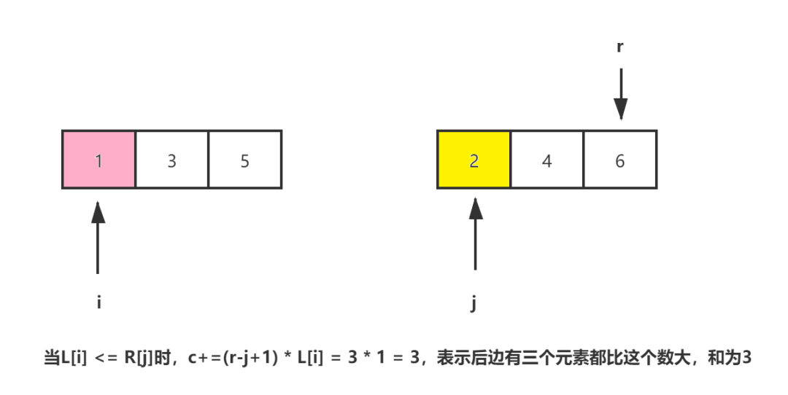

- [排序算法](#排序算法)
  - [比较排序 v.s. 非比较排序](#比较排序-vs-非比较排序)
    - [0. 冒泡排序](#0-冒泡排序)
    - [1.快速排序](#1快速排序)
    - [2. 选择排序](#2-选择排序)
    - [3. 插入排序](#3-插入排序)
    - [4. 希尔排序 [nlogn]](#4-希尔排序-nlogn)
    - [5. 归并排序](#5-归并排序)
    - [6. 堆排序](#6-堆排序)
- [延伸题目](#延伸题目)
  - [56. 合并区间 [medium]](#56-合并区间-medium)
  - [剑指40. 最小的k个数 [*]](#剑指40-最小的k个数-)
  - [215. 数组中的第K个最大元素 [Medium]*](#215-数组中的第k个最大元素-medium)
  - [347. 前K个高频元素 [Medium]*](#347-前k个高频元素-medium)
      - [基于快速排序的思想](#基于快速排序的思想)
      - [基于堆的思想](#基于堆的思想)
  - [386. 整数的字典序 [Medium] [字节 *]](#386-整数的字典序-medium-字节-)
  - [692. 前K个高频单词](#692-前k个高频单词)
  - [补充题： 计算数组的小和 *](#补充题-计算数组的小和-)
  - [剑指51. 数组中的逆序对 *](#剑指51-数组中的逆序对-)
  - [剑指 45. 把数组排成最小的数](#剑指-45-把数组排成最小的数)
  - [179. 最大数](#179-最大数)
  - [334. 递增的三元子序列 [Medium]](#334-递增的三元子序列-medium)
  - [628. 三个数的最大乘积](#628-三个数的最大乘积)

排序算法
-------
面试中的基本盘，考察对基础/常用排序算法的理解和应用；也是面试八股中的重要内容。  
**考察方面一**： 常见排序算法的概念思想、时间复杂度/空间复杂度，以及基本实现  
**考察方面二**： 对部分排序算法的深入理解和应用： 快排的优化/快排与快速选择及堆排在选择topK/中位数问题  
**发散延伸**： 字典序等  


动画图解：https://github.com/chefyuan/algorithm-base
https://zhuanlan.zhihu.com/p/60152722
*全表背诵*

------

### 比较排序 v.s. 非比较排序

常见的快速排序、归并排序、堆排序、冒泡排序等属于比较排序。在排序的最终结果里，元素之间的次序依赖于它们之间的比较。每个数都必须和其他数进行比较，才能确定自己的位置。

在冒泡排序之类的排序中，问题规模为n，又因为需要比较n次，所以平均时间复杂度为O(n²)。在归并排序、快速排序之类的排序中，问题规模通过分治法消减为logN次，所以时间复杂度平均O(nlogn)。
**比较排序的优势是，适用于各种规模的数据，也不在乎数据的分布，都能进行排序。可以说，比较排序适用于一切需要排序的情况。**

计数排序、基数排序、桶排序则属于非比较排序。非比较排序是通过确定每个元素之前，应该有多少个元素来排序。针对数组arr，计算arr[i]之前有多少个元素，则唯一确定了arr[i]在排序后数组中的位置。
**非比较排序只要确定每个元素之前的已有的元素个数即可，所有一次遍历即可解决。算法时间复杂度O(n)。非比较排序时间复杂度底，但由于非比较排序需要占用空间来确定唯一位置。所以对数据规模和数据分布有一定的要求。**


--------
#### 0. 冒泡排序
- 特点：遍历进行对比交换，时间复杂度 O(N2), 稳定排序
- 基本盘

```
void bubbleSort(vector<int>& arr) {
    int L = arr.size();
    for (int i = 0; i < L; i++) {
        bool flag = false;
        for (int j = 0; j < L - 1 -i; j++) {
            if (arr[j] > arr[j+1]) {
                swap(arr[j], arr[j+1]);
                flag  = true;
            }
        }
        cout << i << "th :";
        for (int k = 0; k < L; k++) {
            cout << arr[k] << " ";
        }
        cout << endl;
        if (!flag)
            break; 
    }
}
```

#### 1.快速排序
- 特点：左右交换，递归进行, **非稳定排序**
- 空间复杂度 O(LogN)
- 时间复杂度 O(NLogN)  最差情况下 O(N^2)
  - **时间复杂度与划分点选择相关，如果选中的划分点可以平分序列，那么总划分次数就会是logn**
  - **如果每次选中的划分点为最小/最大值，那么总有一个空区间，剩下的部分等价于线性处理，时间复杂度为O(n^2)**
  - 优化方法为：通常采用“三者值取中”方法，即比较r[low].key、r[high].key与r[(low+high)/2].key，**取三者中关键字为中值的元素为中间数** （解决序列部分有序的问题）

- 参考：https://blog.csdn.net/qq_19525389/article/details/81436838
- **快排优化**
  - 3种取基准的方法
    - 随机（rand函数）、固定（队首、队尾）、三数取中（队首、队中和队尾的中间数）
  - 4种优化方式：
      - 优化1：当待排序序列的长度分割到一定大小后，使用插入排序 **处理序列中有重复的情况** 当待排序列长度为5~20之间，此时使用插入排序能避免效率下降
      - 优化2：在一次分割结束后，可以把与Key相等的元素聚在一起，继续下次分割时，不用再对与key相等元素分割 **有效提高对有重复数据的序列处理速度** 将与当前pivot基准相同的元素在交换的时候都移到数组头部； 在完成交换后，再从头部交换到基准附近，从而将所有相等的值都聚合起来，大幅降低处理速度
      - 优化3：优化递归操作
      - 优化4：**使用并行或多线程处理子序列**

```
int Parition( vector<int>& arr, int left, int right) {
    int pivot = arr[left];
    int start = left;
    while(left < right) {
        while(left < right && arr[right] >= pivot) {
            right--;
        }
        while (left < right && arr[left] <= pivot) {
            left++;
        }

        if (left < right) {
            swap(arr[left],arr[right]);
        }
    }
    swap(arr[start], arr[left]);
    return left;
}

void quickSort(vector<int>& arr, int left, int right) {
    if (left >= right)
        return;
    int p = Parition(arr,left,right);
    cout << p  << endl;
    quickSort(arr,left,p-1);
    quickSort(arr,p+1, right);
}
```


- **主元优化实例： 采用随机选取主元**

```
class Solution {
public:
    int partition(vector<int>& nums, int left, int right) {
        int start = left;
        int pivot = nums[start];
        // cout << left << " " << right << " " << pivot << endl;
   
        while (left < right) {
   
            while ((left < right) && (nums[right] >= pivot)) {
                right--;
            }
  
            while (left < right && nums[left] <= pivot) {
                left++;
            }
  
            if (left < right) {
                swap(nums[left], nums[right]);
            }
        }
        swap(nums[left], nums[start]);
        return left;
    }
    // ***** 关键
    int randomized_partition(vector<int>& nums, int left, int right) {
        int i = rand() % (right - left + 1) + left; // 随机选一个作为我们的主元
        swap(nums[left], nums[i]); // 交换随机元
        return partition(nums, left, right);
    }
    void quickSort(vector<int>& nums, int left, int right) {
        if (left >= right) {
            return;
        }
        int p = randomized_partition(nums, left, right);
        quickSort(nums, left, p - 1);
        quickSort(nums, p + 1, right);
    }
    vector<int> sortArray(vector<int>& nums) {
        quickSort(nums, 0, nums.size() - 1);
        return nums;
    }
};
```

- **代码精简版**

```
    void quick_sort(vector<int>& nums, int l, int r){
        if(l < r){
            int i = l, j = r;
            while(i < j){
                while(i < j && nums[j] >= nums[l]) --j;
                while(i < j && nums[i] <= nums[l]) ++i;
                swap(nums[i], nums[j]);
            }
            swap(nums[l], nums[i]);
            quick_sort(nums, l, i - 1);
            quick_sort(nums, i + 1, r);
        }
    }
```


#### 2. 选择排序

原理： 每次遍历选择最小/大的一个，n次遍历得到每个位置上的值，时间复杂度稳定在`O(N^2)`
- 时间复杂度： O(N^2)
- 空间复杂度:  O(1)
- 稳定性：  不稳定 

>序列5 8 5 2 9，第一遍选择第1个元素5会和2交换，那么原序列中2个5的相对前后顺序就被破坏了
```
void selectSort(vector<int>& arr) {
    int Len = arr.size();
    for (int i = 0; i < Len; i++) {
        for (int j = i + 1; j < Len; j++) {
            if (arr[j] < arr[i]) {
                swap(arr[j], arr[i]);
            }
        }
    }
}


```


#### 3. 插入排序 
原理： 构建有序数组，**每次往前面构成的有序数组中插入**
- 时间复杂度： O(N^2)  最好的情况： O(N) 最差的情况： O(N^2)
- 空间复杂度:  O(1)
- 稳定性： **稳定 (不存在位置交换)**

```
void insertSort(vector<int>& arr) {
    int Len = arr.size();
    for (int i = 0; i < Len - 1; i++) {
        int prev = i;
        int cur = arr[i+1];
        while (cur < arr[prev] && prev >= 0) {
            arr[prev + 1] = arr[prev];
            prev--;
        }
        arr[prev + 1] = cur;
    }
}
```
#### 4. 希尔排序 [nlogn]
- 简单插入排序的升级
- 将整个数组按照gap分成不同的子集，每个子集进行插入排序，并逐步缩小gap值
- 时间复杂度比之前的O(N2)有缩小
  - 时间复杂度： O(NlogN)  最好的情况： O(N) 最差的情况： O(NlogN)
  - 空间复杂度:  O(1)
  - 不稳定
```
void shellSort(vector<int>& arr) {
    int Len = arr.size();
    int gap = Len/2;
    while (gap>0) {
        for (int i = gap; i < Len; i++) {
            int cur = arr[i];
            int prev = i - gap;
            while ( cur < arr[prev] && prev>=0) {
                arr[prev + gap] = arr[prev];
                prev-=gap;
            }
            arr[prev+gap] =  cur;
        }
        gap/=2;
    }
}
```
 
#### 5. 归并排序
- **基于分治思路**
- 建立在归并操作上的一种有效的排序算法。该算法是采用分治法（Divide and Conquer）的一个非常典型的应用。归并排序是一种稳定的排序方法。将已有序的子序列合并，得到完全有序的序列；即先使每个子序列有序，再使子序列段间有序。若将两个有序表合并成一个有序表，称为2-路归并
  - 时间复杂度： 稳定在`O(NLogN)` 空间复杂度 `O(N)`
  - 稳定排序
  - 适用场景：**数据量大，对稳定性有一定要求**


```
void merge(vector<int>& arr, int left, int mid, int right) {
    vector<int> tmp;
    int i = left;
    int j = mid + 1;
    while(i <= mid && j <= right) {
        if (arr[i] > arr[j]) {
            tmp.push_back(arr[j]);
            j++;
        }
        else {
            tmp.push_back(arr[i]);
            i++;
        }
    }
    // 把没有遍历完的部分继续进行遍历
    while (i<=mid) {
        tmp.push_back(arr[i]);
        i++;
    }
    while (j <= right) {
        tmp.push_back(arr[j]);
        j++;
    }
    for (int i = 0; i <tmp.size(); i++) {
        arr[left++] = tmp[i];
    }
    cout << "after merge: "; 
    for (int i = 0; i < arr.size(); i++) {
        cout << arr[i] << " ";
    }
    cout << endl;

}

void mergeSort(vector<int>& arr, int left, int right) {
    if (left >= right) return;
    int mid = left + (right - left) / 2;
    mergeSort(arr, left, mid);
    mergeSort(arr, mid + 1, right);
    merge(arr, left, mid, right);
}
```

#### 6. 堆排序 
- HeapSort
- 基于完全二叉树的结构：
  - 大顶堆 **[用于从小到大排序]** 根节点的值大于两个子节点的值；
  - 小顶堆 **[用于从大到小排序]** 根节点的值小于两个子节点的值
- 排序过程：
  - 1. 构建大顶堆 **自底而上地对节点进行调整**
  - 2. 取出arr[0]即顶元素跟尾部元素交换，然后对剩下的部分继续排序
  - 重复步骤2，得到有序的数组
- 时间复杂度 `O(nlogn)` 最好情况 `O(nlogn)` 最坏情况 `O(nlogn)`
- 空间复杂度 `O(1)`
- 非稳定排序
```
void adjustHead(vector<int> & arr, int Len, int index) {
    int maxIdx = index;
    int left = 2*index + 1;
    int right = 2*index + 2;
    // 进行节点管理
    if (left < Len && arr[left] > arr[maxIdx]) maxIdx = left;
    if (right < Len && arr[right] > arr[maxIdx]) maxIdx = right;
    if (maxIdx != index) { // 调整子树
        swap(arr[maxIdx], arr[index]);
        adjustHead(arr, Len, maxIdx); 
    } 
}

void heapSort(vector<int>& arr) {
    int Len = arr.size();
    // 构建大顶堆， 取所有非叶子节点进行遍历，自底而上
    for(int i = Len/2 - 1 ; i >= 0; i--) {
        adjustHead(arr, Len, i);
    }
    for (int i = 0; i < Len; i++) {
        cout << arr[i] << " ";
    }
    cout << endl;
    cout << "sort" <<endl;
    for (int i = Len - 1; i > 0; i--) {
        swap(arr[0],arr[i]);  // 把最大值调换到最后
        adjustHead(arr, i, 0); // 从头开始调整堆
        for (int i = 0; i < Len; i++) {
            cout << arr[i] << " ";
        }
        cout << endl;
    }
}
```
- **基于优先队列**实现的堆排序
- STL 的**priority_queue**更方便，优先队列的底层就是一个堆结构，在优先队列中，队首元素一定是当前队列中优先级最高的那一个。
- 通过 top() 函数来访问队首元素（也可称为堆顶元素），也就是优先级最高的元素。
- push()插入元素

```
priority_queue< int, vector<int>, greater<int> > q;  // 小顶堆
priority_queue< int, vector<int>, less<int> > q;     // 大顶堆
```

--------

## 延伸题目

### 56. 合并区间 [medium]
> 数组 intervals 表示若干个区间的集合，其中单个区间为 intervals[i] = [starti, endi] 。请你合并所有重叠的区间，并返回一个不重叠的区间数组，该数组需恰好覆盖输入中的所有区间

- 问题并不复杂，模拟整个合并区间的过程即可
- 完整思路： 
  - 给出区间的集合，合并重叠的区间
  - 先进行排序，然后进行遍历合并
    - 时间复杂度 O(NlogN) 空间复杂度
    - 使用运算符重载的方式定义二维数组的排序
  - 遍历合并时主要时判断前后两个区间的范围，动态更新最右侧的阈值即可
- 时间复杂度 O(nlogn) 主要耗费在排序上
  - **需要掌握基于重载运算符方式的排序实现**
  
```
class Solution {
public:
    struct cmp{
        bool operator()(vector<int>& a,  vector<int>& b) {
            return a[0] < b[0]; // **升序排序  如果是 > 则是用于降序**
        }
    };
    vector<vector<int>> merge(vector<vector<int>>& intervals) {
        sort(intervals.begin(), intervals.end(), cmp());
        vector<vector<int>> ans;
        if (intervals.empty())
            return ans;
        int l_min = intervals[0][0];
        int r_max = intervals[0][1];
        for (int i = 1; i < intervals.size(); i++) {
            if (r_max < intervals[i][0])
            {
                ans.push_back(vector<int>{l_min, r_max});
                r_max = intervals[i][1];
                l_min = intervals[i][0];
            }
            else {
                // 取当前对比的最大值
                r_max = max(intervals[i][1], r_max);
            }
        }
        ans.push_back(vector<int>{l_min, r_max});
        return ans;
    }
};
```


### 剑指40. 最小的k个数 [*]
> 输入整数数组 arr ，找出其中最小的 k 个数。例如，输入4、5、1、6、2、7、3、8这8个数字，则最小的4个数字是1、2、3、4。
- 与下面的两道题基本相似
- 通过对堆排序或者/对快排进行改造，减少处理逻辑，来获得高效的算法

- 堆排序/快速排序
  - 堆排序：维护大顶堆，更新堆顶保持一个最小k个数字
  - 快速选择： 维护左侧部分小于/等于划分点

- 堆排序
```
    vector<int> getLeastNumbers(vector<int>& arr, int k) {
        priority_queue<int, vector<int>, less<int>> p;

        for (int i = 0; i < arr.size(); i++) {
            if (i < k) {
                p.push(arr[i]);
            }
            else {
                if (!p.empty() && arr[i] < p.top()) {
                    p.pop();
                    p.push(arr[i]);
                }
            }
        } 
        vector<int> ans;
        while (!p.empty()) {
            ans.push_back(p.top());
            p.pop();
        }
        return ans;
    }
```
- 手写大顶堆 时间复杂度O(NlogK) 空间复杂度O(k)

```
class Solution {
public:
    void adjustHeap(vector<int>& arr, int len, int index) {
        int maxIdx = index;
        if (index*2 + 1 < len && arr[index*2 + 1] > arr[maxIdx]) maxIdx = 2*index + 1;
        if (index*2 + 2 < len && arr[index*2 + 2] > arr[maxIdx]) maxIdx = 2*index + 2;
        if (index != maxIdx) {
            swap(arr[index], arr[maxIdx]);
            adjustHeap(arr, len, maxIdx);
        }
    }
    vector<int> getLeastNumbers(vector<int>& arr, int k) {
        //priority_queue<int, vector<int>, less<int>> p;
        if (k >= arr.size())
            return arr;
        // 构建大顶堆
        for (int i = k/2 - 1; i >= 0; i--) {
            adjustHeap(arr, k, i);
        }
        //cout << arr[0] << arr[1] << arr[2] << endl;
        for (int i = k; i < arr.size(); i++) {
            if (arr[i] <= arr[0]) {
                swap(arr[i], arr[0]);
                adjustHeap(arr, k, 0);
            }
        } 
        vector<int> ans;
        return vector<int>(arr.begin(), arr.begin() + k);
    }
};
```
- **快速排序的改进： 快速选择**
  - 时间复杂度O(N)
  - 只关注于找到比当前划分点小于/等于的元素。
  - 并在目标范围内进行递归，不会同时左右都递归，大幅降低时间复杂度
    - 每次都判断第k个元素的区间位置(从小到大的第k个)
```
class Solution {
public:
    
    void quickSelect(vector<int>& arr, int left, int right, int k,vector<int>& ans ) {
        int start = left;
        int pivot = arr[left];
        for (int i = left + 1; i <= right; i++) {
            if (arr[i] <= pivot) { //取最小的部分
                swap(arr[left + 1], arr[i]);
                left++; // 关键
            }
        }
        swap(arr[left], arr[start]);
        
        //cout << left << start << " " << k << endl;
        // 方向判断 关键
        if (k <= (left - start)) {
            quickSelect(arr, start, left - 1, k, ans);
        }
        else {
            for (int i = start; i <= left; i++) {
                ans.push_back(arr[i]);
            }
            if (k > (left - start + 1)) {
                quickSelect(arr, left + 1, right, k - (left - start + 1), ans);
            }
        }
    }
    vector<int> getLeastNumbers(vector<int>& arr, int k) {
        //priority_queue<int, vector<int>, less<int>> p;
        if (k >= arr.size())
            return arr;
        
        vector<int> ans;
        if (k == 0)
            return ans;
        quickSelect(arr, 0, arr.size() - 1, k, ans);
        return ans;
    }
};
```


### 215. 数组中的第K个最大元素 [Medium]*

- 基于堆的排序方法
  - 使用优先队列代替实现
  - 构建最小堆
  - 最后返回堆顶元素即可
  - **时间复杂度： O(NlogN) 空间复杂度 `O(logN)` 递归处理堆的过程**
```c++
class Solution {
public:
    int findKthLargest(vector<int>& nums, int k) {
        // 定义最小堆
        priority_queue<int, vector<int>, greater<int> > q;
        for (int i = 0; i < nums.size(); i++) {
            if (q.size() == k) {
                if (q.top() < nums[i]) {
                    q.pop();
                    q.push(nums[i]);
                }
            } else{
                q.push(nums[i]);
            }
        }
        
        return q.top();
       
    }
};
```
- 基于快速排序的思路 **快速选择**
  - 与上一题思路基本一致，只要在指定区域进行搜索即可
  - 时间复杂度: O(N) 空间复杂度:`O(logN)` 递归栈的深度

```
class Solution {
public:
    void quickSort(vector<int>& nums, int left, int right, int k, vector<int>& res) {
        int pivot = nums[left];
        int start = left;
        for (int i = left + 1; i <= right; i++) {
            if (nums[i] > pivot) { // 从大到小排序
                swap(nums[i], nums[left + 1]);//
                left++;
            }
        }
        swap(nums[left], nums[start]);
        if (k <= left - start ) {//
            quickSort(nums, start , left - 1, k, res); // 在左区间内
        }
        else {
            for (int i = start; i <= left; i++) {
                res.push_back(nums[i]);//存储结果
            }
            // k = left -start + 1时 即pivot为目标值
            if (k > left - start + 1) { // i ~ i+k : （k + 1）个数字 
                quickSort(nums, left + 1 , right, k - (left - start + 1), res);
            }
        }
    }
    int findKthLargest(vector<int>& nums, int k) {
        // 定义最小堆
        vector<int> ans;
        quickSort(nums, 0, nums.size() - 1, k, ans);
        return ans.back();
       
    }
};
```

- **自定义堆结构，构建小顶堆，取堆顶作为目标值**
    - s1：递归建堆
    - s2: 对于堆外元素，当其大于堆顶元素时进行堆调整
    - s3 返回堆顶
```
class Solution {
public:
    void adjustHeap(vector<int>& nums, int length, int index) {
        int minIdx = index;
        if (2*index + 1 < length && nums[2*index + 1] < nums[minIdx])
            minIdx = 2*index + 1;
        if (2*index + 2 < length && nums[2*index + 2] < nums[minIdx])
            minIdx = 2*index + 2;
        // 调整子树
        if (minIdx != index) {
            swap(nums[index], nums[minIdx]);
            adjustHeap(nums,length,minIdx); 
        }
    }
    int findKthLargest(vector<int>& nums, int k) {
        for (int i = k/2 - 1; i >=0; i--) {
            adjustHeap(nums, k, i);
        }
        for (int i = k; i < nums.size(); i++) {
            if (nums[i] > nums[0]) {
                nums[0] = nums[i];
                adjustHeap(nums,k,0);
            }
        }
        return nums[0];
    }
};
```

### 347. 前K个高频元素 [Medium]*
- 计算出现次数最高的K个元素，返回对应的数组
##### 基于快速排序的思想
  - 核心是快速定位到K大元素的区间
  - 因为每次寻找是大于/等于 pivot的元素，并移动到左区间
  - 对于小于pivot的元素，本题中不用考虑，因此可以大幅降低时间开销
  - 然后递归时同样仅考虑`K`大所在子区间，不用每个分区间都考虑
  - 时间复杂度： O（N）

```
class Solution {
public:
    void quickSort(vector<pair<int, int>>& nums, int k, int left, int right, vector<int>& res) {
        int start = left;
        int pivot = nums[start].second;
        for (int i = left + 1; i <= right; i++) {
            if(nums[i].second > pivot) {
                swap(nums[i], nums[left + 1]);
                left++;
            }
        }
        swap(nums[left],nums[start]);

        // 判断递归方向，重要
        if (k <= left - start) {
            quickSort(nums, k, start, left - 1, res);
        }
        else {
            for (int i = start; i <= left; i++){
                res.push_back(nums[i].first);
            }
            if (k > left - start + 1) {
                quickSort(nums, k - (left - start + 1), left + 1, right, res);
            }
        }
    }
    vector<int> topKFrequent(vector<int>& nums, int k) {
        unordered_map<int, int> occurs;
        for (int i = 0; i < nums.size(); i++) {
            occurs[nums[i]]++;
        }
        vector<pair<int, int>> freqs;
        for (unordered_map<int,int> ::iterator iter = occurs.begin(); iter != occurs.end(); iter++) {
            freqs.push_back({iter->first, iter->second});
        }
        vector<int> ans;
        quickSort(freqs, k, 0, freqs.size() - 1, ans );
        return ans;

    }
};
```

##### 基于堆的思想
- 要取最大的K个值，需要构建小顶堆，存储最大的K个值
- 可以通过优先队列来实现堆结构，当队列长度等于K时
  - 需要进行判断，判断当前堆顶元素是否小于目标值，若小于需要弹出堆
  - 通过重载运算符来实现小顶堆

```
class Solution {
public:

    // static bool cmp(pair<int, int>& m, pair<int, int>& n) {
    //         return m.second > n.second;
    //     }

    struct cmp {
        bool operator()(const pair<int,int> a, const pair<int, int> b) {
            
            return a.second > b.second;
        }
    };
    vector<int> topKFrequent(vector<int>& nums, int k) {
        unordered_map<int, int> occurs;
        for (int i = 0; i < nums.size(); i++) {
            occurs[nums[i]]++;
        }
       priority_queue<pair<int,int>, vector<pair<int,int>>, cmp> q;
        //priority_queue<pair<int, int>, vector<pair<int, int>>, decltype(&cmp)> q(cmp);

       for (auto & [num, count] : occurs) {
           if (q.size() == k) {
               if (q.top().second < count) {
                   q.pop();
                   q.emplace(num,count);
               }
           }
           else {
               q.emplace(num,count);
           }
       } 

       vector<int> ans;
        while (!q.empty()) {
            ans.push_back(q.top().first);
            q.pop();
        }
        return ans;
    }
};
```

### 386. 整数的字典序 [Medium] [字节 *]
> 给定一个整数 n, 返回从 1 到 n 的字典顺序。
```
例如，
给定 n =13，返回 [1,10,11,12,13,2,3,4,5,6,7,8,9]
```

- **字典序可以视为树结构**
- 首个数字不能是0，但其他位置可以是0，
  - 通过DFS对树结构进行遍历，保存结果
  - **自顶而下**的遍历方式，每次都进行结果存储
- 时间复杂度 O(N) 
```
class Solution {
public:
    vector<int> ans;
    void dfs(int tmp, int target) {
        if (tmp > target)
            return;
        ans.push_back(tmp);
        for (int i = 0; i<= 9; i++) {
            dfs(tmp*10+i, target);
        }
    }
    vector<int> lexicalOrder(int n) {
        for(int i = 1; i <= 9; i++) {
            dfs(i, n);
        }
        return ans;
    }
};
```
- 迭代方式实现
- 注意点： 入栈顺序从大到小，而且要注意外层遍历的范围:`min(0,n)`
```
class Solution {
public:
    vector<int> ans;
    vector<int> lexicalOrder(int n) {
        stack<int> st;
        for(int i = min(9,n); i >= 1; i--) {
            st.push(i);
        }
        while(!st.empty()) {
            int cur = st.top();
            st.pop();
            ans.push_back(cur);
            for (int i = 9; i >=0; i--) {
                if (cur*10 + i <= n) 
                    st.push(cur*10 + i);
            }
            
        }
        return ans;
    }
};
```
### 692. 前K个高频单词
> 给一非空的单词列表，返回前 k 个出现次数最多的单词。
返回的答案应该按单词出现频率由高到低排序。如果不同的单词有相同出现频率，按字母顺序排序

- 问题分析： 单词频次统计和词典序处理
- 基本思路与上面的题目基本一致，需要额外考虑对字典序的处理
- 构建小顶堆可以实现，单词频次自小而大的前K个单词集合的构建， 对于**相同频次的单词则需要反序** 即自大而小的排序
  - 因此自定义的排序方式为： `a.second > b.second || (a.second == b.second && a.first < b.first);`
  - 构建了**频次的小顶堆 单词字典的大顶堆**
  - **最后结果也做反序** （因为要自高而低的排序）
- 构建频次大顶堆  字典序的小顶堆也可
```c++
class Solution {
public:
    vector<string> ans;
    void quickSort(vector<pair<string, int>>& nums, int left, int right, int k) {
        int start = left;
        for (int i = left + 1; i <= right; i++) {
            if ( (nums[i].second > nums[start].second) || 
                  (nums[i].second == nums[start].second && nums[i].first > nums[start].first) ) {
                        swap(nums[i], nums[left + 1]);
                        left++;
            }
        }
        swap(nums[left], nums[start]);
        if (k <= (left - start )) {
            quickSort(nums, start, left - 1, k);
        }
        else {
            for (int i = start; i <= left; i++)
                ans.push_back(nums[i].first);
            
            if (k > (left - start + 1)) {
                quickSort(nums, left + 1, right, k - (left - start + 1));
            }
        }
}

    // 词频 小顶堆   单词 大顶堆
    struct cmp {
        bool operator() (const pair<string, int> a, const pair<string, int> b) {
            return a.second > b.second || (a.second == b.second && a.first < b.first);
        }
    };
    vector<string> topKFrequent(vector<string>& words, int k) {
        unordered_map<string, int> freqs;
        for (auto p : words) {
            freqs[p]++;
        }
        vector<pair<string, int>> nums;
        priority_queue<pair<string, int>,vector<pair<string, int>>, cmp> q;
        for (unordered_map<string, int>::iterator iter = freqs.begin(); iter != freqs.end(); iter++) {
            nums.push_back({iter -> first, iter -> second});
        }
        for (auto p : nums) {
            if (q.size() == k) {
                // 小顶堆
                if (p.second > q.top().second)
                {
                        q.pop();
                        q.push(p);
                }
                else if (q.top().second == p.second && q.top().first > p.first) {
                    q.pop();
                    q.push(p);
                }
            }
            else {
                q.push(p);
            }
        }
        while (!q.empty()) {
            ans.push_back(q.top().first);
            q.pop();
        }
        // 由于是小顶堆 需要进行反转
        reverse(ans.begin(), ans.end());

        //quickSort(nums, 0, nums.size() - 1, k);
        return ans;
    }
};
```

### 补充题： 计算数组的小和 *
> 在一个数组中，**每一个数左边比当前数小的数累加起来**，叫做这个数组的小和。求一个数组的小和。

```
例子：[1,3,4,2,5]

1左边比1小的数，没有；

3左边比3小的数，1；

4左边比4小的数，1、3；

2左边比2小的数，1；

5左边比5小的数，1、3、4、2；

所以小和为1+1+3+1+1+3+4+2=16
*要求时间复杂度O(NlogN)，空间复杂度O(N)*
```
https://mp.weixin.qq.com/s/0ih4W6nawzFUPSj3GOnYTQ

- 暴力法： 内外两层循环，时间复杂度O(N^2)
- 进一步优化：**借鉴归并排序的思想**
  - smallSum([1,3,4,2,5])实际就等于smallSum([1,3,4])+smallSum([2,5])+c
  - c即**左半段数组中可能存在比右半段数组小的元素**对应的小和
  - 对区间进行二分后， 同位置上的小和等于`c = (r - j + 1) * L(i)` **即有多少个元素大于前半区的值**

- 套用归并排序的代码框架：
    - 在合并两个子区间的时候，**可以记录对比的小和结果，同时调整顺序**，得到合并后有序的区间，从而在后续的小和计算中，可以保证右区间有序： 计算公式合理
- 时间复杂度 O(NlogN)
```c++
int merge(vector<int>& nums, int left, int mid, int right) {
    int l = left; 
    int r = mid + 1;
    int res = 0;
    vector<int> tmp;
    while (l <= left && r <= right) {
        if (nums[l] < nums[r]) {
            res += (right - r + 1) * nums[l];
            tmp.push_back(nums[l]);
            l++;
        }
        else {
            tmp.push_back(nums[r]);
            r++
        }
    }
    while (l <= left) {
        tmp.push_back(nums[l]);
        l++;
    }
    while (r <= right) {
        tmp.push_back(nums[r]);
        r++;
    }
    for (int i = 0; i < tmp.size(); i++) {
        nums[i+l] = tmp[i];
    }
    return res;
}

int mergeSum(vector<int>& nums, int left, int right) {
    if (left >= right) {
        return 0;
    }
    int mid = left + (right - left) / 2;
    int L = mergeSum(nums, left , mid);
    int R = mergeSum(nums, mid + 1, right);
    int C = merge(nums, left, mid ,right);
    return L + R + C;
}
```

### 剑指51. 数组中的逆序对 *

> 在数组中的两个数字，如果前面一个数字大于后面的数字，则这两个数字组成一个逆序对。输入一个数组，求出这个数组中的逆序对的总数。
```
输入: [7,5,6,4]
输出: 5
```
- 与**补充题 计算数组小和**有相似之处
- 可以采用归并分治的思想进行求解，计算逆序对的过程即比较两个数的大小，
  - 对于两个数，从左到右对比得到结果
  - 当采用递归的思想时，有**左右两个区间**， 那么假设左右区间内数字都是降序排列，那么通过双指针进行对比，当`nums[r] < nums[l]`时 即存在 `right - r + 1`个逆序对
  - 通过以上方面得到左右区间对比下的分布情况，最后将左区间、右区间以及左右区间对比结果相加得到整个区间的逆序对总数
  - 通过以上的分析，可以看到分治思想的利用，采用自底而上的分治过程得到最终的结果
- 时间复杂度 O(nlogn)  空间复杂度 O(N) 归并中用到的临时数组
- 关键点： **`归并思想的应用`**
 
``` c++
class Solution {
public:
    int merge(vector<int>& nums, int left, int mid, int right) {
        int l = left;
        int r = mid + 1;
        vector<int> tmp;
        int ans = 0;
        while (l <= mid && r <= right) {
            if (nums[l] > nums[r]) {
                ans += (right - r + 1);
                tmp.push_back(nums[l]);
                l++;
            }
            else {
                tmp.push_back(nums[r]);
                r++;
            }
        }
        while (l <= mid) {
            tmp.push_back(nums[l++]);
        }
        while (r <= right) {
            tmp.push_back(nums[r++]);
        }
        for (int i = 0; i < tmp.size(); i++) {
            nums[i + left] = tmp[i];
        }
        return ans;
    }
    int mergeNums(vector<int>& nums, int left, int right) {
        if (left >= right) return 0;
        int mid = left + (right - left) / 2;
        int L = mergeNums(nums, left, mid);
        int R = mergeNums(nums, mid + 1, right);
        return merge(nums, left, mid, right) + L + R;
    }
    int reversePairs(vector<int>& nums) {
        return mergeNums(nums, 0, nums.size() - 1);
    }
};
```

### 剑指 45. 把数组排成最小的数
> 输入一个非负整数数组，把数组里所有数字拼接起来排成一个数，打印能拼接出的所有数字中最小的一个。

```
输入: [3,30,34,5,9]
输出: "3033459"
```

- 与LC179题目相似，都是要重新定义一种排序方式
- 比较`AB < BA` 这种规则具有[对称性、传递性和自反性](https://leetcode-cn.com/problems/ba-shu-zu-pai-cheng-zui-xiao-de-shu-lcof/solution/tu-jie-wo-men-zhi-qian-ke-neng-mei-you-g-gcr3/)
> 当 mn < nm 时，得到最小数字 mn, 因为在最小数字 mn 中 ，m 排在 n 的前面，我们此时定义 m "小于" n。注意：此时的 "小于" ，并不是数值的 < 。是我们自己定义，因为 m 在最小数字 mn 中位于 n 的前面，所以我们定义 m 小于 n。
假设 ｍ = 10，n = 1 则有 mn = 101 和 nm = 110; 我们比较 101 和 110 ，发现 101 < 110 所以此时我们的最小数字为 101 ，又因为在最小数字中 10 (m) 排在 1(n) 的前面，我们根据定义则是 10 “小于” 1，反之亦然

  - 自反性：AA = AA，所以 A 等于 A
  - 对称性：如果 A "小于" B 则 AB < BA，所以 BA > AB 则 B "大于" A
  - 传递性： AB < BA  BC < CB => AC < CA

```c++
class Solution {
public:
    struct cmp {
        bool operator () (const int & a, const int & b) {
            string _a = to_string(a);
            string _b = to_string(b);
            return _a + _b < _b + _a;
        }
    };
    string minNumber(vector<int>& nums) {
        sort(nums.begin(), nums.end(), cmp());
        string s = "";
        for (auto p : nums) {
            s += to_string(p);
        }
        return s;
    }
};
```

- 手写快排算法实现，主要调整比较的逻辑
```
while (left < right && pivot + strs[right] <= strs[right] + pivot ) 
right--;

while (left < right && pivot + strs[left] >= strs[left] + pivot ) 
left++;
```

- **注意合并式快排写法中的一些细节，初始化划分点和左右边界要进行记录**
- 如果不急的话， 完全还是可以写之前的函数分段
```c++
class Solution {
public:
    void quickSort(vector<string>& strs, int left, int right) {
        if (left >= right) return;
        int start = left;
        int r = right;
        string pivot = strs[left];
        while (left < right) {
            while (left < right && pivot + strs[right] <= strs[right] + pivot ) right--;
            while (left < right && pivot + strs[left] >= strs[left] + pivot ) left++;
            swap(strs[left], strs[right]);
        }
        swap(strs[left], strs[start]);
        quickSort(strs, start, left - 1);
        quickSort(strs, left + 1, r);
    }
    string minNumber(vector<int>& nums) {
        // sort(nums.begin(), nums.end(), cmp());
        string s = "";
        vector<string> strs;
        
        for (auto p : nums) {
            strs.push_back(to_string(p));
        }
        quickSort(strs, 0, strs.size() - 1);
        for (auto p : strs) {
            s += p;
        }
        return s;
    }
};
```


### 179. 最大数
> 给定一组非负整数 nums，重新排列每个数的顺序（每个数不可拆分）使之组成一个最大的整数。
需要返回一个字符串而不是整数

```
输入：nums = [10,2]
输出："210"
```

- 分析： 需要对数组进行合理的排序，考虑字典序等影响
  - 对于两个正整数 a 和 b, 通过对比 `[ab]` `[ba]`两种排列方式得到最终的排序结果，将这种对比方式作为排序的依据，而非单纯根据值大小
  - 通过以上方式定义了新的排序规则，可以借助运算符重载或手写排序模块的方式来实现最后的排序
  - 在代码中，为了简便，用来字符串对比的结果作为排序依据
- 临界情况： 当排序后的数组第一个即为0时，就直接返回0，避免后面出现重复0
- 关键点： **`自定义排序实现`**
- 时间复杂度 **O(nlogn*logm)** 复杂度包括字符串对比(logm)和排序两个过程（logn）
  - m 是 32位整数的最大值，每个数转化为字符串后的长度是 O(\log m) 的数量级

```
class Solution {
public:
    struct cmp {
        bool operator ()(const int& x, const int& y) {
            string a = to_string(x);
            string b = to_string(y);
            return a + b > b + a;
        }
    };
    string largestNumber(vector<int>& nums) {
        sort(nums.begin(), nums.end(), cmp());
        string s = "";
        // 考虑特殊情况
        if (nums[0] == 0)
            return "0";
        for (auto p : nums) {
            s += to_string(p);
        }
        return s;
    }
};
```

### 334. 递增的三元子序列 [Medium] 
- 需要找出当前序列中的三个元素，满足递增性质
- 在遍历中存储top2值，来完成三元自序列的判断
- 即存在两级对比，时间复杂度 O(N)
  - 若是4元子序列呢？三次对比？
```c++
class Solution {
public:
    bool increasingTriplet(vector<int>& nums) {
        int min = INT_MAX;
        int big = INT_MAX;
        // 两级对比
        for (int i = 0; i < nums.size(); i++) {
            if (nums[i] > big) {
                return true;
            }
            else if (nums[i] > min) {
                big = nums[i]; 
            }
            else {
                min = nums[i];
            }
        }
        return false;

    }
};
```

### 628. 三个数的最大乘积
> 给你一个整型数组 nums ，在数组中找出由三个数组成的最大乘积，并输出这个乘积。

- 问题很简单： **找到最大的三个数即可**
- 但好像还有点问题，负数的情况呢？ **也得找到最小的二个数**，根据这5个数来确定最大积
- 简单做法： 排序即可
  - 时间复杂度 O(NlogN) 空间复杂度 O(1)
```c++
class Solution {
public:
    int maximumProduct(vector<int>& nums) {
        sort(nums.begin(), nums.end());
        if (nums.size() < 3) return 0;
        int n = nums.size() - 1;
        return max(nums[n]*nums[n - 1] * nums[n - 2], nums[0]*nums[1]*nums[n]);
    }
};
```
- 进一步优化： **考虑直接寻找最大的3个数和最小的2个数**， 通过循环中的条件对比来更新结果, 与**[LC334.递增的三元组]**有相似之处
- 时间复杂度 ： O(N); 空间复杂度 O(1)
```c++
class Solution {
public:
    int maximumProduct(vector<int>& nums) {
        int min1 = INT_MAX;
        int min2 = INT_MAX;
        int max1 = INT_MIN, max2 = INT_MIN, max3 = INT_MIN;
        for (auto x : nums) {
            if (x < min1) {
                min2 = min1;
                min1 = x;
            }
            else if (x < min2) {
                min2 = x;
            }
            if (x > max1) {
                max3 = max2;
                max2 = max1;
                max1 = x;
            }
            else if (x > max2) {
                max3 = max2;
                max2 = x;
            }
            else if (x > max3) {
                max3 = x;
            }
        }
        return max(max1 * max2 * max3, max1 * min1 * min2);
    }
};
```