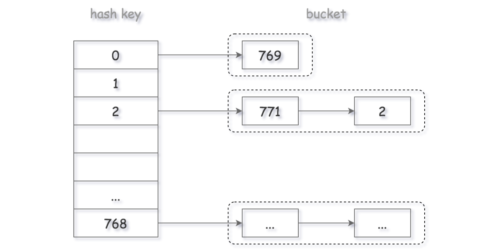

## 哈希表
### C++中哈希表实现

|映射|底层实现 | 是否有序|数值是否可以重复|能否更改数值|查询效率|增删效率|
|  ----  | ----  |  ----  | ----  |  ----  | ----  | ----  |
|std::map	|红黑树	|key有序|key不可重复	|key不可修改	|O(logn)	|O(logn)
|std::multimap|	**红黑树** |key有序	|**key可重复**	|key不可修改	|O(logn)	|O(logn)
|std::unordered_map|**哈希表**|key无序|key不可重复|	key不可修改|O(1)| O(1)
|std::hash_map| 哈希表

基于哈希表可以实现近乎常量的查询效率和删改操作，在编程中是提升效率的重要方法。


### 705. 设计哈希集合 [unordered_set实现]

> 实现 MyHashSet 类：
> - void add(key) 向哈希集合中插入值 key 。
> - bool contains(key) 返回哈希集合中是否存在这个值 key 。
> - void remove(key) 将给定值 key 从哈希集合中删除。如果哈希集合中没有这个值，什么也不做。
- 使用链地址法设计哈希结构，同一哈希值进行同地址链表存储即可
  - 因此，使用数组+链表的形式进行组织： `vector<list<int>>` list中实现了双向链表
  - 操作api:  `push_back(int v)` 与 `erase(list* node)`

- 哈希公式： `key % base` base**取素数/质数**
    - 从素数定理出发，我们可以知道素数有如下性质 **素数定理：在初等数学中有一个基本定理，任意一个大于1的自然数，要么本身就是质数，要么可以分解为几个质数之积，这种分解本身，具有唯一性**
    - 在知道素数的性质后，回过头来看Hash表，我们将元素放在Hash表当中，需要解决的一个问题就是尽量解决冲突。
    - 实验，结论表明：模数的因子会影响数列的冲突，**而且因子越多，冲突的可能性就越大**。而素数的因子恰好只有1和其本身,就非常适合用于解决冲突。：比如 2 4 6 8 10 12这6个数，如果对 6 取余 得到 2 4 0 2 4 0 只会得到3种HASH值，6的因子有1，2，6。冲突会很多。如果对 7 取余 得到 2 4 6 1 3 5 得到6种HASH值，而7的因子只有1，7。

- 空间复杂度: O(n + b) 平均链表长度O(n/b)  时间复杂度O(n/b)


```c++
class MyHashSet {
public:
    static const int base = 769;
    vector<list<int>> data; // 使用链表法来进行哈希设计， 避免哈希冲突
    static int hash(int key) {return key % base;}
    /** Initialize your data structure here. */
    MyHashSet() {
        data.resize(base);
    }
    
    void add(int key) {
        int h = hash(key);
        for (auto iter = data[h].begin(); iter != data[h].end(); iter++) {
            if (*iter == key)
                return;
        }
        data[h].push_back(key);
    }
    
    void remove(int key) {
        int h = hash(key);
        for (auto iter = data[h].begin(); iter != data[h].end(); iter++) {
            if (*iter == key) {
                data[h].erase(iter);
                break;
            }
        }
    }
    
    /** Returns true if this set contains the specified element */
    bool contains(int key) {
        int h = hash(key);
        for (auto iter = data[h].begin(); iter != data[h].end(); iter++) {
            if (*iter == key) {
                return true;
            }
        }
        return false;
    }
};

/**
 * Your MyHashSet object will be instantiated and called as such:
 * MyHashSet* obj = new MyHashSet();
 * obj->add(key);
 * obj->remove(key);
 * bool param_3 = obj->contains(key);
 */
```


### 706. 设计哈希映射 [unordered_map实现]
> 实现 MyHashMap 类：
MyHashMap() 用空映射初始化对象
void put(int key, int value) 向 HashMap 插入一个键值对 (key, value) 。如果 key 已经存在于映射中，则更新其对应的值 value 。
int get(int key) 返回特定的 key 所映射的 value ；如果映射中不包含 key 的映射，返回 -1 。
void remove(key) 如果映射中存在 key 的映射，则移除 key 和它所对应的 value 。

- 与LC705做法一致，使用链地址法实现哈希设计
  - 具体结构采用： `vector<list<pair<int,int>>>` **链表中存储pair数据对**

```c++
class MyHashMap {
public:
    static const int base = 769;
    vector<list<pair<int, int>>> data;
    static int hash(int key) {return key % base; }
    /** Initialize your data structure here. */
    MyHashMap() {
        data.resize(base);
    }
    
    /** value will always be non-negative. */
    void put(int key, int value) {
        int h = hash(key);
        for (auto iter = data[h].begin(); iter != data[h].end(); iter++) {
            if (iter -> first == key) {
                iter -> second = value;
                return;
            }
        }
        data[h].push_back({key, value});
    }
    
    /** Returns the value to which the specified key is mapped, or -1 if this map contains no mapping for the key */
    int get(int key) {
        int h = hash(key);
        for (auto iter = data[h].begin(); iter != data[h].end(); iter++) {
            if (iter -> first == key) {
                return iter -> second;
            }
        }
        return -1;
    }
    
    /** Removes the mapping of the specified value key if this map contains a mapping for the key */
    void remove(int key) {
        int h = hash(key);
        for (auto iter = data[h].begin(); iter != data[h].end(); iter++) {
            if (iter -> first == key) {
                data[h].erase(iter);
                return;
            }
        }
    }
};

/**
 * Your MyHashMap object will be instantiated and called as such:
 * MyHashMap* obj = new MyHashMap();
 * obj->put(key,value);
 * int param_2 = obj->get(key);
 * obj->remove(key);
 */
```


### 1.TwoSum I [Easy]

- 找出数组中两个元素构成target，数组是无序数组
- 暴力解法需要`O(N^2)`时间，O(1)的空间
- 可以通过哈希表来存储value-index的信息
  - 当返回结果时，由于同一元素不能重复使用
  - **需要考虑差值的索引是否等于当前值的索引**
  - 时间复杂度O(N) 空间复杂度 O(N)

```c++
class Solution {
public:
    vector<int> twoSum(vector<int>& nums, int target) {
        unordered_map<int, int> key_idx;
        vector<int> res; 
        if (nums.empty())
            return res;
        for (int i = 0; i < nums.size(); i++) {
            key_idx[nums[i]] = i;
        }
        for (int i = 0; i < nums.size(); i++) {
            int other = target - nums[i];
            if (key_idx.count(other) && key_idx[other] != i) {
                res.push_back(i);
                res.push_back(key_idx[other]);
                return res;
            }
        }
        return res;
    }
};
```

### 167. TwoSum （数组有序） [Easy]
- 有序的情况，问题就可以更高效的解决
- 利用数组的有序性，可以使用双指针法，从左右两侧进行遍历
- 时间复杂度为O(N), 空间复杂度为O(1)
```
class Solution {
public:
    vector<int> twoSum(vector<int>& numbers, int target) {
        vector<int> res;
        if (numbers.empty())
            return res;
        int left = 0;
        int right = numbers.size() - 1;
        while (true) {
            if (numbers[left] + numbers[right] > target) {
                right -- ;
            }
            else if(numbers[left] + numbers[right] < target) {
                left ++;
            }
            else {
                res.push_back(left+1);
                res.push_back(right+1);
                return res;
            }
        }
        return res;
    }
};
```
- 还可以通过**二分查找**的方法进行，每次通过二分查找来找另外一个值

```
class Solution {
public:
    vector<int> twoSum(vector<int>& numbers, int target) {
        vector<int> res;
        if (numbers.empty())
            return res;

        int len = numbers.size() ;
        for (int i = 0; i < len; i++) {
            int other = binarySearch(numbers, i + 1, len - 1, target - numbers[i]);
            //cout << other << endl;
            if (other >= 0) {
                res.push_back(i + 1);
                res.push_back(other + 1);
                return res;
            }
        }
        return res;
    }
    int binarySearch(vector<int>& numbers, int left, int right, int target) {
        while(left <= right) {
            //cout << left << right <<endl;
            int mid = left + (right - left) / 2;
            if (numbers[mid] == target) {
                return mid;
            }
            else if (numbers[mid] < target) {
                left = mid + 1;
            }
            else if (numbers[mid] > target) {
                right = mid - 1;
            }
        }
        return -1;
    }
};
```

### nSum 模板
- 对于twoSum而言，在哈希方法以外，还可以借助上面提到的有序数组的特性，先排序得到有序数组再处理：时间复杂度O(nlogn)，空间复杂度O(1)

```
vector<int> twoSum(vector<int>& numbers, int target) {
    vector<int> res;
    if (numbers.empty())
        return res;
    sort(vector.begin(), vector.end())
    int left = 0;
    int right = numbers.size() - 1;
    while (true) {
        if (numbers[left] + numbers[right] > target) {
            right -- ;
        }
        else if(numbers[left] + numbers[right] < target) {
            left ++;
        }
        else {
            res.push_back(left+1);
            res.push_back(right+1);
            return res;
        }
    }
    return res;
}
```
- 进一步考虑当不允许元素重复的情况下， 输出所有和为target的元素对：
  - 在上面的基础上，添加重复判断逻辑即可

```
vector<vector<int>> twoSum(vector<int>& numbers, int target) {
    vector<vector<int>> res;
    if (numbers.empty())
        return res;
    sort(vector.begin(), vector.end())
    int left = 0;
    int right = numbers.size() - 1;
    while (left < right) {
        int l = numbers[left];
        int r = numbers[right];
        // 跳过重复段
        if (l + r > target) {
            while(right > left && numbers[right] == r)
                right -- ;
        }
        // 跳过重复段
        else if(l + r< target) {
             while(right > left && numbers[left] == l)
                left ++;
        }
        else {
            
            res.push_back({left+1, right+1});
            while(left < right && numbers[left] == l) left ++;
            while(left < right && numbers[right] == r) right ++;
            //return res;
        }
    }
    return res;
}
```

- **ThreeSum**实现，基于Two sum的上面形式，首先考虑第一个数字，对第一个数字进行遍历，在循环中调用twosum；为了避免元素重复，在第一个数字遍历中，也需要跳过重复段。