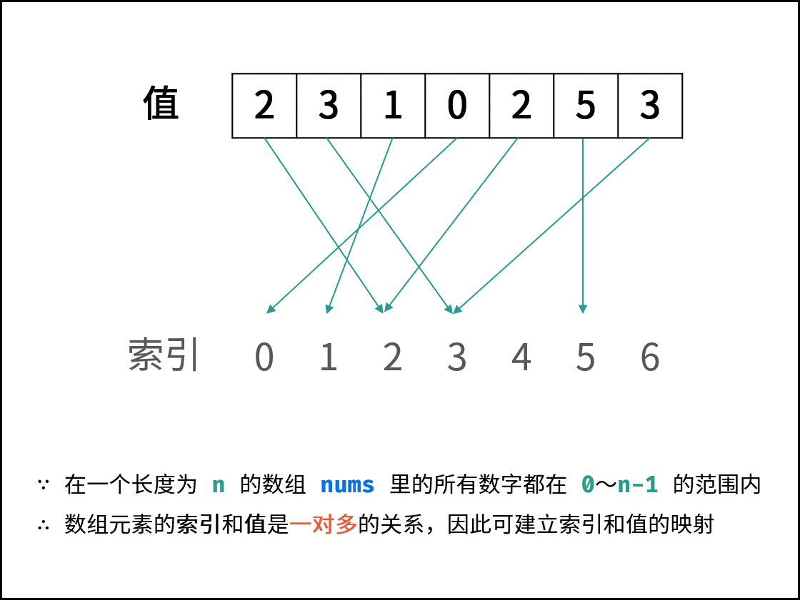
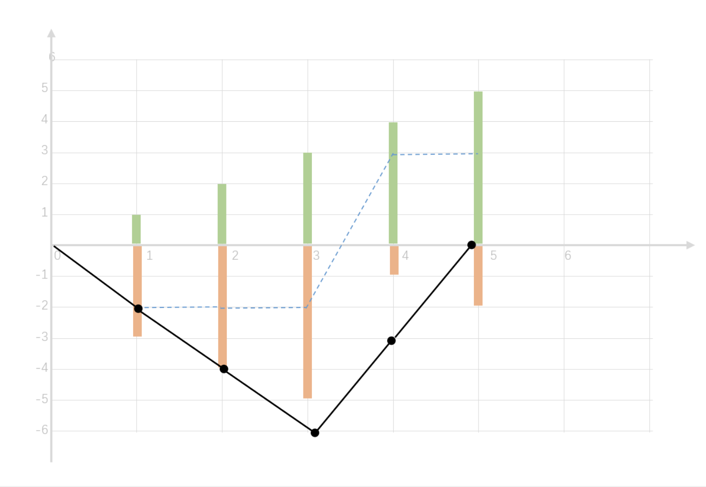

- [单调栈技巧](#单调栈技巧)
  - [739. 每日温度 [Medium]](#739-每日温度-medium)
  - [42. 接雨水 [Hard] :m :](#42-接雨水-hard-m-)
  - [84. 柱状图中的最大面积](#84-柱状图中的最大面积)
  - [85. 最大矩形](#85-最大矩形)
  - [402. 移除K个字符 [Medium]](#402-移除k个字符-medium)
  - [456. 132模式](#456-132模式)
  - [补充. 求区间最小数乘区间和的最大值](#补充-求区间最小数乘区间和的最大值)
- [进阶](#进阶)
  - [31. 下一个排列 [Medium]](#31-下一个排列-medium)
  - [496. 下一个更大元素 I](#496-下一个更大元素-i)
  - [503. 下一个更大元素 II](#503-下一个更大元素-ii)
  - [556. 下一个更大元素 III](#556-下一个更大元素-iii)
  - [670. 最大交换](#670-最大交换)
  - [剑指offer 03. 数组中重复的数字](#剑指offer-03-数组中重复的数字)
  - [41.缺失的第一个正数](#41缺失的第一个正数)
  - [Offer 53 - II. 0～n-1中缺失的数字](#offer-53---ii-0n-1中缺失的数字)
  - [448. 找到所有数组中消失的数字](#448-找到所有数组中消失的数字)
  - [442. 数组中重复的数据](#442-数组中重复的数据)
  - [60. 排列序列](#60-排列序列)
  - [剑指62. 圆圈最后剩下的数字](#剑指62-圆圈最后剩下的数字)
  - [73. 矩阵置零  [Medium/JD]](#73-矩阵置零--mediumjd)
  - [剑指offer 43. 1~n整数中1出现的次数](#剑指offer-43-1n整数中1出现的次数)
  - [134. 加油站](#134-加油站)
  - [135. 分发糖果 **](#135-分发糖果-)
- [滑动窗口解题技巧](#滑动窗口解题技巧)
  - [剑指57-II. 和为s的连续正数序列](#剑指57-ii-和为s的连续正数序列)
  - [76. 最小覆盖子串 [Hard] * [字节/百度]](#76-最小覆盖子串-hard--字节百度)
  - [727. 最小窗口子序列 [最小覆盖子序列]](#727-最小窗口子序列-最小覆盖子序列)
  - [补充题：最多覆盖点问题 [百度/美团 *]](#补充题最多覆盖点问题-百度美团-)
  - [209. 长度最小的子数组](#209-长度最小的子数组)
  - [862. 和至少为 K 的最短子数组 [Hard]](#862-和至少为-k-的最短子数组-hard)
  - [293. 滑动窗口最大值 [Hard] *](#293-滑动窗口最大值-hard-)
  - [718. 最长重复子数组](#718-最长重复子数组)
- [前缀和解题技巧](#前缀和解题技巧)
  - [525. 连续数组](#525-连续数组)
  - [560. 和为K的子数组 [美团]](#560-和为k的子数组-美团)
  - [523. 连续的子数组和](#523-连续的子数组和)


## 单调栈技巧

- 单调栈 https://blog.csdn.net/lucky52529/article/details/89155694
- 从栈底到栈顶数据单调递增或递减。
- 逻辑模板：以单调递减栈为例
```c++
stack<int> st
for (visit list) {
    if (st空 ｜｜st.top >= 当前元素) 
        入栈
    else
        while (st不空 && st.top < 当前元素) 
        {
            出栈；
            update res;
        }
        当前数据入栈
}
```
- 直接套用单调栈模板得到结果
- 在实际答题中，需要能够发现单调栈的使用情况：
  - **要寻找任一个元素的右边或者左边第一个比自己大或者小的元素的位置**
### 739. 每日温度 [Medium]
> 根据每日 气温 列表 temperatures ，请计算在每一天需要等几天才会有更高的温度。如果气温在这之后都不会升高，请在该位置用 0 来代替

- 使用单调递减栈进行求解
  - 递减栈： 当栈顶元素小于目标元素时，进行出栈， 
  - 即**当发现有更高温度就进行出栈操作**，更新结果
  - 栈内自底而上时降序排列
- 时间复杂度 O(N)
- 关键点： **`单调性设计 结果更新`**
```c++
class Solution {
public:
    vector<int> dailyTemperatures(vector<int>& temperatures) {
        int n = temperatures.size();
        vector<int> ans(n);
        stack<int> st;
        for (int i = 0; i < n; i++) {
            while (!st.empty() && temperatures[st.top()]  < temperatures[i]) {
                int cur = st.top();
                st.pop();
                ans[cur] = i - cur; 
            }
            st.push(i);
        }
        return ans;
    }
};
```

### 42. 接雨水 [Hard] :m :
- 当前位置的盛水量取决于**左侧/右侧相对最高位置的比较情况**
- 使用双指针法，每次更新左/右当前的最高位置，取最低位置计算结果
  - 本质上将，当前位置的接水量取决于当前位置左右的最高点
  - 双指针法简化了重复求每个位置左右最高点的计算过程
- 时间复杂度 O(N)
- 关键点 **`单调栈`**

```c++
class Solution {
public:
    int trap(vector<int>& height) {
        int l_max = 0;
        int r_max = 0;
        int left = 0;
        int right = height.size() - 1;
        int ans = 0;
        while (left <= right) {
            l_max = max(l_max, height[left]);
            r_max = max(r_max, height[right]);
            if (r_max < l_max) {
                ans += (r_max - height[right]);
                right--;
            }
            else {
                ans += (l_max - height[left]);
                left++;
            }
        }
        return ans;
    }
};
```


### 84. 柱状图中的最大面积
> 给定 n 个非负整数，用来表示柱状图中各个柱子的高度。每个柱子彼此相邻，且宽度为 1 。
求在该柱状图中，能够勾勒出来的矩形的最大面积

- 最朴素的思路： 对于每个柱子：**找到左右边界得到宽度，然后计算最大面积**
- 在此思路上进行优化：如何寻找左右边界：
  - 通过单调递增栈来搜索：当小于栈顶值时进行出栈操作，栈顶元素对应的左右边界可以通过当前新入栈的元素（右边界）以及，栈顶元素的下一个元素(左边界)得到；进而更新值
  - 特殊情况： **当出栈后栈空时**，需要做特殊处理； 最左侧添加0即可
  - 特殊情况2: **如果柱状图天然为递增情况**，那么不会有出栈的情况，这种情况下：最右侧添加0即可
- 关键点： **`单调栈`**  **`数组预处理`**
```c++
class Solution {
public:
    int largestRectangleArea(vector<int>& heights) {
        heights.insert(heights.begin(), 0); // 
        heights.push_back(0); // 
        int n = heights.size();
        stack<int> st;
        int res = 0;
        for (int i = 0; i < n; i++) {
            while (!st.empty() && heights[st.top()] > heights[i]) {
                int cur = st.top();
                st.pop();
                int left = st.top() + 1; // 精髓
                int right = i - 1;
                // cout << cur << "-" << heights[cur] << " " << (right - left + 1) << " - " << (right - left + 1) * heights[cur] << endl;
                res = max( (right - left + 1) * heights[cur], res); 
                //cout << left << " "<< right << endl;
            }
            st.push(i);
        }
        return res;
    }
};
```

### 85. 最大矩形
> 给定一个仅包含 0 和 1 、大小为 rows x cols 的二维二进制矩阵，找出只包含 1 的最大矩形，并返回其面积

- 与**最大正方形**相比，计算矩形的面积更为复杂，使用动态规划方法做起来难度陡增
- 本题更为简单直接的解法为结合[LC84.柱状图的最大面积]将问题做转换
  - 对于矩阵每行都可以得到相应的高度信息，从而使用单调栈得到当前行对应的最大面积；
  - 时间复杂度: O(mn)  空间复杂度 O(n)
  - 理解起来比较简单易懂

- 关键点： **`问题转换`**  **`单调栈`**

```c++
class Solution {
public:
    int largestRectangleArea(vector<int> heights) {
        heights.insert(heights.begin(), 0);
        heights.push_back(0);
        int ans = 0;
        stack<int> st;
        for (int i = 0; i < heights.size(); i++) {
            while (!st.empty() && heights[i] < heights[st.top()]) {
                int cur = st.top();
                st.pop();
                int left = st.top() + 1; // 左边界
                int right = i - 1;  // 右边界
                ans = max(ans, heights[cur] * (right - left + 1));
            }
            st.push(i);
        }
        //cout << ans << endl;
        return ans;
    }
    int maximalRectangle(vector<vector<char>>& matrix) {
        if (matrix.empty()) return 0;
        int rows = matrix.size();
        int cols = matrix[0].size();
        vector<int> heights(cols);
        int ans = 0;

        for (int i = 0; i < rows; i++) {
            for (int j = 0; j < cols; j++) {
                if (matrix[i][j] == '1') {
                    heights[j] += 1;
                }
                else {
                    heights[j] = 0;
                }
            }
            ans = max(ans, largestRectangleArea(heights));
        }
        return ans;
    }
};
```


### 402. 移除K个字符 [Medium]
> 给定一个以字符串表示的非负整数 num，移除这个数中的 k 位数字，使得剩下的数字最小。

```
输入: num = "1432219", k = 3
输出: "1219"
解释: 移除掉三个数字 4, 3, 和 2 形成一个新的最小的数字 1219
```

- **单调栈做法**
- 解题模板：https://leetcode-cn.com/problems/remove-k-digits/solution/yi-zhao-chi-bian-li-kou-si-dao-ti-ma-ma-zai-ye-b-5/
  - 从左到右遍历，对于每一个遍历到的元素，我们决定是丢弃还是保留
  - 丢弃相邻位置上大的元素，使用**单调递增栈**进行数据组织
- 时间复杂度O(N) 
- 最后**处理临界情况**： 当全部字符都被移除的情况； 计算剩余字符串长度，从栈中取出
- 关键点： **`单调栈构造`**
```c++
class Solution {
public:
    string removeKdigits(string num, int k) {
        vector<char> st;
        int remain = num.size() - k;
        for (int i = 0; i < num.size(); i++) {
            //单调栈
            while (k && !st.empty() && num[i] < st.back()) {
                st.pop_back();
                k-=1;
            } 
            st.push_back(num[i]);
        }
        string ans = "";
        bool flag = false;
        for (int i = 0; i < remain; i++) {
            if (!flag && st[i] == '0')
                continue;
            ans.push_back(st[i]);
            flag = true;
        }
        return ans.empty() ? "0" : ans;
    }
};
```
### 456. 132模式
> 132 模式的子序列 由三个整数 nums[i]、nums[j] 和 nums[k] 组成，并同时满足：i < j < k 和 nums[i] < nums[k] < nums[j] , 判断序列中是否存在132模式

- 主要寻找`nums[i] < nums[k] < nums[j]`
- 依靠单调栈进行，**通过单调递减栈**，确定峰值`nums[k]`和`nums[j]`, 
- 在寻找`nums[i]`时判断其小于历史栈顶元素即可 (第二大数)
- 上述遍历过程要通过逆序遍历实现，因为132，那么相对来说确定3和2后判断1比较容易。


```c++
class Solution {
public:
    bool find132pattern(vector<int>& nums) {
        stack<int> st;
        int k = INT_MIN;
        int n = nums.size(); 
        // i < j < k  
        // nums[i] < nums[k] < nums[j]
        for (int i = n - 1; i >= 0; i--) {
           // 发现1 
            if (nums[i] < k) return true;
            while (!st.empty() && st.top() < nums[i]) {
                // 记录2
                k = max(k, st.top());
                st.pop();
            }
            // 记录3
            st.push(nums[i]);
        }
        return false;
    }
};
```

### 补充. 求区间最小数乘区间和的最大值
> https://mp.weixin.qq.com/s/UFv7pt_djjZoK_gzUBrRXA
> 给定一个数组，要求选出一个区间, 使得该区间是所有区间中经过如下计算的值最大的一个：区间中的最小数 * 区间所有数的和。

```
输入
3
6 2 1
输出
36
解释：满足条件区间是[6] = 6 * 6 = 36;
```

- 暴力解法： 遍历一遍数组，寻找每个元素的左右边界，即找到小于当前元素的左右边界，构成区间。
  - **利用单调栈(递增栈)进行优化**，将查找速度优化为O(1),与[LC84.柱状图中最大的矩形]做法一致。
- 技巧性： **合理构造栈** **前置和后置位填0**
- 时间复杂度 O(N)
```c++
#include <iostream>
#include <vector>
#include <stack>
using namespace std;
const int N = 500000+10;
int a[N];
int dp[N];
int main() {
    stack<int> st;
    int n, res = 0;
    cin >> n;
    // 处理边界问题 前后加0
    a[0] = 0;
    for (int i = 1; i <= n; i++) {
        cin >> a[i];
    }
    a[n+1] = 0;

    // 计算前缀和 前置为0
    int pre = 0;
    for (int i = 0; i <= n + 1; i++) {
        dp[i] = pre + a[i];
        pre = dp[i];
    }
    for (int i = 0; i <= n; i++) {
        while (!st.empty() && a[st.top()] > a[i]) {
            int peak = a[st.top()];
            st.pop();
            int left = a[st.top()];
            int lens = dp[i-1] - dp[left];
             
            res = max(res, lens*peak);
        }
        st.push(i);
    }
    cout << res << endl;
    return res;
}
```


## 进阶


### 31. 下一个排列 [Medium]

- 算法需要将给定数字序列重新排列成字典序中下一个更大的排列。如果不存在下一个更大的排列，则将数字重新排列成最小的排列
> 我们希望下一个数比当前数大，这样才满足“下一个排列”的定义。因此只需要将后面的「大数」与前面的「小数」交换，就能得到一个更大的数。比如 123456，将 5 和 6 交换就能得到一个更大的数 123465

> 还希望**下一个数增加的幅度尽可能的小**，这样才满足“下一个排列与当前排列紧邻“的要求。为了满足这个要求:

1. 在尽可能靠右的低位进行交换，需要从后向前查找
2. 将一个 尽可能小的「大数」 与前面的「小数」交换。比如 123465，下一个排列应该把 5 和 4 交换而不是把 6 和 4 交换
3. 将「大数」换到前面后，**需要将「大数」后面的所有数重置为升序，升序排列就是最小的排列**。以 123465 为例：首先按照上一步，交换 5 和 4，得到 123564；然后需要将 5 之后的数重置为升序，得到 123546。显然 123546 比 123564 更小，123546 就是 123465 的下一个排列

- 关键两个步骤： 低位交换 和 后序序列的翻转
  - 低位交换： 找到相邻的< 组合， 
```c++
class Solution {
public:
    void nextPermutation(vector<int>& nums) {
        int length = nums.size();
        if (length <= 1)
            return;
        int p1 = length - 2;
        int p2 = length - 1;
        int tmp = length - 1;
        // 寻找低位
        while (p1 >= 0 && nums[p1] >= nums[p1 + 1]) {
            p1--;
        }
        // 后序元素跟低位进行交换
        if (p1 >= 0) {
            // 寻找后面第一个大于 低位的元素
            while (tmp >= 0 && nums[p1] >= nums[tmp]) {
                tmp--;
            }
            swap(nums[tmp], nums[p1]);
        }
        // 翻转后面的序列
        reverse(nums.begin() + p1 + 1, nums.end());
    }
};
```
### 496. 下一个更大元素 I
> 两个 **没有重复元素** 的数组 nums1 和 nums2 ，其中nums1 是 nums2 的子集。
请你找出 nums1 中每个元素在 nums2 中的下一个比其大的值。
nums1 中数字 x 的下一个更大元素是指 x 在 nums2 中对应位置的右边的第一个比 x 大的元素。如果不存在，对应位置输出 -1
```
输入: nums1 = [4,1,2], nums2 = [1,3,4,2].
输出: [-1,3,-1]
nums1和nums2中所有整数 互不相同
nums1 中的所有整数同样出现在 nums2 中
```

- next greater 问题
- **一般使用单调栈进行解决** [LC739.每日温度]解题一致
  - 从栈底到栈顶单调递减**单调递减栈**；
    - 单调栈保存数组索引，当**遇到比当前栈顶元素大的值时进行出栈操作**，并更新结果
  - 本题涉及两个数组，需要使用哈希表来进行一个结果索引的映射
- 时间复杂度  O(N) 空间复杂度 O(N)


```c++
class Solution {
public:
    vector<int> nextGreaterElement(vector<int>& nums1, vector<int>& nums2) {
        unordered_map<int, int> map1;
        stack<int> st;
        vector<int> res(nums1.size(),-1);
        for (int i = 0; i < nums1.size(); i++) {
            map1[nums1[i]] = i;
        }
    
        for (int i = 0; i < nums2.size(); i++) {
            while (!st.empty() && nums2[st.top()] < nums2[i]) {
                if (map1.count(nums2[st.top()]) > 0) {
                    int index = map1[nums2[st.top()]];
                    res[index] = nums2[i];
                }
                // 注意pop的位置 不管是否要更新结果，当出现递增的情况都要进行pop
                st.pop();
            }
            st.push(i);
        }
        return res;
    }
};
```
### 503. 下一个更大元素 II
>**一个循环数组**（最后一个元素的下一个元素是数组的第一个元素），输出每个元素的下一个更大元素。数字 x 的下一个更大的元素是按数组遍历顺序，这个数字之后的第一个比它更大的数，这意味着你应该循环地搜索它的下一个更大的数。如果不存在，则输出 -1。

```
输入: [1,2,1]
输出: [2,-1,2]
```
- 与[LC496]的主要区别在于循环数组，使得元素可以双向对比
- 对该题进行简单转换，将数组进行二倍展开，使得每个元素可以与右侧元素进行重复对比；
  - 使用取模操作进行元素拓展访问
  - 只需要添加一点小改动即可
- 时间复杂度 O(N)  空间复杂度 O(N)
- 关键点： **`单调栈 + 循环数组访问`**

```c++
class Solution {
public:
    vector<int> nextGreaterElements(vector<int>& nums) {
        vector<int> res(nums.size(), -1);
        stack<int> st;
        int n = nums.size();
        // 对循环数组进行展开， 通过取模操作进行循环访问
        for (int i = 0; i < 2*n; i++) {
            while (!st.empty() && nums[st.top()] < nums[i % n]) {
                res[st.top()] = nums[i % n];
                st.pop();
            }
            st.push(i%n);
        }
        return res;
    }
};
```


### 556. 下一个更大元素 III 
> 正整数 n ，请你找出符合条件的最小整数，其由重新排列 n 中存在的每位数字组成，并且其值大于 n 。如果不存在这样的正整数，则返回 -1 。
> 返回的整数应当是一个 32 位整数 ，如果存在满足题意的答案，但不是 32 位整数 ，同样返回 -1

- 与[LC31.下一个排列]做法一致，区别在于此处输入为32位正数，翻转计算后**可能存在溢出**
  - s1. 正整数转 string
  - s2. 寻找低位 [left < left + 1]； 若不存在低位，说明木的结果
  - s3. 存在低位： 则进行从个位开始搜索大于低位数字的首个值， 然后进行交换
  - s4. 为了保证是下一个紧邻的元素，**将低位后面的数字进行反序** （在前面的搜索过程中已经确保了这些部分是降序的，反序后的得到的值才是正确值）
- 特殊情况处理：
  - 最后需要添加对**溢出情况的处理**
- 时间复杂度 O(N) 空间复杂度 O(N)

```c++
class Solution {
public:
    int nextGreaterElement(int n) {
        string s = to_string(n);
        if (s.size() <= 1) return -1;
        int p2 = s.size() - 2;
        // 寻找左  < left
        while (p2 >= 0 && s[p2 + 1] <= s[p2]) {
            p2--;
        }
        if (p2 < 0) {
            return -1;
        }
        int t = s.size() - 1;
        // 翻转后序的部分：
        while (t >= 0 && s[t] <= s[p2]) {
            t--;
        }
        swap(s[p2], s[t]);
        reverse(s.begin() + p2 + 1, s.end());
        long val = stol(s);
        if (val > INT_MAX || val <= n) return -1;
        return val;
    }
};
```

### 670. 最大交换
> 给定一个非负整数，你至多可以交换一次数字中的任意两位。返回你能得到的最大值。

```
输入: 2736
输出: 7236
解释: 交换数字2和数字7。
```
- 与[LC37.下一个排列]有相似之处，但细节上差异还挺大
- 本题也是要找到**高位上的最小值和低位上的最大值**，进行交换，但是需要注意的是计算过程是相对的
  - 在实现上通过辅助数组巧妙地完成这一寻找：
  - s1. 从低位到高位进行遍历， 确定**每个位置上从低到高的最大取值** （用辅助数组进行记录）
  - s2. 从高向低遍历，判断当前位置是否可以进行交换得到最大取值(通过上一步的辅助数组进行判断)； 若出现这种情况，直接进行交换即可得到结果

> 核心思想：**把尽可能低位的最大数字与尽可能高位的小数字交换**
1. 先从低位往高位遍历，保存每一位经过交换能得到的最大值的下标
2. 再从高位往低位遍历，直到某一位小于该位可以取到的最大值，上一步保存了该位置最大值的下标，交换即可


```c++
class Solution {
public:
    int maximumSwap(int num) {
        string s = to_string(num);
        vector<int> tmp(s.size()); //记录各个位置上的最大值
        int _m = s.size() - 1;
        for (int i = s.size() - 1; i >= 0; i--) {
            // 从低位到高位记录每个位置上的可能的最大取值
            if (s[i] > s[_m]) _m = i;
            tmp[i] = _m; 
        }
        // 然后从高位到低位进行遍历 对首个位置最大取值在低位的元素进行交换
        for (int i = 0; i < s.size(); i++) {
            if (s[tmp[i]] != s[i]) {
                swap(s[i], s[tmp[i]]);
                break;
            }
        }
        return stoi(s);
    }
};
```

### 剑指offer 03. 数组中重复的数字

> 在一个长度为 n 的数组 nums 里的**所有数字都在 0～n-1 的范围内**。数组中某些数字是重复的，但不知道有几个数字重复了，也不知道每个数字重复了几次。**请找出数组中任意一个重复的数字**

- 最基本的做法： 哈希表方法，通过哈希表检查是否为重复数字， 时间复杂度O(N) 空间复杂度O(N)
- 本题更出色的做法在于： **原地置换**
  - 由于数字范围在0 ~ n-1之间，可以把每个数字置换到`nums[i] = i`的位置，重复数字则会出现重复置换，即多对一的情况
  - 这种置换的思路在**[LC41.缺失的第一个正数]**中也有体现
  - 注意实现的时候的循环逻辑，只有当**当前索引与值一致时才向后遍历**
  - 时间复杂度 ： O(N) 空间复杂度 O(1)



```c++
class Solution {
public:
    int findRepeatNumber(vector<int>& nums) {
        int i = 0;
        while( i < nums.size()) {
            if (nums[i] == i) {
                i++;
                continue;
            }
            if (nums[i] == nums[nums[i]])
                return nums[i];
            
            swap(nums[i], nums[nums[i]]);
        }
        return 0;
    }
};
```

### 41.缺失的第一个正数
> 给你一个未排序的整数数组 nums ，请你找出其中没有出现的最小的正整数。

- 数组的正整数范围在[1, n];
- 可以将目前数组nums中在上述范围上的数字移动到对应位置： nums[i] = i + 1;
  - **细节是魔鬼** 要连续移动至 nums[i] = nums[nums[i] - 1]， 避免单次移动出现遗漏
  - 之后遍历数组返回第一个`nums[i]!= i + 1`的情况
- 时间复杂度 O(N) 空间复杂度O(1)
   
```c++
class Solution {
public:
    int firstMissingPositive(vector<int>& nums) {
        int n = nums.size();
        for (int i = 0; i < n; i++) {
            // 连续移动， 避免被移动到遍历过的位置的数字存在合理
            while (nums[i] >= 1 && nums[i] <= n && nums[i] != nums[nums[i] - 1]) {
                swap(nums[i], nums[nums[i] - 1]);
            }
        }
        for (int i = 0; i < n ; i++) {
            if (nums[i] != i + 1)
                return i + 1;
        }
        cout << n <<endl;
        return n + 1;
    }
};
```
###  Offer 53 - II. 0～n-1中缺失的数字
> 一个长度为n-1的**递增排序数组**中的所有数字都是唯一的，
> 并且每个数字都在范围0～n-1之内。在范围0～n-1内的n个数字中有且只有一个数字不在该数组中，请找出这个数字

- **排序数组中的搜索问题，首先想到 二分法 解决**
- 递增数组，可以利用二分搜索来快速求解，但参照[LC41.]写也行hh
  - 二分法：判断索引值与对应存储值是否相等，不相等则向左搜，相等则向右搜
  - 时间复杂度 O(logN) 
```C++
class Solution {
public:
    int missingNumber(vector<int>& nums) {
        int n = nums.size();
        int left = 0;
        int right = n - 1;
        while (left <= right) {
            int mid = left + (right - left) / 2;
            if (nums[mid] == mid) {
                left = mid + 1;
            }
            else {
                right = mid - 1;
            }
        }
        return left;
    }
};
```

```c++
class Solution {
public:
    int missingNumber(vector<int>& nums) {
        int n = nums.size();
        for (int i = 0; i < n; i++) {
            while (nums[i] < n && nums[i] >= 0 && nums[i] != i) {
                swap(nums[i], nums[nums[i]]);
            }
        }
        for (int i = 0; i < n; i++) {
            if (nums[i] != i) 
                return i;
        }
        return nums.size();
    }
};
```

### 448. 找到所有数组中消失的数字
> 含 n 个整数的数组 nums ，其中 nums[i] 在区间 [1, n] 内。请你找出所有在 [1, n] 范围内但没有出现在 nums 中的数字，并以数组的形式返回结果。

```
输入：nums = [4,3,2,7,8,2,3,1]
输出：[5,6]
```
- 与前几题套路一致，通过循环交换操作，将数组各个位置上的数进行重新归位
- 实际复杂度 O(N)

```c++
class Solution {
public:
    vector<int> findDisappearedNumbers(vector<int>& nums) {
        int n = nums.size();
        for (int i  = 0; i < n; i++) {
            while (nums[i] != nums[nums[i] - 1]) {
                swap(nums[i], nums[nums[i] - 1]);
            }
        }
        vector<int> ans;
        for (int i = 0; i < n; i++) {
            if (nums[i] != i + 1) {
                ans.push_back(i + 1);
            }
        }
        return ans;
    }
};
```

### 442. [数组中重复的数据](https://leetcode-cn.com/problems/find-all-duplicates-in-an-array/)
> 给定一个整数数组 a，其中1 ≤ a[i] ≤ n （n为数组长度）, 其中有些元素出现两次而其他元素出现一次。**找到所有出现两次的元素**。

- 题目中要求时间复杂度 O(N) 空间复杂度 O(1), 限制了我们对题目的想象
- 与[LC41缺失的第一个正数]相似，利用数组元素的值和索引值进行映射调整
  - 这类题目往往都指明：元素范围`1 ≤ a[i] ≤ n`， 能够保证元素重新映射到相等索引上的正确性
  - 本题中为了检验是否重复，利用映射后的元素`nums[nums[i] - 1]`进行辅助判断
  - 当首次出现元素时`nums[nums[i] - 1]`取反， **当遇到元素负值时说明对应的nums[i]出现重复**
  - **由于元素值取反后为负数，在进行索引映射时需要取绝对值**
- 关键点： **`数组元素与索引映射`**
```c++
class Solution {
public:
    vector<int> findDuplicates(vector<int>& nums) {
        vector<int> res;
        for (int i = 0; i < nums.size(); i++) {
            // **由于元素值取反后为负数，在进行索引映射时需要取绝对值**
            int t = abs(nums[i]);
            // 使用数据对应的索引位置上的正负号来标记当前是否重复
            if (nums[t - 1] < 0) {
                res.push_back(t);
            }
            else {
                nums[t - 1] = -nums[t - 1];
            }
        }
        return res;
    }
};
```
### 60. 排列序列
> 给出集合 [1,2,3,...,n]，其所有元素共有 n! 种排列。按大小顺序列出所有排列情况，给定 n 和 k，返回第 k 个排列。

```c++
输入：n = 3, k = 3
输出："213"
```

- 本质上可以通过回溯法进行求解，但在剪枝上需要有很多设计，否则时间复杂度比较高
- 本题最关键的思路**在于缩小空间/问题规模**，具体通过对排序各位的数学分析来锁定最后的目标排列：
  - 首先确定排列中的首个元素$a_1$, 以1为首的排列有 $(n -1)!$个..
    - 因此**首数字**为： $a = \lfloor (k - 1) / (n-1)! \rfloor + 1$ 
    - 注意这个公式，它避免了很多错误的情况， 如果表示为$a = \lfloor (k ) / (n-1)! \rfloor + 1$，**在k整除的情况下就会出现结果错误**
  - 最终每个位置上的结果为： $ (k - 1) mode (n - 1)! + 1$
  - 在遍历过程中，**使用数组记录各个数字是否被使用**， 避免数字重复使用，得到唯一的排序结果
​
```c++
class Solution {
public:

    string getPermutation(int n, int k) {
        string ans;
        vector<int> factor(n + 1);
        // 阶乘
        factor[0] = 1;
        for (int i = 1; i <= n; i++) {
            factor[i] = factor[i - 1] * i;
        }
        /*
            k 需要先自减一 原因：
    不妨设分子为 k，那么得到的公式可能是这样的：
        ai =  ⌊k / (n-1)!⌋ + 1
    尝试使用以上公式计算 a1:
        （1）当 k < (n-1)! 时，a1 = ⌊k / (n-1)!⌋ + 1 = 1，正确
        （2）当 k = (n-1)! 时，a1 = ⌊k / (n-1)!⌋ + 1 = 2，错误
    而使用 ai =  ⌊(k-1) / (n-1)!⌋ + 1 却能正确处理这种情况
    即：只是简洁了数学公式的使用，如果不自减一的话，需要应对多种情况
    */
        k--; // 关键一步， 技巧性十足
        vector<int> valid(n + 1, 1);
        for (int i = 1; i <= n; i++) {
            // 计算倍数
            int order = k / factor[n - i] + 1; // 注意+1操作
            for (int j = 1; j <= n; j++) {
                order -= valid[j];
                // 把用过的数字设置为0；
                if (!order) {
                    ans.push_back(j + '0');
                    valid[j] = 0;
                    break;
                }
            }
            // 更新排列数量
            k %= factor[n - i];
        }
        return ans;
    }
};
```


### 剑指62. 圆圈最后剩下的数字
> **约瑟夫环问题**： 0,1,···,n-1这n个数字排成一个圆圈，从数字0开始，每次从这个圆圈里删除第m个数字（删除后从下一个数字开始计数）。求出这个圆圈里剩下的最后一个数字。

- 模拟操作： 循环链表逐一删除即可
- 数学分析 + 递归/迭代
  - `f(n,m) = y` 有n个数，下标从0到n-1，然后从index=0开始数，**每次数m个数, 结果为y**
  - 寻找 `f(n,m) = y` 与  `f(n - 1,m) = x` 的关系
  - 二者关系在于： n个数划掉一个数后得到的状态就是`f(n - 1,m)` 
  - 而n个数划掉的第一个数就是 `(m-1)%n` 由于是从0编码，所以要是m-1
  - 在划掉数的基础上接着划掉第二个数
  - 最后的结果就是`(m-1)%n`后 第f(n - 1,m) + 1个数就是结果 
    - `f(n,m)=[(m-1)%n+x+1]%n`
    - 化简后： `f(n,m) = [m + x] % n`  `x = f(n-1, m)` 构成递推公式

```c++
class Solution {
public:
    int lastRemaining(int n, int m) {
        int f = 0;
        for (int i = 2; i < n + 1; i++) {
            f = (m + f) % i;
        }
        return f;
    }
};
```


### 73. 矩阵置零  [Medium/JD] 
> 给定一个 m x n 的矩阵，如果一个元素为 0 ，则将其所在行和列的所有元素都设为 0 。请使用 原地 算法。

- 简单的遍历即可，**通过标记数组来记录当前行/列是否有0**，如下时间复杂度O(mn) 空间复杂度O(N)
- 关键点： **`标记数组`**  **`原地置换`**
```c++
class Solution {
public:
    void setZeroes(vector<vector<int>>& matrix) {
        int n = matrix.size();
        int m = matrix[0].size();
        set<int> cols;
        for (int i = 0; i < n; i++) {
            bool flag = false;
            for (int j = 0; j < m; j++) {
                if (matrix[i][j] == 0) {
                    cols.insert(j);
                    flag = true;
                }
            }
            if (flag) {
                matrix[i].assign(m, 0);
            }
        }
        for (int i = 0; i < n; i++) {
            for (auto j : cols) {
                matrix[i][j] = 0;
            }
        }
    }
};
```
- 进一步优化空间，实现常量级空间：使用矩阵第一行和第一列来标记是否有0， 进行两次矩阵遍历得到结果；
- 最后再更新第一行和第一列。
```c++
class Solution {
public:
    void setZeroes(vector<vector<int>>& matrix) {
        int n = matrix.size();
        int m = matrix[0].size();
        bool row0 = false;
        bool col0 = false;
        for (int i = 0; i < n; i++) {
            if (matrix[i][0] == 0) {
                row0 = true;
            }
        }
        for (int i = 0; i < m; i++) {
            if (matrix[0][i] == 0) {
                col0 = true;
            }
        }

        for (int i = 1; i < n; i++) {
            for (int j = 1; j < m; j++) {
                if (matrix[i][j] == 0) {
                    matrix[i][0] = matrix[0][j] = 0;
                }
            }
        }
        for (int i = 1; i < n; i++) {
            for (int j = 1; j < m; j++) {
                if (!matrix[i][0] || !matrix[0][j]) {
                    matrix[i][j] = 0;
                }
            }
        }
        if (row0) {
            for (int i = 0; i < n; i++) {
                matrix[i][0] = 0;
            }
        }
        if (col0) {
            for (int i = 0; i < m; i++) {
                matrix[0][i] = 0;
            }
        }
    }
};
```

### 剑指offer 43. 1~n整数中1出现的次数
> 输入一个整数 n ，求1～n这n个整数的十进制表示中1出现的次数。
> 输入12，1～12这些整数中包含1 的数字有1、10、11和12，1一共出现了5次。

- 讨论**不同情况下的1出现情况**
  - 将当前数字n按照位数划分为high位 cur low位
  - 逐位进行计算; 以2304为例， cur = 0 high = 23 low = 4 digit = 10
  - 当前位cur == 0时， 出现1的次数为 high * digit 
  - cur == 1 时 , high * digit + low + 1
  - cur > 2 时， (high + 1) * digit 
  - 终止条件： high == 0 && cur == 0

```c++
class Solution {
public:
    int countDigitOne(int n) {
        long cur = n % 10;
        long digit = 1;
        long high = n / 10;
        long low = 0;
        long res = 0;
        while (cur != 0 || high != 0) {
            if (cur == 0) {
                res += high * digit;
            }
            else if (cur == 1) {
                res += high * digit + low + 1;
            }
            else {
                res += (high + 1)* digit;
            }
            low += digit * cur;
            cur = high % 10;
            high /= 10;
            digit *= 10;
        }
        return res;
    }
};
```
### 134. 加油站
> 一条环路上有 N 个加油站，其中第 i 个加油站有汽油 gas[i] 升。
你有一辆油箱容量无限的的汽车，从第 i 个加油站开往第 i+1 个加油站需要消耗汽油 cost[i] 升。你从其中的一个加油站出发，开始时油箱为空。
如果你可以绕环路行驶一周，则返回出发时加油站的编号，否则返回 -1

```
输入: 
gas  = [1,2,3,4,5]
cost = [3,4,5,1,2]
输出: 3
```
- 通过下图的折线来表示， **黑色折线图即总油量剩余值**，若要满足题目的要求：跑完全程再回到起点，**总油量剩余值的任意部分都需要在X轴以上**，且跑到终点时：总剩余汽油量 >= 0。

- 为了让黑色折线图任意部分都在 X 轴以上，我们**需要向上移动黑色折线图，直到所有点都在X轴或X轴以上。此时，处在X轴的点即为出发点**
  - 本质在**寻找折线的最低点**
1. 首先判断总gas能不能大于等于总cost，如果总gas不够，一切都白搭对吧（总（gas- cost）不用单独去计算，和找最低点时一起计算即可，只遍历一次）；

2. 再就是找总（gas-cost）的最低点，不管正负（当然如果最低点都是正的话那肯定能跑完了）；

3. 找到最低点后，如果有解，那么**解就是最低点的下一个点**，因为总（gas-cost）是大于等于0的，所以**前面损失的gas要从最低点下一个点开始都会拿回来**




```c++
class Solution {
public:
    int canCompleteCircuit(vector<int>& gas, vector<int>& cost) {
        int spare = 0;
        int minSpare = INT_MAX;
        int idx = 0;
        for (int i = 0; i < gas.size(); i++) {
            spare += (gas[i] - cost[i]);
            if (spare < minSpare) {
                minSpare = spare;
                idx = i;
            }
        }
        return spare < 0 ? -1 : (idx + 1) % gas.size();
    }
};
```

### 135. 分发糖果 **
> 有 N 个孩子站成了一条直线，老师会根据每个孩子的表现，预先给他们评分。你需要按照以下要求，帮助老师给这些孩子分发糖果：
每个孩子至少分配到 1 个糖果。
评分更高的孩子必须比他两侧的邻位孩子获得更多的糖果。
那么这样下来，老师至少需要准备多少颗糖果呢？

- 关键的三条规则：
  - `ratings[i - 1] < ratings[i]`:  `cur[i] = left[i - 1] + 1`
  - `ratings[i] > ratings[i + 1]`:  `cur[i] = right[i+1] + 1`
  - 其他情况，直接设为1即可
- 最基础的做法： 从左到右 + 从右到左进行两次遍历，选择同时满足两个条件的糖果数
- 时间复杂度O(N) 空间复杂度O(N) 需要进行中间结果的记录

- 关键点： **`两次遍历`** **`对比规则`**

```c++
class Solution {
public:
    int candy(vector<int>& ratings) {
        int n = ratings.size();
        int res = 0;
        vector<int> left(n);
        for (int i = 0; i < n; i++) {
            if (i > 0 && ratings[i] > ratings[i - 1]) {
                left[i] = left[i - 1] + 1;
            }
            else {
                left[i] = 1;
            }
        }
        int right = 1;
        for (int i = n - 1; i >= 0; i--) {
            if (i < n - 1 && ratings[i] > ratings[i + 1]) {
                right++;
            }
            else {
                right = 1;
            }
            res += max(right, left[i]);// 
        }
        return res;
    }
};
```
- 继续优化： 尝试一次遍历解决问题
- 关键在于如何处理右规则，即当`ratings[i] < ratings[i-1]`时如何对左侧位置进行更新？
  - 进一步分析为下降序列的情况，可以计算当前位置所在的**连续下降序列**的长度`l`，将当前位置的糖果设为1， 再对之前的位置进行补偿： 加上`l`个糖果
  - 特殊情况： 当连续上升长度和下降长度相等时，**需要把最近的递增序列的最后一个同学也并进递减序列中**： 加上`l+1`个糖果
```
【1,2,4,3,2,1】 递增序列长度为3=递减序列长度3：用dec记录下连续递减了几次，评分4后出现3，dec++变为1，给1个；
                3后出现2，dec++变为2，给2个。2后出现1，dec++变为3，本应给3个，但是因为inc=dec，所以，为了
                区分评分4和3，还要多给一个给4个，这个4个其实包含下标为3的小朋友的3个和另外多给下标为2的1个。

(递减序列长度：从出现下降元素开始算第一个）。
【1,2,3,4,3,2】 递增序列长度为4>递减序列长度2：用dec记录下连续递减了几次，评分4后出现3，dec++变为1，给1个；
                3后出现2，dec++变为2，给2个。这里不需要纠结最后一个小朋友不应该是1个吗？只要是连续下降就好。
               发完 给他们换一下就好，我们只统计数量
```

```c++
class Solution {
public:
    int candy(vector<int>& ratings) {
        int n = ratings.size();
        int res = 1;
        int pre = 1; // 当前位置糖果数
        int inc = 1; // 连续上升序列长度
        int dec = 0; // 连续下降序列长度
        for (int i = 1; i < n; i++) {
            if (ratings[i - 1] <= ratings[i]) {
                dec = 0;// 更新下降序列长度
                // 确定当前位置糖数： 相等就直接设为1
                pre = ratings[i] == ratings[i - 1] ? 1 : pre + 1; 
                res += pre;
                inc = pre; // 更新上升序列长度
            }
            else {
                dec++;
                if (inc == dec) {
                    dec++;
                }
                res += dec;
                pre = 1; // 当前值设为1
            }
        }
        return res;
    }
};
```

## 滑动窗口解题技巧

### 剑指57-II. 和为s的连续正数序列
> 输入一个正整数 target ，输出所有和为 target 的连续正整数序列（**至少含有两个数**)。序列内的数字由小到大排列，不同序列按照首个数字从小到大排列

```
输入：target = 9
输出：[[2,3,4],[4,5]]
```
- 题目描述中透露出浓浓的双指针解题/滑动窗口的味道
- 解题可以**设置左右指针，每次计算窗口内的和，与target进行大小比较**
  - 确定移动left / right指针
  - 在找到相等窗口，存储结果后，左右指针都继续向右移动
- 终止条件： **`left < right`**
- 关键点： **`双指针 滑动窗口`**

```c++
class Solution {
public:
    vector<vector<int>> findContinuousSequence(int target) {
        int n = target / 2 + 1;
        int left = 1;
        int right = 2;
        int sum = 0;
        vector<vector<int>> ans;
        while (left < right) {
            int sum =  (right - left  + 1) * (left + right) / 2;
            if (sum == target) {
                vector<int> tmp;
                for (int i = left; i <= right; i++)
                {
                    tmp.push_back(i);
                }
                ans.push_back(tmp);
                left++;
                right++;
            }
            else if (sum < target) {
                right++;
            }
            else if (sum > target) {
                left++;
            }
        }
        return ans;
    }
};
```


### 76. 最小覆盖子串 [Hard] * [字节/百度]
> 一个字符串 s 、一个字符串 t 。返回 s 中涵盖 t 所有字符的最小子串。如果 s 中不存在涵盖 t 所有字符的子串，则返回空字符串 ""

- 两个字符串的对比和搜索，典型的滑窗题目，设置滑窗在s中搜索符合t的区间，更新滑窗的过程并更新结果
  1. 使用哈希表存储当前滑窗数据和子串t的元素分布
  2. `[left, right)`滑窗，移动right指针，将right指针对应的元素更新到滑窗中 **当t中有该元素再更新**
  3. 当滑窗和子串need的某元素分布一致，valid++，更新当前状态
  4. 当`valid==need.size` 时得到满足条件的滑窗，记录结果，并进行滑窗更新 即**移动左指针**
    - 移动后，有很多细节需要注意：一个是valid的更新，一个是window数据的更新，仅当左指针的元素是need中元素时才进行上面的更新处理
- 时间复杂度 O(N)

```c++
class Solution {
public:
    string minWindow(string s, string t) {
        unordered_map<char, int> need;
        for (auto c : t) {
            need[c]++;
        }
        cout << need.size() << endl;
        unordered_map<char, int> window;
        int left = 0;
        int right = 0;
        int valid = 0; // 辅助判断滑窗是否满足条件
        int min_l = INT_MAX;
        string ans;
        int start = 0;
        while (right < s.size()) {
            // s1: 构建窗口
            char c = s[right];
            right++;
            // 细节1
            if(need.count(c)) {
                window[c]++; // 加入滑窗
                if(window[c] == need[c]) // 某一元素满足条件
                    valid++;
            }
            //printf( "1 window: [%d, %d)\n", left, right);
            // s2 : 更新滑窗数据， 更新结果
            // 细节2
            while (valid == need.size()) {
                if (right - left < min_l) {
                    min_l = right - left;
                    start = left;
                }
                char d = s[left];
                left++;
                // 移除辅助判断条件  更新当前滑窗状态；
                // 细节3  只有当target串中有该元素才处理
                if (need.count(d)) {
                    if (window[d] == need[d]) {
                        valid--;
                    }
                    window[d]--;
                }
            }
            //printf( "2 window: [%d, %d)\n", left, right);

        }
        return min_l == INT_MAX ? "" : s.substr(start, min_l);
    }
};
```

### 727. 最小窗口子序列 [最小覆盖子序列]
> 给定字符串 S and T，找出 S 中最短的（连续）子串 W ，使得 T 是 W 的 子序列。如果 S 中没有窗口可以包含 T 中的所有字符，返回空字符串 ""。如果有不止一个最短长度的窗口，返回开始位置最靠左的那个。

```
输入：
S = "abcdebdde", T = "bde"
输出："bcde"
解释：
"bcde" 是答案，因为它在相同长度的字符串 "bdde" 出现之前。
"deb" 不是一个更短的答案，因为在窗口中必须按顺序出现 T 中的元素。
```

- 与[LC.76最小覆盖子串]相比，本题加上了对序列性的要求，要求还要保存元素的序列性
- 还是用滑动窗口解题， 当搜索到窗口满足当前target串时进行处理即可

```c++
string minWindow(string s1, string s2) {
        int i = 0;
        int j = 0;
        int left = -1;
        int right;
        int minLen = INT_MAX;
        while (i < s1.size()) {
            if (s1[i] == s2[j]) {
                j++; // 移动目标串的指针
                // 当前窗口已匹配时，进行左边界收缩
                if (j == s2.size()) {
                    right = i + 1;
                    j--; // 先减一， 避免访问越界
                    // 左边界收缩，  采用逆序的方式实现，找到最右的左位置
                    while (j >= 0) {
                        while (s1[i] != s2[j]) {
                            i--; // 对于不相等的位置要向前跳过
                        }
                        i--;
                        j--;
                    }
                    i++;
                    j++; // 前面已经减到了负数了， 所以要将j回归到0
                    if (right - i < minLen) {
                        minLen = right - i; // 更新结果
                        left = i;
                    }
                }
            }
            i++;
        }
        return left == -1 ? "" : s1.substr(left, minLen);
    }
```

### 补充题：最多覆盖点问题 [百度/美团 *]

> 数轴上从左到右有n个点a[0],a[1]…,a[n-1]，给定一根长度为L的绳子，求绳子最多能覆盖其中的几个点。要求算法复杂度为o(n)， 空间复杂度为O(1)

- 双指针法，滑窗进行
- 当**当前窗口长度大于最大长度时**，更新结果 `right - left`， 并移动左指针； 否则移动右指针

```
长度： 3 ； 6个数字
3 6
1 2 5 6 8 9
```

```c++
int maxPoints(vector<int>& nums, int len) {
    int ans = 0;
    int left = 0;
    int right = 0;
    while (right < nums.size()) {
        if ( (nums[right] - nums[left]) > len) {
            ans = max(ans, right - left);
            left++;
        }
        else {
            right++;
        }
        //cout << "l : " << left << " r :" << right << " " << ans << endl;
    }
    cout << ans << endl;
    return ans;
}
```


### 209. 长度最小的子数组
> 给定一个含有 n 个**正整数**的数组和一个正整数 target 。
找出该数组中满足其和 ≥ target 的长度最小的 连续子数组 [numsl, numsl+1, ..., numsr-1, numsr] ，并返回其长度。如果不存在符合条件的子数组，返回 0 。

- 计算**数组中和大于目标值的最小长度的连续子数组**
  - **全为正整数**
- 做法一： 前缀和 + 二分搜索
  - 计算各位置的前缀和，由于前缀和数组是有序的，可以通过二分搜索的方法来查找后续是否有满足target和要求的前缀和
  - 时间复杂度 O(nlogn) 空间复杂度 O(n)
```c++
class Solution {
public:
     // 寻找 <= pre - target
    int binarySearch(int target, int left, int right, vector<int>& nums) {
        int res = -1;
        while (left <= right) {
            int mid = left + (right - left) / 2;
            if (nums[mid] >= target) {
                res = mid;
                right = mid - 1;
            }
            else {
                left = mid + 1;
            }
        }
        return res;
    }
    int minSubArrayLen(int target, vector<int>& nums) {
        vector<int> sums( nums.size() + 1);
        for (int i = 0; i < nums.size(); i++) {
            sums[i + 1] = sums[i] + nums[i];
        }
        int left = 0;
        int ans = nums.size() + 1;
        for (int i = 1; i <= nums.size(); i++) {
            int bound = binarySearch(sums[i - 1] + target, left, sums.size() - 1, sums);
            if (bound == -1)
                continue;
            ans = min(ans, bound - (i - 1));
            left = bound;
        }
        return ans == nums.size() + 1 ? 0 : ans;
    }
};
```

- **更简单的滑窗做法**
  - 设置左右指针，从左到右遍历，当当前窗口内和满足条件时即记录长度，并调整左指针
    - 时间复杂度O(N) 空间复杂度 O(N)
  - 与**补充题： 最多覆盖点题目**相似

```c++
class Solution {
public:
    int minSubArrayLen(int target, vector<int>& nums) {
        int left = 0;
        int right = 0;
        int length = nums.size();
        int sum = 0;
        int ans = length + 1;
        while (right < length && left <= right) {
            sum += nums[right];
            // 移动左指针，更新结果
            while (sum >= target) {
                ans = min(right - left + 1, ans);
                sum -= nums[left];
                left ++;
            }
            // 移动右指针
            right++;
        }
        return ans == length + 1 ? 0 : ans;
    }
};
```
### 862. 和至少为 K 的最短子数组 [Hard]
> 返回 A 的最短的非空连续子数组的长度，该子数组的和至少为 K 。
如果没有和至少为 K 的非空子数组，返回 -1 。 数组元素包括负数

- 比LC209只差在数据范围上，问题难度直接上来了。
  - 在LC209中的滑窗方法没法使用，但通用的**前缀和+二分搜索仍然适用**

- 先构建前缀和数组， **结合之前多次前缀和的使用，需要创建[n+1]大小的数组，首元素为0**
- 对前缀和进行遍历，搜索： `presum[i] - presum[j] > k`的情况，为了降低复杂度，这里使用单调队列的思想：
  - 使用队列记录当前前缀和的索引，构建递减前缀和，每次从前缀和大的位置向后进行结果更新；
  - 当前前缀和比队列尾部的前缀和还小的话，进行队列尾部出队操作
  - 因为：目标是计算满足和的最短数组，由于负数的存在，存在当前前缀和小于之前前缀和的情况，这种情况下的子数组长度更短，因此要进行一个递减式的单调队列维护
- 时间复杂度： O(N) 空间复杂度O(N)
- 关键点： **`前缀和 + 单调序列 deque`**
```c++
class Solution {
public:
    int shortestSubarray(vector<int>& nums, int k) {
        if (nums.empty()) return -1;
        vector<int> prefix;
        int pre = 0;
        prefix.push_back(0);
        for (auto p : nums) {
            prefix.push_back(p + pre);
            pre = prefix.back();
        }
        int ans = prefix.size() + 1;
        deque<int> q; // 使用双向队列进行数据存储
        for (int i = 0; i < prefix.size(); i++) {
            while (!q.empty() && prefix[i] - prefix[q.front()] >= k) {
                ans = min(ans, i - q.front());
                q.pop_front();
            }
            while (!q.empty() && prefix[i] <= prefix[q.back()]) {
                q.pop_back();
            }
            q.push_back(i);
        }
        return ans == prefix.size() + 1 ? -1 : ans;
    }
};
```

### 293. 滑动窗口最大值 [Hard] *
> 一个整数数组 nums，有一个大小为 k 的滑动窗口从数组的最左侧移动到数组的最右侧。你只可以看到在滑动窗口内的 k 个数字。滑动窗口每次只向右移动一位，求每个窗口的最大值


- **双向队列解题**
  - `deque<int>window`，用于存储下标。这个变量有以下特点:
  - 变量的最前端（也就是 window.front()）是**此次遍历的最大值的下标**
  - **当我们遇到新的数时，将新的数和双项队列的末尾（也就是window.back()）比较，如果末尾比新数小，则把末尾扔掉，直到该队列的末尾比新数大或者队列为空的时候才停止**，做法有点像使用栈进行括号匹配。
  - 双项队列中的所有值都要在窗口范围内
- 关键逻辑： **元素入队操作和队列合法判断**  **双向队列 deque**
- 时间复杂度 O(N) 空间复杂度O(k)
- 关键点： **`单调队列思想`** **`双向队列利用`**
```c++
class Solution {
public:
    vector<int> maxSlidingWindow(vector<int>& nums, int k) {
        // 双向队列解题 维护队首值最大
        if (nums.empty() || k == 0)
            return nums;
        deque<int> window;
        vector<int> ans;
        for (int i = 0; i < k; i++) {
            while(!window.empty() && nums[i] > nums[window.back()]) {
                window.pop_back();
            }
            window.push_back(i);
        } 
        ans.push_back(nums[window.front()]);
        for (int i = k; i < nums.size(); i++) {
            // 如果已经超出当前窗口 将队首进行出栈
            if (!window.empty() && i - k >= window.front()) {
                window.pop_front();
            }
            while (!window.empty() && nums[i] > nums[window.back()]) {
                window.pop_back();
            }
            window.push_back(i);
            ans.push_back(nums[window.front()]);
        }
        return ans;

    }
};
```

### 718. 最长重复子数组
> 给两个整数数组 A 和 B ，返回两个数组中公共的、长度最长的子数组的长度。

- 滑窗方法解题，**分别移动A/B，调整两个数组的对齐位置，然后进行同位置元素对比，记录连续重复元素的个数**
  - 时间复杂度 O(N+M)*min(n,m) 
  - 空间复杂度 O(1)

```c++
class Solution {
public:
    int findRepeat(vector<int> A, vector<int> B, int addA, int addB, int len) {
        int res = 0;
        int k = 0;
        // 记录当前遍历下的最优结果
        for (int i = 0; i < len; i++) {
            if (A[addA + i] == B[addB + i])
                k++;
            else {
                k = 0;
            }
            res = max(res, k);
        }
        return res; 

    }
    int findLength(vector<int>& A, vector<int>& B) {
        int m = A.size();
        int n = B.size();
        int ans = 0;
        // 左移B数组
        // 当结果大于/等于当前对齐长度后break
        for (int i = 0; i < n - 1; i++) {
            int len = min(m, n - i);
            if (ans >= len)
                break;
            ans = max(findRepeat(A, B, 0, i, len), ans);
        }
        // 左移A数组
        // 当结果大于/等于当前对齐长度后break
        for (int i = 0; i < m - 1; i++) {
            int len = min(n, m - i);
            if (ans >= len)
                break;
            ans = max(findRepeat(A, B, i, 0, len), ans);
        }
        return ans;
    }
};
```

- **动态规划**解法
  - 定义`dp[i][j]` 表**示A数组以i开始和B数组以j开始**的子串的最大公共长度；
  - dp[i][j] = dp[i+1][j+1] + 1 if dp[i] == dp[j]; otherwise dp[i][j] = 0;
  - 最终结果为dp数组中的最大值
- 时间复杂度 `O(M*N)` 空间复杂度 `O(M*N)`
```c++
class Solution {
public:
    int findLength(vector<int>& A, vector<int>& B) {
        int m = A.size();
        int n = B.size();
        int ans = 0;
        // 多增加一维，便于初始化
        vector<vector<int>> dp(m + 1, vector<int> (n + 1));
        //反向遍历 更新dp数组
        for (int i = m - 1; i >= 0; i--) {
            for (int j = n - 1; j >= 0; j--) {
                if (A[i] == B[j]) {
                    dp[i][j] = dp[i + 1][j + 1] + 1;
                }
                else {
                    dp[i][j] = 0;
                }
                ans = max(ans, dp[i][j]);
            }
        }
        return ans;
    }
};
```

## 前缀和解题技巧

### 525. 连续数组
> 给定一个二进制数组, 找到**含有相同数量的 0 和 1 的最长连续子数组**（的长度）

```
输入: [0,1]
输出: 2
说明: [0, 1] 是具有相同数量0和1的最长连续子数组。
```
- 与补充题 01子串基本一致
- 标准的前缀和做法，需要进行一个小转换，将0转换为-1.这样前缀和就是能与**0、1数量一致等价起来**
  - 找到相等的前缀和时进行结果更新即可，
  - **初始化**： 添加0的情况
  - 其他情况： 也可以统计当前0 1的出现差值，哈希表存储差值

- 关键点： **前缀和的拓展应用**


```c++
class Solution {
public:
    int findMaxLength(vector<int>& nums) {
        unordered_map<int, int> deltas;
        int preSum = 0;
        int res = 0;
        deltas[0] = -1; //为前缀和注入灵魂 标志着初始情况
        // 避免 [0,1] 这种情况无法计算
        for (int i = 0; i < nums.size(); i++) {
            preSum += nums[i] ? 1 : -1;
            if (deltas.count(preSum)) {
                res = max(res,  i - deltas[preSum]);
            }
            else {
                deltas[preSum] = i;
            }
        }
        return res;
    }
};
```


### 560. 和为K的子数组 [美团]

> 给定一个整数数组和一个整数 k，你需要找到该数组中和为 k 的连续的子数组的个数。

```
输入:nums = [1,1,1], k = 2
输出: 2 , [1,1] 与 [1,1] 为两种不同的情况
```

- 题目分析： 看起来像是滑动窗口能做的题目，但实际上这个地方计算的是连续子数组，数组也不一定有序，无法使用双指针+滑动窗口
- **连续子数组的和**提醒我们可以使用前缀和的方式来快速求解
- 之前在[LC437.二叉树路径总和3]中就体验了前缀和的便捷。
- 利用前缀和的关键： 寻找`sum-k`对应的前缀和出现的次数就得到了对应目标值的组合情况
  - **初始化**： 需要将前缀和字典先初始化 `(0, 1)`, **以应对sum -target = 0 的特殊情况**
- 时间复杂度 O(N)  空间复杂度 O(N)
- 关键点： **`前缀和 + 哈希表`**

```c++
class Solution {
public:
    int subarraySum(vector<int>& nums, int k) {
        unordered_map<int, int> prefix;
        int sum = 0;
        int ans = 0;
        prefix[0] = 1; // 初始化
        for (int i = 0; i < nums.size(); i++) {
            sum += nums[i];
            if (prefix.count(sum - k)) {
                ans += prefix[sum - k];
            }
            prefix[sum]++;
        }
        return ans;
    }
};
```
### 523. 连续的子数组和
> 给你一个整数数组 nums 和一个整数 k ，编写一个函数来判断该数组是否含有同时满足下述条件的连续子数组：
子数组大小 至少为 2 ，且
子数组元素总和为 k 的倍数。
如果存在，返回 true ；否则，返回 false 。
0 始终视为 k 的一个倍数。

- 连续子数组的和，这种描述下让人很容易想到前缀和
- 利用前缀和数组进行组织，然后再进行搜索。
- 本题是要寻找子数组和为k的倍数，那么效仿前面两题中使用哈希表的方式：
  - 我们使用哈希表记录前缀和 % k 的余数，以及其对应的位置
  - 需要注意的是： **当两个前缀和之差为k的倍数时，那么这个前缀和本身%k的余数应该相等**
  - 在遍历中搜索是否有相同前缀和即可，然后进行结果更新；
  - 需要注意的是：哈希表仅保存余数的首位置，在更新哈希表时要格外注意；

- 与前面的01子串， 连续数组等题的做法十分相似。
- 关键点： **`前缀和 + 哈希表`**
```c++
class Solution {
public:
    bool checkSubarraySum(vector<int>& nums, int k) {
        int n = nums.size();
        vector<int> preSum(n + 1);
        int pre = 0;
        preSum[0] = pre;
        unordered_map<int, int> pos; 
        pos[0] = -1; // 默认初始化； 前缀和的基础
        for (int i = 0; i < n; i++) {
            preSum[i+1] = pre + nums[i];
            pre = preSum[i+1];
            if (pos.find(pre % k) != pos.end()) {
                if (i - pos[pre % k] >= 2)
                    return true; 
            }
            else { // 只有不存在的时候才插入哈希表中
                pos[pre % k] = i;
            }
           
        }
        return false;
    }
};
```

- 更多相同类型题目分析：https://leetcode-cn.com/problems/subarray-sum-equals-k/solution/de-liao-yi-wen-jiang-qian-zhui-he-an-pai-yhyf/


