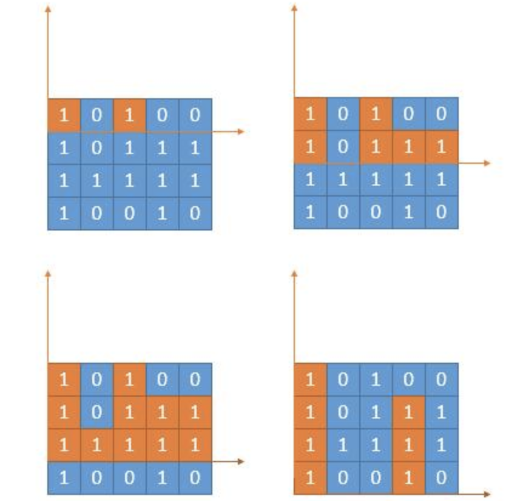

- [遍历问题](#遍历问题)
  - [9. 回文数](#9-回文数)
  - [54. 螺旋数组](#54-螺旋数组)
  - [59. 螺旋矩阵 II](#59-螺旋矩阵-ii)
  - [剑指offer 61. 扑克牌中的顺子](#剑指offer-61-扑克牌中的顺子)
  - [66.加一](#66加一)
  - [118. 杨辉三角](#118-杨辉三角)
  - [119. 杨辉三角 II](#119-杨辉三角-ii)
  - [498. 对角线遍历](#498-对角线遍历)
- [旋转问题](#旋转问题)
    - [48.旋转图像](#48旋转图像)
  - [189. 旋转数组](#189-旋转数组)
- [位运算技巧](#位运算技巧)
  - [136. 只出现一次的数字](#136-只出现一次的数字)
  - [137. 只出现过一次的数字 III](#137-只出现过一次的数字-iii)
  - [260. 只出现过一次的数字 II](#260-只出现过一次的数字-ii)
  - [191. 位1的个数](#191-位1的个数)
  - [231. 2的幂](#231-2的幂)
  - [268. 缺失的数字](#268-缺失的数字)
  - [168. Excel表列名称](#168-excel表列名称)
  - [171. Excel表列序号](#171-excel表列序号)
  - [405. 数字转十六进制](#405-数字转十六进制)
- [双指针技巧](#双指针技巧)
  - [11. 盛最多水的容器](#11-盛最多水的容器)
  - [84. 柱状图中的最大面积](#84-柱状图中的最大面积)
  - [85. 最大矩形](#85-最大矩形)
  - [915. 分割数组](#915-分割数组)
  - [15. 三数之和 3Sum [Medium]](#15-三数之和-3sum-medium)
  - [16. 最接近的三数之和](#16-最接近的三数之和)
  - [18. 四数之和](#18-四数之和)
  - [26. 删除有序数组中的重复项](#26-删除有序数组中的重复项)
  - [75. 颜色分类 [Medium]](#75-颜色分类-medium)
  - [剑指21. 调整数组顺序使奇数位于偶数前面](#剑指21-调整数组顺序使奇数位于偶数前面)
  - [27. 移除元素](#27-移除元素)
  - [283. 移动零](#283-移动零)
  - [88. 合并两个有序数组](#88-合并两个有序数组)
  - [349. 两个数组的交集](#349-两个数组的交集)
  - [350. 两个数组的交集II](#350-两个数组的交集ii)
- [哈希表技巧](#哈希表技巧)
  - [1. 两数之和](#1-两数之和)
  - [36. 有效的数独](#36-有效的数独)
  - [128. 最长连续序列 [字节*]](#128-最长连续序列-字节)
  - [380. 常数时间插入/删除/随机取数组元素 [Medium]](#380-常数时间插入删除随机取数组元素-medium)
- [搜索问题](#搜索问题)
  - [240. 搜索二维矩阵 II [Medium]](#240-搜索二维矩阵-ii-medium)
  - [74. 搜索二维矩阵 I [Medium]](#74-搜索二维矩阵-i-medium)


## 遍历问题
- 常考察对二维数组的不同形式的遍历

### 9. 回文数
> 给你一个整数 x ，如果 x 是一个回文整数，返回 true ；否则，返回 false。

- 排除特殊情况： **当为负数或者个位数为0时**，即不可能是回文数
- 采用整数反转： 反转一半整数，然后对比得到的结果是否相等(偶数位) 或者 `x = tmp/10` （奇数位）

```
class Solution {
public:
    bool isPalindrome(int x) {
        // 当为负数  或者个位数为0时，即不可能是回文数
        if (x < 0 || (x % 10 == 0 && x != 0))
            return false;
        int tmp = 0;
        while ( x > tmp) {
            tmp = tmp * 10 + x % 10;
            x /= 10;
        }
        return tmp == x || x == tmp / 10;
    }
};
```


### 54. 螺旋数组
- 螺旋遍历二维数组
  - 循环终止条件：**还有剩余的元素未遍历**
  - **设置4个index 索引来进行**
- 注意： 在内外循环中都有考虑访问溢出的情况；
  - 外： num>=1
  - 内： 每行/列遍历 num>=1
```
class Solution {
public:
    vector<int> spiralOrder(vector<vector<int>>& matrix) {
        int row_l = 0;
        int row_r = matrix.size() - 1;
        int col_l = 0;
        int col_r = matrix[0].size() - 1;
        vector<int> ans;
        int nums = matrix.size()* matrix[0].size();
        while (nums >= 1) {
            for (int i = col_l; i <= col_r && nums; i++) {
                ans.push_back(matrix[row_l][i]);
                nums--;
            }
            row_l++;
           
            for (int i = row_l; i <= row_r && nums; i++) {
                ans.push_back(matrix[i][col_r]);
                nums--;
            }
            cout << endl;
            col_r--;
            for (int i = col_r; i >= col_l && nums; i--) {
                ans.push_back(matrix[row_r][i]);
                nums--;
                //cout << matrix[row_r][i] << " ";
            }
            row_r--;
            for (int i = row_r; i >= row_l && nums; i--) {
                ans.push_back(matrix[i][col_l]);
                nums--;
                //cout << matrix[i][col_l] << " ";
            }
            col_l++;
        }
        return ans;
    }
};
```
### 59. 螺旋矩阵 II
> 给你一个正整数n，生成一个包含 1 到 n^2 所有元素，且元素按顺时针顺序螺旋排列的 n x n 正方形矩阵matrix

- n^2个数字构成正方形，**顺时针遍历**
  - 循环终止条件 **num < n*n**
  - 与54题操作一致
```
class Solution {
public:
    vector<vector<int>> generateMatrix(int n) {
        vector<vector<int>> target(n, vector<int>(n));
        int row_l = 0;
        int row_r = n - 1;
        int col_l = 0;
        int col_r = n - 1;
        int num = 0;
        n = n * n;
        while(num < n) {
            for (int i = col_l; i <= col_r && num < n; i++) {
                target[row_l][i] = num + 1;
                num++;
            }
            row_l ++;
            for (int i = row_l; i <= row_r && num < n; i++) {
                target[i][col_r] = num + 1;
                num++;
            }
            col_r--;
            for (int i = col_r; i >= col_l && num < n; i--) {
                target[row_r][i] = num + 1;
                num++;
            }
            row_r--;
            for (int i = row_r; i >= row_l && num < n; i--) {
                target[i][col_l] = num + 1;
                num++;
            }
            col_l++;
        }
        return target;
    }
};
```

### 剑指offer 61. 扑克牌中的顺子
> 从扑克牌中随机抽5张牌，判断是不是一个顺子，即这5张牌是不是连续的。2～10为数字本身，A为1，J为11，Q为12，K为13，而大、小王为 0 ，可以看成任意数字。A 不能视为 14。

```
输入: [0,0,1,2,5]
输出: True
```

- 梳理一下题目，本质上是在找**有序数组中空缺的连续值的个数**，`2 3 5`之间缺了4，即缺了1个数， `nums[i+1] - nums[i] - 1`
- 并确定共有多有个0，0的个数要等于/大于比缺失的数量
- 首先进行数组排序，然后进行差值计算即可
  - 特殊情况： 当**有重复元素时一定不满足条件**

- 关键点： **`有序数组 空缺数量`**

``` c++
class Solution {
public:
    bool isStraight(vector<int>& nums) {
        int z = 0;
        int num = 0;
        bool flag = false;
        int res = 0;
        sort(nums.begin(), nums.end());
        for (int i = 0; i < nums.size(); i++) {
            if (nums[i] == 0)
                z++;
            else {
                if (flag)  {
                    if (nums[i] == num) return false;
                    res += (nums[i] - num - 1);
                }
                num = nums[i];
                flag = true;  
            }
        }
        if (res <= z)
            return true;
        return false;
    }
};
```

### 66.加一
https://leetcode-cn.com/leetbook/read/top-interview-questions-easy/x2cv1c/

- 数组遍历+1；对于临界情况进行额外考虑，即头部需要插入新元素
    复杂度分析： 时间复杂度O(m) 插入复杂度O(1)(vector insert)
```
class Solution {
public:
    vector<int> plusOne(vector<int>& digits) {
        bool next=false;
        for(int i=digits.size()-1;i>=0;i--){
            digits[i]++;
            if (digits[i]==10){
                digits[i]=0;
                next=true;
            }else{
                next=false;
                break;
            }
        }
        if(next){
            digits.insert(digits.begin(),1);
        }
        return digits;
    }
};
```

### 118. 杨辉三角
> 给定一个非负整数 numRows，生成杨辉三角的前 numRows 行。


- 时间复杂度分析：O（n(n+1)/2）
- 关键点： **`临界处理`** **`遍历`**
```c++
class Solution {
public:
    vector<vector<int>> generate(int numRows) {
        vector<vector<int>> tri(numRows);
        if(numRows<1)
          return tri;
        tri[0].push_back(1);
        for(int i=1; i<numRows;i++){
            for(int j=0;j<i+1;j++){
                if(j==0| j==i)
                {
                    tri[i].push_back(tri[i-1][0]);
                }
                else{
                    tri[i].push_back(tri[i-1][j-1]+tri[i-1][j]);
                }
            }
        }
        return tri;
    }
};
``` 

### 119. 杨辉三角 II
> 给定一个非负索引 k，其中 k ≤ 33，**返回杨辉三角的第k行**。

- 要求返回具体某一行，可以同上一题一样将每行结果都存下来
- 也可以通过递推公式，使用一维数组进行动态结果存储
  - `ans[j] = ans[j - 1] + ans[j]`  `ans[i] = 1`
- 时间复杂度 O(N^2) 空间复杂度 O(N)

```c++
class Solution {
public:
    vector<int> getRow(int rowIndex) {
        vector<int> ans(rowIndex + 1);
        ans[0] = 1;
        for (int i = 1; i <= rowIndex; i++) {
            ans[i] = 1;
            for (int j = i - 1; j > 0; j--) {
                ans[j] = ans[j - 1] + ans[j];
            }
        }
        return ans;
    }
};
```

### 498. 对角线遍历 
> 给定一个含有 M x N 个元素的矩阵（M 行，N 列），请以对角线遍历的顺序返回这个矩阵中的所有元素

- 与螺旋矩阵遍历有相似之处，都在考察对数组和矩阵的基本操作逻辑
- 对角线遍历方式： **即保持： （x+y = k） 控制x 和 y 不超过合法范围即可**

```
class Solution {
public:
    vector<int> findDiagonalOrder(vector<vector<int>>& mat) {
        // x + y = k.  k = [0, 2n-1]
        vector<int> ans;
        int m = mat.size();
        int n = mat[0].size(); 
        for (int k = 0; k < max(m, n) * 2 - 1; k++) {
            // 向上遍历
            if (k % 2 == 0) {
                for (int row = min(k, m - 1); row >= 0 && (k - row) < n; row--) {
                    //cout << row << k - row << endl;
                    ans.push_back(mat[row][k - row]);
                }
            }
            else {
                for (int col = min(k, n - 1); col >= 0 && (k - col) < m ; col--) {
                    //cout << k - col << col << endl;
                    ans.push_back(mat[k - col][col]);
                }
            }
        }
        return ans;
    }
};
```
## 旋转问题
#### 48.旋转图像
> 给定一个 n × n 的二维矩阵 matrix 表示一个图像。请你将图像顺时针旋转 90 度。

- 思路：
  - 先转置矩阵，
  - 然后再**进行同行翻转即可得到旋转结果** 
  - 时间复杂度O(n^2)

```
class Solution {
public:
    void rotate(vector<vector<int>>& matrix) {
        int n = matrix.size();
        // 矩阵转置
        for (int i = 0; i < n; i++) {
            for (int j = 0; j < i; j++) {
                swap(matrix[i][j], matrix[j][i]);
            }
        }
        for (int i = 0; i < n; i++) {
            reverse(matrix[i].begin(), matrix[i].end());
        }
    }
};
```

```
class Solution {
public:
    void rotate(vector<vector<int>>& matrix) {
        int n=matrix.size();
        for(int i=0;i<n;i++)
        {
            for(int j=0;j<i;j++){
                int tmp=matrix[i][j];
                matrix[i][j]=matrix[j][i];
                matrix[j][i]=tmp;
            }
        }
        for(int i=0;i<n;i++)
        {
            for(int j=0;j<n/2;j++){
                int tmp=matrix[i][j];
                matrix[i][j]=matrix[i][n-j-1];
                matrix[i][n-j-1]=tmp;
            }
        }
        
    }
};
```
### 189. 旋转数组
> 给定一个数组，将数组中的元素向右移动 k 个位置，其中 k 是非负数
```
输入: nums = [1,2,3,4,5,6,7], k = 3
输出: [5,6,7,1,2,3,4]
解释:
向右旋转 1 步: [7,1,2,3,4,5,6]
向右旋转 2 步: [6,7,1,2,3,4,5]
向右旋转 3 步: [5,6,7,1,2,3,4
```
- 方法1： 暴力循环
- 方法2: 环形平移
- 方法3: **三次反转数组** 
```
class Solution {
public:
    void rotate(vector<int>& nums, int k) {
        k%=(nums.size());
        //int tmp=0;
        ///int start=0;
        int count=0;
        for(int i=0;count<nums.size();i++)
        {
            int current=i;
            int pred=nums[current];
            while(true)
                {
                    int next=(current+k)%nums.size();
                    int tmp=nums[next];
                    nums[next]=pred;
                    pred=tmp;
                    current=next;
                    //j=(j+k)%nums.size();
                    count++;
                    if(i==current){
                        break;
                    }
                }

        }     
        }
};
```
- **反转数组**：先反转整个数组，再反转前k个数字，再反转最后的n-k个数字。
```
class Solution {
public:
    void reverse(vector<int>& nums, int start,int end){
        while(start<end){
            int tmp=nums[start];
            nums[start]=nums[end];
            nums[end]=tmp;
            start++;
            end--;
        }
    }
    void rotate(vector<int>& nums, int k) {
        k%=(nums.size());
        reverse(nums,0,nums.size()-1);
        reverse(nums,0,k-1);
        reverse(nums,k,nums.size()-1)；  
        }
};
```
```
class Solution {
public:
    void rotate(vector<int>& nums, int k) {
        k %= nums.size();
        reverse(nums.begin(), nums.end());
        reverse(nums.begin() + k, nums.end());
        reverse(nums.begin(), nums.begin() + k);
    }
};
```

【利用额外空间进行数组记录】
```
class Solution {
public:
  
    void rotate(vector<int>& nums, int k) {
        k%=(nums.size());
        vector<int> a(nums.size());
        for(int j=0;j<nums.size();j++){
            a[(j+k)%nums.size()]=nums[j];
        }
        for(int j=0;j<nums.size();j++){
            nums[j]=a[j];
        }
   
        }
};
```

## 位运算技巧
### 136. 只出现一次的数字
> 给定一个非空整数数组，除了**某个元素只出现一次以外**，其余每个元素均出现两次。找出那个只出现了一次的元素

- 要求是线性时间、不占额外内存；

- 线性时间就可以想到利用排序，减少遍历复杂度；
- 如果没额外内存限制的话，就可以**利用哈希表或者集合**，记录键值。

```
class Solution {
public:
    int singleNumber(vector<int>& nums) {
        // unordered_map<int,int> keys;
        sort(nums.begin(),nums.end());
        bool pre=true;
        for(int j=0;j<nums.size()-1;j++){
            if(nums[j]!=nums[j+1]){
                if(pre) return nums[j];
                pre=true;
            
            }
            else{
                pre=false;

            }
        }
        return nums[nums.size()-1];

    }
};
```
另外一种方法：【**位运算**】
- **使用两元素的异或XOR操作**，整个数组的XOR操作即可得到没有重复的数字；
```c++
class Solution {
public:
    int singleNumber(vector<int>& nums) {

        int res=0;
        for(auto j: nums){
            res^=j;
        }
        return res;

    }
};
```
### 137. 只出现过一次的数字 III
- 给你一个整数数组 nums ，除某个元素仅出现一次外，**其余每个元素都恰出现三次**
  
- 分析： 
> 考虑数字的二进制形式，**对于出现三次的数字，各 二进制位 出现的次数都是 3 的倍数**。
因此，**统计所有数字的各二进制位中 1 的出现次数**，并对 3 求余，结果则为只出现一次的数字


- https://leetcode-cn.com/problems/single-number-ii/solution/single-number-ii-mo-ni-san-jin-zhi-fa-by-jin407891/

- 使用有限自动机来进行分析，对于所有数字的某二进制位上1的个数，存在3种状态： 
**即对 3 余数为 0, 1, 20,1,2**。
  - 若输入二进制位 11 ，则状态按照以下顺序转换；
  - 若输入二进制位 00 ，则状态不变


由于有三个状态，一位二进制无法表示，因此**使用两位二进制来表示3个状态**：`two one`

- one位置的更新方式为： 要考虑two位置状态以及输入的n
```c++
if two == 0:
  if n == 0:
    one = one
  if n == 1:
    one = ~one
if two == 1:
    one = 0
```
通过位运算可以简化为
```c++
one = one ^ n & ~two
```
- two位置的更新方式： 与计算one位置的方式一致，当one位置更新后，整体状态会存在移动，此时通过简单的变换操作既可以得到two位置的计算方法：
```c++
two = two ^ n & ~one
```

- 遍历完所有数字后，**各二进制位都处于状态 00和状态 01** （取决于 “只出现一次的数字” 的各二进制位是 1 还是 0 ），而此两状态是由 one 来记录的（*此两状态下twos恒为 0*），**因此返回 one 即可**


```c++
class Solution {
public:
    int singleNumber(vector<int>& nums) {
        int seen_once = 0;
        int seen_twice = 0;
        for (auto p : nums) {
            seen_once = ~seen_twice&(seen_once ^ p);
            seen_twice = ~seen_once&(seen_twice ^ p);
        }
        return seen_once;
    }
};
```

### 260. 只出现过一次的数字 II 

> 给定一个整数数组 nums，其中**恰好有两个元素只出现一次**，**其余所有元素均出现两次**。 找出只出现一次的那两个元素。你可以按 任意顺序 返回答案。
- 基础做法：哈希表构建，然后直接搜索即可
- 进阶做法，在上一题的基础上，使用异或运算
  - 考虑异或操作的性质：**对于两个操作数的每一位，相同结果为 00，不同结果为 11**。那么在计算过程中，成对出现的数字的所有位会两两抵消为 00，最终得到的结果就是那个出现了一次的数字。
  - 如果我们可以把所有数字分成两组，使得：
    - 两个只出现一次的数字在不同的组中；
    - **相同的数字会被分到相同的组中**。
  - 那么对两个组分别进行异或操作，即可得到答案的两个数字
https://leetcode-cn.com/problems/single-number-iii/solution/zhi-chu-xian-yi-ci-de-shu-zi-iii-by-leet-4i8e/
    - **通过取全部数字异或后的结果x，根据x的位数进行分组，x_i = 1 表示两数不同，x_i = 0表示两数相同，得到满足以上要求的分组**
    - 然后对两组内的元素进行异或，得到结果。

- 时间复杂度： O(N) 空间复杂度O(1)
```c++
class Solution {
public:
    vector<int> singleNumber(vector<int>& nums) {
        int x = 0;
        for (int i = 0; i < nums.size(); i++) {
            x ^= nums[i];
        }
        int l = 1; // 计算1最低位
        while( (l & x) == 0) {
            l <<= 1;
        }
        int a = 0;
        int b = 0;
        // 根据最后的异或位置进行分组
        for (auto s : nums) {
            if (s & l) {
                a ^= s;
            }
            else {
                b ^= s;
            }
        }
        return vector<int>({a,b});
    }
};
```

### 191. 位1的个数
>  输入是一个无符号整数（以二进制串的形式），返回其二进制表达式中数字位数为 '1' 的个数（也被称为汉明重量）


```c++
class Solution {
public:
    int hammingWeight(uint32_t n) {
       int ans = 0;
       int l = 0;
       while (l < 32) {
           if(n & (1 << l))
                ans++;
           l++;
       } 
       return ans;
    }
};
```

### 231. 2的幂

> 给定一个整数，编写一个函数来判断它是否是 2 的幂次方

- 最容易想到的： 二分查找， 时间复杂度 O(logN)
```c++
class Solution {
public:
    bool isPowerOfTwo(int n) {
        int right = n / 2;
        int left = 0;
        while (left <= right) {
            int mid = left + (right - left) / 2;
            if (pow(2, mid) == n)  
                return true;
            if (pow(2, mid) < n) {
                left = mid + 1;
            }
            else {
                right = mid - 1;
            }
        }
        return false;
    }
};
```
- 然而该题更多考察的是**位运算技巧**
    - 幂的二进制表示中仅有一个1，x - 1 则可以得到二进制各位全为1的表示
    - 因此可以计算 `x & (x - 1)` 交运算直接得到结果
    - **为了避免溢出 ：使用 long**
- 时间复杂度 O(1)

```
class Solution {
public:
    bool isPowerOfTwo(int n) {
        if (n == 0) return false;
        long x = n;
        return (x & (x - 1)) == 0; 
    }
};
```

### 268. 缺失的数字
> 给定一个包含 [0, n] 中 n 个数的数组 nums ，找出 [0, n] 这个范围内没有出现在数组中的那个数。

```
输入：nums = [3,0,1]
输出：2
```

- 基础思路：先对数组排序，然后遍历数组，查找空缺位置；时间复杂度：排序算法复杂度(O(nlogN))
- 为了追求线性复杂度，利用更简单的算法：利用高斯求和进行计算：
    - 时间复杂度 O(N) 空间复杂度 O(1)
    - **没有考虑数据溢出的情况**，求和可能会造成数据溢出
- 关键点： **`异或位运算`**  **`遍历`**

- **最简单的优化，利用long型来存储**

- **位运算**操作，利用XOR异或运算来计算缺失值
    - 异或运算中 相同值异或为0，数组连续异或得到没有重复的数字。
    - `3^0^0^1^2^1^3=2` n*2+1个数字异或肯定得到一个不重复的数字，即缺失值
    - 时间复杂度O(N) 空间复杂度O(1)
```c++
class Solution {
public:
    int missingNumber(vector<int>& nums) {
        if(nums.empty())
        return 0;
        int res =  nums.size();
        for(int i=0;i<nums.size();i++){
            res^=i;
            res^=nums[i];
        }
        return res;
    }
};
```
- 基本思路

```c++
class Solution {
public:
    int missingNumber(vector<int>& nums) {
        if(nums.empty())
        return 0;
        int lens = nums.size();
        int count = (lens+1)*(lens)/2;
        int res=0;
        for(auto i:nums)
            res+=i;
        return count-res;

    }
};
```

- **优化改进**：可以通过边加边减的操作来改写代码，这种写法并不能避免极限情况下的溢出，当循环中的前两个数字为最大的两个时，可能直接就溢出了
    - 注意写法，避免数组越界
```
class Solution {
public:
    int missingNumber(vector<int>& nums) {
        if(nums.empty())
        return 0;
        int res =  nums.size();
        for(int i=0;i<nums.size();i++){
            res+=i;
            res-=nums[i];
        }
        return res;

    }
};
```
### 168. Excel表列名称
```
    1 -> A
    2 -> B
    3 -> C
    ...
    26 -> Z
    27 -> AA
    28 -> AB 
    ...
```
- 经典进制转换问题, 此处1 对应 A， 是比较特殊的地方；
  - 为了进行错位，**需要对数字进行减一操作**

```c++
class Solution {
public:
    string convertToTitle(int columnNumber) {
        string res;
        while (columnNumber) {
            columnNumber--; // 关键
            res.push_back(columnNumber % 26 + 'A');
            columnNumber /= 26;
        }
        reverse(res.begin(), res.end());
        return res;
    }
};
```
### 171. Excel表列序号
```
    A -> 1
    B -> 2
    C -> 3
    ...
    Z -> 26
    AA -> 27
    AB -> 28 
    ...
```

- 与LC168是一套题目

```c++
class Solution {
public:
    int titleToNumber(string columnTitle) {
        long long res = 0;
        for (int i = 0; i < columnTitle.size(); i++) {
            res = res * 26 + (columnTitle[i] - 'A' + 1);
        }
        return res;
    }
};
```
### 405. 数字转十六进制
> 给定一个整数，编写一个算法将这个数转换为十六进制数。对于负整数，我们通常使用 补码运算 方法。

- 使用位元素方法，**每4位进行一次&操作**，得到当前的16进制表示；然后**再循环右移即可**，每次移动4位
- 需要提前转换位unsigned int数字，避免对负数的处理。

- 关键点： **`unsigned int`** **`移位 + & 操作`**
```c++
class Solution {
public:
    
    string toHex(int num) {
        string s = "0123456789abcdef";
        if (num == 0) return "0";
        string res;
        unsigned int n = num;
        while (n) {
            res.push_back(s[n & 15]);
            n = n >> 4;
        }
        reverse(res.begin(), res.end());
        return res;
    }
};
```


## 双指针技巧

1. 两数之和 

-  **排序+双指针， 最简单的解法**
```c++
class Solution {
public:
    vector<int> twoSum(vector<int>& numbers, int target) {
        int left = 0;
        int right = numbers.size()-1;
        vector<int> res;
        while(left < right) {
            if (numbers[left] + numbers[right] < target) {
                left++;
            }
            else if (numbers[left] + numbers[right] > target) {
                right--;
            }
            else {
                res.push_back(left+1);
                res.push_back(right+1);
                return res;
            }
        }
        return res;
    }
};
```

### 11. 盛最多水的容器
> 给你 n 个非负整数 a1，a2，...，an，每个数代表坐标中的一个点 (i, ai) 。在坐标内画 n 条垂直线，垂直线 i 的两个端点分别为 (i, ai) 和 (i, 0) 。**找出其中的两条线，使得它们与 x 轴共同构成的容器可以容纳最多的水**

```
输入：[1,8,6,2,5,4,8,3,7]
输出：49 
```

- 本质上是在找面积最大的区间，经典的**双指针题目**
- 左右指针**从两侧向内搜索**
  - 终止条件： `left < right`
  - 当`h[l] < h[r]`时右移左指针，**总是移动矮指针，漏桶原理嘛**
  - 当`h[l] > h[r]`时左移右指针
  - 每次先更新面积结果，然后再移动指针
- 时间复杂度 O(N)

- 关键点： 优美的 **`双指针`**

```c++
class Solution {
public:
    int maxArea(vector<int>& height) {
        int left = 0, right = height.size() - 1;
        int ans = 0;
        while (left < right) {
            ans = max(ans, (right - left) * min (height[left], height[right]));
            if (height[left] < height[right]) {
                left++;
            }
            else {
                right--;
            }
        }
        return ans;
    }
};
```

### 84. 柱状图中的最大面积
> 给定 n 个非负整数，用来表示柱状图中各个柱子的高度。每个柱子彼此相邻，且宽度为 1 。
求在该柱状图中，能够勾勒出来的矩形的最大面积

- 最朴素的思路： 对于每个柱子：**找到左右边界得到宽度，然后计算最大面积**
- 在此思路上进行优化：如何寻找左右边界：
  - 通过单调递增栈来搜索：当小于栈顶值时进行出栈操作，栈顶元素对应的左右边界可以通过当前新入栈的元素（右边界）以及，栈顶元素的下一个元素(左边界)得到；进而更新值
  - 特殊情况： **当出栈后栈空时**，需要做特殊处理； 最左侧添加0即可
  - 特殊情况2: **如果柱状图天然为递增情况**，那么不会有出栈的情况，这种情况下：最右侧添加0即可
- 关键点： **`单调栈`**  **`数组预处理`**
```c++
class Solution {
public:
    int largestRectangleArea(vector<int>& heights) {
        heights.insert(heights.begin(), 0); // 
        heights.push_back(0); // 
        int n = heights.size();
        stack<int> st;
        int res = 0;
        for (int i = 0; i < n; i++) {
            while (!st.empty() && heights[st.top()] > heights[i]) {
                int cur = st.top();
                st.pop();
                int left = st.top() + 1; // 精髓
                int right = i - 1;
                // cout << cur << "-" << heights[cur] << " " << (right - left + 1) << " - " << (right - left + 1) * heights[cur] << endl;
                res = max( (right - left + 1) * heights[cur], res); 
                //cout << left << " "<< right << endl;
            }
            st.push(i);
        }
        return res;
    }
};
```

### 85. 最大矩形
> 给定一个仅包含 0 和 1 、大小为 rows x cols 的二维二进制矩阵，找出只包含 1 的最大矩形，并返回其面积

- 与**最大正方形**相比，计算矩形的面积更为复杂，使用动态规划方法做起来难度陡增
- 本题更为简单直接的解法为结合[LC84.柱状图的最大面积]将问题做转换
  - 对于矩阵每行都可以得到相应的高度信息，从而使用单调栈得到当前行对应的最大面积；
  - 时间复杂度: O(mn)  空间复杂度 O(n)
  - 理解起来比较简单易懂

- 关键点： **`问题转换`**  **`单调栈`**

```c++
class Solution {
public:
    int largestRectangleArea(vector<int> heights) {
        heights.insert(heights.begin(), 0);
        heights.push_back(0);
        int ans = 0;
        stack<int> st;
        for (int i = 0; i < heights.size(); i++) {
            while (!st.empty() && heights[i] < heights[st.top()]) {
                int cur = st.top();
                st.pop();
                int left = st.top() + 1; // 左边界
                int right = i - 1;  // 右边界
                ans = max(ans, heights[cur] * (right - left + 1));
            }
            st.push(i);
        }
        //cout << ans << endl;
        return ans;
    }
    int maximalRectangle(vector<vector<char>>& matrix) {
        if (matrix.empty()) return 0;
        int rows = matrix.size();
        int cols = matrix[0].size();
        vector<int> heights(cols);
        int ans = 0;

        for (int i = 0; i < rows; i++) {
            for (int j = 0; j < cols; j++) {
                if (matrix[i][j] == '1') {
                    heights[j] += 1;
                }
                else {
                    heights[j] = 0;
                }
            }
            ans = max(ans, largestRectangleArea(heights));
        }
        return ans;
    }
};
```

### 915. 分割数组
> 给定一个数组 A，将其划分为两个连续子数组 left 和 right， 使得：
left 中的每个元素都小于或等于 right 中的每个元素。
left 和 right 都是非空的。
left 的长度要尽可能小。
在完成这样的分组后返回 left 的长度。可以保证存在这样的划分方法。

- 即在数组中寻找分割位置，完成目标任务 
  - 基本思路： 利用辅助数组记录每个位置上的leftMax和rightMin值
  - 从左到右（1开始）比较当前位置上的rightMin 是否大于/等于前一位的leftMax
  - 时间复杂度 O(N);   空间复杂度O(N)

```c++
class Solution {
public:
    int partitionDisjoint(vector<int>& nums) {
        int n = nums.size();
        vector<int> upper(n);
        vector<int> down(n);
        for (int i = 0; i < n; i++) {
            if (i == 0) {
                upper[i] = nums[0];
            }
            else {
                upper[i] = max(upper[i - 1], nums[i]);
            } 
        }
        for (int i = n - 1; i >= 0; i--) {
            if (i == n - 1) {
                down[i] = nums[n-1];
            }
            else {
                down[i] = min(down[i + 1], nums[i]);
            } 
        }
        int ans = 0;
        for (int i = 1; i < n; i++) {
            if (down[i] >= upper[i-1]) {
                return i;
            }
        }
        return ans;
    } 
};
```
- 优化，**进行一次遍历完成**所有任务：
  - 仅记录当前位置的左侧最大值leftMax， 和全局最大值：
  - `allMax`存的是[0, i]的最大值，`pos`是left数组的分界点，`leftMax`存的是left数组[0, pos]的最大值
  - 当`A[i] < leftMax`时，为了满足**left数组的数必须小于等于right中的数**，必须**将当前A[i]放入left数组**，同时**更新leftMax和pos**
  - 当 `A[i] = leftMax` 时暂时没必要将A[i]放入left数组，因为我们求的是最小的left
  - `A[i] >= leftMax`，那么A[i]可以暂时放在right数组，若后面有A[j] < leftMax时才必须将A[i]放入left数组
- 时间复杂度 O(N);   空间复杂度O(1)

```c++
class Solution {
public:
    int partitionDisjoint(vector<int>& nums) {
        int n = nums.size();
        int allMax = nums[0];
        int leftMax = nums[0];
        int ans = 0;
        for (int i = 1; i < n; i++) {
            allMax = max(allMax, nums[i]);
            if (leftMax > nums[i]) {
                leftMax = allMax;
                ans = i;
            }
        }
        return ans + 1;
    } 
};
```
### 15. 三数之和 3Sum [Medium]
> 从无序数组中找出三个非重复元素和等于目标值

- **TwoSum的升级** 
- 可以通过多次TwoSum查找来实现3Sum的计算
    - **为了避免重复**，需要在遍历时跳过重复区域
    - 外层循环和内层循环都需要进行重复区域的跳过
- 时间复杂度 `O(N^2)` 空间复杂度 O(logN) 排序所需
- 关键点： **`双指针 `**   **`避免重复`** 
```
class Solution {
public:
    vector<vector<int>> ans;
    void twoSum(vector<int>& nums, int target, int index) {
        int left = index + 1;
        int right = nums.size() - 1;
        while(left < right) {
            if (nums[left] + nums[right] == target) {
                if (left != index && right != index) {
                    ans.push_back({nums[index], nums[left], nums[right]});
                    //cout << nums[index] <<" " <<nums[left] << " "<< nums[right] << endl;
                }
                int cur = nums[left];
                while(left < nums.size() && nums[left]==cur) {
                    left++;
                }
                //cout << "move:" << left << " " << nums[left]<< endl;
                int curr = nums[right];
                while(right >= 0 && nums[right]==curr) {
                    right--;
                }
                //cout << "right:" << right << " " << nums[right]<< endl;
                continue;
                //left++;
            }
            else if(nums[left] + nums[right] < target) {
                left++;
            }
            else {
                right--;
            }
        }
    }
    vector<vector<int>> threeSum(vector<int>& nums) {
        if (nums.size() < 3) {
            return ans;
        }
        sort(nums.begin(), nums.end()); //排序
        int i = 0;
        while (i < nums.size()) {
            if (nums[i] > 0)
                break;
            twoSum(nums, -nums[i], i);
            int cur = nums[i];
            while(i < nums.size() && nums[i]==cur) {
                    i++;
            }
        }
        return ans;
    }
};
```

### 16. 最接近的三数之和
> 给定一个包括 n 个整数的数组 nums 和 一个目标值 target。找出 nums 中的三个整数，使得它们的和与 target 最接近。返回这三个数的和。假定每组输入只存在唯一答案。

```
输入：nums = [-1,2,1,-4], target = 1
输出：2
```

- 与三数之和解法一致，只是调整了对于相等情况的处理，每次遍历通过比较绝对值差来更新结果
- 把ans设为比较大的值，以方便更新结果
- 时间复杂度 O(N^2) 
- 关键点： **`排序 + 双指针`**

```c++
class Solution {
public:
    int threeSumClosest(vector<int>& nums, int target) {
        sort(nums.begin(), nums.end());
        int n = nums.size();
        int ans = 100000;
        for (int i = 0; i < n - 2; i++) {
            int left = i + 1;
            int right = n - 1;
            while (left < right) {
                int tmp = nums[i] + nums[left] + nums[right];
                if (tmp <= target) {
                    left++;
                }
                else {
                    right--;
                }
                if (abs(tmp - target) <= abs(ans - target)) 
                    ans = tmp;
            }
        }
        return ans;
    }
};
```

### 18. 四数之和
> 给定一个包含 n 个整数的数组 nums 和一个目标值 target，判断 nums 中是否存在四个元素 a，b，c 和 d ，使得 a + b + c + d 的值与 target 相等？找出所有满足条件且不重复的四元组。注意：答案中不可以包含重复的四元组

- 与三数之和原理一致，通过**多层循环+排序双指针即可**
- 区别在于比三数之和多一层循环，多一层重复判断
- 关键点： **`重复值判断`**  **`排序 + 双指针`**

``` c++
class Solution {
public:
    vector<vector<int>> fourSum(vector<int>& nums, int target) {
        sort(nums.begin(), nums.end());
        int n = nums.size();
        vector<vector<int>> ans;
        for (int i = 0; i < n - 3; i++) {
            // 重复值处理
            if (i > 0 && nums[i] == nums[i - 1]) {
                continue;
            }
            for (int j = i + 1; j < n - 2; j++) {
                // 重复值处理
                if (j > i + 1 && nums[j] == nums[j - 1])
                    continue;
                
                int left = j + 1;
                int right = n - 1;
                while (left < right) {
                    
                    int tmp = nums[i] + nums[j] + nums[left] + nums[right];
                    if (tmp == target) {
                        //cout <<i << j<< left << right << endl;
                        ans.push_back(vector<int>{nums[i], nums[j], nums[left], nums[right]});
                        int l = nums[left];
                        // 重复值处理
                        while (left < right && nums[left] == l)
                            left++;
                        int r = nums[right];
                        while ( right >= 0 && nums[right] == r)
                            right--;
                    }
                    else if (tmp < target) {
                        left++;
                    }
                    else {
                        right--;
                    }
                }     
               
            }
            
        }
        return ans;
    }
};
```

### 26. 删除有序数组中的重复项
> 给你一个有序数组 nums ，请你 原地 删除重复出现的元素，使每个元素 只出现一次 ，返回删除后数组的新长度

- 使用双指针思想，left指针用于记录元素值，当出现重复值时跳过即可，left指针不移动
- **`双指针`**
```c++
class Solution {
public:
    int removeDuplicates(vector<int>& nums) {
        if (nums.empty())
            return 0;
        int left = 1;
        for (int i = 1; i < nums.size(); i++) {
            if (nums[i-1] == nums[i]) {
                continue;
            }
            else {
                nums[left] = nums[i];
                left++;
            }
        }
        return left;
    }
};
```

### 75. 颜色分类 [Medium]
- 三种颜色 0 1 2 ， 要实现对这些颜色的原地排序 从小到大排列


- 双指针法： **left指针控制0， right指针控制2，进行交换，只需要遍历一次即可完成排序**
  - 遇到0，与left进行交换，即往左甩
  - 遇到2，则与right进行交换，往右甩
  - `left < right`； 
    - 技巧点： 当进行right交换时，交换完成后要回退一步，保证避免遗漏对元素的处理，*可能将2又换到当前位置*
- 时间复杂度： `O(N)`

- 关键点： **双指针** **一次遍历**

```c++
class Solution {
public:
    void sortColors(vector<int>& nums) {
        int left = 0;
        int right = nums.size() - 1;
        for (int i = 0; i <= right; i++){
            if (nums[i] == 0) {
                swap(nums[i], nums[left]);
                left++;
            }
            if (nums[i] == 2) {
                swap(nums[i], nums[right]);
                right--;
                i--;// 解题关键
            }
        }
    }
};
```

### 剑指21. 调整数组顺序使奇数位于偶数前面
> 使得所有奇数位于数组的前半部分，所有偶数位于数组的后半部分。

- 跟LC75题思路相似，原地移动即可，设置left指针，将所有奇数向left指针位置交换即可
- 时间复杂度 O(N)
```
class Solution {
public:
    vector<int> exchange(vector<int>& nums) {
        int left = 0;
        for (int i = 0; i < nums.size(); i++) {
            if (nums[i] % 2 ) {
                swap(nums[left], nums[i]);
                left++;
            }
        }
        return nums;
    }
};
```
### 27. 移除元素
> 给你一个数组 nums 和一个值 val，你需要 原地 移除所有数值等于 val 的元素，并返回移除后数组的新长度。
不要使用额外的数组空间，你必须仅使用 O(1) 额外空间并 原地 修改输入数组。

- 双指针基本操作

```c++
class Solution {
public:
    int removeElement(vector<int>& nums, int val) {
        int left = 0;
        for (int i = 0; i < nums.size(); i++) {
            if (nums[i] != val) {
                nums[left++] = nums[i];
            }
        }
        return left;
    }
};
```

### 283. 移动零
> 给定一个数组 nums，编写一个函数将所有 0 移动到数组的末尾，同时保持非零元素的相对顺序。

```
输入: [0,1,0,3,12]
输出: [1,3,12,0,0]
```
- 这并非一道排序题目, 仍然是数组双指针的应用
- 当当前值非0时，即往左甩，并移动left指针，否则正常移动right指针
- 与剑指21等题目十分相似


```c++
class Solution {
public:
    void moveZeroes(vector<int>& nums) {
        int left = 0;
        int right = 0;
        while (right < nums.size()) {
            if (nums[right]) {
                swap(nums[left], nums[right]);
                left++;
            }
            right++;
        }
    }
};
```


### 88. 合并两个有序数组
- 给定两个有序数组a,b， 其中a数组空间比较大，可以容纳a+b两个数组
- 思路1:  合并后排序
- 思路2： 使用双指针，借助额外空间存储a，双指针合并
- 思路3:  **逆向双指针，从后往前遍历**，将最大值往a的尾部填充
    - 最后将未合并的部分再添加到a中即可
```
class Solution {
public:
    void merge(vector<int>& nums1, int m, vector<int>& nums2, int n) {
        // 
        int right = nums1.size() - 1;
        int p1 = m - 1;
        int p2 = n - 1;
        while (p1 >= 0 && p2 >= 0) {
            if (nums1[p1] > nums2[p2]) {
                nums1[right] = nums1[p1];
                right--;
                p1--;
            } else {
               nums1[right] = nums2[p2];
                right--;
                p2--; 
            }
        }
        // 处理剩余部分
        while(p2 >= 0) {
            nums1[right] = nums2[p2];
            right--;
            p2--; 
        }
    }
};
```

### 349. 两个数组的交集
>  给定两个数组，编写一个函数来计算它们的交集。

```
输入：nums1 = [1,2,2,1], nums2 = [2,2]
输出：[2]
```

- **intersection计算**
- 基于set哈希表进行计算是最简单的思路，
    - 对数组进行去重，然后对比
    - 时间复杂度： O(N） 空间复杂度 O(N)
```c++
class Solution {
public:
    vector<int> getIntersection(set<int> s1, set<int> s2) {
        if (s1.size() > s2.size())
            getIntersection(s2,s1);
        vector<int> res;
        for (auto i : s1) {
            if (s2.count(i)) {
                res.push_back(i);
            }
        }
        return res;
    }
    vector<int> intersection(vector<int>& nums1, vector<int>& nums2) {
        int idx_0, idx_1 = 0;
        set<int> s1, s2;
        
        for (auto i : nums1) 
            s1.insert(i);
        for (auto i : nums2)
            s2.insert(i);
        return getIntersection(s1,s2);
    }
};
```
- 其他思路： 先对数组进行排序，然后利用双指针法从左到右进行遍历处理
    - 时间复杂度： O(mlogm+nlogn) 主要复杂度在列表排序上
- 关键点： **`排序+双指针`**
```c++
class Solution {
public:
    vector<int> intersection(vector<int>& nums1, vector<int>& nums2) {
        sort(nums1.begin(), nums1.end());
        sort(nums2.begin(), nums2.end());
        int length1 = nums1.size(), length2 = nums2.size();
        int index1 = 0, index2 = 0;
        vector<int> intersection;
        while (index1 < length1 && index2 < length2) {
            int num1 = nums1[index1], num2 = nums2[index2];
            if (num1 == num2) {
                // 保证加入元素的唯一性
                if (!intersection.size() || num1 != intersection.back()) {
                    intersection.push_back(num1);
                }
                index1++;
                index2++;
            } else if (num1 < num2) {
                index1++;
            } else {
                index2++;
            }
        }
        return intersection;
    }
};
```

### 350. 两个数组的交集II
https://leetcode-cn.com/leetbook/read/top-interview-questions-easy/x2y0c2/

允许有重复的数字，计算两个数组所有重复的数字(数字本身就是可以重复)

所以不用考虑使用集合，**可以通过哈希表/排序+双指针来完成**。

- 双指针遍历排完序的两个数组：
  时间复杂度分析：排序复杂度O(mlogm+nlogn)；数组遍历O(m+n);总复杂度O(mlogm+nlogn);
  空间复杂度：记录结果的数组O(min(m,n))，使用STL.vector会到O(1)

```c++
class Solution {
public:
    vector<int> intersect(vector<int>& nums1, vector<int>& nums2) {
        sort(nums1.begin(),nums1.end());
        sort(nums2.begin(),nums2.end());
        
        int index=0,index2=0;
        int len=nums1.size();
        int len2=nums2.size();
        vector<int> res;
        while(index<len&&index2<len2){
            if(nums1[index]==nums2[index2]){
                res.push_back(nums1[index]);
                index++;
                index2++;
            }
            else if(nums1[index]<nums2[index2]){
                index++;
            }
            else if(nums1[index]>nums2[index2]){
                index2++;
            }
        }
        return res;
        }
};
```
- 使用哈希表，unordered_map,记录短表的元素值和频次；
- 将长表和哈希表进行遍历，对哈希表进行元素删减，并保存相同元素。
- 与上个方法比利用哈希表的遍历能力，优化了算法：
    - 时间复杂度： 遍历数组操作O(m+n)，哈希表搜索O(1),总体O(m+n)
    - 空间复杂度: O(min(m,n))
```c++
class Solution {
public:
    vector<int> intersect(vector<int>& nums1, vector<int>& nums2) {
        if(nums1.size()>nums2.size()){
            intersect(nums2,nums1);
        }
        vector<int> res;
        unordered_map<int,int> map;
        for(auto n:nums1) map[n]++;
        for(auto n:nums2){
            if(map.count(n)){
                res.push_back(n);
                map[n]--;
            }
            if(map[n]==0){
                map.erase(n);
            }

        }
        return res;
        }
};
```

## 哈希表技巧
### 1. 两数之和
给定数组和目标，找出数组两元素之和为target的元素索引

- 暴力搜索
- 哈希表：在数组线性遍历时，记录每个值的位置，以便于快速查找差值target-x是否存在。 
    时间复杂度：O(n)
- 关键点： **`哈希表`**   **`双指针`**

```
class Solution {
public:
    vector<int> twoSum(vector<int>& nums, int target) {
        unordered_map<int,int> keys;
        for(int i=0; i<nums.size();i++){
            auto iter=keys.find(target-nums[i]);
            if(iter!=keys.end()){
                return {iter->second,i};
            }
            keys[nums[i]]=i;

        }
       return {};

    }
};
```

- **如果是有序数组的话，可以使用二分法和双指针**
- 给定两数之和，找出数组中对应的两个数的索引
- 思路1： 双指针法：
    - 设定左右指针，比较两数之和与target的差距，进行左右指针的调整
    - 时间复杂度： O(N)
    - 方法合理性的相关解释：
> 假设 `\text{numbers}[i]+\text{numbers}[j]=\text{target}numbers[i]+numbers[j]=target` 是唯一解，其中 `0 \leq i<j \leq \text{numbers.length}-10≤i<j≤numbers.length−1`。初始时两个指针分别指向下标 00 和下标 \text{numbers.length}-1numbers.length−1，左指针指向的下标小于或等于 `i`，右指针指向的下标大于或等于 `j`。除非初始时左指针和右指针已经位于下标 `i` 和 `j`，否则一定是左指针先到达下标 `i`的位置或者右指针先到达下标 `j` 的位置。
> **如果左指针先到达下标 `i` 的位置，此时右指针还在下标 `j`的右侧，`\text{sum}>\text{target}sum>target`，因此一定是右指针左移，左指针不可能移到 `i` 的右侧**。
> 如果右指针先到达下标 jj 的位置，此时左指针还在下标 `i` 的左侧，`\text{sum}<\text{target}sum<target`，因此一定是左指针右移，右指针不可能移到 `j` 的左侧。
> 由此可见，在整个移动过程中，左指针不可能移到 `i` 的右侧，右指针不可能移到 `j` 的左侧，因此不会把可能的解过滤掉。由于题目确保有唯一的答案，因此使用双指针一定可以找到答案

```c++
class Solution {
public:
    vector<int> twoSum(vector<int>& numbers, int target) {
        int left = 0;
        int right = numbers.size()-1;
        vector<int> res;
        while(left < right) {
            if (numbers[left] + numbers[right] < target) {
                left++;
            }
            else if (numbers[left] + numbers[right] > target) {
                right--;
            }
            else {
                res.push_back(left+1);
                res.push_back(right+1);
                return res;
            }
        }
        return res;
    }
};
```

- 思路2： 基于二分查找
    - 给定第一个数，寻找第二个数是否存在是最朴素的思路
    - 利用二分查找来寻找target-i能够避免 `O(n^2)`的复杂度
    - 时间复杂度 ： `O(nlogn)`
```c++
class Solution {
public:
    vector<int> twoSum(vector<int>& numbers, int target) {     
        vector<int> res;
        for (int i = 0; i < numbers.size()-1; i++) {
            int left = i+1;
            int right = numbers.size() - 1;
            int t = target - numbers[i];
            while (left <= right) {
                int mid = left + (right - left)/2;
                if (numbers[mid] == t) {
                    res.push_back(i+1);
                    res.push_back(mid+1);
                    return res;
                }
                else if (numbers[mid] < t) {
                    left = mid + 1;
                }
                else {
                    right = mid - 1;
                }
            }
        }
        return res;
    }
};
```


### 36. 有效的数独
```
一个简单的解决方案是遍历该 9 x 9 数独 三 次，以确保：

行中没有重复的数字。
列中没有重复的数字。
3 x 3 子数独内没有重复的数字。
实际上，所有这一切都可以在一次迭代中完成。
```

- 通过哈希表一次记录行、列、宫三种情况的数据分布

```c++
class Solution {
public:
    bool isValidSudoku(vector<vector<char>>& board) {
        unordered_map<int,unordered_map<char,int>> row_info;
        unordered_map<int,unordered_map<char,int>> col_info;
        unordered_map<int,unordered_map<char,int>> box_info;
        for(int i=0;i<9;i++){
            for(int j=0;j<9;j++){
                if(board[i][j]=='.')
                    continue;
                int box=int(i/3)*3+int(j/3);
                row_info[i][board[i][j]]++;
                col_info[j][board[i][j]]++;
                box_info[box][board[i][j]]++;
                

                if(box_info[box][board[i][j]]>1 ||row_info[i][board[i][j]]>1 || col_info[j][board[i][j]]>1)
                {
                    return false;
                }
            }
        }
        return true;
    }
};
```

### 128. 最长连续序列 [字节*]
> 给定一个未排序的整数数组 nums ，找出数字连续的最长序列（不要求序列元素在原数组中连续）的长度

```
输入：nums = [100,4,200,1,3,2]
输出：4
解释：最长数字连续序列是 [1, 2, 3, 4]。它的长度为 4
```

- 要求时间复杂度 O(N)
- **可以借助哈希表来实现**， 遍历每个元素是否存在连续的元素
- 为了降低循环次数，仅当当前元素的前序值不存在时才开始搜索，**即当前元素为可能为连续段的开始元素**
  - `s.count(p-1) == 0`
  - 从而显著降低了时间复杂度

```c++
class Solution {
public:
    int longestConsecutive(vector<int>& nums) {
        unordered_set<int> s;
        for (auto p : nums) {
            s.insert(p);
        }
        int ans = 0;
        for (auto p : nums) {
            if (!s.count(p - 1)) {                   
                int tmp = 1;
                while (s.count(++p)) {
                    tmp++;
                }
                ans = max(ans, tmp);
            }
        }

        return ans;
    }
};
```

### 380. 常数时间插入/删除/随机取数组元素 [Medium]
- 哈希表+动态数组实现
- 删除： 将尾部元素与当前要删除的元素进行交互，然后再删除尾部数组，实现常量级的删除操作
- 关键点： **`常数时间级删除`**  **`数组尾部删除`** 
```c++
class RandomizedSet {
public:
    unordered_map<int, int> indexs;
    vector<int> ans;

    /** Initialize your data structure here. */
    RandomizedSet() {

    }
    
    /** Inserts a value to the set. Returns true if the set did not already contain the specified element. */
    bool insert(int val) {
        //cout << "insert" << endl;
        if (indexs.count(val)) {
            return false;
        }
        ans.push_back(val);
        indexs[val] = ans.size() - 1;
        return true;

    }
    
    /** Removes a value from the set. Returns true if the set contained the specified element. */
    bool remove(int val) {
        //cout << "remove" << endl;
        if (indexs.count(val)) {
           // cout << "remove2" << endl;
            
            
            int pos = indexs[val];
            indexs.erase(val);
            if (pos == ans.size() - 1){
                ans.pop_back();
                return true;
            }
            ans[pos] = ans.back();
            indexs[ans.back()] = pos;
            ans.pop_back();
            
            return true;
        }
        return false;
    }
    
    /** Get a random element from the set. */
    int getRandom() {
        //cout << "Random" << endl;
        return ans[rand() % ans.size()];
    }
};
```


## 搜索问题


### 240. 搜索二维矩阵 II [Medium]
> 每行的元素从左到右升序排列。 每列的元素从上到下升序排列。
- 二分查找法：
  - 在对角线开始向下和向右的搜索

```c++
class Solution {
public:
    int rows = 0;
    int cols = 0;
    bool binarySearch(vector<vector<int>>& matrix, int target, int row) {
        //cout << "binarySearch" << endl;
        int left = row;
        int right = rows - 1;
        int col = row;
        while (left <= right) {
            //cout <<"l : " << left << " r :" << right << endl; 
            int mid = left + (right - left)/2;
            if (matrix[mid][col] == target) 
                return true;
            else if (matrix[mid][col] < target) {
                left = mid + 1;
            }
            else if (matrix[mid][col] > target) {
                right = mid - 1;
            }
        }
        int low = row;
        int high = cols - 1;
        while (low <= high) {
            //cout <<"low : " << low << " high :" << high << endl;
            int mid = low + (high - low)/2;
            if (matrix[row][mid] == target) 
                return true;
            else if (matrix[row][mid] < target) {
                low = mid + 1;
            }
            else if (matrix[row][mid] > target) {
                 high = mid - 1;
            }
        }
        return false;
    }
    bool searchMatrix(vector<vector<int>>& matrix, int target) {
        rows = matrix.size();
        cols = matrix[0].size();
        for (int i = 0; i < min(rows,cols); i ++) {
            if (binarySearch(matrix, target, i))
                return true;
        }
        return false;
    }
};
```
- **进阶做法**： 由于行和列都是有序的，可以将这个矩阵看作是一个搜索二叉树，
  - **将左下角元素作为根节点，向上都是小于根节点的元素，向右都是大于根节点的元素**
- 时间复杂度：`O(m+n)`
```c++
class Solution {
public:

    bool searchMatrix(vector<vector<int>>& matrix, int target) {
        int row = matrix.size() - 1;
        int col = 0;
        while(row >=0 && col < matrix[0].size()) {
            if (matrix[row][col] == target) 
                return true;
            else if (matrix[row][col] > target) {
                row--; // 向小的方向移动
            }
            else if (matrix[row][col] < target) {
                col++;
            }
        }
        return false;
    }
};
```

###  74. 搜索二维矩阵 I [Medium]
> 每行中的整数从左到右按升序排列。每行的第一个整数大于前一行的最后一个整数
- 二分查找的利用
  - **先搜第一列，找出小于目标值的第一行**， 注意边界
  - 然后再在行内进行二分查找
  - 时间复杂度： `O(logm + logn)`
```c++
class Solution {
public:
    bool searchMatrix(vector<vector<int>>& matrix, int target) {
        int low = 0;
        int row = 0;
        int high = matrix.size() - 1;
        while(low <= high) {
            int mid = low + (high - low) / 2;
            if (matrix[mid][0] ==  target) 
                return true;
            else if (matrix[mid][0] < target) {
                row = mid;
                low = mid + 1;
            }
            else {
                high = mid - 1;
            }
        }
        //cout << row << endl;
        if (matrix[row][0] > target || matrix[row].back() < target) 
            return false;
        int left = 0;
        int right = matrix[row].size() - 1;
        while (left <= right) {
            int mid = left + (right - left) / 2;
            if (matrix[row][mid] ==  target) 
                return true;
            else if (matrix[row][mid] < target) {
                left = mid + 1;
            }
            else {
                right = mid - 1;
            }
        }
        return false;
    }
};
```


