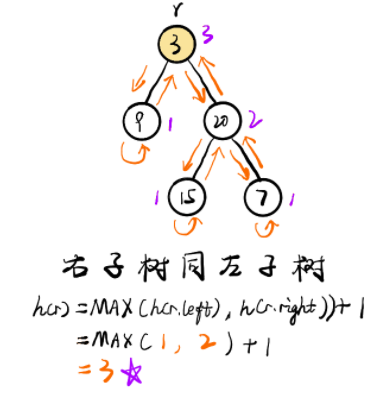

树比链表稍微复杂，因为链表是线性数据结构，而树不是。 
树的问题可以由 广度优先搜索BFS 或 深度优先搜索DFS 解决。 

重点题目：
二叉树的最大深度，
验证二叉搜索树，
二叉树的层次遍历 和 将有序数组转换为二叉搜索树

- 主要要掌握：
  - 二叉树的遍历方式BFS、DFS，
  - 以及对应的先序(根-左-右)/中序(左 根 右)/后序(左 右 根)/层级遍历
  - 中序遍历与二叉搜索树对应(BST)

<!-- @import "[TOC]" {cmd="toc" depthFrom=1 depthTo=6 orderedList=false} -->

<!-- code_chunk_output -->

- [遍历](#遍历)
  - [树的遍历不同方式](#树的遍历不同方式)
    - [先序遍历](#先序遍历)
    - [中序遍历 L Root R](#中序遍历-l-root-r)
    - [后序遍历 L R root](#后序遍历-l-r-root)
  - [102. 二叉树的层序遍历](#102-二叉树的层序遍历)
  - [103. 二叉树的锯齿形层序遍历 [Medium]](#103-二叉树的锯齿形层序遍历-medium)
  - [107. 层序遍历2](#107-层序遍历2)
  - [递归解二叉树问题模板](#递归解二叉树问题模板)
    - [自顶而下](#自顶而下)
    - [自底而上](#自底而上)
  - [104. 二叉树的最大深度](#104-二叉树的最大深度)
  - [111. 二叉树的最小深度](#111-二叉树的最小深度)
  - [559. N叉树的最大深度](#559-n叉树的最大深度)
  - [98. 验证二叉搜索树 [KEY]](#98-验证二叉搜索树-key)
  - [101. 对称二叉树](#101-对称二叉树)
- [树的构建](#树的构建)
  - [108. 有序数组转搜索二叉树 [KEY]](#108-有序数组转搜索二叉树-key)
  - [从中序和后序中构建二叉树](#从中序和后序中构建二叉树)
  - [先序加中序构建二叉树](#先序加中序构建二叉树)
  - [填充每个节点的下一个右侧节点指针](#填充每个节点的下一个右侧节点指针)
  - [二叉树的最近公共祖先](#二叉树的最近公共祖先)
  - [二叉树的序列化与反序列化 [HARD]](#二叉树的序列化与反序列化-hard)
- [树的查找](#树的查找)
  - [剑指26. 树的子结构 [Medium] [Tencent]](#剑指26-树的子结构-medium-tencent)
  - [112. 路径总和 [EASY]](#112-路径总和-easy)
  - [113. 二叉树路径总和 2 [Medium] [Tencent]](#113-二叉树路径总和-2-medium-tencent)
  - [437. 二叉树路径总和3 [Medium]](#437-二叉树路径总和3-medium)
  - [257. 打印二叉树所有路径](#257-打印二叉树所有路径)
  - [230. 二叉搜索树BST中第K小的元素  [Medium]](#230-二叉搜索树bst中第k小的元素--medium)
  - [剑指27. 二叉树的镜像 / 反转二叉树](#剑指27-二叉树的镜像--反转二叉树)
  - [剑指33. 二叉搜索树的后序遍历序列判断 [Medium]](#剑指33-二叉搜索树的后序遍历序列判断-medium)
  - [剑指36. BST与双向链表](#剑指36-bst与双向链表)
  - [110. 平衡二叉树的判断](#110-平衡二叉树的判断)
  - [404. 左叶子之和](#404-左叶子之和)
  - [199. 二叉树的右视图](#199-二叉树的右视图)
- [面试](#面试)

<!-- /code_chunk_output -->
## 遍历
### 树的遍历不同方式

#### 先序遍历
```
class Solution {
    vector<int> res;
public:
    void preoderTrav(TreeNode* root) {
        if (root == nullptr) {
            return;
        }
        res.push_back(root -> val);
        preoderTrav(root -> left);
        preoderTrav(root -> right);
    }
    vector<int> preorderTraversal(TreeNode* root) {
        preoderTrav(root);
        return res;
    }
};
```
- **迭代方式进行:基于栈实现，首先将left节点压到低，然后开始进行节点弹出，并转换到右子树**

```
class Solution {
    vector<int> res;
public:
    vector<int> preorderTraversal(TreeNode* root) {
        stack<TreeNode*> st;
        while (!st.empty() || root != nullptr) {
            while (root) {
                res.push_back(root -> val);
                st.push(root);
                root = root -> left;
            }
            root = st.top();
            st.pop();
            root = root -> right;
        }
        return res;
    }
};
``` 
#### 中序遍历 L Root R
- 迭代方式：
```
class Solution {
public:
    vector<int> inorderTraversal(TreeNode* root) {
        stack<TreeNode*> st;
        vector<int> res;
        while (!st.empty() || root != nullptr) {
            while (root) {
                st.push(root);
                root = root -> left;
            }
            root = st.top();
            res.push_back(root -> val);
            st.pop();
            root = root -> right; 
        }
        return res;
    }
};
```
#### 后序遍历 L R root
- 递归方式
```
class Solution {
public:
    vector<int> res;
    void postorderTrav(TreeNode* root) {
        if (root == nullptr) {
            return;
        }
        postorderTrav(root -> left);
        postorderTrav(root -> right);
        res.push_back(root -> val);
    }
    vector<int> postorderTraversal(TreeNode* root) {
        postorderTrav(root);
        return res;
    }
};
```

- 迭代方式: 稍微复杂一点，要考虑到左子树遍历完成后，右子树是否有节点，
```
class Solution {
public:
    vector<int> res;
    vector<int> postorderTraversal(TreeNode* root) {
        stack<TreeNode* > st;
        TreeNode* prev = nullptr;
        while (!st.empty() || root != nullptr) {
            while (root) {
                st.push(root);
                root = root -> left;
            }
            root = st.top();
            st.pop();  
            // 右边为空 或者之前已经遍历过了，则就不再深入，直接把当前root添加入res中
            if (root -> right == nullptr || root -> right == prev) {
                res.push_back(root -> val);
                prev = root;
                root = nullptr;
            }
            // 右边还是具有节点的，那么调整方面继续入栈
            else {
                st.push(root);
                root = root -> right;
            }
        }
        return res;
    }
};
```

### 102. 二叉树的层序遍历

- 最简单的做法：利用BFS做层序遍历，利用队列存储节点指针，每层运算结束时记录当前层的数组
```
class Solution {
public:
    vector<vector<int>> levelOrder(TreeNode* root) {
        vector<vector<int>> res;
        if(root==NULL) return res;
        queue<TreeNode*>Q;
        Q.push(root);
       
        while(Q.size()>0){
            
            vector<int> tmp;
            int sz=Q.size();
            while(sz){
                TreeNode * node=Q.front();
                Q.pop();
                if(node->left){
                    Q.push(node->left);
                }
                if(node->right){
                    Q.push(node->right);
                }
                tmp.push_back(node->val);
                sz--;
            }
            res.push_back(tmp);
            
        }
        return res;
    }
};

```
- 递归方式： 利用DFS的思想进行遍历，并根据遍历的深度存储数组：利用先序遍历的方式完成任务，只是额外添加了遍历层数，使得能够记录数字对应的层数；


```
class Solution {
public:
    vector<vector<int>> res;
    void _level(TreeNode* root,int level){
        if(root==NULL) return;
        if(level>=res.size()){
            res.push_back(vector<int>()); //提前添加空数组
        }
        res[level].push_back(root->val);
        _level(root->left,level+1);
        _level(root->right,level+1);
    }
    vector<vector<int>> levelOrder(TreeNode* root) {
        _level(root,0);  
        return res;
    }
};
```

### 103. 二叉树的锯齿形层序遍历 [Medium]
- 仍然逃不过bfs的框架
- 区别在于需要用到双向队列，或者用队列和栈来替代，以完成**锯齿形**的遍历
  - 时间复杂度O(N) N为节点数量  空间复杂度O(N)
- 双向队列**deque**: push_back/ push_front() pop_back/pop_front
- 单向队列**queue**
```
class Solution {
public:
    vector<vector<int>> zigzagLevelOrder(TreeNode* root) {
        vector<vector<int>> ans;
        //stack<TreeNode*> st;
        deque<TreeNode*> q; // 双向队列
        if (root == nullptr)
            return ans;
        q.push_back(root);
        int k = 0;
        vector<int> vals;
        while (!q.empty()) {
            if (k % 2 == 0) {
                int qs = q.size();
                for (int i = 0; i < qs; i++) {
                    TreeNode* cur = q.front();
                    vals.push_back(cur -> val);
                    q.pop_front();
                    if (cur -> left)
                        q.push_back(cur -> left);
                    if (cur -> right)
                        q.push_back(cur -> right);
                }
            }
            else {
                int qs = q.size();
                for (int i = 0; i < qs; i++) {
                    TreeNode* cur = q.back();
                    vals.push_back(cur -> val);
                    q.pop_back();
                    if (cur -> right)
                        q.push_front(cur -> right);
                    if (cur -> left)
                        q.push_front(cur -> left);
                }
            }
            ans.push_back(vals);
            vals.clear();
            k++;
        }
        return ans;

    }
};
```
### 107. 层序遍历2
- 注意首先对空值的判断
- 层序遍历用队列
- dfs用stack
```
class Solution {
public:
    vector<vector<int>> levelOrderBottom(TreeNode* root) {
        vector<vector<int>> ans;
        if (!root)
            return ans;
        queue<TreeNode*> st;
        st.push(root);
        while(!st.empty()) {
            int s = st.size();
            vector<int> tmp;
            for(int i = 0; i < s; i++) {
                TreeNode* cur = st.front();
                st.pop();
                tmp.push_back(cur -> val);
                if (cur -> left) {
                    st.push(cur -> left);
                }
                if (cur -> right) {
                    st.push(cur -> right);
                }
            }
            ans.push_back(tmp);
        }
        reverse(ans.begin(), ans.end());
        return ans;
    }
};
```

### 递归解二叉树问题模板
#### 自顶而下
- 在递归中先更新结果或者目标信息， 与先序遍历相似，*先记录结果当前结果*
  - 能确定一些参数，从**该节点自身解决出发**寻找答案吗？
  - 可以使用这些参数和节点本身的值来**决定什么应该是传递给它子节点的参数**吗？
```
1. return specific value for null node
2. update the answer if needed                      // answer <-- params
3. left_ans = top_down(root.left, left_params)		// left_params <-- root.val, params
4. right_ans = top_down(root.right, right_params)	// right_params <-- root.val, params
5. return the answer if needed 
```
#### 自底而上
- 对所有子节点递归调用函数，根据返回值和节点信息得到答案，即自底而上，类似于后序遍历
- 对于树中的任意一个节点，如果知道它子节点的答案，就能计算出该节点的答案
```
1. return specific value for null node
2. left_ans = bottom_up(root.left)			// call function recursively for left child
3. right_ans = bottom_up(root.right)		// call function recursively for right child
4. return answer
```
### 104. 二叉树的最大深度

- 二叉树遍历问题： BFS/DFS
- 基于DFS思想，计算左右子树的深度，取两子树的最大深度; 时间复杂度O(n) 空间复杂度O(depth)

```
/**
 * Definition for a binary tree node.
 * struct TreeNode {
 *     int val;
 *     TreeNode *left;
 *     TreeNode *right;
 *     TreeNode() : val(0), left(nullptr), right(nullptr) {}
 *     TreeNode(int x) : val(x), left(nullptr), right(nullptr) {}
 *     TreeNode(int x, TreeNode *left, TreeNode *right) : val(x), left(left), right(right) {}
 * };
 */
class Solution {
public:
    int maxDepth(TreeNode* root) {
        if(root==NULL){
            return 0;
        }
        return max(maxDepth(root->left),maxDepth(root->right))+1;
    }
};
```
- 基于自顶而下的递归思想
```
class Solution {
public:
    int ans = 0;
    void dfs(TreeNode* root, int depth) {
        if (root == nullptr)
            return;
        if (!root -> left && !root -> right )
            ans = max(ans, depth);
        dfs(root -> left, depth + 1);
        dfs(root -> right, depth + 1);
    }
    int maxDepth(TreeNode* root) {
        if (!root) 
            return 0;
        dfs(root, 0);
        return ans + 1;

    }
};
```
- 基于BFS思想，每遍历树一层，深度就加1，当BFS完成整个树即得到最终的结果；
     时间复杂度O(n) 空间复杂度O(n)

```
class Solution {
public:
    int maxDepth(TreeNode* root) {
        if(root==NULL) return 0;
        int depth=0;
        queue<TreeNode*> q;
        q.push(root);
        while(q.size()>0){
            int s=q.size();
            // 当前层出队，并将下一层节点加入
            while(s){
                TreeNode* node=q.front();
                q.pop();
                if(node->left){
                    q.push(node->left);
                }
                if(node->right){
                    q.push(node->right);
                }
                s-=1;
            }
            depth++;
        }
        return depth;
    }
};
```



### 111. 二叉树的最小深度
- 问题关键：**找到叶子节点，左右子树都空都点**，不能照搬最大深度的写法
- 自顶而上的递归写法 **后序遍历**
```
class Solution {
public:
    int minDepth(TreeNode* root) {
        if (!root) {
            return 0;
        }
        int leftD = minDepth(root -> left);
        int rightD = minDepth(root -> right);

        if (root -> left && root -> right != nullptr) {
            return  leftD + 1;
        }
        else if (root -> right && root -> left != nullptr) {
            return  rightD + 1;
        }
        int res = min(leftD, rightD) + 1;
        return res;
    }
};
```
### 559. N叉树的最大深度
- 二叉树的改造，同样遍历子节点即可，仍然是后序遍历
```
class Solution {
public:
    int maxDepth(Node* root) {
        if (!root)
            return 0;
        int res = 0;
        for (int i = 0; i < root -> children.size(); i++) {
           res = max(res, maxDepth(root -> children[i]));
        }
        return res + 1;
    }
};
```
### 98. 验证二叉搜索树 [KEY]

- 涉及基本的二叉树遍历以及二叉搜索树性质

- 递归解法: 利用BST所有左子树节点小于根节点，所有右子树节点大于根节点，这一性质构建递归公式

```/**
 * Definition for a binary tree node.
 * struct TreeNode {
 *     int val;
 *     TreeNode *left;
 *     TreeNode *right;
 *     TreeNode() : val(0), left(nullptr), right(nullptr) {}
 *     TreeNode(int x) : val(x), left(nullptr), right(nullptr) {}
 *     TreeNode(int x, TreeNode *left, TreeNode *right) : val(x), left(left), right(right) {}
 * };
 */
class Solution {
public:
    bool helper(TreeNode* root, long long lower, long long upper){
        if(root==NULL) return true;

        if(root->val<=lower||root->val>=upper){
            return false;
        }
        return helper(root->left,lower,root->val)&&helper(root->right,root->val,upper);

    }
    bool isValidBST(TreeNode* root) {
        return helper(root,LONG_MIN,LONG_MAX);
        }
};
```

- 遍历解法：利用**中序遍历**得到BST对应的数组，检查是否是单增的数组即可

```/**
 * Definition for a binary tree node.
 * struct TreeNode {
 *     int val;
 *     TreeNode *left;
 *     TreeNode *right;
 *     TreeNode() : val(0), left(nullptr), right(nullptr) {}
 *     TreeNode(int x) : val(x), left(nullptr), right(nullptr) {}
 *     TreeNode(int x, TreeNode *left, TreeNode *right) : val(x), left(left), right(right) {}
 * };
 */
class Solution {
public:
    vector<int> nodes;
    // 中序遍历
    void inOrderParse(TreeNode* root){
        if(root==NULL) return;
        inOrderParse(root->left);
        nodes.push_back(root->val);
        inOrderParse(root->right);
    }
    bool isValidBST(TreeNode* root) {
        inOrderParse(root);
        for(int i=0;i<nodes.size()-1;i++){
            if(nodes[i+1]<=nodes[i]){
                return false;
            }
        }
        return true;
        }
      
};
```

### 101. 对称二叉树

- 利用迭代的方式实现：**记录双指针**，指针方向相反同时压入队列，使得队列中连续两个指针值相同；否则为非对称树

```
class Solution {
public:
    bool isSymmetric(TreeNode* root) {
        queue<TreeNode*> Q;
        Q.push(root);
        Q.push(root);
        while(Q.size()>0){
            TreeNode* p= Q.front(); Q.pop();
            TreeNode* q= Q.front(); Q.pop();
            if(!p&&!q){
                continue;
            }
            else if(!p || !q){
                return false;
            }
            if(p->val!=q->val){
                return false;
            }
            Q.push(p->left);
            Q.push(q->right);
            Q.push(p->right);
            Q.push(q->left);
        }
        return true;
        
    }
};
```

- 递归方式：跟上面一样利用**双指针**，向着对称的相反方向进行遍历：
```class Solution {
public:
    bool check(TreeNode*p, TreeNode*q){
        if(!p&&!q) return true; // 
        if(!p||!q) return false; // 非对称情况
        return (p->val==q->val)&&(check(p->left,q->right))&&(check(p->right,q->left)); 
    }
    bool isSymmetric(TreeNode* root) {
       return  check(root,root);
    }
};
```

## 树的构建
### 108. 有序数组转搜索二叉树 [KEY]

- 要求左右子树高度平衡，即需要选择数组中间位置的数字作为根节点
    当数组长度为奇数或者偶数时，存在差异：对于偶数时需要考虑选择偏左位置还是偏右位置的作为根节点，两者没有效果差异
- 通过递归形式，进行转换

```class Solution {
public:
    TreeNode * helper(vector<int>& nums, int left,int right){
        if(left>right){
            return NULL; 
        }
        int mid=int((left+right+1)/2);

        TreeNode * root=new TreeNode(nums[mid]);
        root->left=helper(nums,left,mid-1);
        root->right=helper(nums,mid+1,right);
        return root;
    }
    TreeNode* sortedArrayToBST(vector<int>& nums) {
        return helper(nums,0,nums.size()-1);

    }
};

```


### 从中序和后序中构建二叉树
- 寻找根节点位置，并确定根节点在何处划分左右子树
- 主要注意遍历方向
```
class Solution {
public:
    unordered_map<int, int> idx_map;
    int post_idx = 0;
    TreeNode* helper(int in_left, int in_right, vector<int>& inorder, vector<int>& postorder) {
        if (in_left > in_right)
            return nullptr;
        //cout << post_idx <<endl;
        int val = postorder[post_idx]; //根节点val
        TreeNode* root = new TreeNode(val); //创建根节点
        int in_idx = idx_map[val]; //获取左右子树分割索引
        post_idx--; //后序数组下移到下个子根节点
        
        // 后序数组从后遍历是先根 后右节点，因此在dfs部分要先进右分支！！！
        root -> right = helper(in_idx + 1, in_right, inorder, postorder); //先dfs走向右子树方向
        root -> left = helper(in_left, in_idx - 1, inorder, postorder);
        return root;
    }
    TreeNode* buildTree(vector<int>& inorder, vector<int>& postorder) {
        for (int i = 0; i < inorder.size(); i++) {
            idx_map[inorder[i]] = i;
        }
        post_idx = postorder.size() - 1;
        TreeNode* root = helper(0, post_idx, inorder, postorder);
        return  root;
    }
};
```

### 先序加中序构建二叉树

- 构建方法：根据先序数组获得根节点值，并对中序数组建立节点值-索引的哈希表
- 每次从先序表中取root值，然后对应的从中序表中获取对应的索引，从而得到划分左右子树的index
- 直接根据root值创建节点，并基于index进行左右子树的创建递归
- **根据先序数组的顺序（root，left，right），正向递归时先进left分支**
- 时间复杂度O(N)，空间复杂度O（N）

```
class Solution {
public:
    unordered_map<int, int> idx_map;
    int pre_idx;
    TreeNode* helper(int in_left, int in_right, vector<int>& preorder, vector<int>& inorder) {
        if(in_left > in_right) {
            return nullptr;
        }
        int val = preorder[pre_idx];
        TreeNode* root = new TreeNode(val);
        int index = idx_map[val];
        pre_idx++;
        root -> left = helper(in_left, index - 1, preorder, inorder);
        root -> right = helper(index + 1, in_right, preorder, inorder);
        return root;
    }
    TreeNode* buildTree(vector<int>& preorder, vector<int>& inorder) {
        for (int i = 0; i < inorder.size(); i++) {
            idx_map[inorder[i]] = i;
        }
        pre_idx = 0;
        return helper(0, preorder.size() - 1, preorder, inorder);
    }
};
```

### 填充每个节点的下一个右侧节点指针

- 递归法，自顶而下的方法
- **因为是完全二叉树**，可以**将节点的左右子节点进行连接**
```
class Solution {
public:
    void dfs(Node* left, Node* right) {
        if (left == nullptr || right == nullptr) {
            return;
        }
        left -> next = right;
        dfs(left -> left, left -> right);
        dfs(right -> left, right -> right);
        dfs(left -> right, right -> left);
    }
    Node* connect(Node* root) {
        if (!root) {
            return root;
        }
        if (root -> left && root -> right) {
            dfs(root -> left, root -> right);
        }
        return root;
    }
};
```
- 对于非完全二叉树：使用队列迭代的方式进行处理，直接使用队列存储会带来额外的空间开销，可以做简单遍历
- 基于逐层遍历的思想，在当前层对下一层进行next 连接，并记录当前层的开始节点
- 然后进行逐层下移遍历
- 时间复杂度 O(N) 空间复杂度 O(1)

```
class Solution {
public:
    void handle(Node* &last, Node* &p, Node* &nextStart ) {
        if (last) {
            last -> next = p;
        }
        if (!nextStart) {
            nextStart = p;
        }
        last = p;  
    }
    Node* connect(Node* root) {
        if (!root) {
            return root;
        }
        Node* start = root; //记录当前层的开始节点
        while (start) {
            Node* p =start;
            Node* last = nullptr; // 记录同层上一个节点
            Node* nextStart = nullptr;
            while (p) {
                if(p -> left) {
                    handle(last, p -> left, nextStart);
                }
                if(p -> right) {
                    handle(last, p -> right, nextStart);
                }
                p = p -> next;
            }
            start = nextStart;
        }
        return root;
    }
};
```
### 二叉树的最近公共祖先
- 通过遍历实现，考虑二叉树节点的分布情况差异：
  - **后序遍历** 自底而上的判断逻辑
  - 两个节点分布在左右子树中，最近公共祖先为root
  - 左右子树都不存在，返回null
  - 递归情况下位于同一子树，返回当前子树root
- 时间复杂度： O(N), 空间复杂度 O(N)

```
class Solution {
public:
    TreeNode* lowestCommonAncestor(TreeNode* root, TreeNode* p, TreeNode* q) {
       if (root == nullptr || root == p || root == q) {
           return root;
       } 
       TreeNode* leftNode = lowestCommonAncestor(root -> left, p, q);
       TreeNode* rightNode = lowestCommonAncestor(root -> right, p, q);
       // 左右子树都不存在
       if (leftNode == nullptr && rightNode ==nullptr) {
           return nullptr;
       }
       // 分别在左右子树 返回root节点
       if (leftNode && rightNode) {
           return root; 
       }
       // 存在于同侧 返回当前子树节点
       return leftNode == nullptr ? rightNode : leftNode;
       
    }
};
```

### 二叉树的序列化与反序列化 [HARD]
- 基于先序遍历递归获取二叉树的string形式，在叶子节点添加空节点
- sting : 'x,#,#'
- 先对string进行切分，得到string数据队列，然后取队列头构建节点，遇到#即返回空，递归式添加节点
```
class Codec {
public:
    void reser(TreeNode* root, string& str) {
        if (root == nullptr) {
            str += "#,";
            return;
        }
        str += to_string(root -> val);
        str += ",";
        reser(root -> left, str);
        reser(root -> right, str);
    }

    // Encodes a tree to a single string.
    string serialize(TreeNode* root) {
        string res = "";
        reser(root, res);
        //cout << res << endl;
        return res;
    }

    TreeNode* deser(queue<string>& datas) {
        if (datas.empty())
            return nullptr;
        string cur = datas.front();
        datas.pop();
        if (cur == "#") {
            return nullptr;
        }
        TreeNode* root = new TreeNode(stoi(cur));
        root -> left = deser(datas);
        root -> right =deser(datas);
        return root;
    }

    // Decodes your encoded data to tree.
    TreeNode* deserialize(string data) {
        queue<string> datas;
        int cnt = 0;
        int begin = 0;
        for (int i = 0; i < data.length(); i++) {
            if (data[i] == ',') {
                if (cnt){
                    datas.push(data.substr(begin, cnt));
                    //cout << data.substr(begin, cnt) << endl;
                }
                cnt = 0;
                begin = i + 1;
            }
            else if (data[i] == '#') {
                datas.push(data.substr(begin, 1));
                //cout << data.substr(begin, 1) << endl;
                cnt = 0;
                begin = i + 1;
            }
            else {
                cnt ++;
            }
        }
        
        return deser(datas);
    }
};
```
## 树的查找
### 剑指26. 树的子结构 [Medium] [Tencent]
- 二叉树的应用
- 计算一个树B是否为另一个树A的子结构
- 思路：先序遍历A树，然后从当前节点开始匹配计算
  - 先helper(A,B) **即以当前节点开始匹配计算**
  - 然后进行A树遍历，移动到左/右子树，isSubstructure(A->right,B)继续进行匹配
  - 时间复杂度：`O(MN)` 节点数量之积； 空间复杂度： `O(M)` 极限情况下即树为链表结构
```
class Solution {
public:
    bool helper(TreeNode* A, TreeNode* B) {
        if (B == nullptr) {
            return true;  // 判断是否找到B树 
        }
        if (A == nullptr || A -> val != B -> val) {
            return false;
        }
        return helper(A -> left, B -> left) && helper(A -> right, B -> right);
    }
    bool isSubStructure(TreeNode* A, TreeNode* B) {
        if (A == nullptr || B == nullptr) {
            return false;
        }
        bool r1 = helper(A, B);
        bool r2 = isSubStructure(A -> left, B);
        bool r3 = isSubStructure(A -> right, B);
        return r1 || r2 || r3;
    }
};
```

### 112. 路径总和 [EASY]
- **计算从根节点到叶子节点的路径和**， 需要判断是否为叶节点
- 递归解法; 时间复杂度 O(N) 空间复杂度 O(H)
```
class Solution {
public:
    bool hasPathSum(TreeNode* root, int targetSum) {
        if (root == nullptr) 
            return false;
        if (root -> left == nullptr && root -> right == nullptr) {
            return root -> val == targetSum;
        }
        return hasPathSum(root -> left, targetSum - root->val) || hasPathSum(root -> right, targetSum - root->val);
    }
};
```
- 迭代解法： **与通用bfs相比，需要增加一个队列记录当前路径的总和**
- 时间复杂度 O(N)； 空间复杂度 O(N)
```
class Solution {
public:
    bool hasPathSum(TreeNode* root, int targetSum) {
        if (!root)
            return false;
        queue<TreeNode*> q;
        queue<int> qv; // 增加一个队列来记录求和情况
        qv.push(root -> val);
        q.push(root);
        while (!q.empty()) {
            int q_size =  q.size();
            for (int i = 0; i < q_size; i++) {
                TreeNode* cur = q.front();
                q.pop();
                int tmp = qv.front();
                qv.pop();
                if (!cur -> left && !cur -> right) {
                    if ( tmp == targetSum) {
                        return true;
                    }
                }
                if (cur -> left) {
                    q.push(cur -> left);
                    qv.push(cur -> left -> val + tmp);
                }
                if (cur -> right) {
                    q.push(cur -> right);
                    qv.push(cur -> right -> val + tmp);
                }
            }
        }
         return  false;
    }
};
```

### 113. 二叉树路径总和 2 [Medium] [Tencent]
- 给你二叉树的根节点 root 和一个整数目标和 targetSum ，找出所有 从根节点到叶子节点 路径总和等于给定目标和的路径

```
class Solution {
public:
    vector<vector<int>> res;
    vector<vector<int>> pathSum(TreeNode* root, int targetSum) {
        vector<int> path;
        backTrack(root, targetSum, 0, path);
        return res;
    }
    void backTrack(TreeNode* root, int target, int sum, vector<int>& path) {
        if (root == nullptr) {
            return;
        }
        path.push_back(root -> val);
        if (sum + root -> val ==target) {
            if (!root -> left && !root -> right) {
                res.push_back(path);
            }
        }
        backTrack(root -> left, target, sum + root -> val, path);
        backTrack(root -> right, target, sum + root -> val, path);
        path.pop_back();
    }
};
```
### 437. 二叉树路径总和3 [Medium]
- **没有从根节点到叶节点的路径限制**，计算所有可能的路径
- 比前面的两个要复杂一些
- 基本思路还是递归，与上面的二叉树子结构相似，通过两层递归嵌套来完成判断
  - 外层递归主要决定当前路径的起点
  - 内层递归主要计算以当前节点开始的路径数量
- 时间复杂度 O(MN) 空间复杂度 O(N)
- **本质上 这样的递归算法虽然比较容易理解，但是比较暴力，算法效率比较低**
- 可以利用前缀和的思想，降低遍历成本，记录当前节点的前缀和，利用sum-target进行前缀和搜索，搜索得到即说明存在目标路径
```
class Solution {
public:
    int pathSum(TreeNode* root, int sum) {
        if (root == nullptr) {
            return 0;
        }
        int ans = 0;
        ans += backTrack(root, sum);
        ans += pathSum(root -> left, sum);
        ans += pathSum(root -> right, sum);
        return ans;
    }
    int backTrack(TreeNode* root, int sum) {
        if (root == nullptr) {
            return 0;
        }
        int count = 0;
        if (sum - root -> val == 0)
            count++;
        return count + backTrack(root -> left, sum - root -> val) + backTrack(root -> right, sum - root -> val);
    }
};
```
- **前缀和**做法
  - 使用hash map来存储遍历过程中的前缀，需要进行**初始化** `prex[0] = 1`
  - 时间复杂度 O(N)  空间复杂度 O(N) 
```
class Solution {
public:
    int pathSum(TreeNode* root, int sum) {
        unordered_map<int, int> prex;
        prex[0] = 1; // c初始化前缀树，如果没有初始的前缀0，结果会出错
        return backTrack(root, prex, sum, 0);
    }
    int backTrack(TreeNode* root, unordered_map<int, int>& prex, int target, int curSum) {
        if (root == nullptr) {
            return 0;
        }
        int count = 0;
        curSum += root -> val;
        int tmp = curSum - target;
        count += prex[tmp];

        prex[curSum]++;
        count += backTrack(root -> left, prex, target, curSum);
        count += backTrack(root -> right, prex, target, curSum);
        prex[curSum]--;
        return count;
    }
};
```

### 257. 打印二叉树所有路径
- 回溯+递归法完成
```
class Solution {
public:
    vector<string> ans;
    void trav(TreeNode* root, vector<int>& path) {
        path.push_back(root -> val);
        if (!root -> left && !root -> right) {
            string tmp ="";
            for (int i = 0; i < path.size(); i++) {
                tmp+=to_string(path[i]);
                if (i < path.size() - 1) {
                    tmp+="->";
                }
            }
            ans.push_back(tmp);
            return;
        }
        if (root -> left) {
            trav(root -> left, path);
            path.pop_back();
        }
        if (root -> right) {
            trav(root -> right, path);
            path.pop_back();
        }
    }
    vector<string> binaryTreePaths(TreeNode* root) {
        vector<int> path;
        if (!root) {
            return ans;
        }
        trav(root, path);
        return ans;
    }
};
```


### 230. 二叉搜索树BST中第K小的元素  [Medium]
- 基本做法：遍历整颗树，然后从结果中取值
```
class Solution {
public:
    vector<int> res;
    void inorder(TreeNode* root) {
        if (!root) {
            return;
        }
        inorder(root -> left);
        res.push_back(root -> val);
        inorder(root -> right);
    }
    int kthSmallest(TreeNode* root, int k) {
        inorder(root);
        if (k > res.size()) {
            return res[res.size() - 1];
        }
        return res[k - 1];
    }
};
```
- 也可以基于stack进行迭代式遍历，减少遍历次数
```
class Solution {
public:
    int kthSmallest(TreeNode* root, int k) {
        
        stack<TreeNode*> st;
        int count = 0;
        int res = 0;
        while (root || !st.empty()) {
            while (root) {
                st.push(root);
                root = root -> left;
            }
            root = st.top();
            st.pop();
            count++;
            if (count == k) {
                return root -> val;
            }
            root = root -> right;
        }
        return res;
    }
};
```

### 剑指27. 二叉树的镜像 / 反转二叉树
- 递归方法实现，交互左右指针即可，主要交换过程
```
class Solution {
public:
    TreeNode* mirrorTree(TreeNode* root) {
        if (!root) {
            return nullptr;
        }
        TreeNode* tmp = root -> left;
        root -> left = mirrorTree(root -> right);
        root -> right = mirrorTree(tmp);
        return  root;
    }
};
```

- 迭代法实现
- 基于先序遍历完成：

```
class Solution { public:
TreeNode* invertTree(TreeNode* root) { 
    stack<TreeNode*> st;
    if (root != NULL) 
        st.push(root); 
    while (!st.empty()) { 
        TreeNode* node = st.top(); 
        if (node != NULL) { 
        st.pop(); 
        if (node->right) st.push(node->right); // 右 
        if (node->left) st.push(node->left);
        // 左
        st.push(node);
        // 中
        st.push(NULL);
        } 
        else { 
            st.pop(); node = st.top(); st.pop(); 
            swap(node->left, node->right);
} } return root; // 节点处理逻辑
```

### 剑指33. 二叉搜索树的后序遍历序列判断 [Medium] 
- 给出一颗树的后序遍历列表，判断是否为二叉搜索树
- **考察对BST的特性理解**，根据后序遍历的顺序 L R root，可以确定root节点位置
  - 每次先搜索所有小于root节点的区间，即得到左子树区域
  - 然后分析剩下的右子树部分是否都满足大于等于根节点的要求
  - 递归地对左右两个区域继续进行判断
  - `helper(left, mid-1)` `helper(mid, right-1)`
```
class Solution {
public:
    bool verifyPostorder(vector<int>& postorder) {
        return helper(postorder, 0, postorder.size() - 1);
    }
    bool helper(vector<int>& postorder, int left, int right) {
        if (left >= right) {
            return true;
        }
        int mid = left;
        // 寻找左子树部分
        while (postorder[mid] < postorder[right]) {
            mid++;
        }
        int tmp = mid;
        // 对右子树部分进行扫描，确认是否存在非法情况
        while (tmp < right) {
            if (postorder[tmp++] < postorder[right]) 
                {
                    return false;
                }
        }
        // 
        return helper(postorder, left, mid - 1) && helper(postorder, mid, right - 1);
    }
};
```
- **单调栈解法**
- 时间复杂度 O(N) 空间复杂度 O(N)
  - 初始化： 单调栈 stackstack ，父节点值 root = +\infinroot=+∞ （初始值为正无穷大，可把树的根节点看为此无穷大节点的左孩子）；
  - 倒序遍历 postorderpostorder ：记每个节点为 r_i
    - 判断： 若 `r_i>root`，说明此后序遍历序列不满足二叉搜索树定义，直接返回 false ；
    - 更新父节点 root ： 当栈不为空 且 r_i<stack.peek() 时，循环执行出栈，并将出栈节点赋给 rootroot 。
    - 入栈： 将当前节点 r_i入栈；
  - 若遍历完成，则说明后序遍历满足二叉搜索树定义，返回 true。
```
class Solution {
public:
    bool verifyPostorder(vector<int>& postorder) {
        stack<int> st;
        int root = INT_MAX;
        for (int i = postorder.size() - 1; i >= 0; i--) {
            int cur = postorder[i];
            while (!st.empty() && st.top() > cur) {
                root = st.top();
                st.pop();
            }
            if (cur > root) {
                return false;
            }
            st.push(cur);
        }
        return true;
    }
};
```
### 剑指36. BST与双向链表
- 将BST调整指针方向，构成有序的双向链表
- 需要在中序遍历的基础上，添加一些方向处理
  - 具体来说，添加pre 和 head两个指针，来完成节点间的关联
  - 时间复杂度 O（N） 空间复杂度 O(N)

```
class Solution {
public:
    Node* pre = nullptr;
    Node* head = nullptr;
    void inorder(Node* root) {
        if (!root) {
            return;
        }
        inorder(root -> left);
        if (pre) {
            pre -> right = root;
        }
        else {
            head = root;
        }
        root -> left = pre;
        pre = root;
        inorder(root -> right);
    }
    Node* treeToDoublyList(Node* root) {
        if (!root) {
            return head;
        }
        inorder(root);
        head -> left =pre;
        pre -> right = head;
        return head;
    }
};
```
### 110. 平衡二叉树的判断
- 左右子树高度差不超过1
  - 节点高度即从叶子节点往上数，**典型的后序遍历方式**
  - 思路：后序遍历，最后判断左右差值是否合法
```
class Solution {
public:
    int getHeight(TreeNode* root) {
        if (!root) return 0;
        int l = getHeight(root -> left);
        if (l == -1) return -1;
        int r = getHeight(root -> right);
        if (r == -1) return -1;
        if (abs(l - r) > 1) 
            return -1;
        return max(l, r) + 1;
    }
    bool isBalanced(TreeNode* root) {
        return  getHeight(root) == -1 ? false : true;
    }
};
```

### 404. 左叶子之和
- 主要点： 确定左叶子
  - 即`root -> left && !root -> left -> left && !root -> left -> right`
  - 即通过父节点来进行属性判断
```
class Solution {
public:
    int sumOfLeftLeaves(TreeNode* root) {
        if(!root) {
            return 0;
        }
        int l = sumOfLeftLeaves(root -> left);
        int r = sumOfLeftLeaves(root -> right);
        int m = 0;
        if (root -> left && !root -> left -> left && !root -> left -> right) {
            m = root -> left -> val;
        }
        return m + l + r;
    }
};
```

### 199. 二叉树的右视图
- 层次遍历方法，取最右节点值即可
  - 时间复杂度 O(N) 空间复杂度O(N)

```
class Solution {
public:
    vector<int> rightSideView(TreeNode* root) {
        queue<TreeNode*> qt;
        vector<int> ans;
        if (!root) 
            return ans;
        qt.push(root);
        while(!qt.empty()) {
            int s = qt.size();
            int value = 0;
            for (int i = 0; i < s; i++) {
                TreeNode* cur = qt.front();
                qt.pop();
                value = cur -> val;
                if (cur -> left) {
                    qt.push(cur -> left);
                }
                if (cur -> right) {
                    qt.push(cur -> right);
                } 
            }
            ans.push_back(value);
        }
        return ans;
    }
};
```

- **DFS 递归做法**
  - 基于`root right left`的遍历顺序，先保存节点信息，自顶而下的处理方式
  - 为了只保存最右侧的一条路径，需要结合深度信息，`当当前深度和结果数组长度一致时，才进行保存处理`
  - 时间复杂度 O(N) 空间复杂度O(N)

```
class Solution {
public:
    vector<int> ans;
    void dfs(TreeNode* root, int depth) {
        if (!root)
            return;
        if (ans.size() == depth)
            ans.push_back(root->val);
        depth++;
        dfs(root -> right, depth);
        dfs(root -> left, depth);

    }
    vector<int> rightSideView(TreeNode* root) {

        if (!root) 
            return ans;
        dfs(root, 0 );
        return ans;
    }
};
```
## 面试
- 二叉树的序列化和反序列化
- 子结构
- 路径和
- 任意进制相加
- 二叉树的层序遍历
- 反转字符串。
- 滑动窗口求最大值