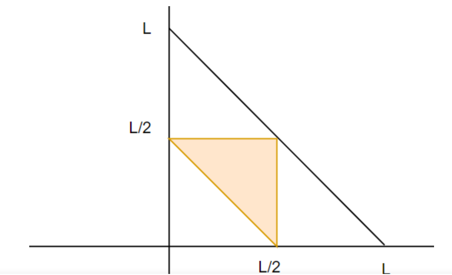
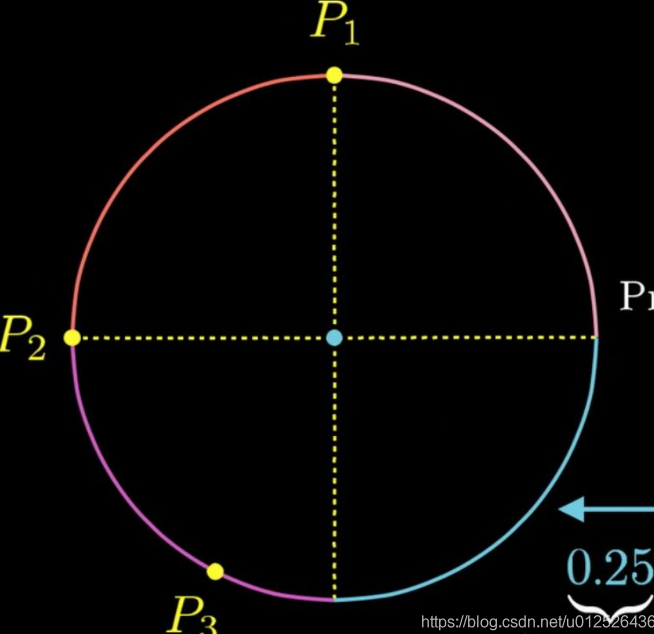
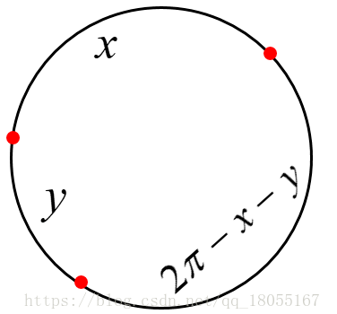
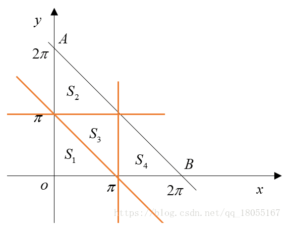

- [智力题](#智力题)
    - [1. 扔鸡蛋 [扔铁球]](#1-扔鸡蛋-扔铁球)
    - [2. 白鼠试毒药问题](#2-白鼠试毒药问题)
    - [3.](#3)
    - [4. 先手必胜策略问题：](#4-先手必胜策略问题)
    - [5. 蚂蚁爬树问题](#5-蚂蚁爬树问题)
    - [6. 瓶子换饮料问题](#6-瓶子换饮料问题)
    - [7. 在24小时里面时针分针秒针可以重合几次](#7-在24小时里面时针分针秒针可以重合几次)
    - [8. 找砝码问题](#8-找砝码问题)
    - [9. 找砝码问题2](#9-找砝码问题2)
    - [10. 生成随机数问题：](#10-生成随机数问题)
    - [11.赛马问题：](#11赛马问题)
    - [赛马II](#赛马ii)
    - [12. 烧香/绳子/其他时间问题](#12-烧香绳子其他时间问题)
    - [13. 掰巧克力问题 / 辩论问题](#13-掰巧克力问题--辩论问题)
    - [16. 倒水问题](#16-倒水问题)
    - [17. 老虎吃羊问题](#17-老虎吃羊问题)
  - [18. 灯泡开关问题](#18-灯泡开关问题)
- [概率题](#概率题)
    - [1. 一根木棒，截成三截，组成三角形的概率](#1-一根木棒截成三截组成三角形的概率)
    - [3. 蚂蚁不相撞的概率](#3-蚂蚁不相撞的概率)
    - [5. 随机数生成](#5-随机数生成)
    - [6. 随机数生成 II](#6-随机数生成-ii)
    - [7. 真假硬币](#7-真假硬币)
    - [8. 一副扑克牌，平均分成三堆，大小王分在同一堆的概率是多大？](#8-一副扑克牌平均分成三堆大小王分在同一堆的概率是多大)
    - [10. 从一副52张扑克牌中随机抽两种，颜色相等的概率](#10-从一副52张扑克牌中随机抽两种颜色相等的概率)
    - [11.  54张牌，分成6份，每份9张牌，大小王在一起的概率](#11--54张牌分成6份每份9张牌大小王在一起的概率)
    - [12. 52张牌去掉大小王，分成26*2两堆，从其中一堆取4张牌为4个a的概率](#12-52张牌去掉大小王分成262两堆从其中一堆取4张牌为4个a的概率)
    - [13. 一枚硬币，扔了一亿次都是正面朝上，再扔一次反面朝上的概率是多少](#13-一枚硬币扔了一亿次都是正面朝上再扔一次反面朝上的概率是多少)
    - [14. 1个硬币抛了10次，8次为正，2次为反，求第11次抛硬币为正的概率](#14-1个硬币抛了10次8次为正2次为反求第11次抛硬币为正的概率)
    - [15. 有8个箱子，现在有一封信，这封信放在这8个箱子中（任意一个）的概率为4/5,不放的概率为1/5](#15-有8个箱子现在有一封信这封信放在这8个箱子中任意一个的概率为45不放的概率为15)
    - [16. 一对夫妻有2个孩子，求一个孩子是女孩的情况下，另一个孩子也是女孩的概率](#16-一对夫妻有2个孩子求一个孩子是女孩的情况下另一个孩子也是女孩的概率)
    - [17. 癌症误诊率](#17-癌症误诊率)
    - [18. 肇事车辆](#18-肇事车辆)
    - [19. 飞机选座位](#19-飞机选座位)
    - [20. 一个国家重男轻女，只要生了女孩就继续生，**直到生出男孩为止**，问这个国家的男女比例？](#20-一个国家重男轻女只要生了女孩就继续生直到生出男孩为止问这个国家的男女比例)
    - [21. 有50个红球，50个蓝球，如何放入两个盒子中使得拿到红球的概率最大](#21-有50个红球50个蓝球如何放入两个盒子中使得拿到红球的概率最大)
    - [22. 某个函数f返回值为0/1，0返回的概率为p，写一函数返回0/1概率相等](#22-某个函数f返回值为010返回的概率为p写一函数返回01概率相等)
    - [23. 利用X等概率生成1-n的数](#23-利用x等概率生成1-n的数)
    - [24. 一个硬币，如何构建事件，使得事件发生的概率为2/3](#24-一个硬币如何构建事件使得事件发生的概率为23)
    - [25. 计算圆周率π的值](#25-计算圆周率π的值)
    - [26. 给一串float型的数, 采样概率计算](#26-给一串float型的数-采样概率计算)
    - [27. 前后向读书](#27-前后向读书)
    - [28. 圆上三个点形成钝角的概率](#28-圆上三个点形成钝角的概率)
    - [29. X Y独立服从(0,1)上的均匀分布](#29-x-y独立服从01上的均匀分布)
    - [30. 圆上三个点形成锐角的概率](#30-圆上三个点形成锐角的概率)
  - [抛硬币问题](#抛硬币问题)
    - [1. 两人轮流抛硬币问题](#1-两人轮流抛硬币问题)
    - [2. 三人循环抛硬币问题](#2-三人循环抛硬币问题)
    - [3. 连续两次正面就停止](#3-连续两次正面就停止)
  - [掷色子问题](#掷色子问题)
    - [1. 最多扔两次骰子，求最大点数的数学期望](#1-最多扔两次骰子求最大点数的数学期望)
    - [2. 商家顾客扔色子](#2-商家顾客扔色子)
  - [袋子摸球问题](#袋子摸球问题)
    - [1. 100个黑球和100个白球，每次随机拿出两个丢掉](#1-100个黑球和100个白球每次随机拿出两个丢掉)
    - [员工生日问题](#员工生日问题)
    - [数据流问题](#数据流问题)
  - [有车通过问题](#有车通过问题)
    - [公路有车通过概率问题](#公路有车通过概率问题)
    - [车站有车通过的概率](#车站有车通过的概率)
    - [三个范围在0-1的数，和也在0-1的概率](#三个范围在0-1的数和也在0-1的概率)
    - [三个范围在0-1的数，平方和也在0-1的概率](#三个范围在0-1的数平方和也在0-1的概率)
    - [9. 圆周率里面是否可以取出任意数字？](#9-圆周率里面是否可以取出任意数字)


https://www.mmbyte.com/article/156114.html


https://www.nowcoder.com/discuss/400248

https://www.nowcoder.com/discuss/428774?type=2&channel=&source_id=1_post


## 智力题
#### 1. 扔鸡蛋 [扔铁球]
100层楼，只有2个鸡蛋，想要判断出那一层刚好让鸡蛋碎掉，给出策略（滴滴笔试中两个铁球跟这个是一类题）
* （给定了楼层数和鸡蛋数的情况）二分法+线性查找  从100/2=50楼扔起，如果破了就用另一个从0扔起直到破。如果没破就从50/2=25楼扔起，重复。
* 动态规划
* 
#### 2. 白鼠试毒药问题
1000瓶水，其中有一瓶可以无限稀释的毒药，要快速找出哪一瓶有毒，需要几只小白鼠
用二进制的思路解决问题。2的十次方是1024，使用十只小鼠喝一次即可。方法是先将每瓶水编号，同时10个小鼠分别表示二进制中的一个位。将每瓶水混合到水瓶编号中二进制为1的小鼠对应的水中。喝完后统计，将死亡小鼠对应的位置为1，没死的置为0，根据死亡小鼠的编号确定有毒的是哪瓶水，如0000001010表示10号水有毒。

> 把老鼠当做10个bit位就行了，可以编码出2^10=1024种喝法，同时把药水编号成为1-1000，凡是编码的2进制编码为1的位值，就要让对应老鼠喝对应号的药水，然后一周后直接通过对应10位bit数得到有毒药水数
> 10只老鼠按顺序排好，每桶酒按照编号转换成二进制，给相应位置上是1的老鼠喝。最后按死掉的老鼠是哪几只，然后排成二进制，再转成十进制就是第几桶酒。
比如：第70桶酒，70转换成二进制就是0001000110，那么就给第四、八、九只老鼠喝。如果最后死掉第三、七、八只老鼠，那么就是0010001100，转换成十进制就是140，即140桶酒有毒。
#### 3.  
#### 4. 先手必胜策略问题：
**100本书，每次能够拿1-5本，怎么拿能保证最后一次是你拿**

寻找每个回合固定的拿取模式。最后一次是我拿，那么**上个回合最少剩下6本**。那么只要保持每个回合结束后都剩下6的倍数，并且在这个回合中我拿的和对方拿的加起来为6（这样这个回合结束后剩下的还是6的倍数），就必胜。

**关键是第一次我必须先手拿（100%6=4）本（这不算在第一回合里面）**。


#### 5. 蚂蚁爬树问题
>放n只蚂蚁在一条树枝上，蚂蚁与蚂蚁之间碰到就各自往反方向走，**问总距离或者时间**。

**碰到就当没发生，继续走，相当于碰到的两个蚂蚁交换了一下身体**。

其实就是每个蚂蚁从当前位置一直走直到停止的总距离或者时间。
  
  
  
#### 6. 瓶子换饮料问题
> 1000瓶饮料，3个空瓶子能够换1瓶饮料，问最多能喝几瓶？


拿走3瓶，换回1瓶，相当于减少2瓶。但是**最后剩下4瓶的时候例外，这时只能换1瓶**。

所以我们计算1000减2能减多少次，直到剩下4.（1000-4=996，996/2=498）所以1000减2能减498次直到剩下4瓶，最后剩下的4瓶还可以换一瓶，

**所以总共是1000+498+1=1499瓶**。


#### 7. 在24小时里面时针分针秒针可以重合几次
24小时中时针走2圈，而分针走24圈，时针和分针重合24-2=22次，而只要时针和分针

忽略秒针重合次数，漏桶原理，决定结果的是转动次数最少的


#### 8. 找砝码问题
> 有一个天平，九个砝码，一个轻一些，用天平至少几次能找到轻的？

至少2次：第一次，一边3个，哪边轻就在哪边，一样重就是剩余的3个；

**第二次，一边1个，哪边轻就是哪个，一样重就是剩余的那个**；


#### 9. 找砝码问题2 
> 有十组砝码每组十个，每个砝码重10g，其中一组每个只有9g，有能显示克数的秤最少几次能找到轻的那一组砝码？

砝码分组1~10，第一组拿一个，第二组拿两个以此类推。。第十组拿十个放到秤上称出克数x，则y = 550 - x，第y组就是轻的那组

**累加后得到重量梯度**

#### 10. 生成随机数问题：
> 给定生成1到5的随机数Rand5()，如何得到生成1到7的随机数函数Rand7()？
思路：由大的生成小的容易，比如由Rand7()生成Rand5()，所以我们先构造一个大于7的随机数生成函数。
记住下面这个式子：
```
RandN^2()= N( RandN()-1 ) + RandN() ;// 生成1到N^2之间的随机数
可以看作是在数轴上撒豆子。N是跨度/步长，是RandN()生成的数的范围长度，RandN()-1的目的是生成0到N-1的数，是跳数。后面+RandN()的目的是填满中间的空隙
```
比如` Rand25= 5( Rand5()-1 ) + Rand5()`可以生成1到25之间的随机数。我们可以只要1到21（3*7）之间的数字，所以可以这么写 
`(RandX - 1)* Y + RandY() -> [1, X*Y]`


```
int rand7(){
  int x=INT_MAX;
  while(x>21){
    x=5*(rand5()-1)+rand5();
  }
  return x%7+1;
}
```
#### 11.赛马问题：
> 有25匹马，每场比赛只能赛5匹，至少要赛多少场才能找到最快的3匹马？
* 第一次，分成5个赛道ABCDE，每个赛道5匹马，每个赛道比赛一场，每个赛道的第12345名记为 A1,A2,A3,A4,A5  B1,B2,B3,B4,B5等等，这一步要赛5场。 
* 第二次，我们将每个赛道的前三名，共15匹。分成三组，然后每组进行比赛。这一步要赛3场。
* 第三次，我们取每组的前三名。共9匹，第一名赛道的马编号为1a,1b,1c，第二名赛道的马编号为2a,2b,2c，第三名赛道的马编号为3a,3b,3c。这时进行分析，1a表示第一名里面的第一名，绝对是所有马中的第一，所以不用再比了。2c表示第二名的三匹里头的最后一匹，3b和3c表示第三名里面的倒数两匹，不可能是所有马里面的前三名，所以也直接排除，剩下1b,1c,2a,2b,,3a，共5匹，再赛跑一次取第一第二名，加上刚筛选出来的1a就是所有马里面的最快3匹了。这一步要赛1场。
* 所以一共是5+3+1=9场。

#### 赛马II


思考题：64匹马，8个跑道，选跑最快的4匹马需要比赛多少次。
( 锦标赛排序算法 ) sum = 11
- 第一步：首先每8匹马跑一次，总共需要8次，假设结果中A1>A2>A3>......,B1>B2>B3>....等。 sum=8；
- 第二步：这8组中的第一名拉出来跑一次，那么这次最快的是总的第一名，假设是A1，同时假设B1>C1>D1。这时还要角逐2,3,4名， 那这一轮中的第五到第八组都可以直接舍弃 ，因为他们所有的马一定进不了前4名。sum=9。

- 第三步：从A组中选A2，A3，A4，B组中B1，B2，B3，C组中C1，C2，D组中D1，这些才有资格角逐2,3,4名。这时需要再比赛两次。 sum=11。（但是如果第10轮选择A4不上场，如果A3获得了第4名，那么A4就不需要比赛了，这样 sum=10 ）

#### 12. 烧香/绳子/其他时间问题 
> 确定时间问题：有两根不均匀的香，燃烧完都需要一个小时，问怎么确定**15分钟的时长**？ 

*本质在求中点/1/4分位*

（说了求15分钟，没说开始的15分钟还是结束的15分钟，这里是可以求最后的15分钟）

点燃一根A，同时点燃另一根B的两端，当另一根B烧完的时候就是半小时，这是再将A的另一端也点燃，从这时到A燃烧完就正好15分钟。

#### 13. 掰巧克力问题 / 辩论问题
> N*M块巧克力，每次掰一块的一行或一列，掰成1*1的巧克力需要多少次？（1000个人参加辩论赛，1V1，输了就退出，需要安排多少场比赛）

每次拿起一块巧克力，掰一下（无论横着还是竖着）都会变成两块，因为所有的巧克力共有N\*M块，所以要掰N\*M-1次，-1是因为最开始的一块是不用算进去的。

每一场辩论赛参加两个人，消失一个人，所以可以看作是每一场辩论赛减少一个人，直到最后剩下1个人，所以是1000-1=999场。


#### 16. 倒水问题

> 水无限。3L和5L水桶各一个，怎样取4L的水？——字节跳动、腾讯、美团等

- 5倒满，5倒满3，3倒出，5剩余2L水倒入3，5加满倒入3就完成 （5L桶里面有4L水）

#### 17. 老虎吃羊问题

> 岛上有**100只老虎和1只羊**，老虎可以吃草但是更愿意吃羊。
假设A: 每次老虎吃完羊之后自己就变成了羊
假设B: **所有老虎都很聪明也很理性，它们都想活下去**
请问这只羊会被吃吗? ——字节跳动

- 答案：**不会被吃**。

> 我们先从1只老虎开始分析，如果只有一只老虎，那它一定会吃羊。因为就算吃完变成羊它也不用担心自己被吃掉。
如果岛上有两只老虎的话，那羊不会被吃掉，因为如果其中一只老虎吃掉羊之后自己就会变成羊被另一只老虎吃掉。
如果岛上有三只老虎，羊会被吃掉。因为一旦有一只最聪明的老虎吃掉羊之后，那只老虎自己变成羊，就变成了刚才所分析的2虎1羊的局面，剩下的2只老虎不敢吃掉变成羊的那只老虎。
如果岛上有4只老虎，羊不会被吃掉，因为一旦有一只虎吃掉羊，就会变成刚刚3虎1羊的局面，那只老虎变成的羊就会被吃掉。

以此类推，**如果老虎的数量是偶数，羊不会被吃掉，如果老虎的数量是奇数，羊就会被吃掉**。

### 18. 灯泡开关问题

> **一个圆环上有 100 个灯泡**，灯泡有亮和暗两种状态。按一个灯泡的开关可以改变它和与它相邻两个灯泡的状态。
设计一种算法，对于任意初始状态，使所有灯泡全亮


将灯泡编号 1 ~ 100
1. **步骤一：将灯泡变为全亮或只剩一个为暗**
从 1 循环到 98 ，**遇到暗的则按它下一个，使之变亮**。循环完毕，1 ~ 98 必然全亮。99 和 100可能为亮亮、暗亮、亮暗、暗暗四种状态。
若为亮亮，皆大欢喜，满足题目要求
暗亮、亮暗，达到只剩一个为暗的状态；
若为暗暗。则按下编号 100 的灯泡，使编号 99 、100 变为亮，编号 1 的灯泡变为暗，从而达到只剩一个为暗的状态。

2. **步骤二：将灯泡变为全暗**
由于灯泡环形摆放，我们指定暗的灯泡编号为 1 ，将剩下 99 个亮着的灯泡每 3 个为一组。按下每组中间的灯泡后，使得所有灯泡变为暗。

3. **步骤三：将灯泡变为全亮**
**将所有灯泡按一下**，灯泡变为全亮

**状态转换分析**：

- **全暗 <=> 全亮**。全暗和全亮状态可以相互转化，方法就是将每个灯泡按一次。**这样每个灯泡都被改变了 3 次状态**，使得全暗变为全亮，全亮也可变为全暗。
- **剩一个为暗 <=> 剩两个相邻为暗**。剩一个为暗时，按下该灯泡左右任意一个，就变成了剩两个相邻为暗的状态；剩两个相邻为暗时，按下第二个暗，便可变成了剩一个为暗的状态。


扩充： 圆环中共有N个灯泡

N 个灯泡做分类讨论。
1. **N = 3*k+1** 一定可以。方法与上述步骤相同，在步骤二中可以将3k个亮的灯泡分为k组。
2. **N = 3*k+2**一定可以。将上述步骤一目标状态的只剩一个为暗改成剩两个相邻为暗，其余 3 * k 个灯泡分组按即可。因为，对于任意只剩一个为暗的状态，按下该灯泡左右任意一个就可以变成剩两个相邻为暗的状态！
3. **N = 3*k不一定**。如果经过上述步骤一可以将灯泡变成全亮的状态则有解；否则，无解。（该结论有待证明）


## 概率题
- https://www.nowcoder.com/discuss/346845?order=0&page=1&pos=6&type=0
- https://blog.csdn.net/csuzhaoqinghui/article/details/52107478
#### 1. 一根木棒，截成三截，组成三角形的概率

设第一段截 x，第二段截 y，第三段 1 - x - y。

考虑所有可能的截法。可能的截法中必须保证三条边都是正数且小于原来边长，则有 0 < x < 1，0 < y < 1，0 < 1 - x - y < 1。

画图可知，(x, y) 必须在单位正方形的左下角的半个直角三角形里，面积为 1 / 2。

然后考虑能形成三角形的截法。首先要满足刚才的三个条件：

0 < x < 1

0 < y < 1

0 < 1 - x - y < 1

 

然后必须符合三角形的边的要求，即两边之和大于第三边：

x + y > 1 - x - y

x + 1 - x - y > y

y + 1 - x - y > x

化简即得：

0 < x < 1/2

0 < y < 1/2

1/2 < x + y < 1

**画图可知，此时 (x, y) 必须在边长为 1/2 的三角形的右上角的半个直角三角形里，面积为 1/8。于是最终概率为 (1/8) / (1/2) = 1/4**



#### 3. 蚂蚁不相撞的概率
> 一个三角形， 三个端点上有三只蚂蚁，蚂蚁可以绕任意边走，问蚂蚁不相撞的概率是多少

- 首先，每个蚂蚁在方向的选择上有且只有 2 种可能，共有 3 只蚂蚁，所以共有 2 的 3 次方种可能，而不相撞有有 2 种可能，即全为顺时针方向或全为逆时针方向。

- **不相撞概率 = 不相撞 / 全部 = 2/8 = 1/4**


#### 5. 随机数生成

> 已知一随机发生器，产生 0 的概率是 p，产生 1 的概率是 1-p，现在要你构造一个发生器，**使得它产生 0 和 1 的概率均为 1/2**（随机数生成）

- 由题目有： 0 : p 1 : 1 - p
- 连续产生两个数，其组合以及概率如下：

> 00 : p2 01 : p(1 - p) 10 : (1 - p) p 11 : (1 - p)(1 - p)

**可以发现 01 和 10 组合的概率是相等的，只需要将其分别映射到 0 和 1 即可**。

- 即每次随机产生两个数，如果组合为00或11则丢弃，若为 01 则映射到 1，若为 10 则映射到 0，这样一来产生 0 和 1 的概率均为 1 / 2 。

#### 6. 随机数生成 II  
> 已知一随机发生器，产生的数字的分布不清楚，现在要你构造一个发生器，使得它产生 0 和 1 的概率均为 1/2

- **本质上都是在人为寻找两个分布相同的状态**
- 使用该随机发生器产生随机数 a，b，有以下 3 种情况：
  - a < b
  - a == b
  - a > b
  - 其中情况（1）和（3）是对称的，发生的概率相等，只需要将这两种情况分别映射到 0 和 1 即可，其中遇到 a == b 时忽略。

- 类似问题：**一硬币，一面向上概率0.7，一面0.3，如何公平？**
  - 抛两次， 正反 A胜， 反正 B胜

#### 7. 真假硬币
> N枚真硬币是一面图案一面字，M枚假硬币是两面图案，选了一枚抛K次都是图案，问是**真硬币的概率**

- 考察**贝叶斯公式**
- `P(A|B) = P(A)P(B|A) / P(B);`
- 给定分布下：真硬币的概率`P(B｜A)  = m/(m+n)`   
- 真硬币分布： P(B) = 0.5^K
- 分布为：  `0.5^K * m/(m+n) + n/(m+n)` 真硬币的分布+假硬币的分布 `P(B) = P(A|B) + P(F|B)` 给定结果下的假设
-  `0.5^K * m/(m+n)`  /`0.5^K * m/(m+n) + n/(m+n)` =  **`m/(m+n*2^K)`**
- **公式详情：**
  - $P(A) = \frac{n}{m+n}$ 真币
  - $P(B)$ 连续出现图案的概率
  - $P(B|A) = 0.5^K$ 真币情况下连续出现图案的概率
- $P(A|B) = \frac{P(A)P(B|A)}{P(A)P(B|A) + P(\hat{A})P(B|\hat{A})}$
  - $P(\hat{A})P(B|\hat{A})$即对于假币的情况下的分布，由于假币两面都是图案，所以最后条件概率为1
#### 8. 一副扑克牌，平均分成三堆，大小王分在同一堆的概率是多大？

17/53

> 问题转换： 一副扑克54张，先把大王拿出来，剩下53张牌，然后分成17，18，18 3份，求小王在17那一份的概率

> 组合数的逻辑： 分成三堆的组合数： M =C(54, (18,18,18)): 54!/(18!18!18!)
> 大小王同时在同一堆的组合数：N = C(52, (16,18,18)) : 52!/ (16! 18! 18!)
> 3 *N / M = 52!18!/ (54! 16!) = 3 * 17 * 18/ (53 * 54) =  **17/53**

#### 10. 从一副52张扑克牌中随机抽两种，颜色相等的概率
- 颜色相等的情况(2种颜色)：
  - $C(2,1)C(26,2) / C(52, 2) = 5/11$
- 花色相等的情况(4种花色)：
  - $C(4,1)C(13,2) / C(52, 2) = 4 / 17$

#### 11.  54张牌，分成6份，每份9张牌，大小王在一起的概率
8 / 53

> 问题转换： 一副扑克54张，先把大王拿出来，剩下53张牌，然后分成8，9，9, 9, 9, 9 共6份，求小王在8那一份的概率

#### 12. 52张牌去掉大小王，分成26*2两堆，从其中一堆取4张牌为4个a的概率
$\frac{2*C_{48}^{22}}{C_{52}^{26}}$

#### 13. 一枚硬币，扔了一亿次都是正面朝上，再扔一次反面朝上的概率是多少
- 频率派：0.5
- 贝叶斯派：无限接近0

#### 14. 1个硬币抛了10次，8次为正，2次为反，求第11次抛硬币为正的概率
- 使用最大似然估计：
- $L_{likelihood} = C_{10}^8 p^8(1-p)^2$
- 对`p`进行求导，得到`p=0.8`

#### 15. 有8个箱子，现在有一封信，这封信放在这8个箱子中（任意一个）的概率为4/5,不放的概率为1/5
> 现在我打开1号箱子发现是空的，**求下面7个箱子中含有这封信的概率为**？

- 利用贝叶斯公式： 
  - $P(A) = 4/5$: 箱子有信
  - $P(B)$: 1号箱子为空
- $P(A|B) = \frac{P(A)P(B|A)}{P(A)P(B|A) + P(\hat{A})P(B|\hat{A})} = \frac{4/5*7/8}{4/5*7/8+1/5*1} = 7/9$ 

#### 16. 一对夫妻有2个孩子，求一个孩子是女孩的情况下，另一个孩子也是女孩的概率
> 4种情况：男男 男女 女男 女女
- P(A)其中一个孩子是女
- P(B)另一个孩子是女
- P(B|A) = P(AB)/P(A) = 1/4 / 3/4 = 1/3 


#### 17. 癌症误诊率
> 有种癌症，早期的治愈率为0.8，中期的治愈率为0.5，晚期的治愈率为0.2.若早期没治好就会转为中期，中期没治好就会变成晚期。现在有一个人被诊断为癌症早期，然后被治愈了，问他被误诊为癌症的概率是多少？

P()


#### 18. 肇事车辆
> 某城市发生了一起汽车撞人逃跑事件，该城市只有两种颜色的车，蓝20%绿80%，事发时现场有一个目击者，他指证是蓝车，但是根据专家在现场分析，当时那种条件能看正确的可能性是80%，那么，肇事的车是蓝车的概率是多少

- P(A) 蓝车概率 P(B) 看到是蓝车
  - $P(A|B) = \frac{P(A)P(B|A)}{P(A)P(B|A) + P(\hat{A})P(B|\hat{A})}$
  - $=\frac{0.2 * 0.8}{0.2 * 0.8 + 0.8 * 0.2} = 0.5$

#### 19. 飞机选座位
> 100人坐飞机，第一个乘客在座位中随便选一个坐下，第100人正确坐到自己坐位的概率是？
>  
**0.5** 
```
等价于这个描述：2-99号乘客登机后如果发现1号(疯子)坐在本属于自己的位子上，就会请疯子离开，然后疯子再随机找个空座。这样到100号登机时，2-99号都在自己座位上，1号疯子在自己座位上和100号乘客座位上概率相同，所以是1/2。另外这个结果和总乘客数无关，可以由100推广至任意k
```


#### 20. 一个国家重男轻女，只要生了女孩就继续生，**直到生出男孩为止**，问这个国家的男女比例？

**每个家庭女孩数量的期望设为E(X)。**

假如第一个孩子是男孩（1/2的概率），停止生小孩，这时女孩总数为0；
假如第一个孩子是女孩（也是1/2的概率），相当于回到了起始点，之后的女孩总数期望还是E(X)，加上已经生的第一个女孩，故而女孩的总数期望变为了1+E(X)，最终可得：
$E(X)=0.5∗0+0.5∗(E(X)+1)$
$E(X)=1$

#### 21. 有50个红球，50个蓝球，如何放入两个盒子中使得拿到红球的概率最大

两个箱子概率是1/2，选中某个箱子后又有选择的是不是红球的概率，所以最大概率就是**一个红球放在一个箱子里，其余的99个球全放到另一个箱子**。

这样概率=0.5+0.5*（49/99）约等于0.75，这样为最大概率。

#### 22. 某个函数f返回值为0/1，0返回的概率为p，写一函数返回0/1概率相等
- 拒绝采样： 拒绝率： $2p(1-p)$
- 调用两次f，**当返回值不等时进行返回**
```
def g():
	while 1:
		a = f()
		b = f()
		if a！=b:
			return a
```

#### 23. 利用X等概率生成1-n的数
> X是一个以p的概率产生1,1-p的概率产生0的随机变量，利用X等概率生成1-n的数
- 先构建等概率生成0/1的函数
- 然后再重复调用p次，构成n对应的p个位置
```python
def random01():
	a = random()
	b = random()
	if a!=b:
		return a
	else:
		return random01()


def randomN(n):
	num = math.ceil(math.log(n,2))
	res = ''
	for _ in range(num):
		res += random01()
	res = int(res,2)
	if res >= n:
		return randomN(n)
	return res+1
```

#### 24. 一个硬币，如何构建事件，使得事件发生的概率为2/3

- 抛两次硬币，如果两次都是正面，就重新抛两次，这样都是反面的概率就是1/3
  - 如果是正反面的话，就是2/3
- 可以理解为00、01、10、11把11的情况去除了

#### 25. 计算圆周率π的值
- 通过采样方式实现
长为2的正方形，内切圆半径为1，往正方形里面随机投点，假设投了N次，有M次是在圆里面，则有
**M/N= \phi / 4**

#### 26. 给一串float型的数, 采样概率计算
> 给一个概率分布均匀的随机数发生器，给一串float型的数，希望通过这个随机数发生器实现对这串数进行随机采样，要求是如果其中的某个数值越大，那么它被采样到的概率也越大

**sigmoid函数**

$1/(1+e^x)$

#### 27. 前后向读书
> 一本无数个字的书从前往后读，某个时间点突然暂停并返回之前读过的某个字，要求每个字返回的概率是一样的

#### 28. 圆上三个点形成钝角的概率
> 一个圆上三个点形成钝角的概率是多少？假如两个点和圆心形成的圆心角已经是直角，那么第三个和这两个点形成钝角的概率是多少

- 只要三个点在半圆弧范围以内,就构成钝角三角形,而不在半圆弧范围以内,就构不成钝角三角形, **所以构成钝角三角形的概率是3/4**
- 当圆心角为直角时， 钝角的概率为3/4



#### 29. X Y独立服从(0,1)上的均匀分布
> P(x^2 + y^2 <= 1)等于
- 1/4*pi
- 1/4圆面积


#### 30. 圆上三个点形成锐角的概率
- https://blog.csdn.net/qq_18055167/article/details/82924726?utm_medium=distribute.pc_relevant.none-task-blog-2%7Edefault%7EBlogCommendFromMachineLearnPai2%7Edefault-3.control&depth_1-utm_source=distribute.pc_relevant.none-task-blog-2%7Edefault%7EBlogCommendFromMachineLearnPai2%7Edefault-3.control

这时，根据圆周角与所夹弧长的关系可以把该问题转化为几何概型：

- 三角形为锐角三角形的充要条件是三条弧长都小于π \piπ；
- 三角形为直角三角形的充要条件是三条弧长只有一条等于π \piπ；
- 三角形为钝角三角形的充要条件是三条弧长只有一条大于π \piπ。


- 三角形AOB所围成区域的点集表示了全概率空间
- $S_3$表示组成锐角三角形时间： $1/4$
- 直角三角形： 即三条黄线再AOB中所阶段线段的长度： 0
- 钝角三角形为 S_1 + S_2 + S_4 = $3/4$


### 抛硬币问题
#### 1. 两人轮流抛硬币问题
>  有一苹果，两个人抛硬币来决定谁吃这个苹果，先抛到正面者吃。问先抛这吃到苹果的概率是多少?

结果： **2/3**

- 可以计算先手者在不同次数上的尝试情况： 第一次： 1/2 第三次 (1/2)^3 第五次 (1/2)^5 ...
- 各种情况加和得到： 等比数列求和的极限： $1/2 *(1-(1/4)^n)/(1-1/4) = 2/3$


其他解释：
- 每一轮 抛硬币，A先抛赢得概率是1/2，B后抛赢得概率是（1/2）*（1/2）= 1/4。
- 那么 **每一轮A赢得概率都是B赢得概率的2倍**，总概率为1,所以A赢的概率是2/3
  - **x + 0.5x = 1**

#### 2. 三人循环抛硬币问题
> a b c 分别循环投掷硬币，**直到正面出现胜利**，求a b c获胜的概率

- P(B) = 1/2*P(A); P(C) = 1/4 * P(A); 
- P(A) + P(B) + P(C) = 1;
结果得:
- P(A) = 4/7, P(B) = 2/7, P(C) = 1/7

#### 3. 连续两次正面就停止
> 硬币正反概率是1/2,一直抛硬币,直到连续两次正面停止，问期望次数
- 首先先抛一枚硬币，如果是花，那么需要重头开始；
- 如果是字，那么再抛一枚硬币，
  - 新抛的这枚如果也是字，则游戏结束，
  - 如果是花，那么又需要重头开始。

- 公式表示为： 期望E
  - `E = 1 + 0.5*E + 0.5(1 + 0.5*E + 0.5*0)`
  - `E = 6`
### 掷色子问题
#### 1. 最多扔两次骰子，求最大点数的数学期望
> **最多扔两次骰子**,第一次扔完可以自行决定要不要扔第二次，**取最后一次扔色子的结果为准**，求：尽可能得到最大点数的数学期望


- 当顾客第一次扔到 1，2，3 的时候他会选择继续扔第二次，
- 这时候期望变为 1/6 (4 + 5 + 6) + 1/2 (1/6 (1 + 2 + 3 + 4 + 5 + 6)) = 4.25

#### 2. 商家顾客扔色子
商家发明一种扔筛子游戏，顾客扔到多少点就得到多少钱，但扔筛子之前顾客需要付一定数量的钱 x，假设商家和顾客都足够聪明
>（1）顾客付一次钱可以扔一次的情况下，顾客能接受的最大 x 是多少
（2）现在规则改为顾客付一次钱可以扔两次，顾客扔了第一次之后可以选择是否继续扔第二次，如果扔了第二次则以第二次的结果为准，如果没有扔第二次就以第一次的结果为准，这时顾客能接受的最大 x 为多少。


- 第一问：**可以直接算顾客收益的期望**为 1/6 (1 + 2 + 3 + 4 + 5 + 6) = 3.5，顾客能接受的最大 x 就是他收益的期望值。

- 第二问：考虑顾客什么情况下会扔第二次，**就是扔第二次得到钱变多的概率相对较大的时候**，那么**当顾客第一次扔到 1，2，3 的时候他会选择继续扔第二次**，则这时候期望变为 1/6 (4 + 5 + 6) + 1/2 (1/6 (1 + 2 + 3 + 4 + 5 + 6)) = 4.25

### 袋子摸球问题
#### 1. 100个黑球和100个白球，每次随机拿出两个丢掉
> 如果丢掉的是不同颜色的球，则从其他地方补充一个黑球到袋子里，如果颜色相同，则补充一个白球到袋子里。问：**最后一个球是黑球和白球的概率分别为多大**？

- 使用`(黑球个数, 白球个数)`来表示桶中黑球和白球的个数变动，正数表示增加，负数表示减
1. 如果每次从桶里面拿出两个白球，则应放入一个黑球：(0, -2) + (1, 0) = (1, -2)；
2. 如果每次从桶里面拿出两个黑球，则应放入一个黑球：(-2, 0) + (1, 0) = (-1, 0)；
3. 如果每次从桶里面拿出一个白球和一个黑球，则应放入一个白球：(-1, -1) + (0, 1) = (-1, 0)；

从以上各种情况可以看出以下规律：
1）每次都会减少一个球，那么最后的结果肯定是桶内只剩一个球，要么是白球，要么是黑球；
2）每次拿球后，白球的数目要么不变，要么两个两个地减少；

因此， **最后不可能只剩下一个白球，那么必然就只能是黑球**了


#### 员工生日问题
> 只要有一个员工过生日，当天所有员工全部放假一天。但在其余时候，所有员工都没有假期，必须正常上班。这个公司需要雇用多少员工，才能让公司一年内所有员工的总工作时间期望值最大？

- n个员工，工作的概率为$\frac{364}{365}^n$
- 期望值公式为$E = 365 * n * {\frac{364}{365}}^n$
- 取对数： $lnE = n * ln(\frac{364}{365}) + ln n$
  - 对n求偏导：$ln(364/365) + 1/n$ 
  - $n = 364.5$**所以可以雇佣 365个人**


#### 数据流问题
> 有一个很大很大的输入流，大到没有存储器可以将其存储下来，而且只输入一次，如何从这个输入流中随机取得m个记录;
> 即如何实现从输入流中**获得这 n 个等概率的随机数据**
- 开一个m大的数组a[m]，前m个记录存入这个数组中。
- 往后的记录采用这种**取舍策略**：
  - 假设为第p个，p是大于m的，在[0，p）间产生一个随机数r，如果r<m，那么a[r] = 第p个记录，反之抛弃这个记录

### 有车通过问题
#### 公路有车通过概率问题
>  某段公路上1小时有车通过的概率是0.96，半小时有车通过的概率是多少

- 1个小时内有车通过的概率是0.96，那么**一个小时内没有车通过的概率是0.04**
- 在连续的两个30分钟里面都没有出现任何车辆的概率为`x`：
  - $x^2 = 0.04$
  - $x = 0.2$
- **半个小时内出现车辆的概率为 0.8**

#### 车站有车通过的概率
> 一个公交站在1分钟内有车经过概率是p，问3分钟内有车经过概率

$1 - (1-p)^3$
#### 三个范围在0-1的数，和也在0-1的概率
> 三个范围在0-1的数，和也在0-1的概率
$x + y + z <= 1$
- 对应在空间中为三角锥体： $1*1*1/2*1/3 = 1/6$
- 概率为1/6

#### 三个范围在0-1的数，平方和也在0-1的概率
- 球的体积/正方体的体积：
  - $\frac{4}{3}\pi\frac{1}{2}^3$ = $\frac{1}{6}\pi$ 


#### 9. 圆周率里面是否可以取出任意数字？

因为圆周率是无理数
而无理数是无限并且不循环的
所以会包含所有的数字组
