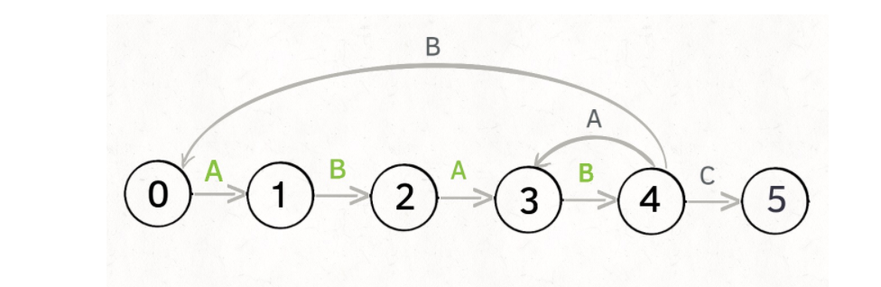
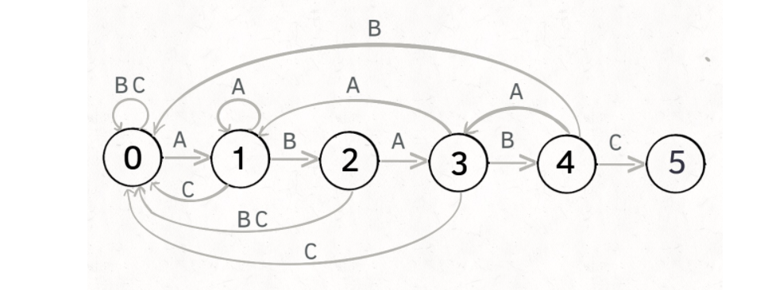
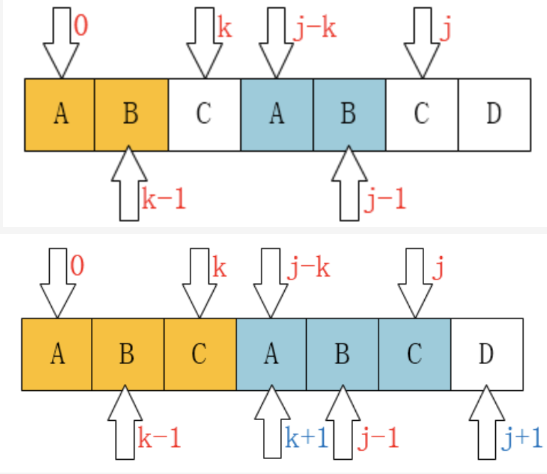
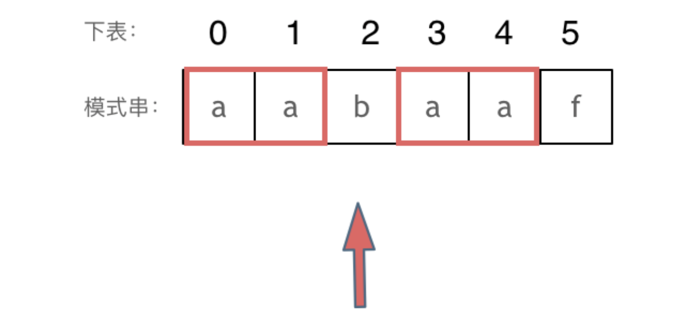

- [字符串匹配问题](#字符串匹配问题)
  - [KMP算法理解与实现](#kmp算法理解与实现)
    - [1. 思想/定义](#1-思想定义)
    - [KMP算法理解-通俗版*](#kmp算法理解-通俗版)
    - [3. 标准算法定义理解](#3-标准算法定义理解)
    - [4. 标准代码实现](#4-标准代码实现)
    - [28. 实现strStr() 子串匹配查找 *](#28-实现strstr-子串匹配查找-)
    - [459. 重复的子字符串](#459-重复的子字符串)
    - [796. 旋转字符串](#796-旋转字符串)


# 字符串匹配问题
主要利用C++中的查找api **find()**  
或者**手写复现KMP算法**来进行更高效的匹配

## KMP算法理解与实现
### 1. 思想/定义
**当出现字符串不匹配时，可以记录一部分之前已经匹配的文本内容，利用这些信息避免从头再去做匹配。**

```
要在文本串：aabaabaafa 中查找是否出现过一个模式串：aabaaf。
```
- 两个字符串进行匹配，定义**主串(query)和模式串(pattern)**， 确定主串是否包含模式串
- 如何减少暴力搜索的匹配次数是KMP要解决的问题：
  - 通过**调整模式串的移动方式来避免重复的移动**
  - KMP算法的关键就在于如何设计模式串的移动/匹配规则
### KMP算法理解-通俗版*
https://leetcode-cn.com/problems/implement-strstr/solution/kmp-suan-fa-xiang-jie-by-labuladong/


- 基于有限状态机进行理解：pat： `ABABC` 当匹配到不同的主串字符时的移动情况，可以用下面的状态转移图表示



- 那么如果构建这样的状态图呢？**关键在于当前状态如何回退**，正常情况下往下遍历很简单，但是当出现不匹配时如何进行有效的回退，也就是状态转移图中的返回。
- 基于标准代码进行分析：
  - 暴力法中的回退法则就是遇到不相等的字符就从模式串头部开始遍历，也就是所有字符都是`next[i] = 0`
  - 这里用next[i] 表示**如果出现模式串`p[i]!=T[j]`时，下一个回退的位置**
  - 基本情况： 
    - 当在模式串第一个字符就不等时， **这时模式串无法回退，应该是主串指针后移**， 设置特殊状态：`next[0] = -1`表示主串后移
  - 
  - 那么更通用的情况下：当前位置的前一位置[i-1]的回退位置为k，如果模式串p[k+1]==p[j], 那么当前回退位置就是k + 1，即`next[i] = k + 1`
  - 若模式串`p[k+1]!=p[j]`,那么这里就要往前回退，`k = next[k]`，寻找最优的前缀
  - **整个过程是在寻找最长前后缀长度，但利用上面的分析过程会更容易理解整个实现过程**
```c++
vector<int> getNext(string ps) {
    vector<int> next(ps.size(), -1);
    for (int i = 1; i < ps.size(); i++) {
        int k = next[i - 1];
        while (k != -1 && ps[k + 1] != ps[i]) {
            k = next[k];
        }
        if (ps[k + 1] == ps[i]) {
            next[i] = k + 1;
        }
    }
    return next;
}
```
### 3. 标准算法定义理解
- **`前缀表`**： next数组 用于记录回退位置，**记录了模式串与主串(文本串)不匹配的时候，模式串应该从哪里开始重新匹配**
  - 记录下标i之前（包括i）的字符串中，有**多大长度的相同前缀后缀** （最长相等前后缀/最长公共前后缀）模式串aabaaf
  - **`前缀`**是指不包含最后一个字符的所有以第一个字符开头的连续子串。
    - `a aa aab aaba aabaa`
  - **`后缀`**是指不包含第一个字符的所有以最后一个字符结尾的连续子串
    - `abaaf baaf aaf af f`
  - 如下图，前五个元素构成的子串的最长公共前后缀长度为2

- 前缀表的使用： 找到的不匹配的位置， 那么此时我们要看它的前一个字符的前缀表的数值是多少。
  - 为什么要前一个字符的前缀表的数值？ 
  - 因为要找前面字符串的最长相同的前缀和后缀，所以要看前一位的前缀表的数值。
  - 代码中`query[i] != pattern[j+1] => j = next[j]`
- 前缀表计算；next

```c++
vector<int> getNext(string ps) {
    vector<int> next(ps.size(), -1); // 初始化首字符回退-1 设为0也可
    for (int i = 1; i < ps.size(); i++) {// 从1开始 即第二个开始搜索；
        int k = next[i - 1]; // k来表示后缀串的开端
        while (k != -1 && ps[k + 1] != ps[i]) { // 当前后缀不等时，进行回退
            k = next[k];
        }
        if (ps[k + 1] == ps[i]) {// 找到相同的前后缀，进行记录
            next[i] = k + 1;
        }
    }
    return next;
}
```

### 4. 标准代码实现

- 完整KMP代码如下： **建议全文背诵**
    - 匹配过程与取next过程基本一致，按照相同逻辑进行模式串回退即可
    - 时间复杂度O(N) 空间复杂度O(N)

```c++
class Solution {
public:
    vector<int> getNext(string pat) {
        vector<int> next(pat.size(), -1);
        for (int i = 1; i < pat.size(); i++) {
            int k = next[i - 1];
            while (k != -1 && pat[k + 1] != pat[i])
                k = next[k];
            if (pat[k + 1] == pat[i]) {
                next[i] = k + 1;
            } 
        }
        return next;
    }
    int strStr(string haystack, string needle) {
        if (needle.size() == 0) return 0;
        int n = haystack.size();
        int m = needle.size();
        vector<int> next = getNext(needle);
        int j = -1;
        for (int i = 0; i < n; i++) {
            while (j != -1 && needle[j + 1] != haystack[i]) {
                j = next[j];
            } 
            if (needle[j + 1] == haystack[i]) {
                j++;  
                if (j == m - 1)
                    return (i - m + 1);
            }
        }
        return -1;
    }
};
```

### 28. 实现strStr() 子串匹配查找 *

- **KMP查找算法**，定义最大相同前后缀长度，计算子串各位置的最大前缀长度，当出现不匹配时根据最大前缀长度进行回退 时间复杂度(O(N))
- 常见面试题，需要深入了解并记住该原理，可以动态规划求解：前缀是指不包含最后一个字符的所有以第一个字符开头的连续子串；后缀是指不包含第一个字符的所有以最后一个字符结尾的连续子串
- 字符串匹配算法：还有Sunday 匹配机制相对比较简单： 

```c++
class Solution {
public:
    void get_next(vector<int> &next,string &s){
        int j=-1;
        next[0]=j;
        for(int i=1;i<s.length();i++){
            //回溯
            while(j>=0&&s[j+1]!=s[i])
            {
                j=next[j];
            }
            if(s[j+1]==s[i]){
                j++;
            }
            next[i]=j;
        }
    }
    int strStr(string haystack, string needle) {
        if(needle.length()==0) return 0;
        vector<int> next(needle.length());
        get_next(next,needle);
        int j=-1;
        for(int i=0; i<haystack.length();i++){
            int ns=0;
            while(j>=0&&haystack[i]!=needle[j+1]){
                j=next[j];
            }
            if(haystack[i]==needle[j+1]){
                j++;
            }
            
            if(j==needle.size()-1)
            return (i-needle.size()+1);
            
        }
    return -1;
    }
};
```

- 更简单的匹配方法：记录待匹配子串的位移表，即每一个在子串 中出现的字符，在子串中出现的最右位置到尾部的距离+1，即记录在匹配失败后的最小移动长度
- 在匹配失败后根据位移表，调整目标串的遍历指针位置，如果下个字符出现在子串中，根据位移表进行指针移动；否则直接将位置移动len+1个位置。
- 时间复杂度O(n)，最差情况：O(mn)
```
class Solution {
public:
    
    int strStr(string haystack, string needle) {
        if(needle.length()==0) return 0;
        unordered_map<int,int> shift;
        int len=needle.length();
        for(int i=len-1;i>=0;i--){
            if(shift.count(needle[i]))
            continue;
            shift[needle[i]]=len-i;
        }
        int ns=0;
        int start=0;
        int i=start;
        while( i<haystack.length()){
            if(haystack[i]!=needle[ns]){
                if(start+len<haystack.length()){
                    if(shift.count(haystack[start+len])){
                        start=start+shift[haystack[start+len]];
                    }else{
                        start=start+len+1;
                    }
                    i=start;
                }
                else{
                    return -1;
                }
                ns=0;
            }
            else{
                ns++;
                i++;
                if(ns==needle.length()){
                    return start;
                }
            }
        }

    return -1;
    }
};
```

### 459. 重复的子字符串
> 给定一个非空的字符串，判断它是否可以由它的一个子串重复多次构成
> 输入: "abab" 输出: True


- 可以将问题转换为**字符串匹配问题**：
  - 对于目标串s，拼接得到 s+s,**从第2个字符开始搜索**，如果还能搜索出s，说明s内部是有循环节的
- 关键点 ： **`掌握KMP算法`** **`每天看一遍`**
- 调用API实现
```c++
class Solution {
public:
    
    bool repeatedSubstringPattern(string s) {
        return (s + s).find(s, 1) != s.size() ;
    }
};
```

- 手动KMP算法实现：
  - **KMP查找算法**，定义最大相同前后缀长度，计算子串各位置的最大前缀长度，当出现不匹配时根据最大前缀长度进行回退 
  - 时间复杂度(O(N))
  - 代码结构： 
    - 构造next数组函数
    - KMP搜索
  - https://www.jianshu.com/p/dcfa55a773f0
  - https://www.cnblogs.com/yjiyjige/p/3263858.html

```c++
class Solution {
public:
    // 构造next数组
    vector<int> getNext(string ps) {
        vector<int> next(ps.size(), -1);
        for (int i = 1; i < ps.size(); i++) {
            int k = next[i - 1];
            while (k != -1 && ps[k + 1] != ps[i]) {
                k = next[k];
            }
            if (ps[k + 1] == ps[i]) {
                next[i] = k + 1;
            }
        }
        return next;
    }
    bool kmp(string query, string pattern, int beg) {
        int n = query.size();
        int m = pattern.size();
        vector<int> next = getNext(pattern);
        int k = -1;
        for (int i = beg; i < n - 1; i++) {
            while (k != -1 && pattern[k + 1] != query[i]) {
                k = next[k];
            }
            if (pattern[k + 1] == query[i]) {
                k++;
                if (k == m - 1)
                    return true;
            }
        }
        return false;
    }
    bool repeatedSubstringPattern(string s) {
        return kmp((s + s), s, 1);
    }
};
```

### 796. 旋转字符串
> 给定两个字符串, A 和 B。A 的旋转操作就是将 A 最左边的字符移动到最右边。 例如, 若 A = 'abcde'，在移动一次之后结果就是'bcdea' 。如果在若干次旋转操作之后，A 能变成B，那么返回True。

- 与[LC459题目]相似,在暴力法之外，需要考虑字符串匹配问题
- 将问题转换为 **A + A串中是否包含 B 串**
- 跟上题目一样可以使用KMP匹配算法来完成：时间复杂度 O(N) 空间复杂度 O(N)
- [优质KMP思路介绍](https://leetcode-cn.com/problems/implement-strstr/solution/kmp-suan-fa-xiang-jie-by-labuladong/)


```c++
class Solution {
public:
    vector<int> getNext(string B) {
        vector<int> next(B.size(), -1);
        for (int i = 1; i < B.size(); i++) {
            int k = next[i - 1];
            while (k != -1 && B[k + 1] != B[i]) {
                k = next[k];
            }
            if (B[k + 1] == B[i]) {
                next[i] = k + 1;
            }
        }
        return next;
    }
    bool kmp(string A, string B, int beg) {
        int n = A.size();
        int m = B.size();
        vector<int> next = getNext(B);
        int k = -1;
        for (int i = beg; i < n; i++) {
           while (k != -1 && B[k + 1] != A[i]) {
               k = next[k];
           }
           if (B[k + 1] == A[i]) {
               k++;
               if (k == m - 1)
                return true;
           }
        }
        return false;
    }
    bool rotateString(string A, string B) {
        if (A == B) return true;
        return A.size() == B.size() && kmp(A + A, B, 0);
        //return A.size() == B.size() && (A + A).find(B) < A.size();
    }
};
```


