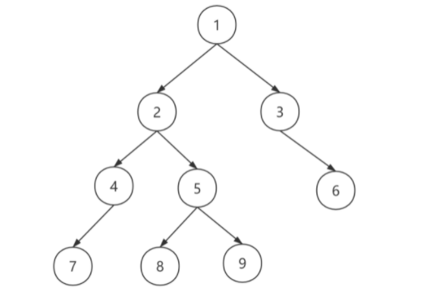

- [树结构中的指针问题](#树结构中的指针问题)
    - [剑指36. BST与双向链表](#剑指36-bst与双向链表)
    - [114. 二叉树展开为链表](#114-二叉树展开为链表)
    - [116. 填充每个节点的下一个右侧节点指针 I](#116-填充每个节点的下一个右侧节点指针-i)
    - [117. 填充每个节点的下一个右侧节点指针 II](#117-填充每个节点的下一个右侧节点指针-ii)
    - [235. 二叉搜索树的最近公共祖先](#235-二叉搜索树的最近公共祖先)
    - [236. 二叉树的最近公共祖先](#236-二叉树的最近公共祖先)
    - [补充题：二叉树的下一个节点](#补充题二叉树的下一个节点)


# 树结构中的指针问题

在刷题中二叉树等树结构是非常常见的题目，在树结构中除了基本的遍历/构建问题外，还会遇到一类特殊的指针问题，需要对二叉树节点的指针进行特殊处理或者查找。本章节对该类问题做简要的梳理。  

主要可以分为以下三类题目：
- 将二叉树调整指针，转为链表结构： [BST转双向链表、二叉树转前序链表等]
- 根据二叉树结构添加指针，改变树结构 [填充节点的下一个右侧节点指针]
- 根据二叉树指针特性，搜索指定节点 [最近公共祖先、二叉树的下一个后继节点]

------------

### 剑指36. BST与双向链表
- 将BST调整指针方向，**构成有序的双向链表**
- 需要在**中序遍历**的基础上，添加一些方向处理
  - 具体来说，**添加pre 和 head两个指针**，来完成节点间的关联
  - 时间复杂度 O（N） 空间复杂度 O(N)

```c++
class Solution {
public:
    Node* pre = nullptr;
    Node* head = nullptr;
    void inorder(Node* root) {
        if (!root) {
            return;
        }
        inorder(root -> left);
        if (pre) {
            pre -> right = root;
        }
        else {
            head = root;
        }
        root -> left = pre;
        pre = root;
        inorder(root -> right);
    }
    Node* treeToDoublyList(Node* root) {
        if (!root) {
            return head;
        }
        inorder(root);
        head -> left =pre;
        pre -> right = head;
        return head;
    }
};
```

### 114. 二叉树展开为链表
> 给你二叉树的根结点 root ，请你将它展开为一个单链表：
展开后的单链表应该同样使用 TreeNode ，其中 right 子指针指向链表中下一个结点，而左子指针始终为 null 。展开后的单链表应该与二叉树先序顺序相同


- 树结构改造问题
- 最基本的思路可以是先进行先序遍历得到节点顺序，然后再进行遍历，调整前后指针情况， （移动right， lef置空）
  - 时间复杂度 O(N) 空间复杂度O(N)

```c++
class Solution {
public:
    vector<TreeNode* > nodes;
    void preorder(TreeNode* root) {
        if (!root) return;
        nodes.push_back(root);
        preorder(root -> left);
        preorder(root -> right);
    }
    void flatten(TreeNode* root) {
        preorder(root);
        for (int i = 1; i < nodes.size(); i++) {
            nodes[i - 1] -> right = nodes[i];   
            nodes[i - 1] -> left = nullptr;
        }
    }
};
```

- 进一步思考发现：二叉树展开成前序链表的过程相当于：
  - 1. 把一**A结点的左孩子L整个完整的树替换到此结点的右孩子R上**
  - 2. 同时把此结点原来的右孩子R接到此节点左孩子L的最右结点的右孩子上
  - 3. 然后将**当前结点替换为此结点的右孩子**(也就是原来的L)进行迭代(注意每次要将结点的左孩子设置为nullptr)。
- 基于以上三步进行递归实现
- 递归方法相对来说，不够直观
```
    1
   / \
  2   5
 / \   \
3   4   6

//将 1 的左子树插入到右子树的地方
    1
     \
      2         5
     / \         \
    3   4         6        
//将原来的右子树接到左子树的最右边节点
    1
     \
      2          
     / \          
    3   4  
         \
          5
           \
            6
            
 //将 2 的左子树插入到右子树的地方
    1
     \
      2          
       \          
        3       4  
                 \
                  5
                   \
                    6   
        
 //将原来的右子树接到左子树的最右边节点
    1
     \
      2          
       \          
        3      
         \
          4  
           \
            5
             \
              6         
```
- 根据以上流程即可完成：

```c++
class Solution {
public:
    void flatten(TreeNode* root) {
        if (!root) return;
        //
        flatten(root -> left);
        // 三步调整操作
        // 左右节点调整
        TreeNode* tmp = root -> right;
        root -> right = root -> left;
        root -> left = nullptr;
        // 寻找原左子树最后的右节点
        while (root -> right) {
            root = root -> right;
        }
        // 将原右子树拼接在当前部分的后面
        root -> right = tmp;
        // 
        flatten(tmp); // 这部分也可以提前到 root-> right = tmp
    }
};
```

---------


### 116. 填充每个节点的下一个右侧节点指针 I
> 填充它的每个 next 指针，让这个指针指向其下一个右侧节点。如果找不到下一个右侧节点，则将 next 指针设置为 NULL。 （**给的是完全二叉树**）


- 递归法，自顶而下的方法
- **因为是完全二叉树**，可以**将节点的左右子节点进行连接**
- 关键点： **`递归方向`**  **`递归终止条件`** 
```c++
class Solution {
public:
    void dfs(Node* left, Node* right) {
        if (left == nullptr || right == nullptr) {
            return;
        }
        left -> next = right;
        dfs(left -> left, left -> right);
        dfs(right -> left, right -> right);
        dfs(left -> right, right -> left);
    }
    Node* connect(Node* root) {
        if (!root) {
            return root;
        }
        if (root -> left && root -> right) {
            dfs(root -> left, root -> right);
        }
        return root;
    }
};
```
### 117. 填充每个节点的下一个右侧节点指针 II

- **对于非完全二叉树**：使用队列迭代的方式进行处理，直接使用队列存储会带来额外的空间开销，可以做简单遍历
- 基于逐层遍历的思想，在当前层对下一层进行next 连接，并记录当前层的开始节点
- 然后进行逐层下移遍历
- 时间复杂度 O(N) 空间复杂度 O(1)
- **`层次遍历`** 

```c++
class Solution {
public:
    void handle(Node* &last, Node* &p, Node* &nextStart ) {
        if (last) {
            last -> next = p;
        }
        if (!nextStart) {
            nextStart = p;
        }
        last = p;  
    }
    Node* connect(Node* root) {
        if (!root) {
            return root;
        }
        Node* start = root; //记录当前层的开始节点
        while (start) {
            Node* p =start;
            Node* last = nullptr; // 记录同层上一个节点
            Node* nextStart = nullptr;
            while (p) {
                if(p -> left) {
                    handle(last, p -> left, nextStart);
                }
                if(p -> right) {
                    handle(last, p -> right, nextStart);
                }
                p = p -> next;
            }
            start = nextStart;
        }
        return root;
    }
};
```

----------

### 235. 二叉搜索树的最近公共祖先
> 给定一个二叉搜索树, 找到该树中两个指定节点的最近公共祖先。
百度百科中最近公共祖先的定义为：“对于有根树 T 的两个结点 p、q，最近公共祖先表示为一个结点 x，满足 x 是 p、q 的祖先且 x 的深度尽可能大（一个节点也可以是它自己的祖先）。”


- 根据二叉搜索树的特性，可以先判断两个目标节点的分布情况：
  - 都位于同一子树： 递归到子树中再判断
  - 分别位于左/右子树： 直接返回当前root节点即可

- 当然也可以采用与[LC236.]的通用写法

```c++
/**
 * Definition for a binary tree node.
 * struct TreeNode {
 *     int val;
 *     TreeNode *left;
 *     TreeNode *right;
 *     TreeNode(int x) : val(x), left(NULL), right(NULL) {}
 * };
 */

class Solution {
public:
    TreeNode* lowestCommonAncestor(TreeNode* root, TreeNode* p, TreeNode* q) {
        // 在同一侧进行递归搜索
        while (root != nullptr && (root -> val - p -> val) * (root -> val - q -> val) > 0) {
            root = (root -> val - p -> val) > 0 ? root -> left : root -> right;
        } 
        return root;
    }
};
```


### 236. 二叉树的最近公共祖先
- 通过递归实现，考虑二叉树节点的分布情况差异：
  - **后序遍历**： 自底而上的判断逻辑
  - 两个节点分布在左右子树中，最近公共祖先为root
  - 左右子树都不存在，返回null
  - 递归情况下位于同一子树，返回当前子树root
- 时间复杂度： O(N), 空间复杂度 O(N)

```c++
class Solution {
public:
    TreeNode* lowestCommonAncestor(TreeNode* root, TreeNode* p, TreeNode* q) {
       if (root == nullptr || root == p || root == q) {
           return root;
       } 
       TreeNode* leftNode = lowestCommonAncestor(root -> left, p, q);
       TreeNode* rightNode = lowestCommonAncestor(root -> right, p, q);
       // 左右子树都不存在
       if (leftNode == nullptr && rightNode ==nullptr) {
           return nullptr;
       }
       // 分别在左右子树 返回root节点
       if (leftNode && rightNode) {
           return root; 
       }
       // 存在于同侧 返回当前子树节点
       return leftNode == nullptr ? rightNode : leftNode;
       
    }
};
```


### 补充题：二叉树的下一个节点
> 即二叉树的后继节点： 二叉树中一个节点的后继节点指的是，二叉树的中序遍历的序列中的下一个节点。
```
链接：https://www.nowcoder.com/questionTerminal/c37ec6a9e4084b9c943be2d3a369e177
来源：牛客网

第一行输入两个整数 n 和 root，n 表示二叉树的总节点个数，root 表示二叉树的根节点。

以下 n 行每行四个整数 fa，lch，rch，表示 fa 的左儿子为 lch，右儿子为 rch。(如果 lch 为 0 则表示 fa 没有左儿子，rch同理)

最后一行输入要询问的节点 node
```
- 经典的二叉树遍历问题，**对于一个节点的下一个后继节点**，有多种情况，需要清楚考虑：
  - https://mp.weixin.qq.com/s/yewlHvHSilMsrUMFIO8WAA
  - 若x有右子树。则x的下一个节点为x右子树最左侧节点。如，2的下一个节点为8。
  - 若x没有右子树，又分为2种情况。
    - **若x是父节点的左孩子**。则x的父节点就是x的下一个节点。如，7的下一个节点是4。
    - **若x是父节点的右孩子**。则沿着父节点向上，直到找到一个节点的父节点的左孩子是该节点，则该节点的父节点就是x的下一个节点。如，9的下一个节点是1。
  

```c++
#include<iostream>
#include<map>
using namespace std;

struct TreeNode{
    TreeNode* parent;
    TreeNode* left;
    TreeNode* right;
    int val;
    TreeNode(int v) {
        val = v;
        parent = left = right = nullptr;
    }
};

TreeNode* getNext(TreeNode* node) {
    if (node == nullptr) return nullptr;
    if (node -> right != nullptr) {
        // 右子树不为空
        // 搜索右子树的最左节点
        TreeNode* cur = node -> right;
        while (cur -> left != nullptr) {
            cur = cur -> left;
        }
        return cur;
    }
    else {
        // 右子树为空， 在左子树及根节点中进行搜索
        // 当前节点在左子树的右节点上 需要往上搜索到下一个根节点
        // 或者 当前节点在左子树的左节点上 直接访问父节点即可
        while (node -> parent != nullptr && node -> parent -> left != node) {
            node = node -> parent;
        }
        return node -> parent; // 最后要返回node-> parent
        // 因为上面的遍历最后只能遍历到 根节点的左节点或者空节点上
    }
}

int main(){
    int n,rootval;
    cin>>n>>rootval;
    map<int,TreeNode*> mp;
    mp[0] = nullptr;
    for (int i=0; i<n; i++){
        int pa,lc,rc;
        cin >> pa >> lc >> rc;
        if (!mp.count(pa)) mp[pa] = new TreeNode(pa);
        if (!mp.count(lc)) mp[lc] = new TreeNode(lc);
        if (!mp.count(rc)) mp[rc] = new TreeNode(rc);
        mp[pa]->left = mp[lc];
        mp[pa]->right = mp[rc];
        if (mp[lc] != nullptr) mp[lc]->parent = mp[pa];
        if (mp[rc] != nullptr) mp[rc]->parent = mp[pa];
    }
    int visit;
    cin >> visit;
    TreeNode* nextNode = getNext(mp[visit]);
    int res = nextNode == nullptr? 0:nextNode->val;
    cout << res << endl;
    return 0;
}
```