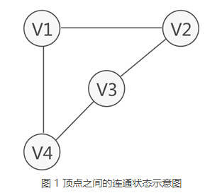
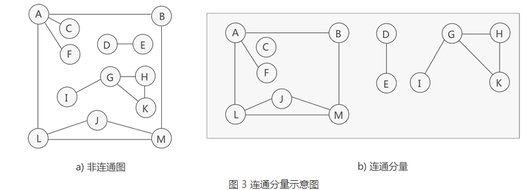
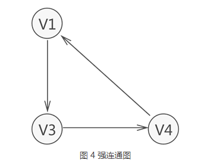
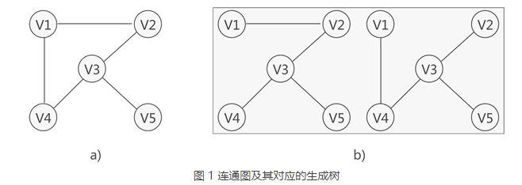
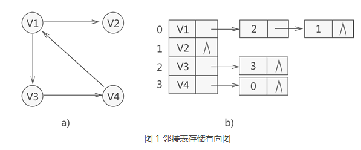
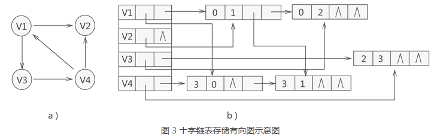
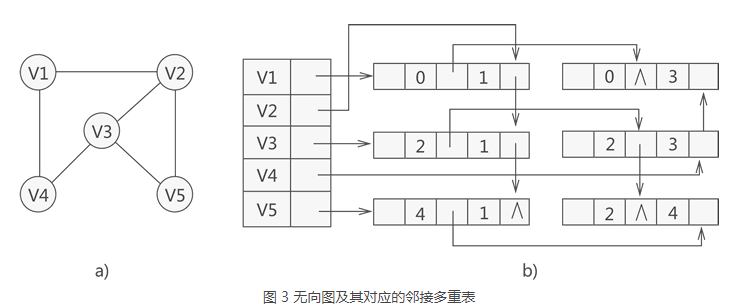

- [图结构](#图结构)
  - [0. 基本概念](#0-基本概念)
  - [1. 生成树与生成森林](#1-生成树与生成森林)
  - [2. 图的存储结构](#2-图的存储结构)
    - [顺序存储(邻接矩阵)](#顺序存储邻接矩阵)
    - [邻接表存储](#邻接表存储)
    - [十字链表存储](#十字链表存储)
    - [邻接多重表存储](#邻接多重表存储)
  - [3. 图的遍历方法](#3-图的遍历方法)
### 图结构
参考：http://data.biancheng.net/view/200.html

图是一种“多对多”的存储结构，基本组成： 节点与边，可以大体分为： 无向图与有向图。
#### 0. 基本概念
- **节点的度**： 入度与出度 （有向图概念）
- **路径与回路**： 从一个顶点到另一顶点途径的所有顶点组成的序列（包含这两个顶点），称为一条路径。如果路径中第一个顶点和最后一个顶点相同，则此路径称为"回路"（或"环"）
- **权与网**： 在某些实际场景中，图中的**每条边（或弧）会赋予一个实数来表示一定的含义**，这种与边（或弧）相匹配的实数被称为"权"，而带权的图通常称为网。
- 根据特征进行图分类：
  - **完全图**： 图中**各个顶点都与除自身外的其他顶点有关联**，这样的无向图称为完全图（如图 4a)）。同时，满足此条件的有向图则称为有向完全图
  - **稀疏图与**： $e<nlogn$，其中 `e` 表示图中边（或弧）的数量，`n`表示图中顶点的数量。如果式子成立，则为稀疏图；反之则为稠密图
  - **连通图**： 无向图中，如果**任意两个顶点之间都能够连通**，则称此无向图为连通图
    - **若无向图不是连通图**，但图中**存储某个子图**符合连通图的性质，则称该子图为**连通分量**
  - **强连通图**： **有向图中**，若任意两个顶点 Vi 和 Vj，满足从 Vi 到 Vj 以及从 Vj 到 Vi 都连通，**也就是都含有至少一条通路**，则称**此有向图为强连通图**
    - 若**有向图本身不是强连通图**，但其包含的最大连通子图具有强连通图的性质，则称**该子图为强连通分量**




#### 1. 生成树与生成森林
- **对连通图进行遍历**，过程中所经过的边和顶点的组合可看做是一棵普通树，通常称为生成树。
- 即反映遍历过程的树结构，与后面的图遍历方法紧密相关。
  - `生成树中边的数量 = 顶点数 - 1`
- 连通图中的生成树必须满足以下 2 个条件：
  - 包含连通图中所有的顶点；
  - 任意两顶点之间有且仅有一条通路；
- 对于非连通图，每个连通分量可以得到对应的生成树，构成生成森林。



#### 2. 图的存储结构
总体存储方式可以分为顺序存储和链表存储，根据物理空间是否连续来决定；可以从存储空间使用和操作方便程度上进行存储结构选取；
- 图结构稀疏是否
- 是否需要有频繁的结构/节点调整
##### 顺序存储(邻接矩阵)
- 存储顶点之间的关系时，使用二维数组记录每个顶点和其它所有顶点之间的关系
- 优点：
直观、容易理解，可以很容易的判断出任意两个顶点是否有边，**很容易计算出各个顶点的度**。

- 缺点：
**对于边数较少，顶点比较多的稀疏矩阵**，会**造成很严重的空间浪费。**


```c++
#define MAX_VERtEX_NUM 20                   //顶点的最大个数
#define VRType int                          //表示顶点之间的关系的变量类型
#define InfoType char                       //存储弧或者边额外信息的指针变量类型
#define VertexType int                      //图中顶点的数据类型
typedef enum{DG,DN,UDG,UDN}GraphKind;       //枚举图的 4 种类型
typedef struct {
    VRType adj;                             //对于无权图，用 1 或 0 表示是否相邻；对于带权图，直接为权值。
    InfoType * info;                        //弧或边额外含有的信息指针
}ArcCell,AdjMatrix[MAX_VERtEX_NUM][MAX_VERtEX_NUM];

typedef struct {
    VertexType vexs[MAX_VERtEX_NUM];        //存储图中顶点数据
    AdjMatrix arcs;                         //二维数组，记录顶点之间的关系
    int vexnum,arcnum;                      //记录图的顶点数和弧（边）数
    GraphKind kind;                         //记录图的种类
}MGraph;
```

##### 邻接表存储
> 邻接指的是图中顶点之间有边或者弧的存在。
- 邻接表存储图的实现方式是，给图中的各个顶点独自建立一个链表，用节点存储该顶点，用链表中其他节点存储各自的临界点
- 优点： 对于，稀疏图，邻接表比邻接矩阵更节约空间。
- 缺点： 邻接表和逆邻接表分别擅长出度和入度的计算，对于**入度和出度**都需要遍历整个邻接表。


```C
#define  MAX_VERTEX_NUM 20//最大顶点个数
#define  VertexType int//顶点数据的类型
#define  InfoType int//图中弧或者边包含的信息的类型
typedef struct ArcNode{
    int adjvex;//邻接点在数组中的位置下标
    struct ArcNode * nextarc;//指向下一个邻接点的指针
    InfoType * info;//信息域
}ArcNode;
typedef struct VNode{
    VertexType data;//顶点的数据域
    ArcNode * firstarc;//指向邻接点的指针
}VNode,AdjList[MAX_VERTEX_NUM];//存储各链表头结点的数组
typedef struct {
    AdjList vertices;//图中顶点的数组
    int vexnum,arcnum;//记录图中顶点数和边或弧数
    int kind;//记录图的种类
}ALGraph;
```
##### 十字链表存储
- 与邻接表不同，十字链表法**仅适用于**存储有向图和有向网。**不仅如此，十字链表法还改善了邻接表计算图中顶点入度的问题**
- 实质上就是为每个顶点建立两个链表，分别存储以该顶点为弧头的所有顶点和以该顶点为弧尾的所有顶点;
- *也可以视为链表中记录了当前节点相关的有向边信息* 
- 表结构元素为： `data| firstin | firstout`
  - 链表中节点构成为： `tailV | headV | headLink | tailLink | info`
  - tailvex 用于存储以首元节点为弧尾的顶点位于数组中的位置下标
  - headvex 用于存储以首元节点为弧头的顶点位于数组中的位置下标；
  - hlink 指针：用于链接下一个存储以首元节点为弧头的顶点的节点；
  - tlink 指针：用于链接下一个存储以首元节点为弧尾的顶点的节点；
  - info 指针：用于存储与该顶点相关的信息，例如顶点之间的权值；


- 优点： 整合了邻接表和逆邻接表，顶点的出度和入度都很容易计算。
- 缺点： 数据结构相对复杂。

##### 邻接多重表存储
- 无向图的存储可以使用邻接表，但在实际使用时，**如果想对图中某顶点进行实操（修改或删除）**，由于邻接表中存储该顶点的节点有两个，因此需要操作两个节点。
- 邻接多重表存储无向图的方式，可看作是邻接表和十字链表的结合
- 表结构： `data | firstedge `; 链表元素：
  - mark：**标志域**，用于标记此节点**是否被操作过**，例如在对图中顶点做遍历操作时，为了防止多次操作同一节点，mark 域为 0 表示还未被遍历；mark 为 1 表示该节点已被遍历；
  - ivex 和 jvex：数据域，分别存储图中各边两端的顶点所在数组中的位置下标；
  - ilink：指针域，指向下一个存储与 ivex 有直接关联顶点的节点；
  - jlink：指针域，指向下一个存储与 jvex 有直接关联顶点的节点；
  - info：指针域，用于存储与该顶点有关的其他信息，比如无向网中各边的权；



```C
#define MAX_VERTEX_NUM 20                   //图中顶点的最大个数
#define InfoType int                        //边含有的信息域的数据类型
#define VertexType int                      //图顶点的数据类型
typedef enum {unvisited,visited}VisitIf;    //边标志域
typedef struct EBox{
    VisitIf mark;                           //标志域
    int ivex,jvex;                          //边两边顶点在数组中的位置下标
    struct EBox * ilink,*jlink;             //分别指向与ivex、jvex相关的下一个边
    InfoType *info;                         //边包含的其它的信息域的指针
}EBox;
typedef struct VexBox{
    VertexType data;                        //顶点数据域
    EBox * firstedge;                       //顶点相关的第一条边的指针域
}VexBox;
typedef struct {
    VexBox adjmulist[MAX_VERTEX_NUM];//存储图中顶点的数组
    int vexnum,degenum;//记录途中顶点个数和边个数的变量
}AMLGraph;
```

#### 3. 图的遍历方法

1. 深度优先搜索： 基于堆栈
   - 不全部保留结点，占用空间少；有回溯操作(即有入栈、出栈操作)，运行速度慢。—— 储存空间小，运行慢
2. 广度优先搜索： 基于队列
   - 保留全部结点，占用空间大； 无回溯操作(即无入栈、出栈操作)，运行速度快。—— 存储空间大，运行快

- 适用场景分析
  - 如果解决方案离树的根不远，那么广度优先搜索（BFS）可能会更好。
  - 如果树很深并且解决方案很少，深度优先搜索（DFS）可能需要很长时间，但BFS可能会更快。
  - 如果树很宽，BFS可能需要太多内存，所以它可能完全不切实际。
  - 如果解决方案频繁但位于树的深处，那么BFS可能是不切实际的。
  - 如果搜索树非常深，则无论如何都需要限制深度优先搜索（DFS）的搜索深度（例如，使用迭代加深）。
  - **当树的深度可以变化时**，广度优先搜索通常是最好的方法，并且您只需要搜索树的一部分以获得解决方案。 例如，找到从起始值到最终值的最短路径是使用BFS的好地方。
    - 当您需要搜索整个树时，通常会使用深度优先搜索。 它比BFS更容易实现（使用递归），并且需要更少的状态：虽然BFS要求您存储整个“前沿”，但DFS只需要存储当前元素的父节点列表。
    - DFS比BFS更节省空间，但可能会达到不必要的深度。