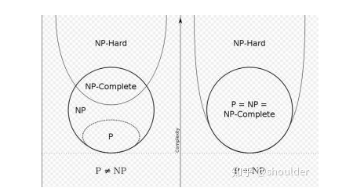

### P问题
Polynominal 有多项式时间算法$ax^n+bx^{(n-1)}+c$, 算得很快的问题

### NP问题
NP:Non-deterministic polynominal，非确定性多项式问题

不确定问题是否存在一个多项式时间算法，所以称之为非确定性问题。
但可以在多项式时间内严重并得到这个问题的一个正确解。

NP：旅行家推销问题：
> 有一个推销员，要到n个城市推销商品，他要找出一个包含所有n个城市的环路，这个环路路径小于a。我们知道这个问题如果单纯的用枚举法来列举的话会有(n-1)! 种，已经不是多项式时间的算法了，(注：阶乘算法比多项式的复杂)。那怎么办呢？我们可以用猜的，假设人品爆炸猜几次就猜中了一条小于长度a的路径，TSP问题解决了，皆大欢喜。可是，我不可能每次都猜的那么准，也许我要猜完所有种方案呢？所以我们说，这是一个NP类问题。也就是，我们能在多项式的时间内验证并得出问题的正确解，可是我们却不知道该问题是否存在一个多项式时间的算法，每次都能解决他(注意，这里是不知道，不是不存在)

### NPC问题： NP完全问题
Nondeterminism Polynomial complete

存在这样一个NP问题，所有的NP问题都可以约化成它。换句话说，**只要解决了这个问题，那么所有的NP问题都解决了**。其定义要满足2个条件：

**首先，它得是一个NP问题；然后，所有的NP问题都可以约化到它。**

要证明npc问题的思路就是： 先证明它至少是一个NP问题，再证明其中一个已知的NPC问题能约化到它

旅行商问题： 就是NP完全问题
https://zhuanlan.zhihu.com/p/73953567

#### NP-Hard问题
NP-Hard问题是这样一种问题，它满足NPC问题定义的第二条但不一定要满足第一条（就是说，NP-Hard问题要比 NPC问题的范围广，NP-Hard问题没有限定属于NP），即所有的NP问题都能约化到它，但是它不一定是一个NP问题。 以上四个问题他们之间的关系可以用下图来：
